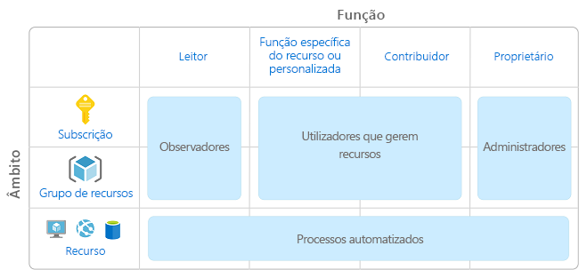
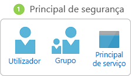
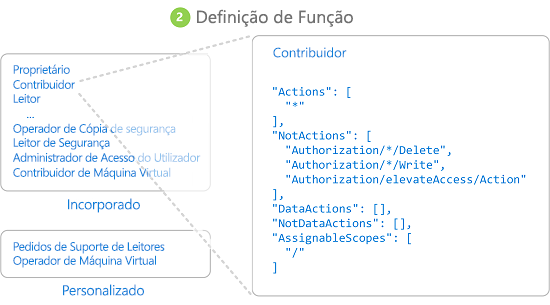
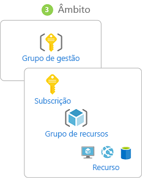
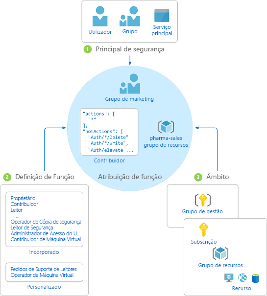

# O que é o controlo de acesso baseado em funções (RBAC)?

A gestão de acesso para recursos na cloud é uma função crítica para qualquer organização que está a utilizar a cloud. O controlo de acesso baseado em funções (RBAC) ajuda-o a gerir quem tem acesso aos recursos do Azure, o que fazem com esses recursos e a que áreas têm acesso.

O RBAC é um sistema de autorização criado com base no [Azure Resource Manager](../azure-resource-manager/resource-group-overview.md) que fornece gestão pormenorizada de acesso de recursos no Azure.

## O que posso fazer com o RBAC?

Seguem-se alguns exemplos do que pode fazer com o RBAC:

- Permitir a um utilizador gerir máquinas virtuais numa subscrição e a outro utilizador gerir redes virtuais
- Permitir a um grupo DBA gerir bases de dados SQL numa subscrição
- Permitir a um utilizador gerir todos os recursos num grupo de recursos, como máquinas virtuais, sites e sub-redes
- Permitir a uma aplicação aceder a todos os recursos num grupo de recursos

## Melhor prática para utilizar o RBAC

Ao utilizar o RBAC, pode segregar funções na sua equipa e conceder apenas a quantidade de acesso a utilizadores que precisam para desempenhar as suas funções. Em vez de dar a todas as pessoas permissões sem restrições na sua subscrição do Azure ou recursos, pode permitir apenas determinadas ações num âmbito específico.

Quando planear a estratégia de controlo de acesso, é boa prática conceder aos utilizadores o privilégio menor de que precisam para trabalhar. O diagrama seguinte mostra um padrão sugerido para utilizar o RBAC.

## Como funciona o RBAC

A forma de controlar o acesso a recursos com o RBAC é criar atribuições de funções. Este é um conceito fundamental para compreender de que forma as permissões são impostas. Uma atribuição de função é composta por três elementos: principal de segurança, definição de função e âmbito.

### Principal de segurança

Um *principal de segurança* é um objeto que representa um utilizador, grupo ou principal de serviço que está a solicitar acesso aos recursos do Azure.

- Utilizador – Um indivíduo que tem um perfil no Azure Active Directory. Também pode atribuir funções a utilizadores noutros inquilinos. Para obter informações sobre utilizadores noutras organizações, veja [Azure Active Directory B2B](/azure/active-directory/active-directory-b2b-what-is-azure-ad-b2b).
- Grupo – Um conjunto de utilizadores criado no Azure Active Directory. Quando atribui uma função a um grupo, todos os utilizadores nesse grupo têm essa função. 
- Principal de serviço – Uma identidade de segurança utilizada por aplicações ou serviços para aceder a recursos específicos do Azure. Pode considerá-lo como uma *identidade de utilizador* (nome de utilizador e palavra-passe ou certificado) para uma aplicação.

### Definição de função

Uma *definição de função* é uma coleção de permissões. Por vezes é denominada apenas *função*. Uma definição de função lista as operações que podem ser efetuadas, por exemplo, ler, escrever e eliminar. As funções podem ser de nível elevado, como proprietário, ou específicas, como leitor de máquina virtual.

O Azure inclui várias [funções incorporadas](built-in-roles.md) que pode utilizar. São apresentadas em seguida quatro funções incorporadas fundamentais. As três primeiras aplicam-se a todos os tipos de recursos.

- [Proprietário](built-in-roles.md#owner) – Tem acesso total a todos os recursos, incluindo o direito de delegar o acesso a outras pessoas.
- [Contribuidor](built-in-roles.md#contributor) – Pode criar e gerir todos os tipos de recursos do Azure, mas não pode conceder acesso a outras pessoas.
- [Leitor](built-in-roles.md#reader) – Pode ver os recursos do Azure existentes.
- [Administrador de Acesso do Utilizador](built-in-roles.md#user-access-administrator) – Permite gerir o acesso do utilizador aos recursos do Azure.

As restantes funções incorporadas permitem a gestão de recursos específicos do Azure. Por exemplo, a função [Contribuidor de Máquina Virtual](built-in-roles.md#virtual-machine-contributor) permite a um utilizador criar e gerir máquinas virtuais. Se as [funções incorporadas](custom-roles.md) não suprirem as necessidades específicas da sua organização, pode criar as suas próprias funções personalizadas.

O Azure introduziu operações de dados (atualmente em pré-visualização) que permitem conceder acesso aos dados num objeto. Por exemplo, se um utilizador tiver acesso a dados de leitura a uma conta de armazenamento, pode ler os blobs ou as mensagens nessa conta de armazenamento. Para obter mais informações, veja [Compreender definições de função](role-definitions.md).

### Âmbito

O *âmbito* é o limite aplicado ao acesso. Quando atribui uma função, pode limitar ainda mais as ações permitidas ao definir um âmbito. Isto é útil se quiser tornar alguém [Contribuidor de Site](built-in-roles.md#website-contributor), mas apenas para um grupo de recursos.

No Azure, pode especificar um âmbito a vários níveis: [grupo de gestão](../azure-resource-manager/management-groups-overview.md), subscrição, grupo de recursos ou recurso. Os âmbitos são estruturados numa relação de principal-subordinado.

Quando concede acesso a um âmbito principal, os âmbitos secundários herdam essas permissões. Por exemplo:

- Se atribuir a função [Proprietário](built-in-roles.md#owner) a um utilizador no âmbito de grupo de gestão, esse utilizador pode gerir tudo em todas as subscrições no grupo de gestão.
- Se atribuir a função [Leitor](built-in-roles.md#reader) a um grupo no âmbito da subscrição, os membros desse grupo pode ver cada grupo de recursos e recurso na subscrição.
- Se atribuir a função [Contribuidor](built-in-roles.md#contributor) a uma aplicação no âmbito do grupo de recursos, pode gerir recursos de todos os tipos no grupo de recursos, mas não outros grupos de recursos na subscrição.

### Atribuição de função

Uma *atribuição de função* é o processo de associar uma definição de função a um utilizador, grupo ou principal de serviço num determinado âmbito para efeitos de concessão de acesso. O acesso é concedido ao criar uma atribuição de função e o acesso é revogado ao remover uma atribuição de função.

O diagrama seguinte mostra um exemplo de uma atribuição de função. Neste exemplo, foi atribuída a função [Contribuidor](built-in-roles.md#contributor) ao grupo Marketing para o grupo de recursos de vendas farmacêuticas. Isto significa que os utilizadores no grupo Marketing podem criar ou gerir qualquer recurso do Azure no grupo de recursos de vendas farmacêuticas. Os utilizadores do grupo Marketing não têm acesso aos recursos fora o grupo de recursos de vendas farmacêuticas, a menos que façam parte de outra atribuição de função.

Pode criar atribuições de funções no portal do Azure, CLI do Azure, Azure PowerShell, SDKs do Azure ou APIs REST. Pode ter até 2000 atribuições de funções em cada subscrição. Para criar e remover atribuições de funções, precisa de ter a permissão `Microsoft.Authorization/roleAssignments/*`. Esta permissão é concedida através das funções [Proprietário](built-in-roles.md#owner) ou [Administrador de Acesso de Utilizador](built-in-roles.md#user-access-administrator).

## Passos seguintes

- [Início Rápido: Conceder acesso a um utilizador com o RBAC e o Portal do Azure](quickstart-assign-role-user-portal.md)
- [Gerir o acesso através do RBAC e do portal do Azure](role-assignments-portal.md)
- [Compreender as diferentes funções no Azure](rbac-and-directory-admin-roles.md)
