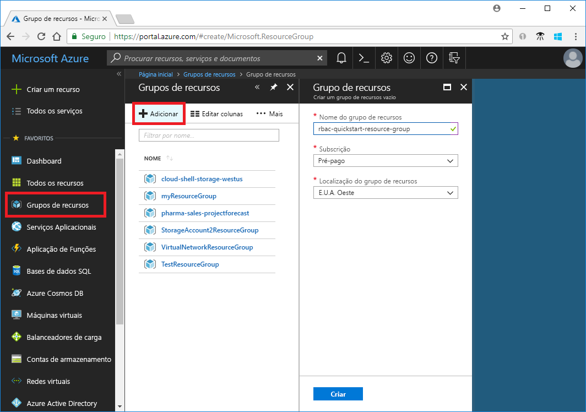
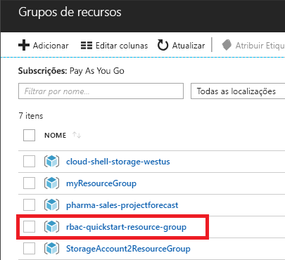
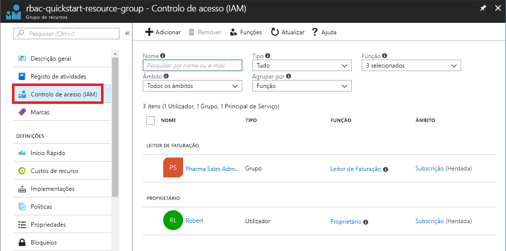
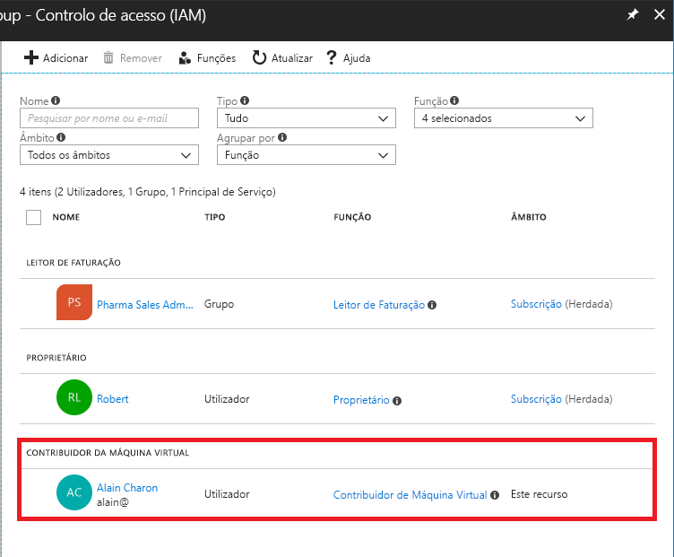
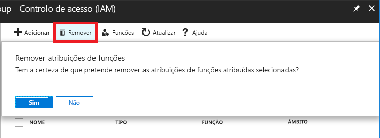
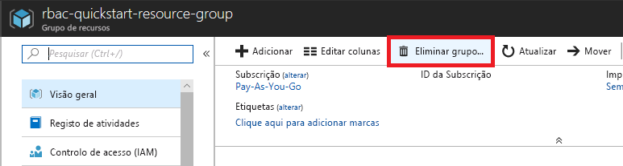

# Guia de Início Rápido: Conceder acesso a um utilizador com o RBAC e o Portal do Azure

O controlo de acesso baseado em funções (RBAC) é a forma de gerir o acesso a recursos no Azure. Neste guia de início rápido, irá conceder a um utilizador acesso para criar e gerir máquinas virtuais num grupo de recursos.

Se não tiver uma subscrição do Azure, crie uma [conta gratuita](https://azure.microsoft.com/free/?WT.mc_id=A261C142F) antes de começar.

## Iniciar sessão no Azure

Inicie sessão no portal do Azure em http://portal.azure.com.

## Criar um grupo de recursos

1. Na lista de navegação, selecione **Grupos de recursos**.

1. Selecione **Adicionar** para abrir o painel **Grupo de recursos**.

   

1. Para **Nome do grupo de recursos**, introduza **rbac-quickstart-resource-group**.

1. Selecione uma subscrição e uma localização.

1. Selecione **Criar** para criar o grupo de recursos.

1. Selecione **Atualizar** para atualizar a lista de grupos de recursos.

   O novo grupo de recursos é apresentado na lista de grupos de recursos.

   

## Conceder acesso

No RBAC, para conceder acesso, crie uma atribuição de função.

1. Na lista de **Grupos de recursos**, selecione o novo grupo de recursos **rbac-quickstart-resource-group**.

1. Selecione **Controlo de acesso (IAM)** para ver a lista atual de atribuições de funções.

   

1. Escolha **Adicionar** para abrir o painel **Adicionar permissões**.

   Se não tiver permissões para atribuir funções, não verá a opção **Adicionar**.

   

1. Na lista pendente **Função**, selecione **Contribuidor de Máquina Virtual**.

1. Na lista **Selecionar**, selecione-se a si mesmo ou outro utilizador.

1. Escolha **Guardar** para criar a atribuição de função.

   Após alguns instantes, o utilizador é atribuído à função Contribuidor de Máquina Virtual no âmbito do grupo de recursos rbac-quickstart-resource-group.

   

## Remover o acesso

No RBAC, para remover o acesso, remova uma atribuição de função.

1. Na lista de atribuições de funções, adicione uma marca de verificação junto ao utilizador com a função Contribuidor de Máquina Virtual.

1. Escolha **Remover**.

   

1. Na mensagem para remover atribuição de função que é apresentada, escolha **Sim**.

## Limpeza

1. Na lista de navegação, selecione **Grupos de recursos**.

1. Selecione **rbac-quickstart-resource-group** para abrir o grupo de recursos.

1. Selecione **Eliminar grupo de recursos** para eliminar o grupo de recursos.

   

1. No painel **Tem a certeza de que quer eliminar**, escreva o nome do grupo de recursos: **rbac-quickstart-resource-group**.

1. Selecione **Eliminar** para eliminar o grupo de recursos.

## Passos seguintes

> [!div class="nextstepaction"]
> [Tutorial: Conceder acesso a um utilizador com o RBAC e o PowerShell](tutorial-role-assignments-user-powershell.md)

