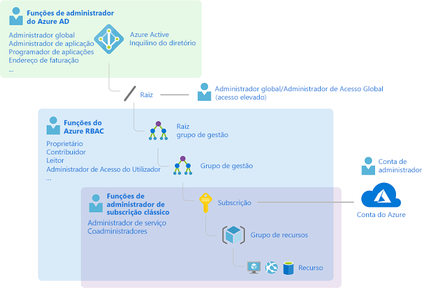
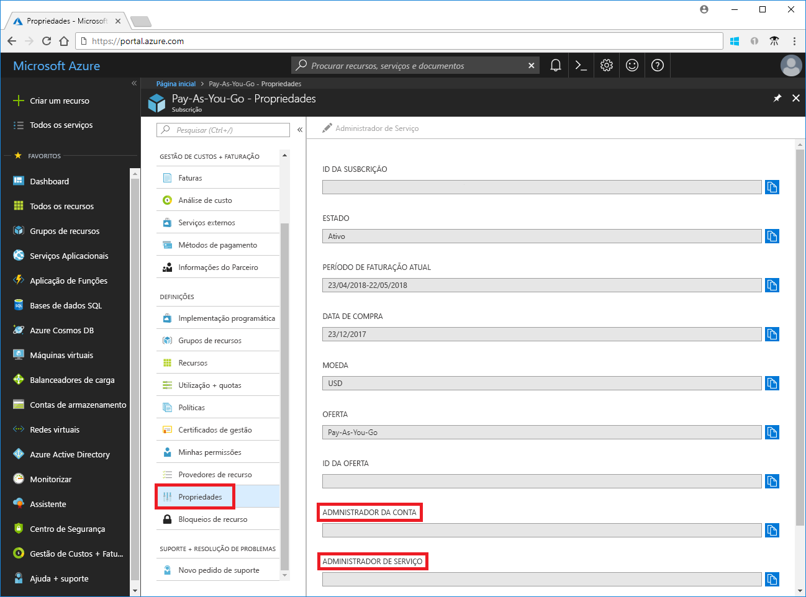
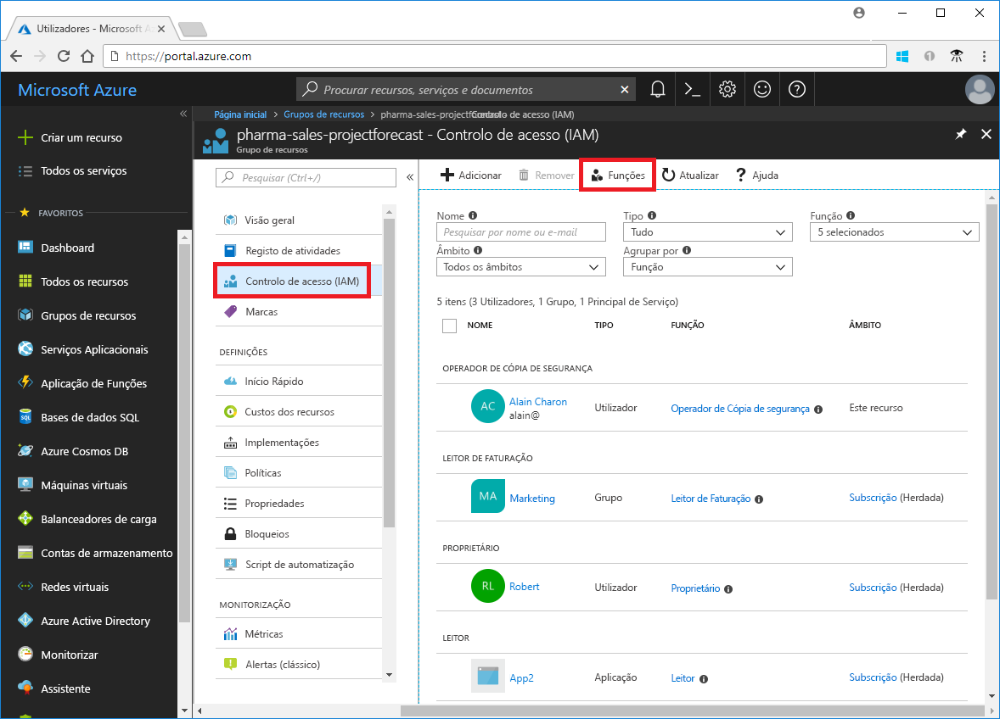
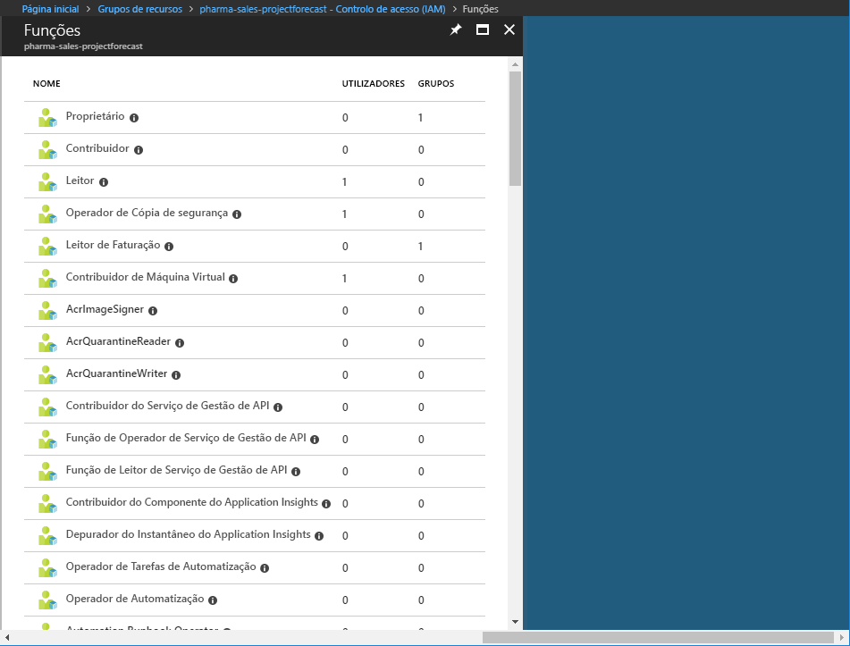
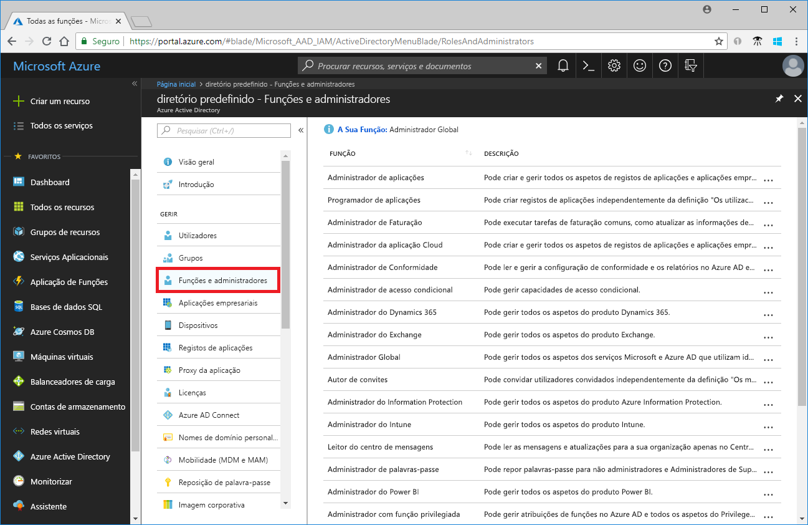
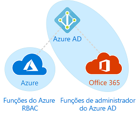

# Compreender as diferentes funções no Azure

Se estiver familiarizado com o Azure, pode ser um desafio para compreender todas as funções no Azure. Este artigo ajuda a explicar as seguintes funções e quando utilizar a cada:
- Funções de administrador de subscrição clássica
- Funções (RBAC) do controlo de acesso baseado em função do Azure
- Funções de administrador do Azure Active Directory (Azure AD)

## Como as funções estão relacionadas

Para compreender melhor as funções no Azure, ele ajuda a conhecer alguns do histórico. Quando o Azure foi inicialmente lançado, o acesso aos recursos foi gerido com apenas três funções de administrador: administrador de conta, administrador de serviços e Coadministrador. Mais tarde, o controlo de acesso baseado em funções (RBAC) para recursos do Azure foi adicionado. RBAC do Azure é um sistema de autorização mais recente, criado nos [do Azure Resource Manager](../azure-resource-manager/resource-group-overview.md) que fornece gestão de acessos detalhada para recursos do Azure. RBAC inclui muitas funções incorporadas, pode ser atribuído em escopos diferentes e permite-lhe criar suas próprias funções personalizadas. Para gerir os recursos no Azure AD, como utilizadores, grupos e domínios, existem várias funções de administrador do Azure AD.

O diagrama seguinte é uma visão geral de como estão relacionadas a funções de administrador de subscrição clássica, funções RBAC do Azure e funções de administrador do Azure AD.

## Administradores de subscrição clássica

Administrador de conta, administrador de serviços e Coadministrador são as três funções de administrador de subscrição clássico no Azure. Os administradores de subscrição clássica têm acesso total à subscrição do Azure. Podem gerir recursos com o portal do Azure, as APIs do Azure Resource Manager e o modelo de implementação clássica APIs. A conta que é utilizada para se inscrever para o Azure é automaticamente definida como o administrador de conta e o administrador de serviços. Em seguida, podem ser adicionados outros Coadministradores. O administrador de serviços e os Coadministradores têm o equivalente acesso de utilizadores que foram atribuídas a função de proprietário (uma função RBAC do Azure) no âmbito da subscrição. A tabela seguinte descreve as diferenças entre estas três funções administrativas de subscrição clássica.

| Administrador de subscrição clássica | Limite | Permissões | Notas |
| --- | --- | --- | --- |
| Administrador de conta | 1 por conta do Azure | <ul><li>Acesso a [Centro de contas do Azure](https://account.azure.com/Subscriptions)</li><li>Gerir todas as subscrições numa conta</li><li>Criar novas subscrições</li><li>Cancelar subscrições</li><li>Alterar a faturação de uma subscrição</li><li>Alterar o administrador de serviço</li></ul> | Conceitualmente, o proprietário de faturação da subscrição.|
| Administrador de Serviços | 1 por subscrição do Azure | <ul><li>Gerir serviços no [portal do Azure](https://portal.azure.com)</li><li>Atribuir utilizadores à função de Coadministrador</li></ul> | Por predefinição, numa nova subscrição, o administrador de conta também é o administrador de serviços. O administrador de serviços tem o acesso equivalente de um utilizador que é atribuído a função de proprietário no âmbito da subscrição. |
| Coadministrador | 200 por subscrição | <ul><li>Mesmos privilégios de acesso como administrador do serviço, mas não é possível alterar a associação de subscrições a diretórios do Azure</li><li>Atribuir utilizadores à função de Coadministrador, mas não é possível alterar o administrador de serviços</li></ul> | O Coadministrador tem o acesso equivalente de um utilizador que é atribuído a função de proprietário no âmbito da subscrição. |

No portal do Azure, pode ver quem é atribuído para o administrador de conta e o administrador de serviço ao visualizar as propriedades da sua subscrição.

Para obter informações sobre como adicionar ou alterar os administradores de subscrição, veja [adicionar ou alterar os administradores de subscrição do Azure](../billing/billing-add-change-azure-subscription-administrator.md) na documentação de faturação do Azure.

### Conta do Azure e subscrições do Azure

Uma conta do Azure representa uma relação de faturação. Uma conta do Azure é uma identidade de utilizador, uma ou mais subscrições do Azure e um conjunto associado de recursos do Azure. A pessoa que cria a conta é o administrador de conta para todas as subscrições criadas nessa conta. Essa pessoa também é o padrão de administrador de serviços para a subscrição.

As subscrições do Azure ajudam-na organizar o acesso aos recursos do Azure. Também ajudam a controlar de que forma é que a utilização dos recursos é comunicada, faturada e paga. Cada subscrição pode ter uma configuração de faturação e pagamento diferente, para que possa ter subscrições e planos diferentes por office, departamento, projeto e assim por diante. Cada serviço pertence a uma subscrição e o ID de subscrição pode ser necessário para operações de programação.

Contas e subscrições são geridas na [Centro de contas do Azure](https://account.azure.com/Subscriptions).
## Funções RBAC do Azure

RBAC do Azure é um sistema que fornece gestão de acessos detalhada para recursos do Azure, como computação e armazenamento. RBAC do Azure inclui mais de 60 funções incorporadas. Existem quatro funções RBAC fundamentais. Os três primeiros aplicam-se a todos os tipos de recursos:

| Função RBAC do Azure | Permissões | Notas |
| --- | --- | --- |
| [Proprietário](built-in-roles.md#owner) | <ul><li>Acesso total a todos os recursos</li><li>Delegar o acesso a outras pessoas</li></ul> | O administrador de serviços e Coadministradores são atribuídas a função de proprietário no âmbito da subscrição Aplica-se a todos os tipos de recursos. |
| [Contribuidor](built-in-roles.md#contributor) | <ul><li>Criar e gerir todos os tipos de recursos do Azure</li><li>Não é possível conceder acesso a outras pessoas</li></ul> | Aplica-se a todos os tipos de recursos. |
| [Leitor](built-in-roles.md#reader) | <ul><li>Ver recursos do Azure</li></ul> | Aplica-se a todos os tipos de recursos. |
| [Administrador de acesso de utilizador](built-in-roles.md#user-access-administrator) | <ul><li>Gerir o acesso de utilizador aos recursos do Azure</li></ul> |  |

O restante das funções incorporadas permitir a gestão de recursos específicos do Azure. Por exemplo, o [contribuinte de Máquina Virtual](built-in-roles.md#virtual-machine-contributor) função permite que o usuário criar e gerir máquinas virtuais. Para obter uma lista de todas as funções incorporadas, consulte [funções incorporadas](built-in-roles.md).

Apenas o portal do Azure e as APIs do Azure Resource Manager suportam o RBAC. Os utilizadores, grupos e aplicações que estão atribuídas funções RBAC não é possível utilizar o [APIs de modelo de implementação clássica do Azure](../azure-resource-manager/resource-manager-deployment-model.md).

No portal do Azure, as atribuições de funções através do RBAC constar da **controlo de acesso (IAM)** painel. Neste painel pode encontradas em todo o portal, como as subscrições, grupos de recursos e vários recursos.

Quando clica no **funções** opção, verá a lista de funções incorporadas e personalizadas.

## Funções de administrador do Azure AD

Administrador do AD Azure funções são utilizadas para gerir recursos do Azure AD num diretório, como criar ou editar utilizadores, atribuir funções administrativas a outras pessoas, repor palavras-passe do utilizador, gerir licenças de utilizador e gerir domínios. A tabela seguinte descreve algumas das funções de administrador do Azure AD mais importantes.

| Função de administrador do Azure AD | Permissões | Notas |
| --- | --- | --- |
| [Administrador global](../active-directory/active-directory-assign-admin-roles-azure-portal.md#company-administrator) | <ul><li>Gerir o acesso a todas as funcionalidades administrativas no Azure Active Directory, bem como serviços que federar ao Azure Active Directory</li><li>Atribuir funções de administrador a outras pessoas</li><li>Repor a palavra-passe para qualquer utilizador e a todos os outros administradores</li></ul> | A pessoa que se inscreve no inquilino do Azure Active Directory torna-se um Administrador Global. |
| [Administrador de utilizadores](../active-directory/active-directory-assign-admin-roles-azure-portal.md#user-account-administrator) | <ul><li>Criar e gerir todos os aspetos de utilizadores e grupos</li><li>Gerir pedidos de suporte</li><li>Monitorizar estado de funcionamento do serviço</li><li>Alterar palavras-passe para utilizadores, administradores de suporte técnico e outros administradores de utilizador</li></ul> |  |
| [Administrador de suporte técnico](../active-directory/active-directory-assign-admin-roles-azure-portal.md#helpdesk-administrator) | <ul><li>Alterar palavras-passe para utilizadores e outros administradores de suporte técnico</li><li>Gerir pedidos de serviço</li><li>Monitorizar estado de funcionamento do serviço</li></ul> |  |
| [Administrador de faturação](../active-directory/active-directory-assign-admin-roles-azure-portal.md#billing-administrator) | <ul><li>Fazer compras</li><li>Gerir subscrições</li><li>Gerir pedidos de suporte</li><li>Monitores de estado de funcionamento do serviço</li></ul> |  |

Para obter uma lista de todas as funções de administrador do Azure AD, consulte [atribuir funções de administrador no Azure Active Directory](/azure/active-directory/active-directory-assign-admin-roles-azure-portal).

No portal do Azure, pode atribuir funções de administrador do Azure AD no **do Azure Active Directory** painel.

## Diferenças entre funções RBAC do Azure e funções de administrador do Azure AD

Num alto nível, funções RBAC do Azure, controlar permissões para gerir recursos do Azure, enquanto as funções de administrador do Azure AD controlam as permissões para gerir os recursos do Azure Active Directory. A tabela seguinte compara algumas das diferenças.

| Funções RBAC do Azure | Funções de administrador do Azure AD |
| --- | --- |
| Gerir o acesso aos recursos do Azure | Gerir o acesso aos recursos do Azure Active Directory |
| Oferece suporte a funções personalizadas | Não é possível criar suas próprias funções |
| Âmbito pode ser especificado em vários níveis (grupo de gestão, subscrição, grupo de recursos, recursos) | O escopo é ao nível do inquilino |
| Informações de função podem ser acedidos no portal do Azure, CLI do Azure, o Azure PowerShell, modelos Azure Resource Manager, API de REST | Informações de função podem ser acedidas no portal de administração do Office 365 portal, administrador do Azure, Microsoft Graph, AzureAD PowerShell |

### Funções RBAC do Azure e funções de administrador do Azure AD se sobrepõem?

Por predefinição, funções RBAC do Azure e funções de administrador do Azure AD não se propagam Azure e o Azure AD. No entanto, se um Administrador Global eleva o acesso ao escolher o **Administrador Global pode gerir as subscrições do Azure e grupos de gestão** mudar no portal do Azure, o Administrador Global vai ser concedido a [ Administrador de acesso de utilizador](built-in-roles.md#user-access-administrator) função (uma função RBAC) em todas as subscrições para um inquilino específico. A função de administrador de acesso de utilizador permite ao utilizador para conceder a outros utilizadores acesso aos recursos do Azure. Essa opção pode ser útil para recuperar o acesso a uma subscrição. Para obter mais informações, consulte [elevar o acesso de administrador do Azure AD](elevate-access-global-admin.md).

Vários span de funções de administrador do Azure AD do Azure AD e o Microsoft Office 365, tal como as funções de Administrador Global e administrador de utilizadores. Por exemplo, se for um membro da função de Administrador Global, tem capacidades de administrador global no Azure AD e do Office 365, como fazer alterações ao Microsoft Exchange e o Microsoft SharePoint. No entanto, por predefinição, o Administrador Global não tem acesso aos recursos do Azure.

## Passos seguintes

- [O que é o controlo de acesso baseado em funções (RBAC)?](overview.md)
- [Atribuir funções de administrador no Azure Active Directory](/azure/active-directory/active-directory-assign-admin-roles-azure-portal)
- [Adicionar ou alterar os administradores de subscrição do Azure](/azure/billing/billing-add-change-azure-subscription-administrator)
