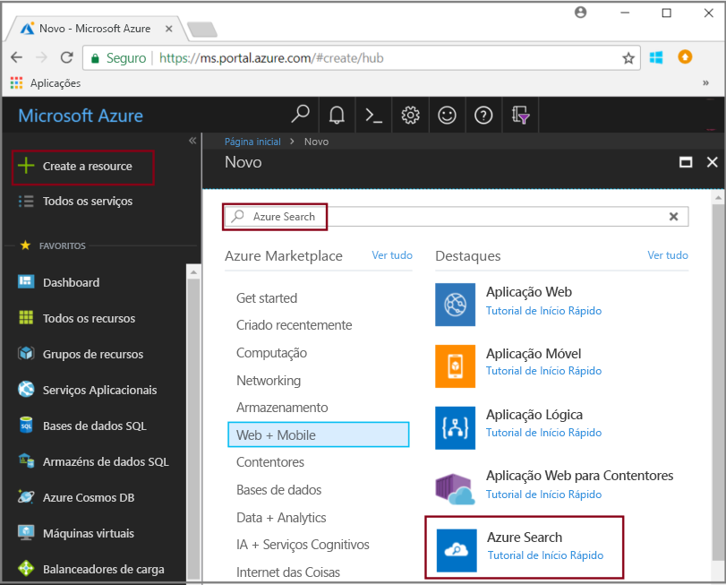
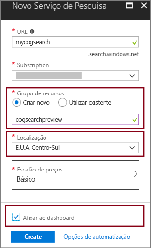
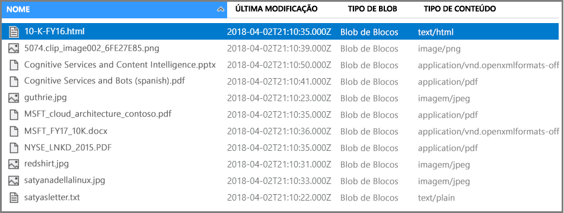
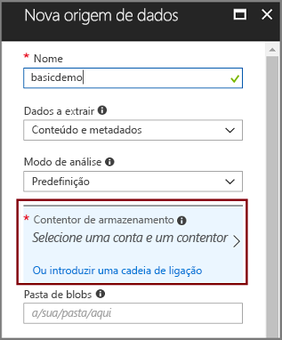
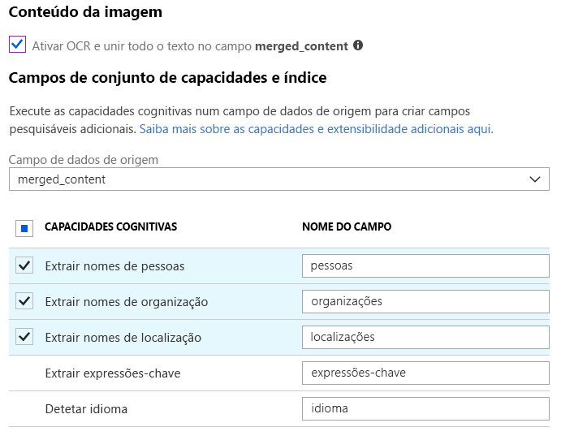
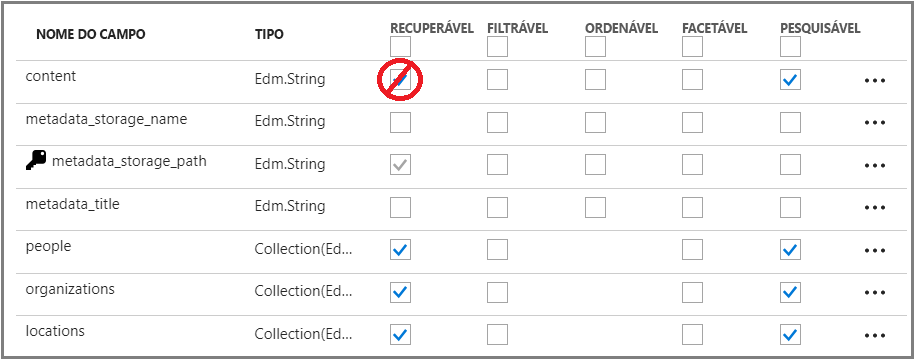
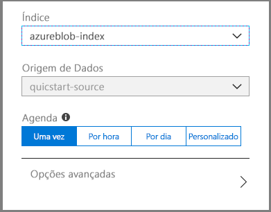
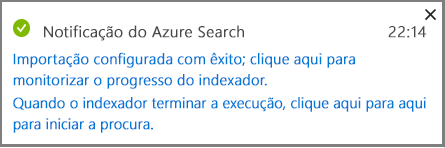
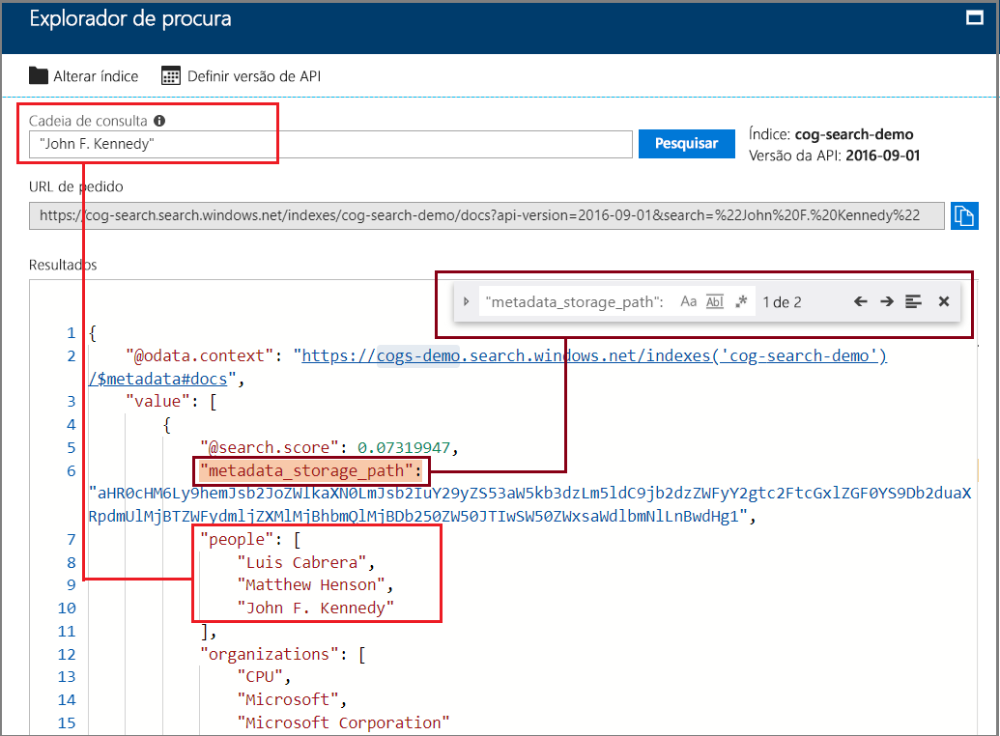

# Início Rápido: criar um pipeline de pesquisa cognitiva com competências e dados de exemplo

A pesquisa cognitiva (pré-visualização) adiciona a extração de dados, o processamento de linguagem natural (NLP) e as competências de processamento de imagens a um pipeline de indexação do Azure Search, tornando o conteúdo não pesquisável ou não estruturado mais pesquisável. As informações criadas por uma competência, como o reconhecimento de entidades ou a análise de imagens, são adicionadas a um índice no Azure Search.

Neste início rápido, experimente o pipeline de melhoramento no [portal do Azure](https://portal.azure.com) antes de escrever qualquer linha de código:

* Comece com dados de exemplo no armazenamento de Blobs do Azure
* Configure o [Assistente para importar dados](search-import-data-portal.md) para indexação e melhoramento 
* Execute o assistente (uma capacidade de entidades deteta as pessoas, a localização e as organizações)
* Utilize o [Explorador de procura](search-explorer.md) para consultar os dados melhorados.

##  Regiões suportadas

Pode experimentar a pesquisa cognitiva num serviço do Azure Search criado nas seguintes regiões:

* EUA Centro-Oeste
* EUA Centro-Sul
* EUA Leste
* Europa Ocidental
* Europa do Norte
* Sudeste Asiático

Se não tiver uma subscrição do Azure, crie uma [conta gratuita](https://azure.microsoft.com/free/?WT.mc_id=A261C142F) antes de começar.

> [!NOTE]
> A Pesquisa Cognitiva está em pré-visualização pública. A execução de conjuntos de capacidades e a normalização e extração de imagens estão atualmente disponíveis gratuitamente. Posteriormente, anunciaremos os preços destas funcionalidades. 

## Pré-requisitos

A página [“O que é a pesquisa cognitiva?”](cognitive-search-concept-intro.md) apresenta os melhoramentos dos componentes e da arquitetura. 

Os serviços do Azure são utilizados exclusivamente neste cenário. A criação dos serviços de que precisa faz parte da preparação.

+ O armazenamento de Blobs do Azure fornece a origem de dados.
+ O Azure Search processa a ingestão e a indexação de dados, o melhoramento da pesquisa cognitiva e as consultas de pesquisa de texto completo.

### Configurar o Azure Search

Primeiro, inscreva-se no serviço do Azure Search. 

1. Entre no [Portal do Azure](https://portal.azure.com) e inicie sessão com a sua conta do Azure.

1. Clique em **Criar um recurso**, procure o Azure Search e clique em **Criar**. Veja [Criar um serviço do Azure Search no portal](search-create-service-portal.md) se estiver a configurar um serviço de pesquisa pela primeira vez e precisar de mais ajuda.

  

1. Para Grupo de recursos, crie um grupo de recursos para conter todos os recursos que criar neste início rápido. Tal torna mais fácil limpar os recursos depois de concluir o início rápido.

1. Para a localização, escolha uma da [regiões suportadas](#supported-regions) para pesquisa cognitiva.

1. Para Escalão de preço, pode criar um serviço **Gratuito** para concluir os tutoriais e os inícios rápidos. Para uma investigação mais aprofundada através dos seus próprios dados, crie um [serviço pago](https://azure.microsoft.com/pricing/details/search/), como **Básico** ou **Standard**. 

  O serviço Gratuito está limitado a 3 índices, um tamanho de blob máximo de 16 MB e 2 minutos de indexação, o que é insuficiente para executar todas as funcionalidades da pesquisa cognitiva. Para rever os limites dos diferentes escalões, veja [Limites do Serviço](search-limits-quotas-capacity.md).

  > [!NOTE]
  > A Pesquisa cognitiva está em pré-visualização pública. A execução do conjunto de competências está atualmente disponível em todos os escalões, incluindo o gratuito. Posteriormente, iremos anunciar os preços desta capacidade.

1. Afixe o serviço no dashboard para ter acesso rápido às informações do serviço.

  

### Configurar o serviço Blob do Azure e carregar dados de exemplo

O pipeline de melhoramento solicita as origens de dados do Azure suportadas pelos [Indexadores do Azure Search](search-indexer-overview.md). Para este exercício, vamos utilizar o armazenamento de blobs para demonstrar os vários tipos de conteúdo.

1. A [transferência de dados de exemplo](https://1drv.ms/f/s!As7Oy81M_gVPa-LCb5lC_3hbS-4) é constituída por um pequeno conjunto de ficheiros de diferentes tipos. 

1. Inscreva-se no armazenamento de Blobs do Azure, crie uma conta de armazenamento, inicie sessão no Explorador de Armazenamento e crie um contentor. Veja [Início Rápido do Explorador de Armazenamento do Azure](../storage/blobs/storage-quickstart-blobs-storage-explorer.md) para obter instruções sobre todos os passos.

1. Com o Explorador de Armazenamento do Azure, no contentor que criou, clique em **Carregar** para carregar os ficheiros de exemplo.

  

## Criar o pipeline de melhoramento

Volte à página do dashboard do serviço do Azure Search e clique em **Importar dados** na barra de comandos para configurar o melhoramento em quatro passos.

### Passo 1: criar uma origem de dados

Em **Ligar aos seus dados** > **Armazenamento de Blobs do Azure**, selecione a conta e o contentor que criou. Dê um nome à origem de dados e utilize os valores predefinidos para o resto. 

   

Clique em **OK** para criar a origem de dados.

Uma vantagem da utilização do assistente para **Importar dados** é que também pode criar o índice. Com a criação da origem de dados, o assistente cria em simultâneo um esquema de índice. A criação do índice pode demorar alguns segundos.

### Passo 2: adicionar capacidades cognitivas

Em seguida, adicione passos de melhoramento ao pipeline de indexação. O portal fornece-lhe competências cognitivas predefinidas para a análise de imagens e a análise de texto. No portal, um conjunto de competências funciona através de um campo de origem exclusivo. Tal poderá parecer como um destino pequeno, mas, para os blobs do Azure, o campo `content` contém a maior parte do documento de blobs (por exemplo, um documento Word ou uma apresentação do PowerPoint). Como tal, este campo é uma entrada ideal uma vez que contém todo o conteúdo de um blob.

Por vezes, quer extrair a representação textual dos ficheiros que são compostos principalmente por imagens digitalizadas, como um PDF que é gerado por um scanner. O Azure Search pode extrair automaticamente o conteúdo das imagens incorporadas no documento. Para tal, selecione a opção **Ativar OCR e intercalar todo o texto no campo merged_content**. Esta ação criará automaticamente um campo `merged_content`, que contém o texto extraído do documento e a representação textual das imagens incorporadas no documento. Quando seleciona esta opção, o `Source data field` será definido como `merged_content`.

Em **Adicionar competências cognitivas**, escolha as competências que realizam o processamento de linguagem natural. Para este início rápido, escolha o reconhecimento de entidades de pessoas, organizações e localizações.

Clique em **OK** para aceitar a definição.
   
  

As competências de processamento de linguagem natural funcionam através de conteúdo de texto no conjunto de dados de exemplo. Uma vez que não foram selecionadas quaisquer opções de processamento de imagens, os ficheiros JPEG presentes no conjunto de dados de exemplo não serão processados neste início rápido. 

### Passo 3: configurar o índice

Lembra-se do índice que foi criado com a origem de dados? Neste passo, pode ver o esquema dele e possivelmente rever as definições. 

Para este início rápido, o assistente é muito útil, pois define predefinições razoáveis: 

+ Todos os índices devem ter um nome. Para este tipo de origem de dados, o nome predefinido é *azureblob-index*.

+ Cada documento tem de ter uma chave. O assistente escolhe um campo com valores exclusivos. Neste início rápido, a chave é *metadata_storage_path*.

+ Cada coleção de campos tem de ter campos com um tipo de dados que descreva os seus valores e, por sua vez, cada campo deve ter atributos de índice que descrevam como este é utilizado num cenário de pesquisa. 

Uma vez que definiu um conjunto de competências, o assistente parte do princípio que pretende o campo de dados de origem, assim como os campos de saída criados pelas competências. Por este motivo, o portal adiciona campos de índice para `content`, `people`, `organizations` e `locations`. Tenha em atenção que o assistente ativa automaticamente as opções Recuperável e Pesquisável para estes campos.

Em **Personalizar índice**, analise os atributos nos campos para ver como são utilizados num índice. Pesquisável indica que um campo pode ser pesquisado. Recuperável significa que pode ser devolvido nos resultados. 

Considere limpar Recuperável no campo `content`. Nos blobs, este campo pode ser executado em milhares de linhas, tornando-se difícil de ler numa ferramenta como o **Explorador de procura**.

Clique em **OK** para aceitar a definição do índice.

  

> [!NOTE]
> Os campos não utilizados foram recortados da captura de ecrã por uma questão de brevidade. Se estiver a acompanhar o processo no portal, a lista mostrará campos adicionais.

### Passo 4: configurar o indexador

O indexador é um recurso de alto nível que impulsiona o processo de indexação. Especifica o nome da origem de dados, o índice e a frequência de execução. O resultado final do assistente para **Importar dados** é sempre um indexador que pode executar repetidamente.

Na página **Indexador**, dê um nome ao indexador e utilize a opção “executar uma vez” predefinida para o executar de imediato. 

  

Clique em **OK** para importar, melhorar e indexar os dados.

  

A indexação e o melhoramento podem demorar algum tempo, motivo pelo qual os conjuntos de dados mais pequenos são recomendados para uma exploração antecipada. Pode monitorizar a indexação na página Notificações do portal do Azure. 

## Consultar no Explorador de procura

Depois de criar um índice, pode submeter consultas para devolver documentos do índice. No portal, utilize **Explorador de procura** para executar consultas e ver resultados. 

1. Na página do dashboard do serviço de procura, clique em **Explorador de procura** na barra de comandos.

1. Selecione **Alterar Índice**, na parte superior, para selecionar o índice que criou.

1. Introduza uma cadeia de pesquisa para consultar o índice, por exemplo, “John F. Kennedy”.

Os resultados são devolvidos em JSON, que podem ser verbosos e difíceis de ler, especialmente em documentos grandes provenientes de blobs do Azure. 

Se não conseguir analisar os resultados facilmente, utilize CTRL-F para procurar nos documentos. Para esta consulta, pode pesquisar no JSON por “John F. Kennedy” para ver as instâncias desse termo de pesquisa. 

CTRL-F pode igualmente ajudá-lo a determinar o número de documentos num determinado conjunto de resultados. Para os blobs do Azure, o portal escolhe “metadata_storage_path” como a chave, porque cada valor é exclusivo para o documento. Com CTRL-F, pesquise “metadata_storage_path” para obter uma contagem de documentos. Para esta consulta, dois documentos no conjunto de resultados contêm o termo “John F. Kennedy”.

  

## Conclusões

Concluiu o primeiro exercício de indexação melhorada. Este início rápido tinha como objetivo introduzir conceitos importantes e orientá-lo através do assistente para que possa criar rapidamente um protótipo de uma solução de pesquisa cognitiva com os seus próprios dados.

Alguns dos conceitos-chave que esperamos que tenha assimilado incluem a dependência das origens de dados do Azure. O melhoramento da pesquisa cognitiva está vinculado aos indexadores e, por sua vez, os indexadores são específicos do Azure e da origem. Embora este início rápida utilize o armazenamento de Blobs do Azure, pode utilizar outras origens de dados do Azure. Para obter mais informações, veja [Indexadores no Azure Search](search-indexer-overview.md).

Outro conceito importante é que as competências funcionam através de campos de texto. No portal, tem de escolher um campo de origem exclusivo para todas as competências. No código, as entradas podem ser outros campos ou o resultado de uma competência de origem.

 As entradas para uma competência estão mapeadas num campo de saída num índice. Internamente, o portal configura as [anotações](cognitive-search-concept-annotations-syntax.md) e define um [conjunto de competências](cognitive-search-defining-skillset.md) ao estabelecer a ordem das operações e o fluxo geral. Estes passos estão ocultos no portal, mas quando começar a escrever código, estes conceitos tornam-se importantes.

Por fim, aprendeu que pode visualizar resultados através da consulta do índice. No final, o Azure Search fornece um índice pesquisável, que pode consultar com a sintaxe de consulta [simples](https://docs.microsoft.com/rest/api/searchservice/simple-query-syntax-in-azure-search) ou [completamente expandida](https://docs.microsoft.com/rest/api/searchservice/lucene-query-syntax-in-azure-search). Um índice com campos melhorados é igual a qualquer outro. Se pretender incorporar [analisadores personalizados](search-analyzers.md) ou standard, [perfis de classificação](https://docs.microsoft.com/rest/api/searchservice/add-scoring-profiles-to-a-search-index), [sinónimos](search-synonyms.md), [filtros por facetas](search-filters-facets.md), pesquisa geográfica ou qualquer outra funcionalidade do Azure Search, pode certamente fazê-lo.

## Limpar recursos

Se tiver terminado a exploração, a forma mais rápida de a limpar passará por eliminar o grupo de recursos que contém o serviço do Azure Search e o serviço Blob do Azure.  

Assumindo que coloca ambos os serviços no mesmo grupo, elimine o grupo de recursos agora para eliminar definitivamente todo o seu conteúdo, incluindo os serviços e quaisquer conteúdos armazenados criados para este exercício. No portal, o nome do grupo de recursos está na página Descrição geral de cada serviço.

## Passos Seguintes

Pode experimentar a indexação e o melhoramento ao executar novamente o assistente com competências e campos de dados de origem diferentes. Para repetir os passos, elimine o índice e o indexador e, em seguida, recrie o indexador com uma nova combinação de seleções.

+ Em **Descrição geral** > **Índices**, selecione o índice criado e clique em **Eliminar**.

+ Na **Descrição geral**, faça duplo clique no mosaico **Indexadores**. Localize o indexador que criou e elimine-o.

Alternativamente, reutilize os dados de exemplo e os serviços que criou e saiba como realizar as mesmas tarefas programaticamente no próximo tutorial. 

> [!div class="nextstepaction"]
> [Tutorial: Learn the cognitive search REST APIs](cognitive-search-tutorial-blob.md) (Tutorial: Saber mais acerca das APIs REST da pesquisa cognitiva)
