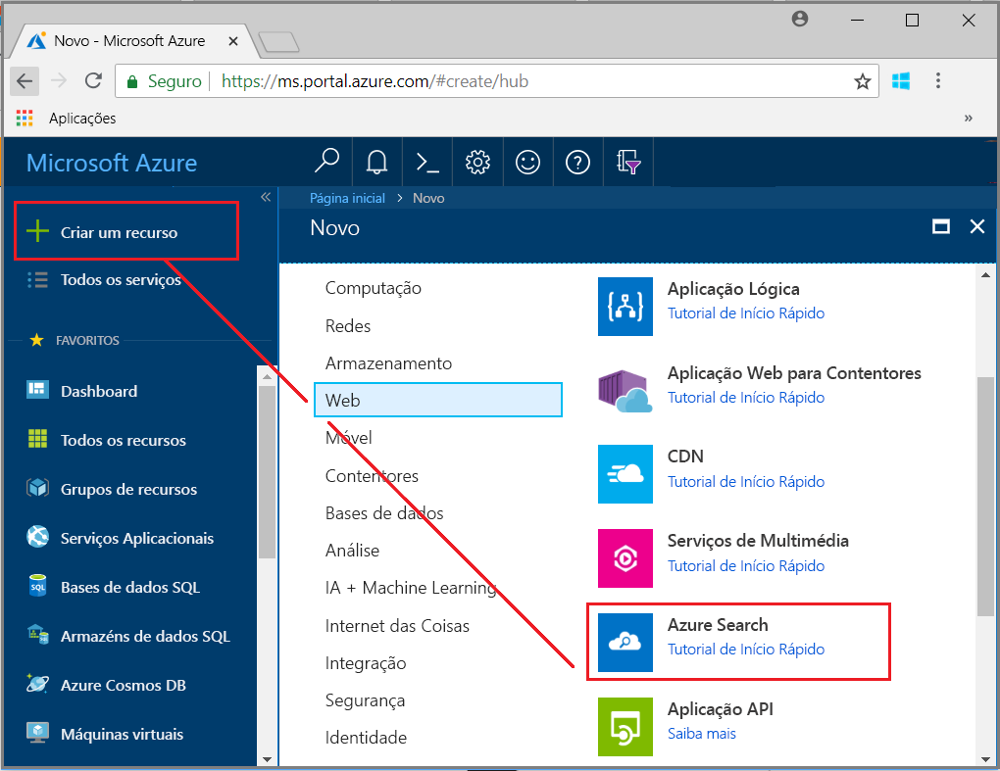
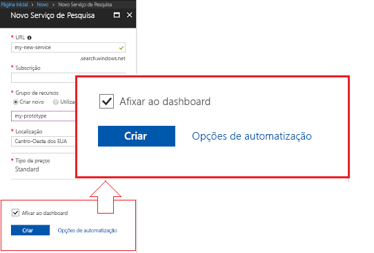
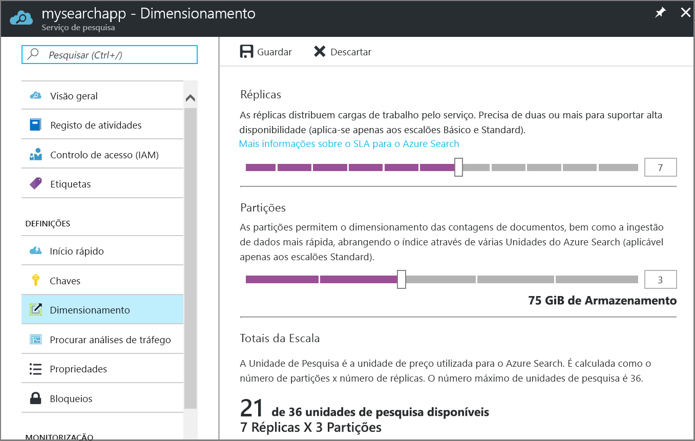

# Criar um serviço do Azure Search no portal

Saiba como criar ou aprovisionar um serviço do Azure Search no portal. 

Prefere o PowerShell? Utilize o [modelo de serviço](https://azure.microsoft.com/resources/templates/101-azure-search-create/) do Azure Resource Manager. Para obter ajuda para começar, veja [Gerir o Azure Search com o PowerShell](search-manage-powershell.md) para obter informações.

## Subscrever (gratuito ou pago)

[Abra uma conta do Azure gratuita](https://azure.microsoft.com/pricing/free-trial/?WT.mc_id=A261C142F) e utilize créditos gratuitos para experimentar serviços do Azure pagos. Depois de gastar os créditos, mantenha a conta e continue a utilizar os serviços do Azure gratuitos, como Web sites. O seu cartão de crédito não será cobrado, a menos que altere explicitamente as suas definições e peça para ser cobrado.

Em alternativa, [ative os benefícios do subscritor do MSDN](https://azure.microsoft.com/pricing/member-offers/msdn-benefits-details/?WT.mc_id=A261C142F). Uma subscrição do MSDN dá-lhe créditos todos os meses que pode utilizar em serviços pagos do Azure. 

## Localizar o Azure Search
1. Inicie sessão no [portal do Azure](https://portal.azure.com/).
2. Clique no sinal de soma ("+ Criar recurso") no canto superior esquerdo.
3. Selecione **Web** > **Azure Search**.

## Atribuir um nome ao serviço e ao ponto final do URL

Um nome de serviço faz parte do ponto final do URL no qual são emitidas as chamadas de API: `https://your-service-name.search.windows.net`. Introduza o nome do serviço no campo **URL**. 

Requisitos do nome do serviço:
   * Tem de ser exclusivo no espaço de nomes search.windows.net
   * Ter 2 e 60 carateres
   * Utilize letras minúsculas, números ou hífenes ("-")
   * Evite hífenes ("-") nos primeiro 2 carateres ou como último caráter único
   * Sem hífenes consecutivos ("-") em qualquer parte

## Selecionar uma subscrição
Se tiver mais do que uma subscrição, escolha uma que tenha também serviços de armazenamento de dados ou ficheiros. O Azure Search pode detetar automaticamente o armazenamento de Tabelas e Blobs do Azure, a Base de Dados SQL e o Azure Cosmos DB para indexação através de [*indexadores*](search-indexer-overview.md), mas apenas para serviços na mesma subscrição.

## Selecionar um grupo de recursos
Um grupo de recursos é uma coleção de serviços e recursos do Azure utilizados em conjunto. Por exemplo, se estiver a utilizar o Azure Search para indexar uma base de dados SQL, ambos os serviços devem fazer parte do mesmo grupo de recursos.

> [!TIP]
> A eliminação de um grupo de recursos também elimina os serviços no mesmo. Para projetos de protótipo que utilizam múltiplos serviços, colocá-los a todos no mesmo grupo de recursos facilita a limpeza depois de o projeto terminar. 

## Selecionar uma localização de alojamento 
Como um serviço do Azure, o Azure Search pode ser alojado em datacenters em todo o mundo. Tenha em atenção que [os preços podem ser diferentes](https://azure.microsoft.com/pricing/details/search/) por geografia.

## Selecionar um escalão de preço (SKU)
[O Azure Search é atualmente disponibilizado em vários escalões de preços](https://azure.microsoft.com/pricing/details/search/): Gratuito, Básico ou Standard. Cada escalão tem a sua própria [capacidade e limites](search-limits-quotas-capacity.md). Veja [Escolher um escalão de preço ou SKU](search-sku-tier.md) para obter orientações.

Normalmente, o escalão Standard é escolhido para cargas de trabalho de produção, embora a maioria dos clientes comece com o serviço Gratuito.

Um escalão de preço não pode ser alterado após a criação do serviço. Se precisar de um escalão superior ou inferior mais tarde, terá de voltar a criar o serviço.

## Criar o serviço

Não se esqueça de afixar o serviço ao dashboard para facilitar o acesso sempre que iniciar sessão.

## Dimensionar o serviço
Pode demorar alguns minutos a criar um serviço (15 minutos ou mais consoante o escalão). Depois de o serviço ser aprovisionado, pode dimensioná-lo para satisfazer as suas necessidades. Uma vez que escolheu o escalão Standard para o seu serviço do Azure Search, pode dimensionar o serviço em duas dimensões: réplicas e partições. Se tiver escolhido o escalão Básico, apenas pode adicionar réplicas. Se tiver aprovisionado o serviço gratuito, o dimensionamento não está disponível.

As ***partições*** permitem ao serviço armazenar e pesquisar mais documentos.

As ***réplicas*** permitem ao serviço processar uma carga maior de consultas de pesquisa.

A adição de recursos aumenta a sua fatura mensal. A [calculadora de preços](https://azure.microsoft.com/pricing/calculator/) pode ajudá-lo a compreender as ramificações de faturação da adição de recursos. Lembre-se de que pode ajustar os recursos com base na carga. Por exemplo, pode aumentar os recursos para criar um índice inicial completo e, em seguida, reduzir recursos mais tarde para um nível mais adequado para a indexação incremental.

> [!Important]
> Um serviço tem de ter [2 réplicas para SLA só de leitura e 3 réplicas para SLA de leitura/escrita](https://azure.microsoft.com/support/legal/sla/search/v1_0/).

1. Aceda à página do serviço de pesquisa no portal do Azure.
2. No painel de navegação esquerdo, selecione **Definições** > **Dimensionar**.
3. Utilize a barra de deslize para adicionar recursos de qualquer tipo.

> [!Note] 
> Cada escalão tem diferentes [limites](search-limits-quotas-capacity.md) para o número total de Unidades de Pesquisa permitido num único serviço (Réplicas * Partições = Total de Unidades de Pesquisa).

## Quando adicionar um segundo serviço

A grande maioria dos clientes utiliza apenas um serviço aprovisionado num escalão que oferece o [equilíbrio certo de recursos](search-sku-tier.md). Um serviço pode alojar vários índices, sujeitos aos [limites máximos do escalão que selecionar](search-capacity-planning.md), com os índices isolados uns dos outros. No Azure Search, os pedidos só podem ser direcionados para um índice, o que minimiza a possibilidade de obtenção de dados acidental ou intencional a partir de outros índices no mesmo serviço.

Embora a maioria dos clientes utilize apenas um serviço, a redundância de serviços pode ser necessária se os requisitos operacionais incluírem o seguinte:

+ Recuperação após desastre (falha do datacenter). O Azure Search não fornece ativação pós-falha instantânea na eventualidade de indisponibilidade. Para obter recomendações e orientações, veja [Administração de serviços](search-manage.md).
+ A investigação de modelação de multi-inquilinos determinou que a conceção ideal é ter serviços adicionais. Para obter mais informações, veja [Conceber para multi-inquilinos](search-modeling-multitenant-saas-applications.md).
+ Para aplicações implementadas globalmente, pode necessitar de uma instância do Azure Search em várias regiões para minimizar a latência do tráfego internacional da sua aplicação.

> [!NOTE]
> No Azure Search, não pode segregar cargas de trabalho de indexação e consulta; assim, nunca criará vários serviços para cargas de trabalho segregadas. Um índice é sempre consultado no serviço em que foi criado (não pode criar um índice num serviço e copiá-lo para outro).
>

Não é necessário um segundo serviço para elevada disponibilidade. A elevada disponibilidade para consultas é alcançada ao utilizar 2 ou mais réplicas no mesmo serviço. As atualizações de réplicas são sequenciais, o que significa que pelo menos uma está operacional quando é implementada uma atualização de serviço. Para obter mais informações sobre o tempo de atividade, veja [Contratos de Nível de Serviço](https://azure.microsoft.com/support/legal/sla/search/v1_0/).

## Passos seguintes
Após o aprovisionamento de um serviço do Azure Search, está pronto para [definir um índice](search-what-is-an-index.md) para poder carregar e pesquisar os seus dados. 

> [!div class="nextstepaction"]
> [Como utilizar o Azure Search no .NET](search-howto-dotnet-sdk.md)
