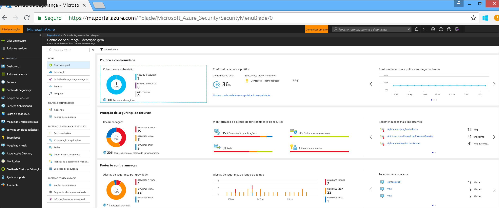
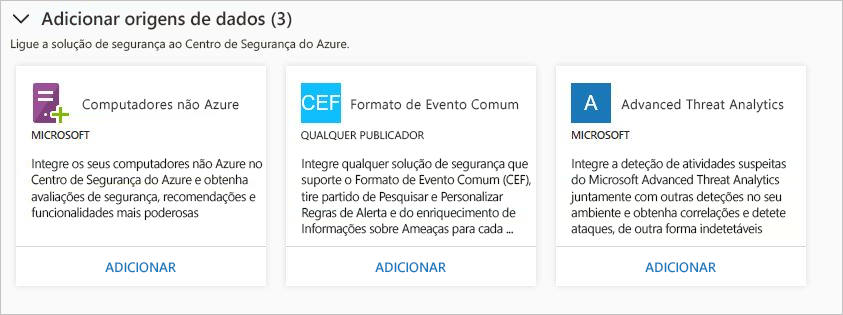
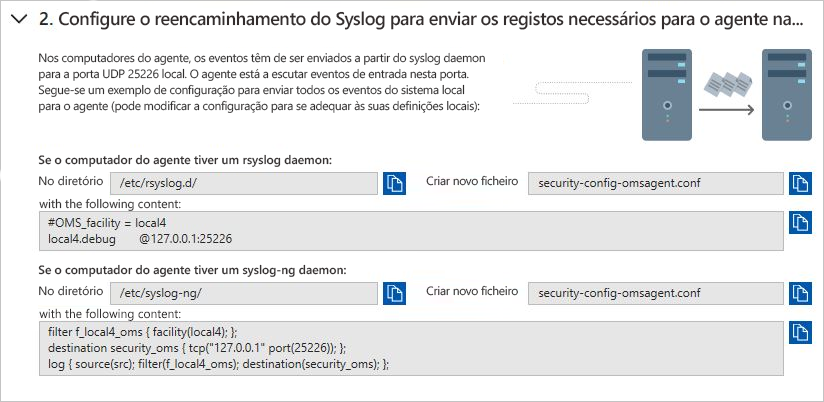
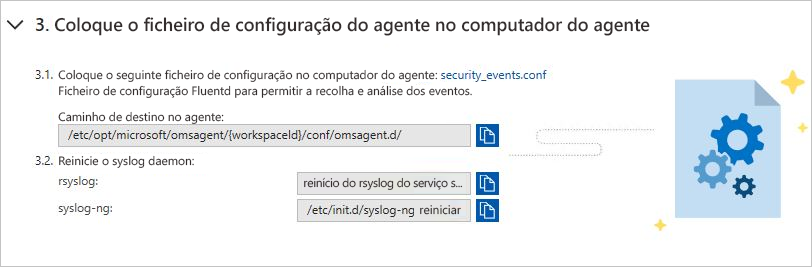
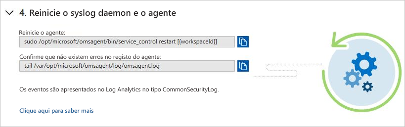
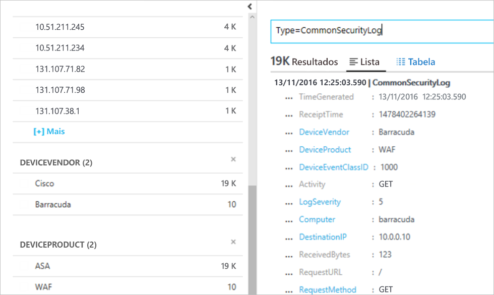

# Manual de Início Rápido: ligar soluções de segurança ao Centro de Segurança

Além de recolher dados de segurança dos seus computadores, pode integrar os dados de segurança de várias outras soluções de segurança, incluindo as que suportarem o Formato de Evento Comum (CEF). O CEF é um formato padrão da indústria sobre as mensagens Syslog, utilizado por vários fornecedores de segurança para permitir a integração de eventos entre diferentes plataformas.

Este manual de início rápido mostra-lhe como:
- Ligar uma solução de segurança ao Centro de Segurança com Registos CEF
- Validar a ligação com a solução de segurança

## Pré-requisitos
Para começar a utilizar o Centro de Segurança, tem de possuir uma subscrição do Microsoft Azure. Se não tiver uma subscrição, pode inscrever-se numa [conta gratuita](https://azure.microsoft.com/free/).

Para acompanhar este manual de início rápido, tem de estar no escalão de preço Standard do Centro de Segurança. Pode experimentar o Centro de Segurança Standard sem custos durante os primeiros 60 dias. O início rápido [Onboard your Azure subscription to Security Center Standard](security-center-get-started.md) (Incluir a sua subscrição do Azure no Centro de Segurança Standard) explica-lhe como atualizar para Standard.

Também precisa de uma [máquina Linux](https://docs.microsoft.com/azure/log-analytics/log-analytics-agent-linux), com o serviço de Syslog já ligado ao seu Centro de Segurança.

## Ligar a solução com CEF

1. Inicie sessão no [Portal do Azure](https://azure.microsoft.com/features/azure-portal/).
2. No menu **Microsoft Azure**, selecione **Centro de Segurança**. **Centro de Segurança - Descrição Geral** é aberto.

      

3. No menu principal do Centro de Segurança, selecione **Soluções de Segurança**.
4. Na página Soluções de Segurança, em **Adicionar origens de dados (3)**, clique em **Adicionar** em **Formato de Evento Comum**.

    

5. Na página Registos do Formato de Evento Comum, expanda o segundo passo **Configurar o reencaminhamento do Syslog para enviar os registos necessários para o agente na porta UDP 25226**e siga as instruções abaixo no seu computador Linux:

    

6. Expanda o terceiro passo **Colocar o ficheiro de configuração do agente no computador do agente** e siga as instruções abaixo no seu computador Linux:

    

7. Expanda o quarto passo **Reiniciar o syslog daemon e o agente**e siga as instruções abaixo no seu computador Linux:

    

## Validar a ligação

Antes de avançar para os passos abaixo, terá de aguardar até que o syslog comece a reportar para o Centro de Segurança. Esta operação pode demorar algum tempo, que irá variar consoante o tamanho do ambiente.

1.  No painel esquerdo do dashboard do Centro de Segurança, clique em **Procurar**.
2.  Selecione a área de trabalho à qual o Syslog (Máquina Linux) está ligado.
3.  Escreva *CommonSecurityLog* e clique no botão **Procurar**.

O exemplo seguinte mostra o resultado destes passos: 

## Limpar recursos
Outros inícios rápidos e tutoriais desta coleção têm por base este início rápido. Se pretender continuar a trabalhar com inícios rápidos e tutoriais posteriores, continue a executar o escalão Standard e mantenha o aprovisionamento automático ativado. Se não pretender continuar ou quiser voltar para o Escalão gratuito:

1. Regresse ao menu principal do Centro de Segurança e selecione **Política de Segurança**.
2. Selecione a subscrição ou a política para a qual pretende voltar como Gratuita. **Política de segurança** abre-se.
3. Em **COMPONENTES DA POLÍTICA**, selecione **Escalão de preço**.
4. Selecione **Gratuito** para alterar a subscrição, do Escalão standard para o Escalão gratuito.
5. Selecione **Guardar**.

Se pretender desativar aprovisionamento automático:

1. Regresse ao menu principal do Centro de Segurança e selecione **Política de segurança**.
2. Selecione a subscrição para a qual pretende desativar o aprovisionamento automático.
3. Em **Política de segurança – Recolha de Dados**, selecione **Desativar** em **Inclusão** para desativar o aprovisionamento automático.
4. Selecione **Guardar**.

>[!NOTE]
> Desativar o aprovisionamento automático não remove o Microsoft Monitoring Agent das VMs do Azure onde o agente tiver sido aprovisionado. Desativar o aprovisionamento automático limita a monitorização da segurança dos seus recursos.
>

## Passos seguintes
Neste manual de início rápido, aprendeu a ligar uma solução do Linux Syslog ao Centro de Segurança através de CEF. Ao ligar os seus registos CEF ao Centro de Segurança, pode tirar partido das regras de alerta personalizado e de pesquisa, e enriquecimento das informações sobre ameaças para cada registo. Para saber mais sobre como utilizar o Centro de Segurança, avance para o tutorial para configurar uma política de segurança e avaliar a segurança dos seus recursos.

> [!div class="nextstepaction"]
> [Tutorial: definir e avaliar as políticas de segurança](./tutorial-security-policy.md)
