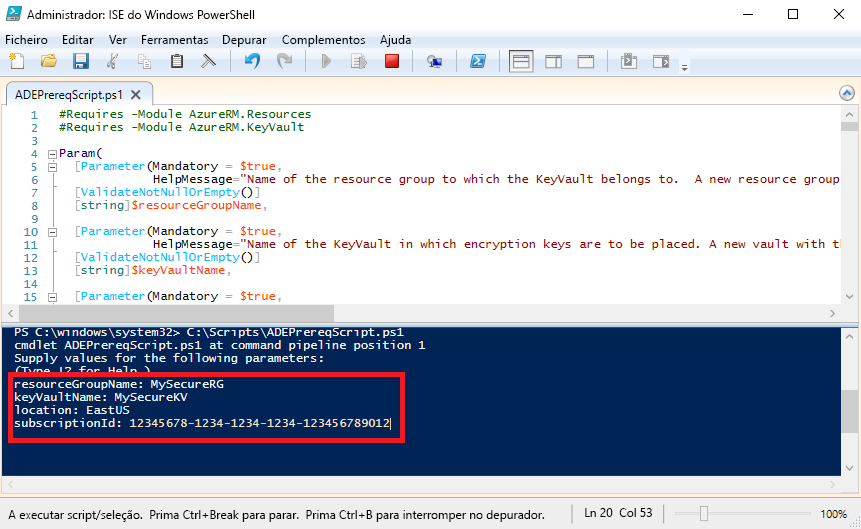

# <a name="quickstart-encrypt-a-windows-iaas-vm-with-azure-powershell"></a>Início rápido: Encriptar uma VM de IaaS do Windows com o Azure PowerShell

O Azure Disk Encryption ajuda-o a encriptar os seus discos de máquina virtual IaaS do Windows e do Linux. A solução está integrada com o Azure Key Vault para ajudar a controlar e gerir as chaves de encriptação do disco e os segredos. Ao utilizar a encriptação de Disco do Azure, pode certificar-se de que as suas VMs inativas são protegidas com a tecnologia de encriptação de norma do setor. Neste início rápido, irá criar uma VM do Windows Server 2016 e encriptar o disco do SO.

Se não tiver uma subscrição do Azure, crie uma [conta gratuita](https://azure.microsoft.com/free/?WT.mc_id=A261C142F) antes de começar.

## <a name="prerequisites"></a>Pré-requisitos

- ISE do Windows PowerShell
- Instalar ou atualizar para o [versão mais recente do módulo AzureRM PowerShell](/powershell/azure/azurerm/install-azurerm-ps?view=azurermps-6.13.0)
    - A versão do módulo AzureRM tem de ser a 6.0.0 ou superior. `Get-Module AzureRM -ListAvailable | Select-Object -Property Name,Version,Path`
- Uma cópia do [script de pré-requisitos do Azure Disk Encryption](https://raw.githubusercontent.com/Azure/azure-powershell/master/src/Compute/Compute/Extension/AzureDiskEncryption/Scripts/AzureDiskEncryptionPreRequisiteSetup.ps1).
    - Se já tem este script, transfira uma nova cópia, uma vez que foi recentemente alterado. 
    - Utilize **CTRL-A** para selecionar todo o texto e, em seguida, utilize **CTRL-C** para copiar todo o texto para o Bloco de notas.
    - Guarde o ficheiro como **ADEPrereqScript.ps1**


## <a name="sign-in-to-azure"></a>Iniciar sessão no Azure

1. Clique com o botão direito do rato em **ISE do Windows PowerShell** e clique em **Executar como administrador**.
1. Na **administrador: Windows PowerShell ISE** janela, clique em **vista** e, em seguida, clique em **Mostrar painel de Script**.
1. No painel de scripts, escreva o seguinte cmdlet: 

     ```azurepowershell
      Connect-AzureRMAccount
     ```

1. Clique na seta verde para **Executar Script**, ou utilize F5. 
2. Utilize o início de sessão interativo para concluir a ligação à sua conta do Azure.
3. Copie o seu **ID de subscrição** que é devolvido para utilização ao executar o próximo script do PowerShell. 

## <a name="bkmk_PrereqScript"></a>Execute o script de pré-requisitos do Azure Disk Encryption
 **ADEPrereqScript.ps1** irá criar um grupo de recursos, um cofre de chaves e definir a política de acesso do cofre de chaves. O script também cria um bloqueio de recursos no cofre de chaves para ajudar a protegê-lo da eliminação acidental.  

1. Na **administrador: Windows PowerShell ISE** janela, clique em **arquivo** e, em seguida, clique em **aberto**. Navegue para o ficheiro **ADEPrereqScript.ps1** e faça duplo clique no mesmo. O script irá abrir num painel de scripts.
2. Clique na seta verde para **Executar Script**, ou utilize F5 para executar o script. 
3. Escreva os nomes para um novo **grupo de recursos** e um novo **cofre de chaves**. Não utilize um grupo de recursos existente ou um cofre de chaves para este início rápido, uma vez que vamos eliminar o grupo de recursos mais tarde. 
4. Escreva a localização onde pretende criar os recursos, como **EastUS**. Obtenha uma lista de localizações com `Get-AzureRMLocation`.
5. Copie o seu **ID de subscrição**. Pode obter o seu ID de subscrição com `Get-AzureRMSubscription`.  
6. Clique na seta verde para **Executar Script**. 
7. Copie **DiskEncryptionKeyVaultUrl** e **DiskEncryptionKeyVaultId** devolvidos para serem utilizados mais tarde.




## <a name="create-a-virtual-machine"></a>Criar uma máquina virtual 
Agora precisa de criar uma máquina virtual, para que possa encriptar o respetivo disco. O script que irá utilizar cria uma VM do Windows Server 2016 com 8 GB de RAM e um disco do SO de 30 GB. 

1. Copie o script para o **administrador: Windows PowerShell ISE** painel de scripts e alterar as variáveis de três principais. O grupo de recursos e a localização têm de ser os mesmos que utilizou no [script de pré-requisitos](#bkmk_PrereqScript).  

   ```azurepowershell
    # Variables for common values
    $resourceGroup = "MySecureRG"
    $location = "EastUS"
    $vmName = "MySecureVM"
    
    # Create user object
    $cred = Get-Credential -Message "Enter a username and password for the virtual machine."
    
    # Create a resource group
    #New-AzureRmResourceGroup -Name $resourceGroup -Location $location
    
    # Create a subnet configuration
    $subnetConfig = New-AzureRmVirtualNetworkSubnetConfig -Name mySubnet -AddressPrefix 192.168.1.0/24
    
    # Create a virtual network
    $vnet = New-AzureRmVirtualNetwork -ResourceGroupName $resourceGroup -Location $location `
      -Name MYvNET -AddressPrefix 192.168.0.0/16 -Subnet $subnetConfig
    
    # Create a public IP address and specify a DNS name
    $pip = New-AzureRmPublicIpAddress -ResourceGroupName $resourceGroup -Location $location `
      -Name "mypublicdns$(Get-Random)" -AllocationMethod Static -IdleTimeoutInMinutes 4
    
    # Create an inbound network security group rule for port 3389
    $nsgRuleRDP = New-AzureRmNetworkSecurityRuleConfig -Name myNetworkSecurityGroupRuleRDP  -Protocol Tcp `
      -Direction Inbound -Priority 1000 -SourceAddressPrefix * -SourcePortRange * -DestinationAddressPrefix * `
      -DestinationPortRange 3389 -Access Allow
    
    # Create a network security group
    $nsg = New-AzureRmNetworkSecurityGroup -ResourceGroupName $resourceGroup -Location $location `
      -Name myNetworkSecurityGroup -SecurityRules $nsgRuleRDP
    
    # Create a virtual network card and associate with public IP address and NSG
    $nic = New-AzureRmNetworkInterface -Name myNic -ResourceGroupName $resourceGroup -Location $location `
      -SubnetId $vnet.Subnets[0].Id -PublicIpAddressId $pip.Id -NetworkSecurityGroupId $nsg.Id
    
    # Create a virtual machine configuration
    $vmConfig = New-AzureRmVMConfig -VMName $vmName -VMSize Standard_D2_v3 | `
    Set-AzureRmVMOperatingSystem -Windows -ComputerName $vmName -Credential $cred | `
    Set-AzureRmVMSourceImage -PublisherName MicrosoftWindowsServer -Offer WindowsServer -Skus 2016-Datacenter-smalldisk -Version latest | `
    Add-AzureRmVMNetworkInterface -Id $nic.Id
    
    # Create a virtual machine
    New-AzureRmVM -ResourceGroupName $resourceGroup -Location $location -VM $vmConfig
   ```

2. Clique na seta verde para **Executar Script**, para compilar a VM.  


## <a name="encrypt-the-disk-of-the-vm"></a>Encriptar o disco da VM
Agora que já criou e configurou um cofre de chaves e uma VM, pode encriptar o disco com o cmdlet **Set-AzureRmVmDiskEncryptionExtension**. 
 
1. Execute o seguinte cmdlet para encriptar o disco da VM:

    ```azurepowershell
     Set-AzureRmVmDiskEncryptionExtension -ResourceGroupName "MySecureRG" -VMName "MySecureVM" `
     -DiskEncryptionKeyVaultId "<Returned by the prerequisites script>" -DiskEncryptionKeyVaultUrl "<Returned by the prerequisites script>"
     ```


1. Quando a encriptação estiver concluída, pode verificar que o disco está encriptado com o seguinte cmdlet: 

     ```azurepowershell
     Get-AzureRmVmDiskEncryptionStatus -ResourceGroupName "MySecureRG" -VMName "MySecureVM"
     ```
    
    
## <a name="clean-up-resources"></a>Limpar recursos
 O **ADEPrereqScript.ps1** cria um bloqueio de recursos no cofre de chaves. Para limpar os recursos neste início rápido, terá de remover o bloqueio de recurso pela primeira vez e, em seguida, eliminar o grupo de recursos. 

1. Remover o bloqueio de recursos do cofre de chaves

     ```azurepowershell
     $LockId =(Get-AzureRMResourceLock -ResourceGroupName "MySecureRG" -ResourceName "MySecureVault" -ResourceType "Microsoft.KeyVault/vaults").LockID 
     Remove-AzureRmResourceLock -LockID $LockId
      ```
    
2. Remova o grupo de recursos. Este procedimento também irá eliminar todos os recursos no grupo. 
     ```azurepowershell
      Remove-AzureRmResourceGroup -Name "MySecureRG"
      ```

## <a name="next-steps"></a>Passos Seguintes
Avance para o artigo seguinte para saber mais sobre os pré-requisitos do Azure Disk Encryption para VMs de IaaS.

> [!div class="nextstepaction"]
> [Pré-requisitos do Azure Disk Encryption](azure-security-disk-encryption-prerequisites.md)