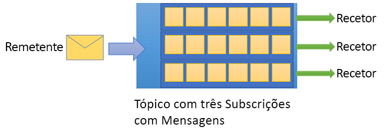

# O que é o Azure Service Bus?

O Microsoft Azure Service Bus é um mediador de mensagens de integração empresarial totalmente gerido. O Service Bus é mais utilizado para dissociar aplicações e serviços e é uma plataforma fiável e segura para transferência de estados e dados assíncronos. Os dados são transferidos entre diferentes aplicações e serviços utilizando *mensagens*. É uma mensagem no formato binário, que pode conter somente texto, JSON ou XML. 

Alguns cenários comuns de mensagens são:

* Mensagens: transferir dados empresariais, como vendas ou notas de encomenda, diários ou movimentos de inventário.
* Dissociar aplicações: melhorar a fiabilidade e a escalabilidade de aplicações e serviços (o cliente e o serviço não têm de estar online ao mesmo tempo).
* Tópicos e subscrições: ativar relações 1:*n* entre os editores e os subscritores.
* Sessões de mensagens: implementar fluxos de trabalho que exigem a ordenação de mensagens ou diferimento de mensagens.

## Espaços de nomes

O espaço de nomes é um contentor para todos os componentes de mensagens. Um único espaço de nomes pode conter várias filas e tópicos, sendo que os espaços de nomes servem frequentemente de contentores da aplicação.

## Filas

As mensagens são enviadas e recebidas de *filas*. As filas permitem armazenar mensagens até a aplicação recetora estar disponível para receber e processá-las.

As mensagens das filas são ordenadas e carimbadas com data/hora na chegada. Depois de aceite, a mensagem é mantida em segurança no armazenamento redundante. As mensagens são entregues na *pull* modo, que oferece a mensagens de pedido.

## Tópicos

Também pode utilizar *tópicos* para enviar e receber mensagens. Embora uma fila seja utilizada frequentemente para comunicação ponto a ponto, os tópicos são úteis em cenários de publicação/subscrição.

Os tópicos podem ter várias subscrições independentes. Um subscritor de um tópico pode receber uma cópia de cada mensagem enviada para esse tópico. As subscrições são entidades denominadas, que são criadas de forma duradoura, mas podem, opcionalmente, expirar ou serem eliminadas automaticamente.

Em alguns cenários, pode não pretender que as subscrições individuais recebam todas as mensagens enviadas para um tópico. Nesse caso, pode utilizar [regras e filtros](topic-filters.md) para definir condições que acionem [ações](topic-filters.md#actions) opcionais, filtrem mensagens especificadas e definam ou modifiquem propriedades de mensagem.

## Funcionalidades avançadas

O Service Bus também tem funcionalidades avançadas que permitem resolver problemas de mensagens mais complexos. As seguintes secções descrevem estas principais funcionalidades:

### Sessões de mensagens

Para uma garantia FIFO (first-in, first-out) no Service Bus, utilize sessões. As [sessões de mensagens](message-sessions.md) permitem o manuseamento conjunto e ordenado de sequências não vinculadas de mensagens relacionadas. 

### Reencaminhamento automático

A funcionalidade de [reencaminhamento automático](service-bus-auto-forwarding.md) permite encadear uma fila ou subscrição a outra fila ou tópico que faça parte do mesmo espaço de nomes. Quando o reencaminhamento automático estiver ativado, o Service Bus remove automaticamente as mensagens que são colocadas na primeira fila ou subscrição (origem) e coloca-as na segunda fila ou tópico (destino).

### Mensagens não entregues

O Service Bus suporta uma [fila de mensagens não entregues](service-bus-dead-letter-queues.md) (DLQ) para guardar mensagens que não podem ser entregues a qualquer recetor ou mensagens que não podem ser processadas. Pode remover mensagens da DLQ e inspecioná-las.

### Entrega agendada

Pode submeter mensagens para uma fila ou tópico [para processamento adiado](message-sequencing.md#scheduled-messages); por exemplo, para agendar uma tarefa para ficar disponível para processamento por um sistema a determinada hora.

### Diferimento de mensagens

Quando um cliente de fila ou subscrição recebe uma mensagem que está disposto a processar, mas cujo processamento não é atualmente disponível devido a circunstâncias especiais na aplicação, a entidade tem a opção de [diferir a obtenção da mensagem](message-deferral.md) para um momento posterior. A mensagem permanece na fila ou subscrição, mas é reservada.

### Lotes

A [criação de lotes do lado do cliente](service-bus-performance-improvements.md#client-side-batching) permite que um cliente de fila ou tópico adie o envio de uma mensagem por determinado período de tempo. Se o cliente enviar mensagens adicionais durante este período de tempo, transmitirá as mensagens num único lote. 

### Transações

Uma [transação](service-bus-transactions.md) agrupa duas ou mais operações num âmbito de execução. O Service Bus suporta operações de agrupamento em relação a uma entidade de mensagens única (fila, tópico, subscrição) no âmbito de uma transação.

### Filtragem e ações

Os subscritores podem definir as mensagens que pretendem receber de um tópico. Estas mensagens são especificadas na forma de uma ou mais [regras de subscrição denominadas](topic-filters.md). Para cada condição de regra correspondente, a subscrição produz uma cópia da mensagem, que pode ser anotada de forma diferente para cada regra correspondente.

### Eliminação automática em inatividade

A [eliminação automática em inatividade](/dotnet/api/microsoft.servicebus.messaging.queuedescription.autodeleteonidle) permite especificar um intervalo de inatividade após o qual a fila é eliminada automaticamente. A duração mínima é 5 minutos.

### Deteção de duplicados

Se ocorrer um erro que faz com que o cliente tiver qualquer dúvida sobre o resultado de uma operação de envio [duplicar deteção](duplicate-detection.md) leva a dúvida fora essas situações, permitindo que o remetente enviar novamente a mesma mensagem e a fila ou tópico elimina quaisquer cópias duplicadas.

### SAS, RBAC e Identidades geridas para os recursos do Azure

O Service Bus suporta protocolos de segurança como [Assinaturas de Acesso Partilhado](service-bus-sas.md) (SAS), [Controlo de Acesso Baseado em Funções](service-bus-role-based-access-control.md) (RBAC) e [Identidades geridas para os recursos do Azure](service-bus-managed-service-identity.md).

### Recuperação após desastre geográfica

Quando as regiões ou centros de dados do Azure sofrem um período de inatividade, a [recuperação após desastre geográfica](service-bus-geo-dr.md) permite o processamento de dados para continuar a operar numa região ou centro de dados diferente.

### Segurança

O Service Bus suporta os protocolos [AMQP 1.0](service-bus-amqp-overview.md) e [HTTP/REST](/rest/api/servicebus/) padrão.

## Bibliotecas de cliente

O Service Bus suporta bibliotecas de cliente para [.NET](https://github.com/Azure/azure-service-bus-dotnet/tree/master), [Java](https://github.com/Azure/azure-service-bus-java/tree/master) e [JMS](https://github.com/Azure/azure-service-bus/tree/master/samples/Java/qpid-jms-client).

## Integração

O Service Bus integra-se totalmente nos seguintes serviços do Azure:

- [Event Grid](https://azure.microsoft.com/services/event-grid/) 
- [Aplicações Lógicas](https://azure.microsoft.com/services/logic-apps/) 
- [Funções](https://azure.microsoft.com/services/functions/) 
- [Dynamics 365](https://dynamics.microsoft.com)
- [Stream Analytics](https://azure.microsoft.com/services/stream-analytics/)
 
## Passos Seguintes

Para começar a utilizar as mensagens do Service Bus, consulte os seguintes artigos:

* [Comparar serviços de mensagens do Azure](../event-grid/compare-messaging-services.md?toc=%2fazure%2fservice-bus-messaging%2ftoc.json&bc=%2fazure%2fservice-bus-messaging%2fbreadcrumb%2ftoc.json)
* Obtenha mais informações sobre os escalões [Standard e Premium](https://azure.microsoft.com/pricing/details/service-bus/) do Azure Service Bus e os respetivos preços
* [Desempenho e Latência do escalão Premium do Azure Service Bus](https://blogs.msdn.microsoft.com/servicebus/2016/07/18/premium-messaging-how-fast-is-it/)
* Experimente os inícios rápidos sobre [.NET](service-bus-quickstart-powershell.md), [Java](service-bus-quickstart-powershell.md) ou [JMS](service-bus-quickstart-powershell.md)
