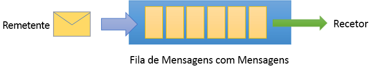
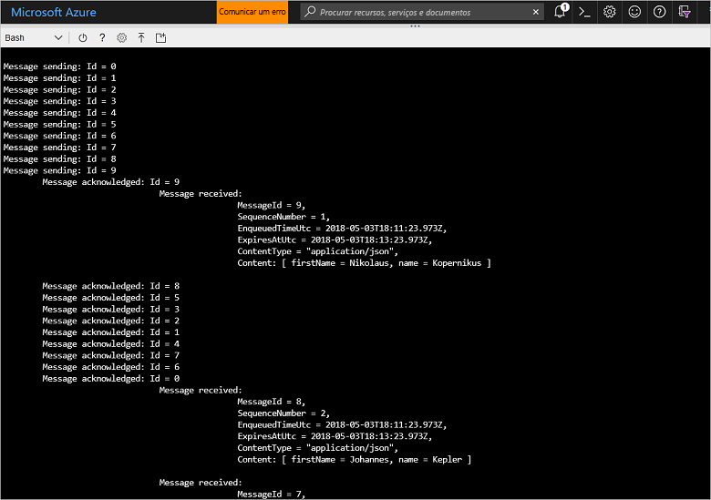

# <a name="quickstart-send-and-receive-messages-using-azure-cli-and-java"></a>Início Rápido: Enviar e receber mensagens com a CLI do Azure e o Java

O Microsoft Azure Service Bus é um mediador de mensagens de integração empresarial que fornece mensagens seguras e fiabilidade. Um cenário normal do Service Bus, normalmente, envolve desacoplamento de duas ou mais aplicações, serviços ou processos entre si (as aplicações não precisam de estar online ao mesmo tempo), transferir alterações de estado ou de dados e envio de mensagens entre as aplicações. 

Por exemplo, uma empresa de revenda poderá enviar os dados do respetivo ponto de venda para um escritório ou centro de distribuição regional para atualização de reabastecimento e de inventário. Neste caso, a aplicação cliente envia e recebe mensagens numa fila do Service Bus:



Este guia de introdução descreve como enviar e receber mensagens com o Service Bus, através da CLI do Azure e da biblioteca de Java do Service Bus. Por fim, se estiver interessado em obter mais detalhes técnicos, pode [ler uma explicação](#understand-the-sample-code) dos elementos-chave do código de exemplo.

Se não tiver uma subscrição do Azure, pode criar uma [conta gratuita][] antes de começar.

[!INCLUDE [cloud-shell-try-it.md](../../includes/cloud-shell-try-it.md)]

## <a name="log-in-to-azure"></a>Iniciar sessão no Azure

Clique no botão de Cloud Shell no menu no canto superior direito do portal do Azure e na lista pendente **Selecionar ambiente** , selecione **Bash**. 

## <a name="use-cli-to-create-resources"></a>Utilize a CLI para criar recursos

No Cloud Shell, na linha de comandos do Bash, indique os seguintes comandos para aprovisionar os recursos do Service Bus. Não se esqueça de substituir todos os marcadores de posição pelos valores apropriados:

```azurecli-interactive
# Create a resource group
az group create --name myResourceGroup --location eastus

# Create a Service Bus messaging namespace with a unique name
namespaceName=myNameSpace$RANDOM
az servicebus namespace create \
   --resource-group myResourceGroup \
   --name $namespaceName \
   --location eastus

# Create a Service Bus queue
az servicebus queue create --resource-group myResourceGroup \
   --namespace-name $namespaceName \
   --name myQueue

# Get the connection string for the namespace
connectionString=$(az servicebus namespace authorization-rule keys list \
   --resource-group myResourceGroup \
   --namespace-name  $namespaceName \
   --name RootManageSharedAccessKey \
   --query primaryConnectionString --output tsv)
```

Depois da execução do último comando, copie e cole a cadeia de ligação e o nome de fila selecionado para uma localização temporária como o Bloco de notas. Vai precisar dele no próximo passo.

## <a name="send-and-receive-messages"></a>Enviar e receber mensagens

Depois de ter criado a fila e o espaço de nomes e se tiver as credenciais necessárias, está pronto para enviar e receber mensagens. Pode examinar o código nesta [pasta de exemplo do GitHub](https://github.com/Azure/azure-service-bus/tree/master/samples/Java/quickstarts-and-tutorials/quickstart-java/src/main/java/samples/quickstart/SendAndReceiveMessages.java).

1. Certifique-se de que a Cloud Shell está aberta e apresenta a linha de comandos do Bash.

2. Clone o [repositório do GitHub do Service Bus](https://github.com/Azure/azure-service-bus/) ao indicar o comando seguinte:

   ```bash
   git clone https://github.com/Azure/azure-service-bus.git
   ```

2. Altere o diretório atual para a pasta de exemplo, utilizando barras como separadores de caminho:

   ```bash
   cd azure-service-bus/samples/Java/quickstarts-and-tutorials/quickstart-java 
   ```

3. Indique o seguinte comando para criar a aplicação:
   
   ```bash
   mvn clean package -DskipTests
   ```

4. Para executar o programa, indique o seguinte comando. Uma vez que não reiniciou a shell do bash, a variável que contém o valor de cadeia de ligação é substituída automaticamente:

   ```bash
   java -jar ./target/samples.quickstart-1.0.0-jar-with-dependencies.jar -c $connectionString -q myQueue
   ```

6. Observe 10 mensagens que estão a ser enviadas para a fila. Tenha em atenção que não é garantida a ordenação de mensagens, mas pode ver as mensagens enviadas e, em seguida, confirmadas e recebidas, juntamente com os dados do payload:

   

## <a name="clean-up-resources"></a>Limpar recursos

Execute o seguinte comando para remover o grupo de recursos, o espaço de nomes e todos os recursos relacionados:

```azurecli-interactive
az group delete --resource-group myResourceGroup
```

## <a name="understand-the-sample-code"></a>Compreender o código de exemplo

Esta secção contém mais detalhes sobre as secções-chave do código de exemplo. Pode procurar o código, localizado no repositório do GitHub [aqui](https://github.com/Azure/azure-service-bus/blob/master/samples/Java/quickstarts-and-tutorials/quickstart-java/src/main/java/samples/quickstart/SendAndReceiveMessages.java).

### <a name="get-connection-string-and-queue"></a>Obter a cadeia de ligação e a fila

Em primeiro lugar, o código declara duas variáveis de cadeia que são transmitidas para o programa como argumentos na linha de comandos:

```java
String ConnectionString = null;
String QueueName = null;
```

Estes valores são adicionados através dos parâmetros e atribuídos ao método `runApp()`:

```java
public static void main(String[] args) {
    SendAndReceiveMessages app = new SendAndReceiveMessages();
    try {
        app.runApp(args);
        app.run();
    } catch (Exception e) {
        System.out.printf("%s", e.toString());
    }
    System.exit(0);
}

public void runApp(String[] args) {
    try {
        // parse connection string from command line             
        Options options = new Options();
        options.addOption(new Option("c", true, "Connection string"));
        options.addOption(new Option("q", true, "Queue Name"));
        CommandLineParser clp = new DefaultParser();
        CommandLine cl = clp.parse(options, args);
        if (cl.getOptionValue("c") != null && cl.getOptionValue("q") != null) {
            ConnectionString = cl.getOptionValue("c");
            QueueName =  cl.getOptionValue("q");
        }
        else
        {
            HelpFormatter formatter = new HelpFormatter();
            formatter.printHelp("run jar with", "", options, "", true);
        }

    } catch (Exception e) {
        System.out.printf("%s", e.toString());
    }
}
```

### <a name="create-queue-clients-to-send-and-receive"></a>Criar clientes de fila para enviar e receber

Para enviar e receber mensagens, o método `run()` cria instâncias de cliente de fila, que são construídas a partir da cadeia de ligação e do nome da fila. Este código cria dois clientes de fila, cada um para envio e receção:

```java
public void run() throws Exception {
// Create a QueueClient instance for receiving using the connection string builder
// We set the receive mode to "PeekLock", meaning the message is delivered
// under a lock and must be acknowledged ("completed") to be removed from the queue
QueueClient receiveClient = new QueueClient(new ConnectionStringBuilder(ConnectionString, QueueName), ReceiveMode.PEEKLOCK);
this.registerReceiver(receiveClient);

// Create a QueueClient instance for sending and then asynchronously send messages.
QueueClient sendClient = new QueueClient(new ConnectionStringBuilder(ConnectionString, QueueName), ReceiveMode.PEEKLOCK);
```

O método `run()` também é iniciado como operação de envio de mensagens assíncronas e fecha o remetente depois de concluída a operação de envio:

```java
this.sendMessagesAsync(sendClient).thenRunAsync(() -> sendClient.closeAsync());
``` 

### <a name="construct-and-send-messages"></a>Construir e enviar mensagens

O método `sendMessagesAsync()` cria um conjunto de 10 mensagens e no modo assíncrono envia-as com o cliente de fila:

```java
CompletableFuture<Void> sendMessagesAsync(QueueClient sendClient) {
List<HashMap<String, String>> data =
        GSON.fromJson(
                "[" +
                        "{'name' = 'Einstein', 'firstName' = 'Albert'}," +
                        "{'name' = 'Heisenberg', 'firstName' = 'Werner'}," +
                        "{'name' = 'Curie', 'firstName' = 'Marie'}," +
                        "{'name' = 'Hawking', 'firstName' = 'Steven'}," +
                        "{'name' = 'Newton', 'firstName' = 'Isaac'}," +
                        "{'name' = 'Bohr', 'firstName' = 'Niels'}," +
                        "{'name' = 'Faraday', 'firstName' = 'Michael'}," +
                        "{'name' = 'Galilei', 'firstName' = 'Galileo'}," +
                        "{'name' = 'Kepler', 'firstName' = 'Johannes'}," +
                        "{'name' = 'Kopernikus', 'firstName' = 'Nikolaus'}" +
                        "]",
                new TypeToken<List<HashMap<String, String>>>() {}.getType());

List<CompletableFuture> tasks = new ArrayList<>();
for (int i = 0; i < data.size(); i++) {
    final String messageId = Integer.toString(i);
    Message message = new Message(GSON.toJson(data.get(i), Map.class).getBytes(UTF_8));
    message.setContentType("application/json");
    message.setLabel("Scientist");
    message.setMessageId(messageId);
    message.setTimeToLive(Duration.ofMinutes(2));
    System.out.printf("\nMessage sending: Id = %s", message.getMessageId());
    tasks.add(
            sendClient.sendAsync(message).thenRunAsync(() -> {
                System.out.printf("\n\tMessage acknowledged: Id = %s", message.getMessageId());
            }));
}
return CompletableFuture.allOf(tasks.toArray(new CompletableFuture<?>[tasks.size()]));
```

### <a name="receive-messages"></a>Receber mensagens

O método `registerReceiver()` regista a chamada de retorno `RegisterMessageHandler` e também define algumas opções de mensagem de processador:

```java
void registerReceiver(QueueClient queueClient) throws Exception {
    // register the RegisterMessageHandler callback
    queueClient.registerMessageHandler(new IMessageHandler() {
                           // callback invoked when the message handler loop has obtained a message
                           public CompletableFuture<Void> onMessageAsync(IMessage message) {
                               // receives message is passed to callback
                               if (message.getLabel() != null &&
                                       message.getContentType() != null &&
                                       message.getLabel().contentEquals("Scientist") &&
                                       message.getContentType().contentEquals("application/json")) {
                                    byte[] body = message.getBody();
                                   Map scientist = GSON.fromJson(new String(body, UTF_8), Map.class);

                                   System.out.printf(
                                           "\n\t\t\t\tMessage received: \n\t\t\t\t\t\tMessageId = %s, \n\t\t\t\t\t\tSequenceNumber = %s, \n\t\t\t\t\t\tEnqueuedTimeUtc = %s," +
                                                   "\n\t\t\t\t\t\tExpiresAtUtc = %s, \n\t\t\t\t\t\tContentType = \"%s\",  \n\t\t\t\t\t\tContent: [ firstName = %s, name = %s ]\n",
                                           message.getMessageId(),
                                           message.getSequenceNumber(),
                                           message.getEnqueuedTimeUtc(),
                                           message.getExpiresAtUtc(),
                                           message.getContentType(),
                                           scientist != null ? scientist.get("firstName") : "",
                                           scientist != null ? scientist.get("name") : "");
                               }
                               return CompletableFuture.completedFuture(null);
                           }

                           // callback invoked when the message handler has an exception to report
                           public void notifyException(Throwable throwable, ExceptionPhase exceptionPhase) {
                               System.out.printf(exceptionPhase + "-" + throwable.getMessage());
                           }
                       },
    // 1 concurrent call, messages are auto-completed, auto-renew duration
    new MessageHandlerOptions(1, true, Duration.ofMinutes(1)));

}
```

## <a name="next-steps"></a>Passos seguintes

Neste artigo, criou um espaço de nomes do Service Bus e outros recursos necessários para enviar e receber mensagens numa fila. Para obter mais informações sobre como escrever código para enviar e receber mensagens, continue no tutorial seguinte para o Service Bus:

> [!div class="nextstepaction"]
> [Atualizar inventário com a CLI e o Java](./service-bus-tutorial-topics-subscriptions-cli.md)

[Conta gratuita]: https://azure.microsoft.com/free/?ref=microsoft.com&utm_source=microsoft.com&utm_medium=docs&utm_campaign=visualstudio
[fully qualified domain name]: https://wikipedia.org/wiki/Fully_qualified_domain_name
[Install Azure CLI 2.0]: /cli/azure/install-azure-cli
[az group create]: /cli/azure/group#az_group_create