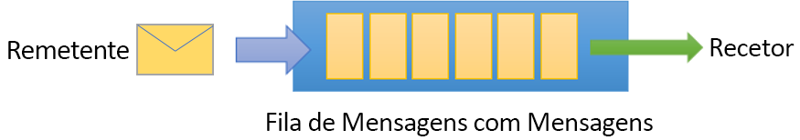
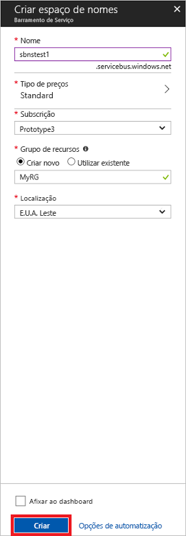

# <a name="quickstart-send-and-receive-messages-using-the-azure-portal-and-net"></a>Início Rápido: Enviar e receber mensagens com o portal do Azure e o .NET

O Microsoft Azure Service Bus é um mediador de mensagens de integração empresarial que fornece mensagens seguras e fiabilidade absoluta. Um cenário típico do Service Bus, normalmente, envolve desacoplamento de duas ou mais aplicações, serviços ou processos entre si e transferência de alterações de estado ou de dados. Tais cenários poderão envolver agendamento de várias tarefas de lote noutras aplicações ou serviços ou acionamento de cumprimento de pedidos. Por exemplo, uma empresa de revenda poderá enviar os dados do seu ponto de venda para um escritório ou centro de distribuição regional para atualização de reabastecimento e de inventário. Neste cenário, a aplicação cliente envia e recebe mensagens numa fila do Service Bus.  



Este início rápido descreve como enviar e receber mensagens de e para uma fila do Service Bus, com o [portal do Azure][Azure portal] para criar um espaço de nomes de mensagens e uma fila dentro desse espaço de nomes e obter as credenciais de autorização nesse espaço de nomes. O procedimento, em seguida, mostra como enviar e receber mensagens desta fila com a [biblioteca .NET Standard](https://www.nuget.org/packages/Microsoft.Azure.ServiceBus).

Se não tiver uma subscrição do Azure, pode criar uma [conta gratuita][] antes de começar.

## <a name="prerequisites"></a>Pré-requisitos

Para concluir este tutorial, confirme que tem instalada:

- [Visual Studio 2017 Atualização 3 (versão 15.3, 26730.01)](https://www.visualstudio.com/vs) ou posterior.
- [SDK NET Core](https://www.microsoft.com/net/download/windows), versão 2.0 ou posterior.

## <a name="log-on-to-the-azure-portal"></a>Iniciar sessão no portal do Azure

Primeiro, entre no [Portal do Azure][Azure portal] e inicie sessão com a sua subscrição do Azure. O primeiro passo é criar um espaço de nomes de Service Bus do tipo **Mensagens**.

## <a name="create-a-service-bus-namespace"></a>Criar um espaço de nomes do Service Bus

Um espaço de nomes de mensagens do Service Bus fornece um contentor de âmbito exclusivo, referenciado pela [nome de domínio completamente qualificado][], no qual cria uma ou mais filas, tópicos e subscrições. O exemplo seguinte cria um espaço de nomes de mensagens do Service Bus num [ grupo de recursos](/azure/azure-resource-manager/resource-group-portal) novo ou existente:

1. No painel de navegação à esquerda do portal, clique em **+ Criar um recurso** e, em seguida, clique em **Enterprise Integration** e em **Service Bus**.
2. Na caixa de diálogo **Criar espaço de nomes**, introduza um nome de espaço de nomes. O sistema verifica imediatamente a disponibilidade do nome.
3. Após se confirmar que o espaço de nomes está disponível, selecione o escalão de preço (Standard ou Premium).
4. No campo **Subscrição**, selecione a subscrição do Azure em que pretende criar o espaço de nomes.
5. No campo **Grupo de recursos**, selecione um grupo de recursos existente em que o espaço de nomes será colocado ou crie um novo.      
6. Em **Localização**, selecione o país ou a região em que o espaço de nomes deverá ser alojado.
7. Clique em **Criar**. O sistema cria o espaço de nomes e ativa-o. Poderá ter de aguardar alguns minutos enquanto o sistema aprovisiona recursos para a sua conta.



### <a name="obtain-the-management-credentials"></a>Obter as credenciais de gestão

A criação de um espaço de nomes gera automaticamente uma regra inicial de Assinatura de Acesso Partilhado (SAS) com um par de chaves primárias e secundárias associado que cada uma concede controlo total sobre todos os aspetos do espaço de nomes. Para copiar a regra inicial, siga estes passos: 

1.  Clique em **Todos os recursos** e clique no nome do espaço de nomes criado recentemente.
2. Na janela de espaço de nomes, clique em **Políticas de acesso partilhado**.
3. No ecrã **Políticas de acesso partilhado**, clique em **RootManageSharedAccessKey**.
4. Na janela **Política: RootManageSharedAccessKey**, clique no botão **Copiar** junto a **Cadeia de Ligação Primária** para copiar a cadeia de ligação para a sua área de transferência e utilizá-la mais tarde. Cole este valor no Bloco de Notas ou noutra localização temporária. 

    ![connection-string][connection-string]
5. Repita o passo anterior, copie e cole o valor da **Chave primária** para uma localização temporária para utilizar mais tarde.

## <a name="create-a-queue"></a>Criar uma fila

Para criar uma fila do Service Bus, especifique o espaço de nomes abaixo da fila onde pretende criá-lo. O exemplo seguinte mostra como criar uma fila no portal:

1. No painel de navegação à esquerda do portal, clique em **Service Bus** (se não vir **Service Bus**, clique em **Mais serviços**).
2. Clique no espaço de nomes no qual gostaria de criar a fila.
3. Na janela do espaço de nomes, clique em **Filas** e, em seguida, na janela **Filas**, clique em **+ Fila**.
4. Introduza o **Nome** da fila e deixe os outros valores com as respetivas predefinições.
5. Na parte inferior da janela, clique em **Criar**.
6. Anote o nome da fila.

## <a name="send-and-receive-messages"></a>Enviar e receber mensagens

Depois de aprovisionar a fila e o espaço de nomes e se tiver as credenciais necessárias, está pronto para enviar e receber mensagens. Pode examinar o código nesta [pasta de exemplo do GitHub](https://github.com/Azure/azure-service-bus/tree/master/samples/Java/quickstarts-and-tutorials/quickstart-jms).

Para executar o código, faça o seguinte:

1. Clone o [repositório do GitHub do Service Bus](https://github.com/Azure/azure-service-bus/) ao emitir o comando seguinte:

   ```shell
   git clone https://github.com/Azure/azure-service-bus.git
   ```

3. Navegue para a pasta `azure-service-bus\samples\DotNet\GettingStarted\BasicSendReceiveQuickStart\BasicSendReceiveQuickStart` de exemplo.

4. Copie o nome da fila e a cadeia de ligação que obteve na secção [Obter credenciais de gestão](#obtain-the-management-credentials).

5.  Na linha de comandos, escreva o seguinte comando:

   ```shell
   dotnet build
   ```

6.  Navegue para a pasta `bin\Debug\netcoreapp2.0`.

7.  Escreva o seguinte comando para executar o programa. Não se esqueça de substituir `myConnectionString` pelo valor obtido anteriormente e `myQueueName` pelo nome da fila que criou:

   ```shell
   dotnet BasicSendReceiveQuickStart.dll -ConnectionString "myConnectionString" -QueueName "myQueueName"
   ``` 

8. Observe as 10 mensagens que estão a ser enviadas para a fila e subsequentemente recebidas da fila:

   

## <a name="clean-up-resources"></a>Limpar recursos

Pode utilizar o portal para remover o grupo de recursos, o espaço de nomes e a fila.

## <a name="understand-the-sample-code"></a>Compreender o código de exemplo

Esta secção contém mais detalhes sobre o que faz o código de exemplo. 

### <a name="get-connection-string-and-queue"></a>Obter a cadeia de ligação e a fila

Os nomes da fila e da cadeia de ligação são transmitidos para o método `Main()` como argumentos da linha de comandos. `Main()` declara duas variáveis de cadeia para armazenar estes valores:

```csharp
static void Main(string[] args)
{
    string ServiceBusConnectionString = "";
    string QueueName = "";

    for (int i = 0; i < args.Length; i++)
    {
        var p = new Program();
        if (args[i] == "-ConnectionString")
        {
            Console.WriteLine($"ConnectionString: {args[i+1]}");
            ServiceBusConnectionString = args[i + 1]; 
        }
        else if(args[i] == "-QueueName")
        {
            Console.WriteLine($"QueueName: {args[i+1]}");
            QueueName = args[i + 1];
        }                
    }

    if (ServiceBusConnectionString != "" && QueueName != "")
        MainAsync(ServiceBusConnectionString, QueueName).GetAwaiter().GetResult();
    else
    {
        Console.WriteLine("Specify -Connectionstring and -QueueName to execute the example.");
        Console.ReadKey();
    }                            
}
```
 
Em seguida, o método `Main()` inicia o ciclo de mensagens assíncronas, `MainAsync()`.

### <a name="message-loop"></a>Ciclo de mensagens

O método MainAsync() cria um cliente de fila com os argumentos da linha de comandos, chama um processador de mensagens de receção com o nome `RegisterOnMessageHandlerAndReceiveMessages()` e envia o conjunto de mensagens:

```csharp
static async Task MainAsync(string ServiceBusConnectionString, string QueueName)
{
    const int numberOfMessages = 10;
    queueClient = new QueueClient(ServiceBusConnectionString, QueueName);

    Console.WriteLine("======================================================");
    Console.WriteLine("Press any key to exit after receiving all the messages.");
    Console.WriteLine("======================================================");

    // Register QueueClient's MessageHandler and receive messages in a loop
    RegisterOnMessageHandlerAndReceiveMessages();

    // Send Messages
    await SendMessagesAsync(numberOfMessages);

    Console.ReadKey();

    await queueClient.CloseAsync();
}
```

O método `RegisterOnMessageHandlerAndReceiveMessages()` define simplesmente algumas opções de processador de mensagens e, em seguida, chama o método `RegisterMessageHandler()` do cliente de fila, que inicia a receção:

```csharp
static void RegisterOnMessageHandlerAndReceiveMessages()
{
    // Configure the MessageHandler Options in terms of exception handling, number of concurrent messages to deliver etc.
    var messageHandlerOptions = new MessageHandlerOptions(ExceptionReceivedHandler)
    {
        // Maximum number of Concurrent calls to the callback `ProcessMessagesAsync`, set to 1 for simplicity.
        // Set it according to how many messages the application wants to process in parallel.
        MaxConcurrentCalls = 1,

        // Indicates whether MessagePump should automatically complete the messages after returning from User Callback.
        // False below indicates the Complete will be handled by the User Callback as in `ProcessMessagesAsync` below.
        AutoComplete = false
    };

    // Register the function that will process messages
    queueClient.RegisterMessageHandler(ProcessMessagesAsync, messageHandlerOptions);
} 
```

### <a name="send-messages"></a>Enviar mensagens

As operações de criação e envio de mensagem ocorrem no método `SendMessagesAsync()`:

```csharp
static async Task SendMessagesAsync(int numberOfMessagesToSend)
{
    try
    {
        for (var i = 0; i < numberOfMessagesToSend; i++)
        {
            // Create a new message to send to the queue
            string messageBody = $"Message {i}";
            var message = new Message(Encoding.UTF8.GetBytes(messageBody));

            // Write the body of the message to the console
            Console.WriteLine($"Sending message: {messageBody}");

            // Send the message to the queue
            await queueClient.SendAsync(message);
        }
    }
    catch (Exception exception)
    {
        Console.WriteLine($"{DateTime.Now} :: Exception: {exception.Message}");
    }
}
```

### <a name="process-messages"></a>Processar mensagens

O método `ProcessMessagesAsync()` reconhece, processa e conclui a receção das mensagens:

```csharp
static async Task ProcessMessagesAsync(Message message, CancellationToken token)
{
    // Process the message
    Console.WriteLine($"Received message: SequenceNumber:{message.SystemProperties.SequenceNumber} Body:{Encoding.UTF8.GetString(message.Body)}");

    // Complete the message so that it is not received again.
    await queueClient.CompleteAsync(message.SystemProperties.LockToken);
}
```

## <a name="next-steps"></a>Passos seguintes

Neste artigo, criou um espaço de nomes do Service Bus e outros recursos necessários para enviar e receber mensagens numa fila. Para obter mais informações sobre como escrever código para enviar e receber mensagens, avance para o tutorial seguinte do Service Bus:

> [!div class="nextstepaction"]
> [Atualizar o inventário com o portal do Azure](./service-bus-tutorial-topics-subscriptions-portal.md)


[conta gratuita]: https://azure.microsoft.com/free/?ref=microsoft.com&utm_source=microsoft.com&utm_medium=docs&utm_campaign=visualstudio
[nome de domínio completamente qualificado]: https://wikipedia.org/wiki/Fully_qualified_domain_name
[Azure portal]: https://portal.azure.com/

[connection-string]: ./media/service-bus-quickstart-portal/connection-string.png
[service-bus-flow]: ./media/service-bus-quickstart-portal/service-bus-flow.png
