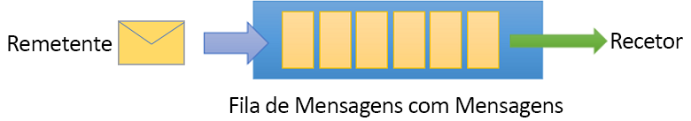

# <a name="quickstart-use-azure-powershell-to-create-a-service-bus-queue"></a>Início rápido: Utilizar o Azure PowerShell para criar uma fila do Service Bus
O Microsoft Azure Service Bus é um mediador de mensagens de integração empresarial que fornece mensagens seguras e fiabilidade absoluta. Um cenário típico do Service Bus, normalmente, envolve desacoplamento de duas ou mais aplicações, serviços ou processos entre si e transferência de alterações de estado ou de dados. Tais cenários poderão envolver agendamento de várias tarefas de lote noutras aplicações ou serviços ou acionamento de cumprimento de pedidos. Por exemplo, uma empresa de revenda poderá enviar os dados do seu ponto de venda para um escritório ou centro de distribuição regional para atualização de reabastecimento e de inventário. Neste cenário, a aplicação cliente envia e recebe mensagens numa fila do Service Bus.



Este início rápido descreve como enviar e receber mensagens de e para uma fila do Service Bus, com o PowerShell para criar um espaço de nomes de mensagens e uma fila dentro desse espaço de nomes e obter as credenciais de autorização nesse espaço de nomes. O procedimento, em seguida, mostra como enviar e receber mensagens desta fila com a [biblioteca .NET Standard](https://www.nuget.org/packages/Microsoft.Azure.ServiceBus).

Se não tiver uma subscrição do Azure, crie uma [conta gratuita][] antes de começar.

## <a name="prerequisites"></a>Pré-requisitos

Para concluir este tutorial, confirme que tem instalada:

- [Visual Studio 2017 Atualização 3 (versão 15.3, 26730.01)](https://www.visualstudio.com/vs) ou posterior.
- [SDK NET Core](https://www.microsoft.com/net/download/windows), versão 2.0 ou posterior.

Este início rápido requer a utilização da versão mais recente do Azure PowerShell. Se precisar de instalar ou atualizar, veja [Instalar e Configurar o Azure PowerShell][].

## <a name="log-in-to-azure"></a>Iniciar sessão no Azure

1. Em primeiro lugar, instale o módulo do PowerShell do Service Bus, se ainda não o tiver feito:

   ```azurepowershell-interactive
   Install-Module AzureRM.ServiceBus
   ```

2. Execute o seguinte comando para iniciar sessão no Azure:

   ```azurepowershell-interactive
   Login-AzureRmAccount
   ```

3. Emita os seguintes comandos para definir o contexto de subscrição atual ou para ver a subscrição ativa atualmente:

   ```azurepowershell-interactive
   Select-AzureRmSubscription -SubscriptionName "MyAzureSubName" 
   Get-AzureRmContext
   ```

## <a name="provision-resources"></a>Recursos de aprovisionamento

Na linha de comandos do PowerShell, emita os seguintes comandos para aprovisionar os recursos do Service Bus. Não se esqueça de substituir todos os marcadores de posição pelos valores apropriados:

```azurepowershell-interactive
# Create a resource group 
New-AzureRmResourceGroup –Name my-resourcegroup –Location eastus

# Create a Messaging namespace
New-AzureRmServiceBusNamespace -ResourceGroupName my-resourcegroup -NamespaceName namespace-name -Location eastus

# Create a queue 
New-AzureRmServiceBusQueue -ResourceGroupName my-resourcegroup -NamespaceName namespace-name -Name queue-name -EnablePartitioning $False

# Get primary connection string (required in next step)
Get-AzureRmServiceBusKey -ResourceGroupName my-resourcegroup -Namespace namespace-name -Name RootManageSharedAccessKey
```

Depois da execução do cmdlet `Get-AzureRmServiceBusKey`, copie e cole a cadeia de ligação e o nome de fila selecionado para uma localização temporária como o Bloco de notas. Vai precisar deles no próximo passo.

## <a name="send-and-receive-messages"></a>Enviar e receber mensagens

Depois de criar a fila e o espaço de nomes e se tiver as credenciais necessárias, está pronto para enviar e receber mensagens. Pode examinar o código nesta [pasta de exemplo do GitHub](https://github.com/Azure/azure-service-bus/tree/master/samples/DotNet/GettingStarted/BasicSendReceiveQuickStart).

Para executar o código, faça o seguinte:

1. Clone o [repositório do GitHub do Service Bus](https://github.com/Azure/azure-service-bus/) ao emitir o comando seguinte:

   ```shell
   git clone https://github.com/Azure/azure-service-bus.git
   ```

3. Navegue para a pasta `azure-service-bus\samples\DotNet\GettingStarted\BasicSendReceiveQuickStart\BasicSendReceiveQuickStart` de exemplo.

4. Se ainda não o tiver feito, obtenha a cadeia de ligação através do seguinte cmdlet do PowerShell. Não se esqueça de substituir `my-resourcegroup` e `namespace-name` pelos seus valores específicos: 

   ```azurepowershell-interactive
   Get-AzureRmServiceBusKey -ResourceGroupName my-resourcegroup -Namespace namespace-name -Name RootManageSharedAccessKey
   ```

5.  Na linha de comandos do PowerShell, escreva o seguinte comando:

   ```shell
   dotnet build
   ```

6.  Navegue para a pasta `bin\Debug\netcoreapp2.0`.

7.  Escreva o seguinte comando para executar o programa. Não se esqueça de substituir `myConnectionString` pelo valor obtido anteriormente e `myQueueName` pelo nome da fila que criou:

   ```shell
   dotnet BasicSendReceiveQuickStart.dll -ConnectionString "myConnectionString" -QueueName "myQueueName"
   ``` 

8. Observe as 10 mensagens que estão a ser enviadas para a fila e subsequentemente recebidas da fila:

   

## <a name="clean-up-resources"></a>Limpar recursos

Execute o seguinte comando para remover o grupo de recursos, o espaço de nomes e todos os recursos relacionados:

```powershell-interactive
Remove-AzureRmResourceGroup -Name my-resourcegroup
```

## <a name="understand-the-sample-code"></a>Compreender o código de exemplo

Esta secção contém mais detalhes sobre o que faz o código de exemplo. 

### <a name="get-connection-string-and-queue"></a>Obter a cadeia de ligação e a fila

Os nomes da fila e da cadeia de ligação são transmitidos para o método `Main()` como argumentos da linha de comandos. `Main()` declara duas variáveis de cadeia para armazenar estes valores:

```csharp
static void Main(string[] args)
{
    string ServiceBusConnectionString = "";
    string QueueName = "";

    for (int i = 0; i < args.Length; i++)
    {
        var p = new Program();
        if (args[i] == "-ConnectionString")
        {
            Console.WriteLine($"ConnectionString: {args[i+1]}");
            ServiceBusConnectionString = args[i + 1]; 
        }
        else if(args[i] == "-QueueName")
        {
            Console.WriteLine($"QueueName: {args[i+1]}");
            QueueName = args[i + 1];
        }                
    }

    if (ServiceBusConnectionString != "" && QueueName != "")
        MainAsync(ServiceBusConnectionString, QueueName).GetAwaiter().GetResult();
    else
    {
        Console.WriteLine("Specify -Connectionstring and -QueueName to execute the example.");
        Console.ReadKey();
    }                            
}
```
 
Em seguida, o método `Main()` inicia o ciclo de mensagens assíncronas, `MainAsync()`.

### <a name="message-loop"></a>Ciclo de mensagens

O método MainAsync() cria um cliente de fila com os argumentos da linha de comandos, chama um processador de mensagens de receção com o nome `RegisterOnMessageHandlerAndReceiveMessages()` e envia o conjunto de mensagens:

```csharp
static async Task MainAsync(string ServiceBusConnectionString, string QueueName)
{
    const int numberOfMessages = 10;
    queueClient = new QueueClient(ServiceBusConnectionString, QueueName);

    Console.WriteLine("======================================================");
    Console.WriteLine("Press any key to exit after receiving all the messages.");
    Console.WriteLine("======================================================");

    // Register QueueClient's MessageHandler and receive messages in a loop
    RegisterOnMessageHandlerAndReceiveMessages();

    // Send Messages
    await SendMessagesAsync(numberOfMessages);

    Console.ReadKey();

    await queueClient.CloseAsync();
}
```

O método `RegisterOnMessageHandlerAndReceiveMessages()` define simplesmente algumas opções de processador de mensagens e, em seguida, chama o método `RegisterMessageHandler()` do cliente de fila, que inicia a receção:

```csharp
static void RegisterOnMessageHandlerAndReceiveMessages()
{
    // Configure the MessageHandler Options in terms of exception handling, number of concurrent messages to deliver etc.
    var messageHandlerOptions = new MessageHandlerOptions(ExceptionReceivedHandler)
    {
        // Maximum number of Concurrent calls to the callback `ProcessMessagesAsync`, set to 1 for simplicity.
        // Set it according to how many messages the application wants to process in parallel.
        MaxConcurrentCalls = 1,

        // Indicates whether MessagePump should automatically complete the messages after returning from User Callback.
        // False below indicates the Complete will be handled by the User Callback as in `ProcessMessagesAsync` below.
        AutoComplete = false
    };

    // Register the function that will process messages
    queueClient.RegisterMessageHandler(ProcessMessagesAsync, messageHandlerOptions);
} 
```

### <a name="send-messages"></a>Enviar mensagens

As operações de criação e envio de mensagem ocorrem no método `SendMessagesAsync()`:

```csharp
static async Task SendMessagesAsync(int numberOfMessagesToSend)
{
    try
    {
        for (var i = 0; i < numberOfMessagesToSend; i++)
        {
            // Create a new message to send to the queue
            string messageBody = $"Message {i}";
            var message = new Message(Encoding.UTF8.GetBytes(messageBody));

            // Write the body of the message to the console
            Console.WriteLine($"Sending message: {messageBody}");

            // Send the message to the queue
            await queueClient.SendAsync(message);
        }
    }
    catch (Exception exception)
    {
        Console.WriteLine($"{DateTime.Now} :: Exception: {exception.Message}");
    }
}
```

### <a name="process-messages"></a>Processar mensagens

O método `ProcessMessagesAsync()` reconhece, processa e conclui a receção das mensagens:

```csharp
static async Task ProcessMessagesAsync(Message message, CancellationToken token)
{
    // Process the message
    Console.WriteLine($"Received message: SequenceNumber:{message.SystemProperties.SequenceNumber} Body:{Encoding.UTF8.GetString(message.Body)}");

    // Complete the message so that it is not received again.
    await queueClient.CompleteAsync(message.SystemProperties.LockToken);
}
```

## <a name="next-steps"></a>Passos Seguintes

Neste artigo, criou um espaço de nomes do Service Bus e outros recursos necessários para enviar e receber mensagens numa fila. Para obter mais informações sobre como escrever código para enviar e receber mensagens, avance para o tutorial seguinte do Service Bus:

> [!div class="nextstepaction"]
> [Atualizar o inventário com o Azure PowerShell](./service-bus-tutorial-topics-subscriptions-powershell.md)

[conta gratuita]: https://azure.microsoft.com/free/?ref=microsoft.com&utm_source=microsoft.com&utm_medium=docs&utm_campaign=visualstudio
[Instalar e Configurar o Azure PowerShell]: /powershell/azure/install-azurerm-ps