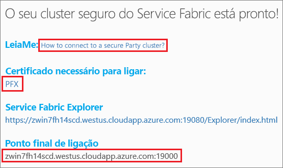
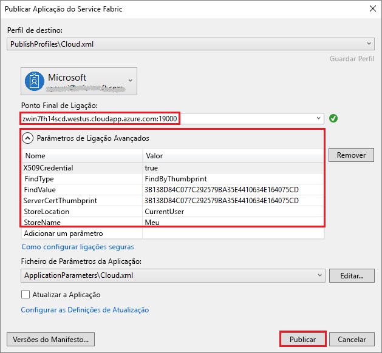

# <a name="quickstart-deploy-windows-containers-to-service-fabric"></a>Início rápido: Implementar contentores do Windows no Service Fabric

O Azure Service Fabric é uma plataforma de sistemas distribuídos par implementar e gerir microsserviços e contentores dimensionáveis e fiáveis.

Para executar uma aplicação existente num contentor do Windows num cluster do Service Fabric, não precisa de fazer quaisquer alterações à sua aplicação. Este guia de início rápido mostra como implementar uma imagem de contentor do Docker pré-concebida numa aplicação do Service Fabric. Quando tiver terminado, terá em funcionamento um contentor do Windows Server 2016 Nano Server e do IIS. Este guia de início rápido descreve a implementação de um contentor do Windows. Leia [este início rápido](service-fabric-quickstart-containers-linux.md) para implementar um contentor do Linux.

![Página Web do IIS predefinida][iis-default]

Neste início rápido, vai aprender a:

* Empacotar um contentor de imagens do Docker
* Configurar a comunicação
* Criar e empacotar a aplicação do Service Fabric
* Implementar a aplicação de contentor no Azure

## <a name="prerequisites"></a>Pré-requisitos

* Uma subscrição do Azure (pode criar uma [conta gratuita](https://azure.microsoft.com/free/?WT.mc_id=A261C142F)).
* Um computador de programação com:
  * Visual Studio 2015 ou Visual Studio 2017.
  * [SDK e ferramentas do Service Fabric](service-fabric-get-started.md).

## <a name="package-a-docker-image-container-with-visual-studio"></a>Empacotar um contentor de imagens do Docker com o Visual Studio

O SDK e as ferramentas do Service Fabric fornecem um modelo de serviço para o ajudar a implementar um contentor num cluster do Service Fabric.

Inicie o Visual Studio como “Administrador”.  Selecione **Ficheiro** > **Novo** > **Projeto**.

Selecione **Aplicação do Service Fabric**, dê-lhe o nome "MyFirstContainer" e clique em **OK**.

Selecione **Contentor** nos modelos de **Contentores e Aplicações Alojados**.

Em **Nome da Imagem**, introduza "microsoft/iis:nanoserver", a [imagem de base do Windows Server Nano Server e do IIS](https://hub.docker.com/r/microsoft/iis/).

Configure o mapeamento de portas, da porta para o anfitrião do contentor, de modo que os pedidos recebidos para o serviço na porta 80 sejam mapeados para a porta 80 no contentor.  Defina a **Porta de Contentor** para "80" e defina a **Porta do Anfitrião** para "80".  

Dê ao serviço o nome "MyContainerService" e clique em **OK**.

![Caixa de diálogo do novo serviço][new-service]

## <a name="specify-the-os-build-for-your-container-image"></a>Especificar a compilação do SO para a imagem do contentor
Os contentores criados com uma versão específica do Windows Server poderão não funcionar num anfitrião com uma versão diferente do Windows Server. Por exemplo, os contentores criados com o Windows Server versão 1709 não funcionam nos sistemas anfitriões que executam a versão 2016 do Windows Server. Para obter mais informações, veja [Compatibilidade do sistema operativo do contentor do Windows Server e do sistema operativo do sistema anfitrião ](service-fabric-get-started-containers.md#windows-server-container-os-and-host-os-compatibility). 

Com a versão 6.1 do runtime do Service Fabric e com versões mais recentes, pode especificar várias imagens de sistema operativo por contentor e etiquetar cada uma com a versão do sistema operativo para a qual deve ser implementada. Este procedimento ajuda-o a verificar se a aplicação funcionará em sistemas anfitriões com versões diferentes do sistema operativo Windows. Para saber mais, veja [Indicar imagens de contentor específicas da compilação de SO](service-fabric-get-started-containers.md#specify-os-build-specific-container-images). 

A Microsoft publica imagens diferentes para as versões do IIS criadas em diferentes versões do Windows Server. Para verificar se o Service Fabric implementa um contentor compatível com a versão do Windows Server que em execução nos nós do cluster onde implementa a aplicação, adicione as seguintes linhas ao ficheiro *ApplicationManifest.xml*. A versão de compilação do Windows Server 2016 é 14393 e a da versão 1709 do Windows Server é 16299. 

```xml
    <ContainerHostPolicies CodePackageRef="Code"> 
      <ImageOverrides> 
        ...
          <Image Name="microsoft/iis:nanoserverDefault" /> 
          <Image Name= "microsoft/iis:nanoserver" Os="14393" /> 
          <Image Name="microsoft/iis:windowsservercore-1709" Os="16299" /> 
      </ImageOverrides> 
    </ContainerHostPolicies> 
```

O manifesto de serviço continua a especificar apenas uma imagem para o Nano Server, `microsoft/iis:nanoserver`. 

## <a name="create-a-cluster"></a>Criar um cluster

Para implementar a aplicação num cluster no Azure, pode aderir a um cluster de terceiros. Os party clusters são clusters do Service Fabric gratuitos, limitados temporalmente, alojados no Azure e executados pela equipa do Service Fabric, nos quais qualquer pessoa pode implementar aplicações e saber mais sobre a plataforma.  O cluster utiliza um certificado autoassinado para o nó "nó para nó", bem como a segurança de "cliente para nó". Os party clusters suportam contentores. Se optar por configurar e utilizar o seu próprio cluster, o cluster tem de estar em execução numa SKU que suporte contentores (por exemplo, o Windows Server 2016 Datacenter com Contentores).

Inicie sessão e [adira a um cluster do Windows](https://aka.ms/tryservicefabric). Transfira o certificado PFX para o seu computador ao clicar na ligação **PFX**. Clique na ligação **Como ligar a um cluster de terceiro seguro?** e copie a palavra-passe do certificado. O certificado, a palavra-passe do certificado e o valor **Ponto final da ligação** são utilizados nos passos seguintes.



> [!Note]
> Há um número limitado de clusters de terceiros por hora. Se aparecer um erro ao tentar inscrever-se num cluster de terceiros, pode ter aguardar algum tempo e tentar novamente ou pode seguir estes passos no tutorial [Implementar uma aplicação .NET](https://docs.microsoft.com/azure/service-fabric/service-fabric-tutorial-deploy-app-to-party-cluster#deploy-the-sample-application) para criar um cluster Service Fabric na subscrição do Azure e implementar a aplicação ao mesmo. O cluster criado através do Visual Studio suporta contentores. Depois de ter implementado e verificado a aplicação no seu cluster, pode avançar diretamente para [Concluir a aplicação do Service Fabric de exemplo e manifestos do serviço](#complete-example-service-fabric-application-and-service-manifests) neste início rápido.
>

Num computador Windows, instale o PFX no arquivo de certificados *CurrentUser\My*.

```powershell
PS C:\mycertificates> Import-PfxCertificate -FilePath .\party-cluster-873689604-client-cert.pfx -CertStoreLocation Cert:\CurrentUser\My -Password (ConvertTo-SecureString 873689604 -AsPlainText -Force)


  PSParentPath: Microsoft.PowerShell.Security\Certificate::CurrentUser\My

Thumbprint                                Subject
----------                                -------
3B138D84C077C292579BA35E4410634E164075CD  CN=zwin7fh14scd.westus.cloudapp.azure.com
```

Não se esqueça do thumbprint no passo seguinte.

## <a name="deploy-the-application-to-azure-using-visual-studio"></a>Implementar a aplicação no Azure com o Visual Studio

Agora que a aplicação está pronta, pode implementá-la num cluster diretamente a partir do Visual Studio.

Clique com o botão direito do rato em **MyFirstContainer**, no Explorador de Soluções, e escolha **Publicar**. É apresentada a caixa de diálogo Publicar.

Copie o **Ponto Final da Ligação** na página Cluster de terceiros para o campo **Ponto Final da Ligação**. Por exemplo, `zwin7fh14scd.westus.cloudapp.azure.com:19000`. Clique em **Parâmetros de Ligação Avançada** e verifique as informações dos parâmetros da ligação.  Os valores *FindValue* e *ServerCertThumbprint* têm de coincidir com o thumbprint do certificado instalado no passo anterior.



Clique em **Publicar**.

Cada aplicação no cluster tem de ter um nome exclusivo.  Contudo, os clusters de party são ambientes públicos e partilhados, pelo que poderá haver um conflito com aplicações já existentes.  Se houver um conflito de nomes, mude o nome do projeto do Visual Studio e reimplemente-o.

Abra um browser e navegue para o **Ponto final de ligação** especificado na página do cluster de Terceiros. Opcionalmente, pode preceder o identificador do esquema, `http://`, e acrescentar a porta, `:80`, ao URL. Por exemplo, http://zwin7fh14scd.westus.cloudapp.azure.com:80. Deverá ver a página Web predefinida do IIS: ![Página Web predefinida do IIS][iis-default]

## <a name="next-steps"></a>Passos seguintes

Neste início rápido, aprendeu a:

* Empacotar um contentor de imagens do Docker
* Configurar a comunicação
* Criar e empacotar a aplicação do Service Fabric
* Implementar a aplicação de contentor no Azure

Para saber mais sobre como trabalhar com contentores do Windows no Service Fabric, avance para o tutorial para aplicações de contentor do Windows.

> [!div class="nextstepaction"]
> [Criar uma aplicação contentora do Windows](./service-fabric-host-app-in-a-container.md)

[iis-default]: ./media/service-fabric-quickstart-containers/iis-default.png
[publish-dialog]: ./media/service-fabric-quickstart-containers/publish-dialog.png
[new-service]: ./media/service-fabric-quickstart-containers/NewService.png
