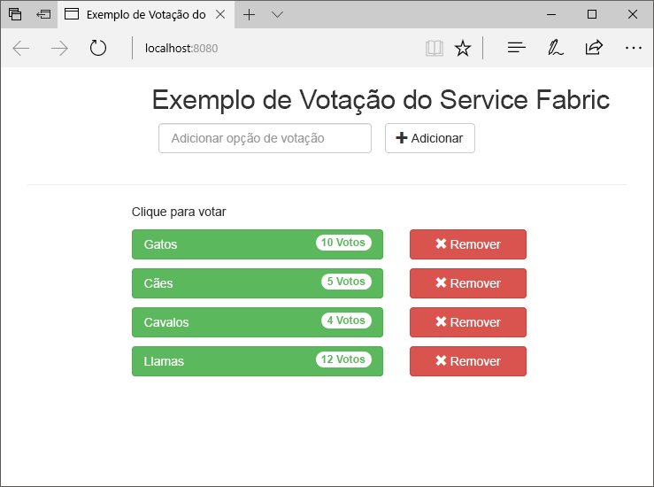
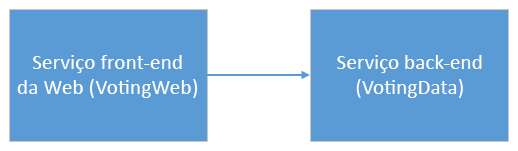
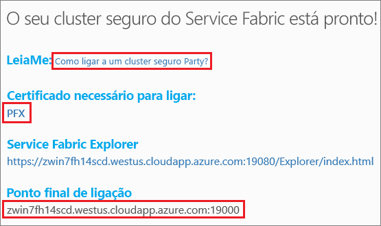
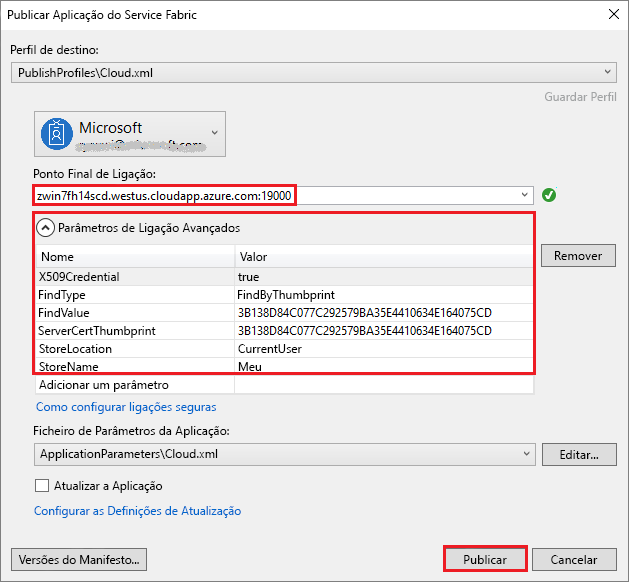
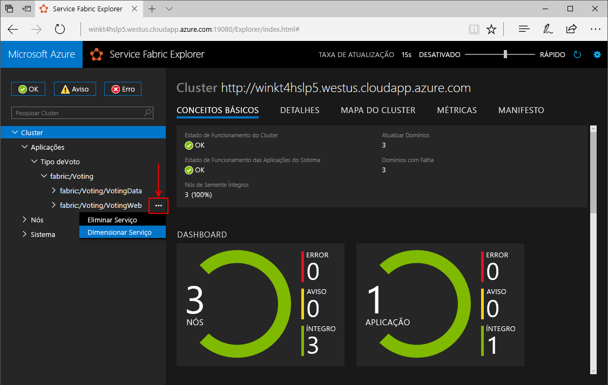
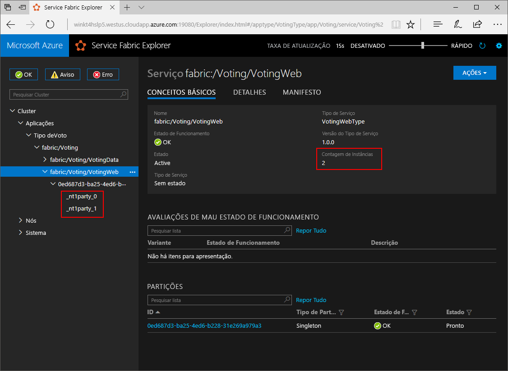
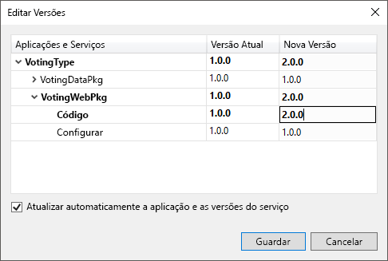
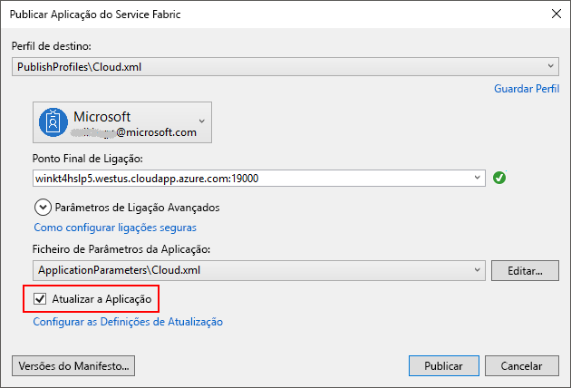
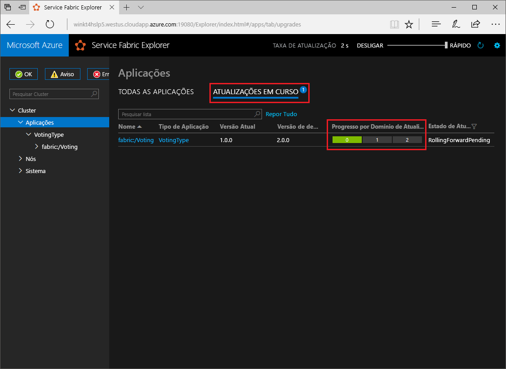

# <a name="quickstart-create-a-net-service-fabric-application-in-azure"></a>Início Rápido: criar uma aplicação .NET do Service Fabric no Azure
O Azure Service Fabric é uma plataforma de sistemas distribuídos par implementar e gerir microsserviços e contentores dimensionáveis e fiáveis. 

Este início rápido mostra como implementar a sua primeira aplicação .NET no Service Fabric. Quando tiver terminado, terá uma aplicação de votações com um front-end da Web ASP.NET que guarda os resultados das votações num serviço de back-end com estado no cluster.



Com esta aplicação, vai aprender a:

* Criar uma aplicação com .NET e o Service Fabric
* Utilizar o ASP.NET Core como um front-end da Web
* Armazenar dados da aplicação num serviço com estado
* Depurar a sua aplicação localmente
* Implementar a aplicação num cluster no Azure
* Aumentar horizontalmente a aplicação em vários nós
* Realizar atualizações sem interrupção de aplicações

## <a name="prerequisites"></a>Pré-requisitos
Para concluir este guia de início rápido:
1. [Instale o Visual Studio 2017](https://www.visualstudio.com/) com as cargas de trabalho de **desenvolvimento no Azure** e **desenvolvimento na Web e em ASP.NET**.
2. [Instale o Git](https://git-scm.com/).
3. [Instale o SDK do Microsoft Azure Service Fabric](http://www.microsoft.com/web/handlers/webpi.ashx?command=getinstallerredirect&appid=MicrosoftAzure-ServiceFabric-CoreSDK)
4. Execute o comando seguinte para permitir que o Visual Studio implemente no cluster do Service Fabric local:
    ```powershell
    Set-ExecutionPolicy -ExecutionPolicy Unrestricted -Force -Scope CurrentUser
    ```

>[!NOTE]
> O exemplo de aplicação neste guia de introdução utiliza funcionalidades que não estão disponíveis no Windows 7.
>

## <a name="download-the-sample"></a>Transferir o exemplo
Numa janela do comando, execute o seguinte comando para clonar o repositório da aplicação de exemplo para o seu computador local.
```
git clone https://github.com/Azure-Samples/service-fabric-dotnet-quickstart
```

## <a name="run-the-application-locally"></a>Executar a aplicação localmente
Clique com o botão direito do rato no ícone do Visual Studio, no Menu Iniciar, e escolha **Executar como administrador**. Para ligar o depurador aos seus serviços, tem de executar o Visual Studio como administrador.

Abra a solução **Voting.sln** do Visual Studio no repositório que clonou.  

Por predefinição, a aplicação Voting está definida para escutar na porta 8080.  A porta da aplicação está definida no ficheiro */VotingWeb/PackageRoot/ServiceManifest.xml*.  Pode atualizar o atributo **Port** do elemento **Endpoint** para alterá-la.  Para implementar e executar a aplicação localmente, a porta da aplicação tem de estar aberta e disponível no seu computador.  Se alterar a porta, substitua o valor da porta nova da aplicação por “8080” ao longo deste artigo.

Para implementar a aplicação, prima **F5**.

> [!NOTE]
> Da primeira vez que executar e implementar a aplicação, o Visual Studio cria um cluster local para depuração. Esta operação pode demorar algum tempo. O estado da criação do cluster aparece na janela de saída do Visual Studio.  Na saída, verá a mensagem "O URL da aplicação não está definido ou não é um URL de HTTP/HTTPS, pelo que o browser não será aberto na aplicação".  Esta mensagem não indica um erro, mas sim que o browser não se vai abrir automaticamente.

Quando a implementação estiver concluída, inicie um browser e abra a página `http://localhost:8080` - o front-end da Web da aplicação.


Agora, pode adicionar um conjunto de opções de voto e começar a recolher votos. A aplicação é executada e armazena todos os dados no seu cluster do Service Fabric, sem que seja preciso uma base de dados separada.

## <a name="walk-through-the-voting-sample-application"></a>Percorrer a aplicação de votação de exemplo
A aplicação de votação é composta por dois serviços:
- Serviço de front-end da Web (VotingWeb) - um serviço de front-end da Web ASP.NET Core, que serve a página Web e expõe as APIs da Web para comunicar com o serviço de back-end.
- Serviço de back-end (VotingData) - um serviço Web ASP.NET Core, que expõe uma API para armazenar os resultados da votação num dicionário fiável que é persistido no disco.



Quando vota na aplicação, ocorrem os seguintes eventos:
1. Um JavaScript envia o pedido de voto para a API Web no serviço de front-end Web como pedido HTTP PUT.

2. O serviço de front-end da Web utiliza um proxy para localizar e reencaminhar um pedido HTTP PUT para o serviço de back-end.

3. O serviço de back-end recebe o pedido de entrada e armazena os resultados atualizados num dicionário fiável, que é replicado para vários nós dentro do cluster e persistido no disco. Todos os dados da aplicação são armazenados no cluster, pelo que não é necessária uma base de dados.

## <a name="debug-in-visual-studio"></a>Depurar no Visual Studio

A aplicação deve estar em execução OK, mas pode utilizar o depurador para ver como as partes das chaves do trabalho de aplicação. Ao depurar a aplicação no Visual Studio, vai utilizar um cluster de desenvolvimento local do Service Fabric. Tem a opção de ajustar a sua experiência de depuração para o seu cenário. Nesta aplicação, os dados são armazenados no serviço de back-end através de um dicionário fiável. O Visual Studio remove a aplicação por predefinição, quando para o depurador. Remover a aplicação faz com que os dados no serviço de back-end sejam também removidos. Para persistir os dados entre as sessões de depuração, pode alterar o **Modo de Depuração da Aplicação** como propriedade no projeto **Voting** no Visual Studio.

Para ver o que acontece no código, conclua os passos seguintes:
1. Abra o ficheiro **/VotingWeb/Controllers/VotesController.cs** e defina um ponto de interrupção no método **Put** da API Web (linha 69). Pode procurar o ficheiro no Explorador de Soluções no Visual Studio.

2. Abra o ficheiro **/VotingData/Controllers/VoteDataController.cs** e defina um ponto de interrupção no método **Put** desta API Web (linha 54).

3. Regresse ao browser e clique numa opção de votação ou adicione uma opção nova. Atingiu o primeiro ponto de interrupção no controlador de API do front-end da Web.
    - É aqui que o JavaScript no browser envia um pedido para o controlador de API Web no serviço do front-end.
    
    

    - Primeiro, construa o URL para o ReverseProxy para o nosso serviço de back-end **(1)**.
    - Em seguida, envie o Pedido HTTP PUT para ReverseProxy **(2)**.
    - Por último, devolva a resposta do serviço de back-end para o cliente **(3)**.

4. Prima **F5** para continuar
    - Se lhe for pedido pelo browser, conceda permissões para o Modo de Depuração de leitura e execução ao grupo ServiceFabricAllowedUsers.
    - Está agora no ponto de interrupção do serviço de back-end.
    
    

    - Na primeira linha no método **(1)**, `StateManager` obtém ou adiciona um dicionário fiável chamado `counts`.
    - Todas as interações com os valores num dicionário fiável requer uma transação; a utilização da declaração **(2)** cria essa transação.
    - Na transação, atualize o valor da chave relevante para a opção de votação e consolide a operação **(3)**. Quando é devolvido o método de consolidação, os dados são atualizados no dicionário e replicados para outros nós do cluster. Os dados estão agora armazenados em segurança no cluster e o serviço de back-end pode fazer a ativação pós-falha para outros nós, mantendo os dados disponíveis.
5. Prima **F5** para continuar

Para parar a sessão de depuração, prima **Shift + F5**.

## <a name="deploy-the-application-to-azure"></a>Implementar a aplicação no Azure
Para implementar a aplicação no Azure, precisa de um cluster do Service Fabric que executa a aplicação. 

### <a name="join-a-party-cluster"></a>Aderir a um party cluster
Os party clusters são clusters do Service Fabric gratuitos, limitados temporalmente, alojados no Azure e executados pela equipa do Service Fabric, nos quais qualquer pessoa pode implementar aplicações e saber mais sobre a plataforma. O cluster utiliza um certificado autoassinado para o "nó para nó", bem como a segurança de "cliente para nó". 

Inicie sessão e [adira a um cluster do Windows](http://aka.ms/tryservicefabric). Transfira o certificado PFX para o seu computador ao clicar na ligação **PFX**. Clique na ligação **Como ligar a um cluster de terceiro seguro?** e copie a palavra-passe do certificado. O certificado, a palavra-passe do certificado e o valor **Ponto final da ligação** são utilizados nos passos seguintes.



> [!Note]
> Há um número limitado de clusters de terceiros por hora. Se aparecer um erro ao tentar inscrever-se num cluster de terceiros, pode ter aguardar algum tempo e tentar novamente ou pode seguir estes passos no tutorial [Implementar uma aplicação .NET](https://docs.microsoft.com/azure/service-fabric/service-fabric-tutorial-deploy-app-to-party-cluster#deploy-the-sample-application) para criar um cluster Service Fabric na subscrição do Azure e implementar a aplicação ao mesmo. Se não tiver uma subscrição do Azure, pode [criar uma conta gratuita](https://azure.microsoft.com/free/?WT.mc_id=A261C142F). Depois de ter implementado e verificado a aplicação no seu cluster, pode avançar diretamente para [Dimensionar aplicações e serviços num cluster](#scale-applications-and-services-in-a-cluster) neste manual de início rápido.
>


No computador Windows, instale o PFX no arquivo de certificados *CurrentUser\My*.

```powershell
PS C:\mycertificates> Import-PfxCertificate -FilePath .\party-cluster-873689604-client-cert.pfx -CertStoreLocation Cert:\CurrentUser\My -Password (ConvertTo-SecureString 873689604 -AsPlainText -Force)


   PSParentPath: Microsoft.PowerShell.Security\Certificate::CurrentUser\My

Thumbprint                                Subject
----------                                -------
3B138D84C077C292579BA35E4410634E164075CD  CN=zwin7fh14scd.westus.cloudapp.azure.com
```

Não se esqueça do thumbprint no passo seguinte.

> [!Note]
> Por predefinição, o serviço de front-end da Web está configurado para escutar tráfego de entrada na porta 8080. A porta 8080 está aberta no Cluster de Party.  Se tiver de alterar a porta da aplicação, altere-a para uma das que estão abertas no Cluster de Party.
>

### <a name="deploy-the-application-using-visual-studio"></a>Implementar a aplicação com o Visual Studio
Agora que a aplicação está pronta, pode implementá-la num cluster diretamente a partir do Visual Studio.

1. Clique com o botão direito do rato em **Voting**, no Explorador de Soluções, e escolha **Publish** (Publicar). É apresentada a caixa de diálogo Publicar.


2. Copie o **Ponto Final da Ligação** na página Cluster de terceiros para o campo **Ponto Final da Ligação**. Por exemplo, `zwin7fh14scd.westus.cloudapp.azure.com:19000`. Clique em **Parâmetros de Ligação Avançados** e certifique-se de que os valores *FindValue* e *ServerCertThumbprint* correspondem ao thumbprint do certificado instalado num passo anterior. 

    

    Cada aplicação no cluster tem de ter um nome exclusivo.  Contudo, os clusters de party são ambientes públicos e partilhados, pelo que poderá haver um conflito com aplicações já existentes.  Se houver um conflito de nomes, mude o nome do projeto do Visual Studion e reimplemente-o.

3. Clique em **Publicar**.

4. Abra um browser e escreva o endereço do cluster seguido de “:8080” para ir para a aplicação no mesmo; por exemplo, `http://zwin7fh14scd.westus.cloudapp.azure.com:8080`. Deverá ver agora aplicação em execução no cluster no Azure.

    

## <a name="scale-applications-and-services-in-a-cluster"></a>Dimensionar aplicações e serviços num cluster
Os serviços do Service Fabric podem ser facilmente dimensionados num cluster para se prepararem para alterações à carga nos serviços. Para dimensionar um serviço, tem de alterar o número de instâncias em execução no cluster. Existem várias formas de dimensionar os seus serviços. Pode utilizar scripts ou comandos no PowerShell ou na CLI do Service Fabric (sfctl). Neste exemplo, utilizamos o Service Fabric Explorer.

O Service Fabric Explorer é executado em todos os clusters do Service Fabric e pode ser acedido num browser, navegando para a porta (19080) de gestão HTTP dos clusters; por exemplo `https://zwin7fh14scd.westus.cloudapp.azure.com:19080`. 

Poderá receber um aviso de navegador a indicar que a localização não é fidedigna. Isto acontece porque o certificado é autoassinado. Pode optar por ignorar o aviso e continuar.
1. Quando for pedido pelo navegador, selecione o certificado instalado para ligar. O certificado de cluster comemorativo que selecionar da lista tem de corresponder ao cluster comemorativo ao qual está a tentar aceder. Por exemplo, win243uja6w62r.westus.cloudapp.azure.com.
2. Se lhe for pedido pelo browser, conceda acesso à sua Chave Privada CryptoAPI para esta sessão.

Para dimensionar o serviço de front-end da Web, execute os seguintes passos:

1. Abra o Service Fabric Explorer no seu cluster - por exemplo, `https://zwin7fh14scd.westus.cloudapp.azure.com:19080`. 
2. Na vista de árvore, expanda **Aplicações**->**VotingType**->**fabric:/Voting**. Clique nas reticências (três pontos) junto ao nó **fabric:/Voting/VotingWeb**, na vista de árvore, e escolha**Dimensionar Serviço**.

    

    Agora, pode optar por dimensionar o número de instâncias do serviço de front-end da Web.

3. Altere o número para **2** e clique em **Dimensionar Serviço**.
4. Clique no nó **fabric:/Voting/VotingWeb**, na vista de árvore, e expanda o nó de partição (representado por uma GUID).

    

    Após um atraso, pode ver que o serviço tem duas instâncias.  Na vista de árvore, pode ver em que nós as instâncias são executadas.

Através desta simples tarefa de gestão, os recursos disponíveis para o nosso serviço de front-end processar a carga de utilizador duplicaram. É importante compreender que não precisa de várias instâncias de um serviço para o executar de forma fiável. Se um serviço falhar, o Service Fabric certifica-se de que uma nova instância de serviço é executado no cluster.

## <a name="perform-a-rolling-application-upgrade"></a>Realizar atualizações sem interrupção de aplicações
O Service Fabric implementa as atualizações novas na sua aplicação de forma segura. As atualizações sem interrupção evitam períodos de indisponibilidade, bem como reversão automática, caso ocorram erros.

Para atualizar a aplicação, faça o seguinte:

1. Abra o ficheiro **/VotingWeb/Views/Home/Index.cshtml** no Visual Studio.
2. Altere o cabeçalho da página ao adicionar ou atualizar o texto. Por exemplo, altere o cabeçalho para "Exemplo de Aplicação de Votação v” do Service Fabric".
3. Guarde o ficheiro.
4. Clique com o botão direito do rato em **Voting**, no Explorador de Soluções, e escolha **Publish** (Publicar). É apresentada a caixa de diálogo Publicar.
5. Clique botão **Manifest Version** (Versão do Manifesto) para alterar a versão do serviço e da aplicação.
6. Altere a versão do elemento **Code** em **VotingWebPkg** para "2.0.0", por exemplo, e clique em **Save** (Guardar).

    
7. Na caixa de diálogo **Publish Service Fabric Application** (Publicar Aplicação do Service Fabric), assinale a caixa de verificação Upgrade the Application (Atualizar a Aplicação) e clique em **Publish**.

    

    Pode continuar a utilizar a aplicação enquanto a atualização estiver em execução. Uma vez que tem duas instâncias do serviço em execução no cluster, alguns dos seus pedidos poderão receber uma versão atualizada da aplicação e outros continuar a versão antiga.

8. Abra o browser e navegue para o endereço do cluster na porta 19080 - por exemplo, `http://zwin7fh14scd.westus.cloudapp.azure.com:19080`.
9. Clique no nó **Applications** (Aplicações) na vista de árvore e em **Upgrades in Progress** (Atualizações em Curso), no painel do lado direito. Pode ver de que forma é que a atualização é aplicada nos domínios de atualização do seu cluster e confirmar que cada domínio está em bom estado de funcionamento antes de avançar para o seguinte. Após o estado de funcionamento de um domínio ter sido verificado, o domínio de atualização aparece a verde na barra de progresso.
    

    O Service Fabric torna as atualizações seguras, ao aguardar dois minutos após atualizar o serviço em cada nó do cluster. A atualização completa deverá demorar aproximadamente oito minutos.


## <a name="next-steps"></a>Passos seguintes
Neste início rápido, aprendeu a:

* Criar uma aplicação com .NET e o Service Fabric
* Utilizar o ASP.NET Core como um front-end da Web
* Armazenar dados da aplicação num serviço com estado
* Depurar a sua aplicação localmente
* Implementar a aplicação num cluster no Azure
* Aumentar horizontalmente a aplicação em vários nós
* Realizar atualizações sem interrupção de aplicações

Para saber mais sobre o Service Fabric e .NET, veja este tutorial:
> [!div class="nextstepaction"]
> [.NET application on Service Fabric](service-fabric-tutorial-create-dotnet-app.md) (Aplicação .NET no Service Fabric)
