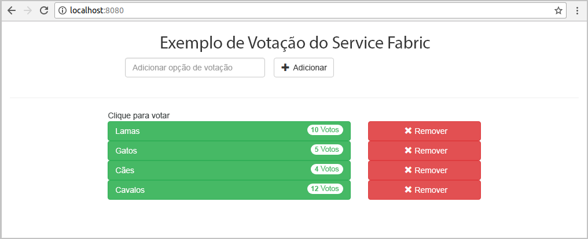
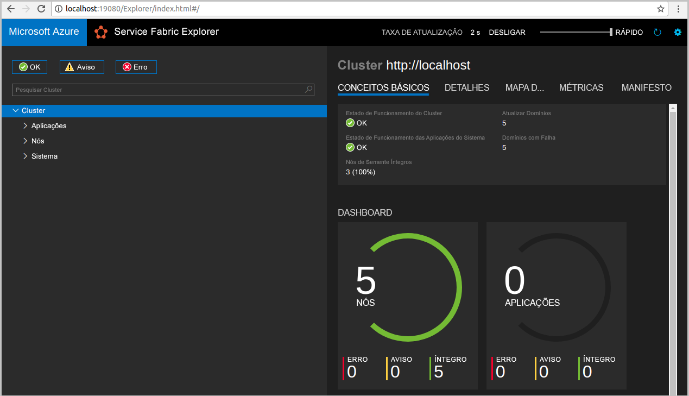
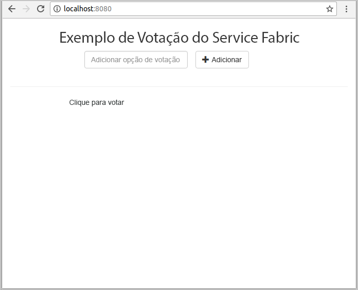
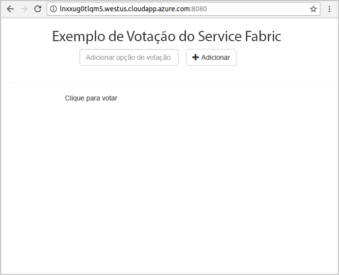
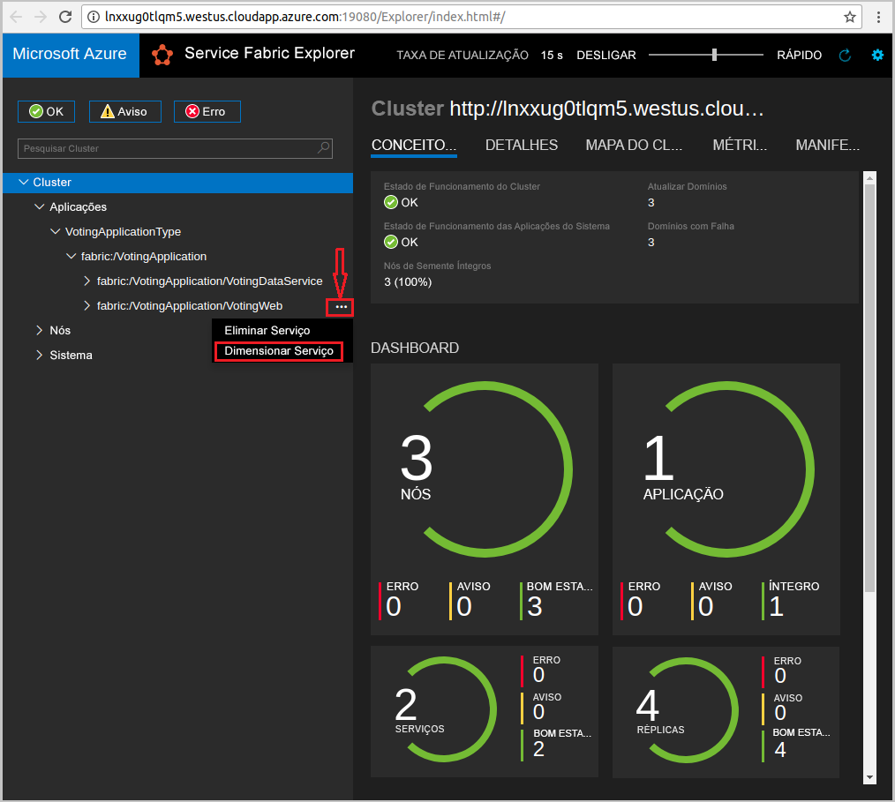
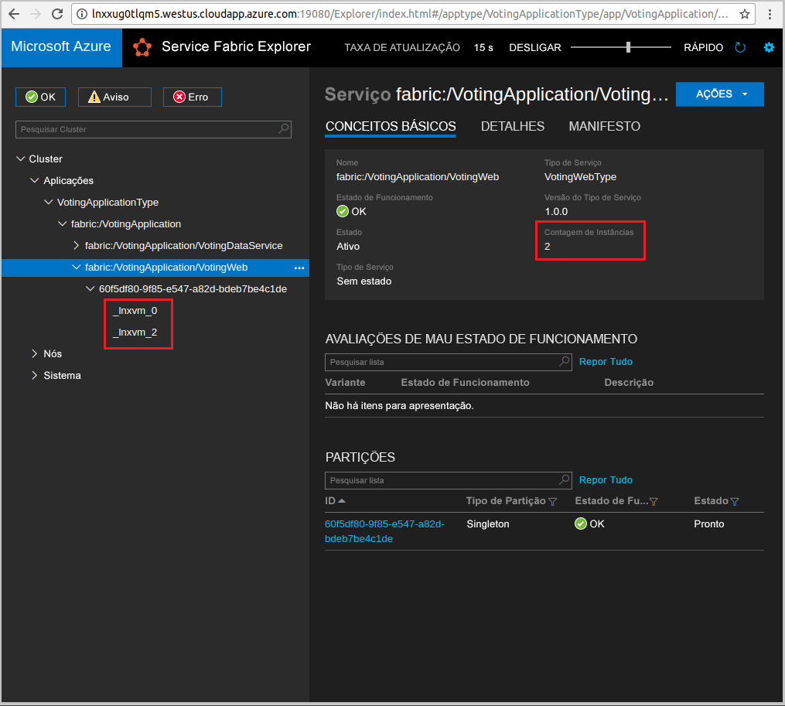

# <a name="quickstart-deploy-a-java-reliable-services-application-to-service-fabric"></a>Início Rápido: Implementar uma aplicação de serviços fiáveis no Service Fabric em Java

O Azure Service Fabric é uma plataforma de sistemas distribuídos par implementar e gerir microsserviços e contentores.

Este guia de introdução mostra como implementar a sua primeira aplicação de Java no Service Fabric com o ODE do Eclipse numa máquina de programador do Linux. Quando tiver terminado, terá uma aplicação de votações com um front-end da Web Java que guarda os resultados das votações num serviço de back-end com estado no cluster.



Neste início rápido, vai aprender a:

* Utilize o Eclipse como uma ferramenta para as suas aplicações de Java do Service Fabric
* Implementar a aplicação no seu cluster local
* Implementar a aplicação num cluster no Azure
* Aumentar horizontalmente a aplicação em vários nós

## <a name="prerequisites"></a>Pré-requisitos

Para concluir este guia de início rápido:

1. [Instalar o SDK do Service Fabric e Interface de Linha de Comandos (CLI) do Service Fabric](https://docs.microsoft.com/azure/service-fabric/service-fabric-get-started-linux#installation-methods)
2. [Instale o Git](https://git-scm.com/)
3. [Instalar o Eclipse](https://www.eclipse.org/downloads/)
4. [Configure o Ambiente de Java](https://docs.microsoft.com/azure/service-fabric/service-fabric-get-started-linux#set-up-java-development), garantindo que segue os passos opcionais para instalar o plug-in do Eclipse

## <a name="download-the-sample"></a>Transferir o exemplo

Numa janela do comando, execute o seguinte comando para clonar o repositório da aplicação de exemplo para o seu computador local.

```git
git clone https://github.com/Azure-Samples/service-fabric-java-quickstart.git
```

## <a name="run-the-application-locally"></a>Executar a aplicação localmente

1. Inicie o seu cluster local com o seguinte comando:

    ```bash
    sudo /opt/microsoft/sdk/servicefabric/common/clustersetup/devclustersetup.sh
    ```
    O arranque do cluster local demora algum tempo. Para confirmar que o cluster está totalmente operacional, aceda ao Service Fabric Explorer em **http://localhost:19080**. Os cinco nós em bom estado indicam que o cluster local está a funcionar.

    

2. Abra o Eclipse.
3. Clique em Ficheiro -> Importar -> Gradle -> Projeto do Gradle existente e siga o assistente.
4. Clique em Diretório e escolha o diretório `Voting` da pasta `service-fabric-java-quickstart` que clonou a partir do Github. Clique em Concluir. 

    

5. Tem agora o projeto `Voting` no Explorador do Pacote para o Eclipse.
6. Clique com o botão direito do rato no projeto e selecione **Publicar Aplicação...** sob o menu pendente **Service Fabric**. Escolha **PublishProfiles/Local.json** como o Perfil de Destino e clique em Publicar.

    

7. Abra o browser favorito e aceda à aplicação em **http://localhost:8080**.

    

Agora, pode adicionar um conjunto de opções de voto e começar a recolher votos. A aplicação é executada e armazena todos os dados no seu cluster do Service Fabric, sem que seja preciso uma base de dados separada.

## <a name="deploy-the-application-to-azure"></a>Implementar a aplicação no Azure

### <a name="set-up-your-azure-service-fabric-cluster"></a>Configurar o Cluster do Azure Service Fabric

Para implementar a aplicação num cluster no Azure, crie o seu próprio cluster.

Os clusters comemorativos são clusters do Service Fabric gratuitos e de tempo limitado, alojados no Azure e executados pela equipa do Service Fabric. Pode utilizar os clusters comemorativos para implementar aplicações e obter informações sobre a plataforma. O cluster utiliza um certificado autoassinado para a segurança de "nó para nó" e de "cliente para nó".

Inicie sessão e adira a um [cluster do Linux](https://aka.ms/tryservicefabric). Transfira o certificado PFX para o seu computador ao clicar na ligação **PFX**. Clique na hiperligação **Leia-me** para localizar a palavra-passe do certificado e instruções sobre como configurar vários ambientes para utilizar o certificado. Mantenha as páginas de **Boas-vindas** e **Leia-me** abertas, irá utilizar algumas das instruções nos passos seguintes.

> [!Note]
> Há um número limitado de clusters comemorativos por hora. Se obtiver uma mensagem um erro ao tentar inscrever-se num cluster comemorativo, pode ter de aguardar algum tempo e tentar novamente ou pode seguir estes passos em [Criar um cluster do Service Fabric no Azure](service-fabric-tutorial-create-vnet-and-linux-cluster.md) para criar um cluster na sua subscrição.
>
> O serviço de Spring Boot está configurado para escutar tráfego de entrada na porta 8080. Certifique-se de que a porta está aberta no seu cluster. Se estiver a utilizar um Cluster de Grupo, esta porta estará aberta.
>

O Service Fabric fornece várias ferramentas que pode utilizar para gerir um cluster e as respetivas aplicações:

* O Service Fabric Explorer, uma ferramenta baseada no browser.
* A CLI (Interface de Linha de Comandos) do Service Fabric, que é executada na CLI do Azure.
* Comandos do PowerShell.

Neste início rápido,vai utilizar a CLI do Service Fabric e o Service Fabric Explorer.

Para utilizar a CLI, terá de criar um ficheiro PEM com base no ficheiro PFX que transferiu. Para converter o ficheiro, utilize o seguinte comando. (Para os clusters comemorativos, pode copiar um comando específico para o ficheiro PFX, a partir das instruções da página **Leia-me**.)

    ```bash
    openssl pkcs12 -in party-cluster-1486790479-client-cert.pfx -out party-cluster-1486790479-client-cert.pem -nodes -passin pass:1486790479
    ```

De modo a utilizar o Service Fabric Explorer, tem de importar o ficheiro PFX de certificado que transferiu do site do Cluster Comemorativo para o seu arquivo de certificados (Windows ou Mac) ou para o próprio browser (Ubuntu). Precisará da palavra-passe da chave privada do PFX, que pode obter na página **Leia-me**.

Utilize o método que preferir para importar o certificado para o seu sistema. Por exemplo:

* No Windows: faça duplo clique no ficheiro PFX e siga as instruções para instalar o certificado no seu arquivo pessoal, `Certificates - Current User\Personal\Certificates`. Em alternativa, pode utilizar o comando do PowerShell das instruções **Leia-me**.
* No Mac: faça duplo clique no ficheiro PFX e siga as instruções para instalar o certificado na sua Keychain.
* No Ubuntu: o Mozilla Firefox é o browser predefinido do Ubuntu 16.04. Para importar o certificado para o Firefox, clique no botão de menu no canto superior direito do seu browser e, em seguida, clique em **Opções**. Na página **Preferências**, utilize a caixa de pesquisa para procurar "certificados". Clique em **Ver Certificados**, selecione o separador **Os Seus Certificados**, clique em **Importar** e siga as instruções para importar o certificado.

   

### <a name="add-certificate-information-to-your-application"></a>Adicionar informações de certificados à sua aplicação

Têm de ser adicionados thumbprints de certificados à sua aplicação, uma vez que está a utilizar modelos de programação do Service Fabric.

1. Precisará do thumbprint do seu certificado no ficheiro `Voting/VotingApplication/ApplicationManifest.xml` ao executar num cluster seguro. Execute o seguinte comando para extrair o thumbprint do certificado.

    ```bash
    openssl x509 -in [CERTIFICATE_PEM_FILE] -fingerprint -noout
    ```

2. No ficheiro `Voting/VotingApplication/ApplicationManifest.xml`, adicione o seguinte fragmento de código na etiqueta **ApplicationManifest**. O **X509FindValue** deverá ser o thumbprint do passo anterior (sem ponto e vírgula). 

    ```xml
    <Certificates>
        <SecretsCertificate X509FindType="FindByThumbprint" X509FindValue="0A00AA0AAAA0AAA00A000000A0AA00A0AAAA00" />
    </Certificates>
    ```

### <a name="deploy-the-application-using-eclipse"></a>Implementar a aplicação com o Eclipse

Agora que a aplicação e o cluster estão prontos, pode implementá-los num cluster diretamente a partir do Eclipse.

1. Abra o ficheiro **Cloud.json** sob o diretório **PublishProfiles** e preencha os campos `ConnectionIPOrURL` e `ConnectionPort` adequadamente. É apresentado um exemplo:

    ```bash
    {
         "ClusterConnectionParameters":
         {
            "ConnectionIPOrURL": "lnxxug0tlqm5.westus.cloudapp.azure.com",
            "ConnectionPort": "19080",
            "ClientKey": "[path_to_your_pem_file_on_local_machine]",
            "ClientCert": "[path_to_your_pem_file_on_local_machine]"
         }
    }
    ```

2. Clique com o botão direito do rato no projeto e selecione **Publicar Aplicação...** sob o menu pendente **Service Fabric**. Escolha **PublishProfiles/Cloud.json** como o Perfil de Destino e clique em Publicar.

    

3. Abra o browser e aceda à aplicação em **http://\<ConnectionIPOrURL>:8080**.

    

## <a name="scale-applications-and-services-in-a-cluster"></a>Dimensionar aplicações e serviços num cluster

Os serviços podem ser facilmente dimensionados num cluster para se prepararem para alterações à carga nos serviços. Para dimensionar um serviço, tem de alterar o número de instâncias em execução no cluster. Existem várias formas de dimensionar os seus serviços, por exemplo, pode utilizar scripts ou comandos da CLI do Service Fabric (sfctl). Nos passos seguintes, é utilizado o Service Fabric Explorer.

O Service Fabric Explorer é executado em todos os clusters do Service Fabric e pode ser acedido num browser, navegando para a porta (19080) de gestão HTTP dos clusters; por exemplo `http://lnxxug0tlqm5.westus.cloudapp.azure.com:19080`.

Para dimensionar o serviço de front-end da Web, faça o seguinte:

1. Abra o Service Fabric Explorer no seu cluster - por exemplo, `https://lnxxug0tlqm5.westus.cloudapp.azure.com:19080`.
2. Clique nas reticências (três pontos) junto ao nó **fabric:/Voting/VotingWeb**, na vista de árvore, e escolha**Dimensionar Serviço**.

    

    Agora, pode optar por dimensionar o número de instâncias do serviço de front-end da Web.

3. Altere o número para **2** e clique em **Dimensionar Serviço**.
4. Clique no nó **fabric:/Voting/VotingWeb**, na vista de árvore, e expanda o nó de partição (representado por uma GUID).

    

    Agora, pode ver que o serviço tem duas instâncias e na vista de árvore vê em que nós as instâncias são executadas.

Através desta simples tarefa de gestão, duplicou os recursos disponíveis para o serviço de front-end processar a carga de utilizador. É importante compreender que não precisa de várias instâncias de um serviço para que o mesmo seja executado de forma fiável. Se um serviço falhar, o Service Fabric certifica-se de que uma nova instância do serviço é executada no cluster.

## <a name="next-steps"></a>Passos seguintes

Neste início rápido, aprendeu a:

* Utilize o Eclipse como uma ferramenta para as suas aplicações de Java do Service Fabric
* Implementar aplicações Java no seu cluster local
* Implementar aplicações Java num cluster no Azure
* Aumentar horizontalmente a aplicação em vários nós

Para saber mais sobre como trabalhar com aplicações Java no Service Fabric, avance para o tutorial para aplicações Java.

> [!div class="nextstepaction"]
> [Implementar uma aplicação Java](./service-fabric-tutorial-create-java-app.md)
