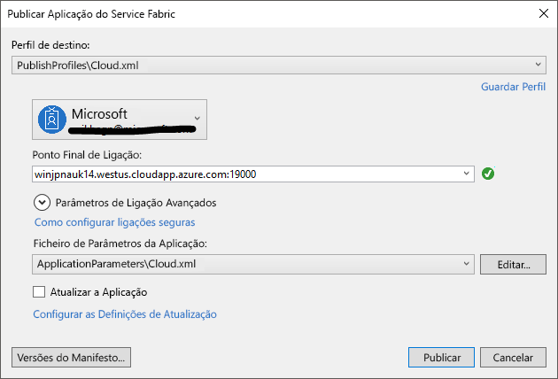

# <a name="tutorial-deploy-an-application-to-a-service-fabric-cluster-in-azure"></a>Tutorial: Implementar uma aplicação num cluster do Service Fabric no Azure
Este tutorial é a segunda parte de uma série e mostra-lhe como implementar uma aplicação do Azure Service Fabric num cluster novo no Azure diretamente a partir do Visual Studio.

Neste tutorial, ficará a saber como:
> [!div class="checklist"]
> * Criar um cluster a partir do Visual Studio
> * Implementar uma aplicação num cluster remoto com o Visual Studio


Nesta série de tutoriais, ficará a saber como:
> [!div class="checklist"]
> * [Criar uma aplicação .NET do Service Fabric](service-fabric-tutorial-create-dotnet-app.md)
> * Implementar a aplicação num cluster remoto
> * [Adicionar um ponto final HTTPS a um serviço de front-end ASP.NET Core](service-fabric-tutorial-dotnet-app-enable-https-endpoint.md)
> * [Configurar o CI/CD com o Visual Studio Team Services](service-fabric-tutorial-deploy-app-with-cicd-vsts.md)
> * [Configurar a monitorização e os diagnósticos da aplicação](service-fabric-tutorial-monitoring-aspnet.md)


## <a name="prerequisites"></a>Pré-requisitos
Antes de começar este tutorial:
- Se não tiver uma subscrição do Azure, crie uma [conta gratuita](https://azure.microsoft.com/free/?WT.mc_id=A261C142F)
- [Instale o Visual Studio 2017](https://www.visualstudio.com/) e as cargas de trabalho de **desenvolvimento no Azure** e **desenvolvimento na Web e em ASP.NET**.
- [Instale o SDK do Service Fabric](service-fabric-get-started.md)

## <a name="download-the-voting-sample-application"></a>Transferir o exemplo de aplicação de votação
Se não criou o exemplo de aplicação de votação na [primeira parte desta série de tutoriais](service-fabric-tutorial-create-dotnet-app.md), pode transferi-lo. Numa janela do comando, execute o seguinte comando para clonar o repositório da aplicação de exemplo para o seu computador local.

```
git clone https://github.com/Azure-Samples/service-fabric-dotnet-quickstart
```

## <a name="create-a-service-fabric-cluster"></a>Criar um cluster do Service Fabric
Agora que a aplicação está pronta, pode implementá-la num cluster diretamente a partir do Visual Studio. Um [cluster do Service Fabric](/service-fabric/service-fabric-deploy-anywhere.md) é um conjunto de máquinas virtuais ou físicas ligado à rede, no qual os microsserviços são implementados e geridos

Dispõe de duas opções de implementação no Visual Studio:
- Criar um cluster no Azure a partir do Visual Studio. Esta opção permite-lhe criar um cluster seguro diretamente a partir do Visual Studio com as suas configurações preferidas. Este tipo de cluster é ideal para cenários de teste, nos quais pode criar o cluster e, em seguida, publicar diretamente no mesmo no Visual Studio.
- Publique num cluster existente na sua subscrição.  Pode criar clusters do Service Fabric através do [portal do Azure](https://portal.azure.com) com os scripts do [PowerShel](./scripts/service-fabric-powershell-create-secure-cluster-cert.md) ou da [CLI do Azure](./scripts/cli-create-cluster.md) ou a partir de um [modelo do Azure Resource Manager](service-fabric-tutorial-create-vnet-and-windows-cluster.md).

Este tutorial cria um cluster a partir do Visual Studio. Se já tiver um cluster implementado, poderá copiar e colar o ponto final de ligação ou escolhê-lo na sua subscrição.
> [!NOTE]
> Muitos serviços utilizam proxy inverso para comunicar entre si. Os clusters criados a partir do Visual Studio e os clusters de terceiros têm proxy inverso ativado por predefinição.  Se utilizar um cluster existente, tem de [ativar o proxy inverso no cluster](service-fabric-reverseproxy.md#setup-and-configuration).

### <a name="find-the-votingweb-service-endpoint"></a>Localizar o ponto final de serviço do VotingWeb
Primeiro, localize o ponto final do serviço Web de front-end.  O serviço Web de front-end está à escuta numa porta específica.  Quando implementa a aplicação num cluster do Azure, tanto o cluster como a aplicação são executados atrás de um balanceador de carga do Azure.  A porta da aplicação tem de ser aberta no balanceador de carga do Azure para que o tráfego de entrada possa chegar ao serviço Web.  A porta (8080, por exemplo) encontra-se no ficheiro *VotingWeb/PackageRoot/ServiceManifest.xml* no elemento **Ponto final**:

```xml
<Endpoint Protocol="http" Name="ServiceEndpoint" Type="Input" Port="8080" />
```

No próximo passo, especifique esta porta no separador **Avançado** da caixa de diálogo **Criar cluster**.  Se estiver a implementar a aplicação num cluster existente, poderá abrir esta porta no balanceador de carga do Azure com um [script do PowerShell](./scripts/service-fabric-powershell-open-port-in-load-balancer.md) ou no [portal do Azure](https://portal.azure.com).

### <a name="create-a-cluster-in-azure-through-visual-studio"></a>Criar um cluster no Azure através do Visual Studio
Clique com o botão direito do rato no projeto de aplicação no Explorador de Soluções e escolha **Publish**.

Inicie sessão com a sua conta do Azure para poder aceder às suas subscrições. Este passo é opcional se estiver a utilizar um cluster de terceiros.

Selecione a lista pendente do **Ponto Final de Ligação** e selecione a opção **<Create New Cluster...>**.
    

    
Na caixa de diálogo **Criar cluster**, modifique as seguintes definições:

1. Especifique o nome do cluster no campo **Nome do Cluster**, bem como a subscrição e a localização que pretende utilizar.
2. Opcional: pode modificar o número de nós. Por predefinição, tem três nós, o mínimo exigido para testar cenários do Service Fabric.
3. Selecione o separador **Certificado**. Neste separador, escreva uma palavra-passe a utilizar para proteger o certificado do seu cluster. Este certificado ajuda a tornar o seu cluster seguro. Também pode modificar o caminho para o local onde pretende guardar o certificado. O Visual Studio também pode importar o certificado por si, uma vez que este é um passo obrigatório para publicar a aplicação no cluster.
4. Selecione o separador **Detalhes da VM**. Especifique a palavra-passe que pretende utilizar para as máquinas virtuais (VM) que compõem o cluster. O nome de utilizador e a palavra-passe podem ser utilizados para ligar remotamente às VMs. Também tem de selecionar um tamanho de VM e pode alterar a imagem da VM, se necessário.
5. No separador **Avançado**, pode modificar a lista de portas que pretende que sejam abertas no balanceador de carga do Azure a par do cluster.  Adicione o ponto final de serviço do VotingWeb que detetou num passo anterior. Também pode adicionar uma chave do Application Insights existente para encaminhar os ficheiros de registo da aplicação.
6. Quando terminar de modificar as definições, selecione o botão **Criar**. A criação demora alguns minutos a ser concluída; a janela de saída informá-lo-á quando o cluster estiver totalmente criado.


## <a name="deploy-the-sample-application"></a>Implementar o exemplo de aplicação
Quando o cluster que pretende utilizar estiver pronto, clique com o botão direito do rato no projeto de aplicação e escolha **Publish**.

Após a conclusão da publicação, deverá conseguir enviar um pedido para a aplicação através de um browser.

Abra o seu browser preferencial e escreva o endereço do cluster (o ponto final da ligação sem as informações de porta, por exemplo, win1kw5649s.westus.cloudapp.azure.com).

Deverá ver agora o mesmo resultado que viu quando executou a aplicação localmente.


## <a name="next-steps"></a>Passos seguintes
Neste tutorial, ficou a saber como:

> [!div class="checklist"]
> * Criar um cluster a partir do Visual Studio
> * Implementar uma aplicação num cluster remoto com o Visual Studio

Avance para o tutorial seguinte:
> [!div class="nextstepaction"]
> [Ativar HTTPS](service-fabric-tutorial-dotnet-app-enable-https-endpoint.md)
