# <a name="create-and-query-an-azure-sql-data-warehouse-in-the-azure-portal"></a>Criar e consultar um armazém de dados SQL do Azure no portal do Azure

Crie e consulte rapidamente um armazém de dados SQL do Azure através do portal do Azure.

Se não tiver uma subscrição do Azure, crie uma conta [gratuita](https://azure.microsoft.com/free/) antes de começar.

## <a name="before-you-begin"></a>Antes de começar

Transfira e instale a versão mais recente do [SQL Server Management Studio](/sql/ssms/download-sql-server-management-studio-ssms.md) (SSMS).

## <a name="sign-in-to-the-azure-portal"></a>Iniciar sessão no portal do Azure

Inicie sessão no [Portal do Azure](https://portal.azure.com/).

## <a name="create-a-data-warehouse"></a>Criar um armazém de dados

É criado um armazém de dados SQL do Azure com um conjunto definido de [recursos de computação](performance-tiers.md). A base de dados é criada num [Grupo de recursos do Azure](../azure-resource-manager/resource-group-overview.md) e num [servidor lógico SQL do Azure](../sql-database/sql-database-features.md). 

Siga estes passos para criar um armazém de dados SQL que contenha os dados de exemplo AdventureWorksDW. 

1. Clique no botão **Novo** no canto superior esquerdo do portal do Azure.

2. Selecione **Bases de Dados** na página **Novo** e selecione **Armazém de Dados SQL** em **Destaques** na página **Novo**.

    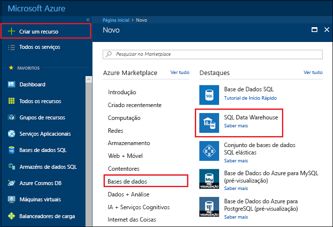

3. Preencha o formulário do SQL Data Warehouse com as seguintes informações:   

    | Definição | Valor sugerido | Descrição | 
    | ------- | --------------- | ----------- | 
    | **Nome da base de dados** | mySampleDataWarehouse | Para nomes de bases de dados válidos, veja [Database Identifiers](/sql/relational-databases/databases/database-identifiers) (Identificadores de Bases de Dados). Tenha em atenção que um armazém de dados é um tipo de base de dados.| 
    | **Subscrição** | A sua subscrição  | Para obter detalhes sobre as suas subscrições, veja [Subscriptions](https://account.windowsazure.com/Subscriptions) (Subscrições). |
    | **Grupo de recursos** | myResourceGroup | Para nomes de grupo de recursos válidos, veja [Naming rules and restrictions](https://docs.microsoft.com/azure/architecture/best-practices/naming-conventions) (Atribuição de nomes de regras e restrições). |
    | **Selecionar origem** | Sample | Especifica para carregar uma base de dados de exemplo. Tenha em atenção que um armazém de dados é um tipo de base de dados. |
    | **Selecionar exemplo** | AdventureWorksDW | Especifica para carregar a base de dados de exemplo AdventureWorksDW.  |

    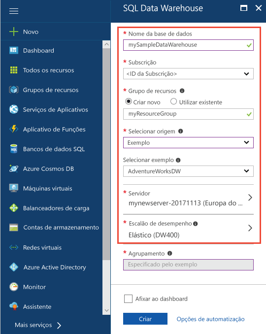

4. Clique em **Servidor** para criar e configurar um novo servidor para a nova base de dados. Preencha o **Novo formulário de servidor** com as seguintes informações: 

    | Definição | Valor sugerido | Descrição | 
    | ------------ | ------------------ | ------------------------------------------------- | 
    | **Nome do servidor** | Qualquer nome globalmente exclusivo | Para nomes de servidores válidos, veja [Naming rules and restrictions](https://docs.microsoft.com/azure/architecture/best-practices/naming-conventions) (Atribuição de nomes de regras e restrições). | 
    | **Início de sessão de administrador do servidor** | Qualquer nome válido | Para nomes de início de sessão válidos, veja [Database Identifiers](https://docs.microsoft.com/sql/relational-databases/databases/database-identifiers) (Identificadores de Bases de Dados).|
    | **Palavra-passe** | Qualquer palavra-passe válida | A sua palavra-passe deve ter, pelo menos, oito carateres e deve conter carateres de três das seguintes categorias: carateres maiúsculos, carateres minúsculos, números e carateres não alfanuméricos. |
    | **Localização** | Nenhuma localização válida | Para obter mais informações sobre regiões, veja [Azure Regions](https://azure.microsoft.com/regions/) (Regiões do Azure). |

    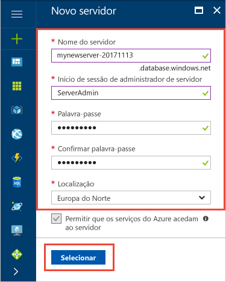

5. Clique em **Selecionar**.

6. Clique em **Escalão de desempenho** para especificar a configuração de desempenho do armazém de dados.

7. Para este tutorial, selecione o escalão de desempenho **Otimizado para Elasticidade**. O controlo de deslize está predefinido como **DW400**.  Experimente movê-lo para cima e para baixo para ver como funciona. 

    

8. Clique em **Aplicar**.

9. Agora que concluiu o formulário da Base de Dados SQL do Servidor, clique em **Criar** para aprovisionar a base de dados. O aprovisionamento demora alguns minutos. 

    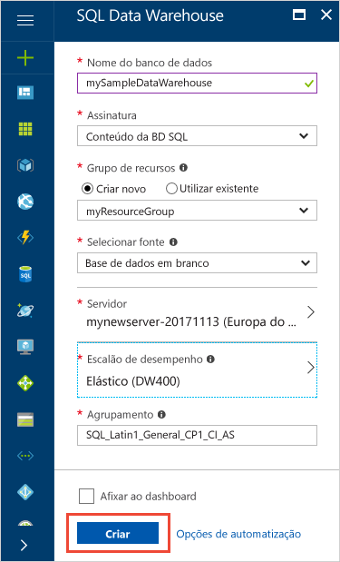

10. Na barra de ferramentas, clique em **Notificações** para monitorizar o processo de implementação.
    
     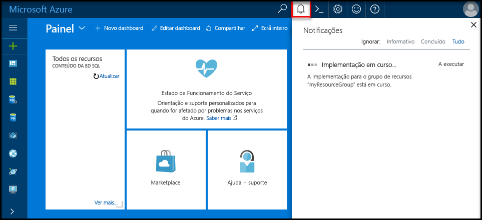

## <a name="create-a-server-level-firewall-rule"></a>Criar uma regra de firewall ao nível do servidor

O serviço SQL Data Warehouse cria uma firewall ao nível do servidor que impede que as aplicações e ferramentas externas estabeleçam uma ligação ao servidor ou a quaisquer bases de dados no servidor. Para permitir a conectividade, pode adicionar regras de firewall que permitem a conectividade para endereços IP específicos.  Siga estes passos para criar uma [regra de firewall ao nível do servidor](../sql-database/sql-database-firewall-configure.md) para o endereço IP do cliente. 

> [!NOTE]
> O SQL Data Warehouse comunica através da porta 1433. Se estiver a tentar ligar a partir de uma rede empresarial, o tráfego de saída através da porta 1433 poderá não ser permitido pela firewall da rede. Se assim for, não poderá ligar ao servidor da Base de Dados SQL do Azure, a menos que o departamento de TI abra a porta 1433.
>

1. Depois de concluída a implementação, clique em **Bases de dados SQL** no menu do lado esquerdo e, em seguida, clique em **mySampleDatabase** na página **Bases de dados SQL**. É aberta uma página de descrição geral para a base de dados que mostra o nome de servidor completamente qualificado (como **mynewserver-20171113.database.windows.net**) e oferece opções para configuração adicional. 

2. Copie este nome de servidor totalmente qualificado para utilizar para ligar ao seu servidor e às respetivas bases de dados nos seguintes guias de introdução. Para abrir as definições do servidor, clique no nome do servidor.

   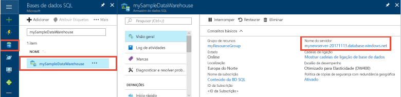 

3. Para abrir as definições do servidor, 
4. clique no nome do servidor.

   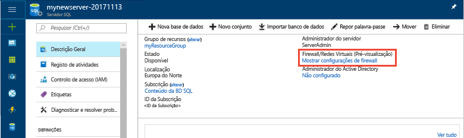 

5. Clique em **Mostrar definições da firewall**. É aberta a página **Definições da firewall** do servidor da Base de Dados SQL. 

   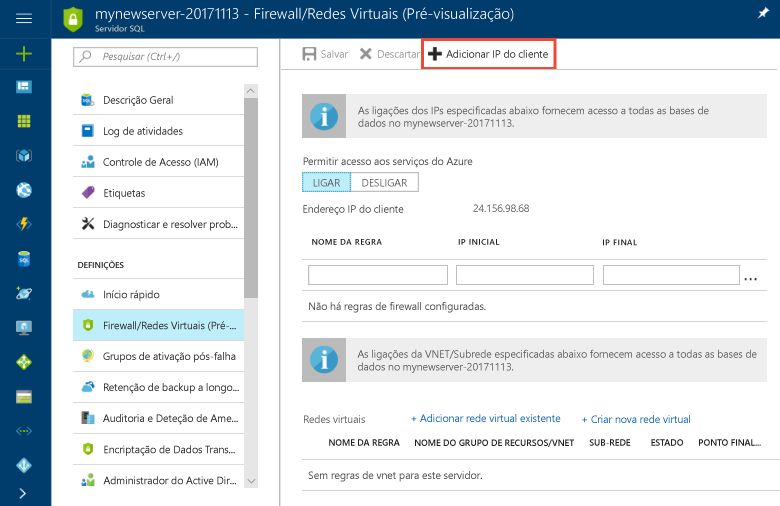 

4. Para adicionar o endereço IP atual a uma nova regra de firewall, clique em **Adicionar IP de cliente**. Uma regra de firewall consegue abrir a porta 1433 para um único endereço IP ou para um intervalo de endereços IP.

5. Clique em **Guardar**. É criada uma regra de firewall ao nível do servidor para a sua porta de abertura 1433 do endereço IP atual no servidor lógico.

6. Clique em **OK** e, em seguida, feche a página **Definições da firewall**.

Agora, pode ligar ao servidor SQL e aos respetivos armazéns de dados com este endereço IP. A ligação funciona a partir do SQL Server Management Studio ou de outra ferramenta à sua escolha. Ao ligar, utilize a conta ServerAdmin que criou anteriormente.  

> [!IMPORTANT]
> Por predefinição, o acesso através da firewall da Base de Dados SQL está ativado para todos os serviços do Azure. Clique em **DESATIVADO** nesta página e, em seguida, clique em **Guardar** para desativar a firewall para todos os serviços do Azure.

## <a name="get-the-fully-qualified-server-name"></a>Obter o nome de servidor completamente qualificado

Obtenha o nome de servidor completamente qualificado para o servidor SQL no portal do Azure. Utilizará mais tarde o nome completamente qualificado quando ligar ao servidor.

1. Inicie sessão no [Portal do Azure](https://portal.azure.com/).
2. Selecione **Bases de Dados SQL** a partir do menu do lado esquerdo e clique na sua base de dados na página **Bases de Dados SQL**. 
3. No painel **Essentials** na página do portal do Azure da sua base de dados, localize e, em seguida, copie o **Nome do servidor**. Neste exemplo, o nome completamente qualificado é mynewserver-20171113.database.windows.net. 

      

## <a name="connect-to-the-server-as-server-admin"></a>Ligar ao servidor como administrador do servidor

Esta secção utiliza o [SQL Server Management Studio](/sql/ssms/download-sql-server-management-studio-ssms.md) (SSMS) para estabelecer uma ligação ao servidor SQL do Azure.

1. Abra o SQL Server Management Studio.

2. Na caixa de dialogo **Ligar ao Servidor**, introduza as seguintes informações:

   | Definição       | Valor sugerido | Descrição | 
   | ------------ | ------------------ | ------------------------------------------------- | 
   | Tipo de servidor | Motor de base de dados | Este valor é obrigatório |
   | Nome do servidor | O nome de servidor completamente qualificado | Segue-se um exemplo: **mynewserver-20171113.database.windows.net**. |
   | Autenticação | Autenticação do SQL Server | A Autenticação do SQL é o único tipo de autenticação configurado neste tutorial. |
   | Iniciar sessão | A conta de administrador do servidor | Esta é a conta que especificou quando criou o servidor. |
   | Palavra-passe | A palavra-passe da sua conta de administrador do servidor | Esta é a palavra-passe que especificou quando criou o servidor. |

    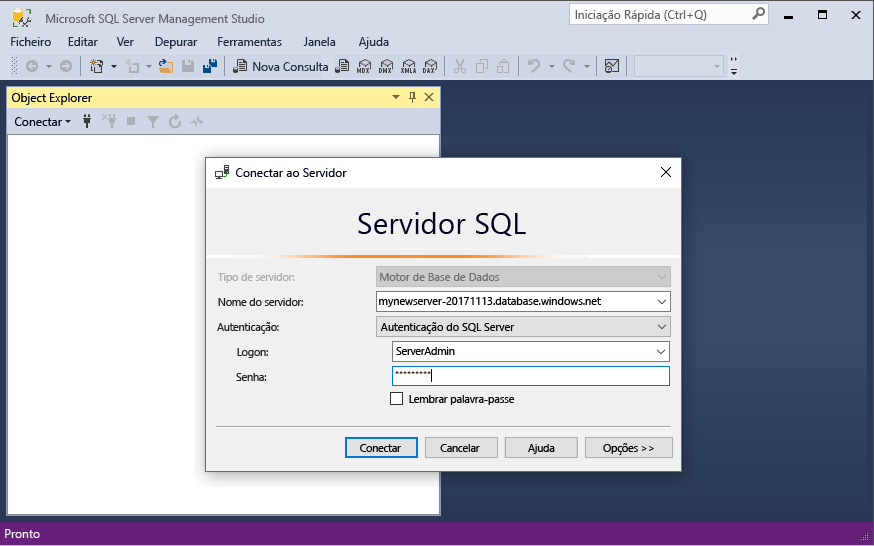

4. Clique em **Ligar**. A janela do Object Explorer é aberta no SSMS. 

5. No Object Explorer, expanda **Databases**. Em seguida, expanda **mySampleDatabase** para ver os objetos na nova base de dados.

    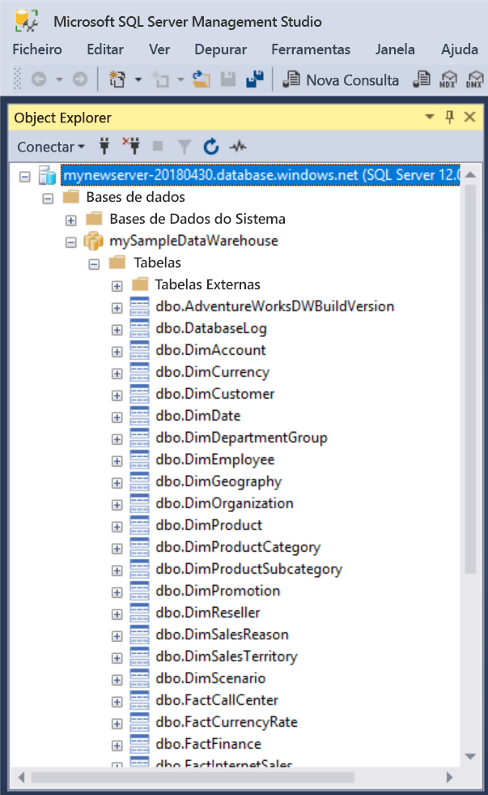 

## <a name="run-some-queries"></a>Executar algumas consultas

O SQL Data Warehouse utiliza o T-SQL como linguagem de consulta. Para abrir uma janela de consulta e executar algumas consultas de T-SQL, utilize os seguintes passos:

1. Clique com o botão direito do rato em **mySampleDataWarehouse** e selecione **Nova Consulta**.  É aberta uma nova janela de consulta.
2. Na janela da consulta, introduza o seguinte comando para ver uma lista de bases de dados.

    ```sql
    SELECT * FROM sys.databases
    ```

3. Clique em **Executar**.  Os resultados da consulta mostram duas bases de dados: **master** e **mySampleDataWarehouse**.

    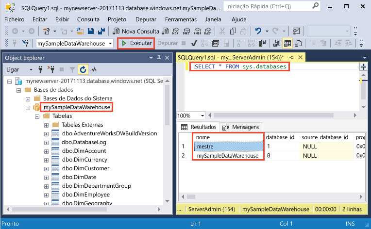

4. Para ver alguns dados, utilize o seguinte comando para ver o número de clientes com o apelido Adams com três filhos em casa. Os resultados listam seis clientes. 

    ```sql
    SELECT LastName, FirstName FROM dbo.dimCustomer
    WHERE LastName = 'Adams' AND NumberChildrenAtHome = 3;
    ```

    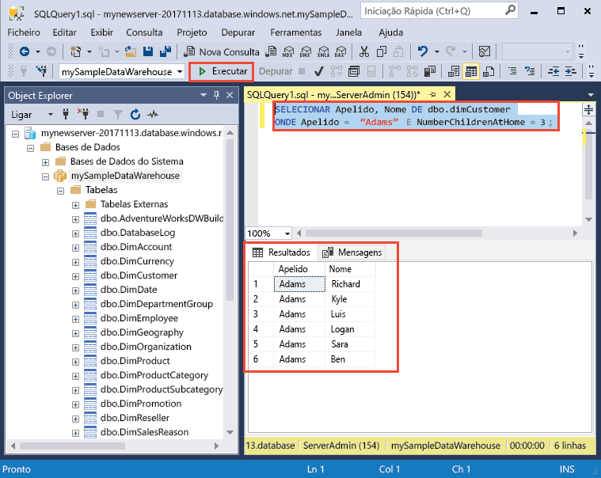

## <a name="clean-up-resources"></a>Limpar recursos

Estão a ser-lhe cobradas as unidades do armazém de dados e os dados armazenados no mesmo. Estes recursos de computação e armazenamento são faturados em separado. 

- Se quiser manter os dados no armazenamento, pode interromper a computação quando não estiver a utilizar o armazém de dados. Ao interromper a computação, apenas lhe será cobrado o armazenamento de dados. Pode retomar a computação quando estiver preparado para trabalhar com os dados.
- Se quiser remover futuras cobranças, pode eliminar o armazém de dados. 

Siga estes passos para limpar os recursos conforme quiser.

1. Inicie sessão no [portal do Azure](https://portal.azure.com) e clique no seu armazém de dados.

    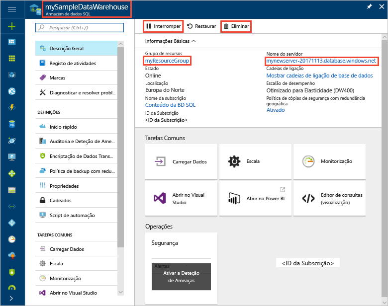

1. Para interromper a computação, clique no botão **Pausar**. Quando o armazém de dados estiver em pausa, verá um botão **Iniciar**.  Para retomar a computação, clique em **Iniciar**.

2. Para remover o armazém de dados para não lhe ser cobrada a computação ou o armazenamento, clique em **Eliminar**.

3. Para remover o servidor SQL que criou, clique em **mynewserver-20171113.database.windows.net** na imagem anterior e, em seguida, clique em **Eliminar**.  Tenha cuidado com esta eliminação, uma vez que eliminar o servidor também elimina todas as bases de dados atribuídas ao mesmo.

4. Para remover o grupo de recursos, clique em **myResourceGroup** e, em seguida, clique em **Eliminar grupo de recursos**.


## <a name="next-steps"></a>Passos seguintes
Criou um armazém de dados e uma regra de firewall, ligou ao armazém de dados e executou algumas consultas. Para saber mais sobre o Azure SQL Data Warehouse, avance para o tutorial para carregar dados.
> [!div class="nextstepaction"]
>[Carregar dados para o SQL Data Warehouse](load-data-from-azure-blob-storage-using-polybase.md)