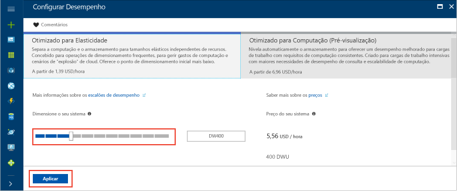

# <a name="tutorial-load-data-to-azure-sql-data-warehouse"></a>Tutorial: Carregar dados para o Azure SQL Data Warehouse

Este tutorial utiliza o PolyBase para carregar o armazém de dados WideWorldImportersDW do armazenamento de Blobs do Azure para o Azure SQL Data Warehouse. Este tutorial utiliza o [portal do Azure](https://portal.azure.com) e o [SQL Server Management Studio](/sql/ssms/download-sql-server-management-studio-ssms) (SSMS) para: 

> [!div class="checklist"]
> * Criar um armazém de dados no portal do Azure
> * Configurar uma regra de firewall ao nível do servidor no portal do Azure
> * Ligar ao armazém de dados com o SSMS
> * Criar um utilizador designado para carregar dados
> * Criar tabelas externas que utilizam o blob do Azure como origem de dados
> * Utilizar a instrução CTAS T-SQL para carregar dados para o armazém de dados
> * Ver o progresso dos dados à medida que são carregados
> * Gerar um ano de dados nas tabelas de factos de dimensão e vendas de data
> * Criar estatísticas dos dados recentemente carregados

Se não tiver uma subscrição do Azure, [crie uma conta gratuita](https://azure.microsoft.com/free/) antes de começar.

## <a name="before-you-begin"></a>Antes de começar

Antes de começar este tutorial, transfira e instale a versão mais recente do [SQL Server Management Studio](/sql/ssms/download-sql-server-management-studio-ssms) (SSMS).


## <a name="log-in-to-the-azure-portal"></a>Iniciar sessão no portal do Azure

Inicie sessão no [Portal do Azure](https://portal.azure.com/).

## <a name="create-a-blank-sql-data-warehouse"></a>Criar um armazém de dados SQL vazio

É criado um armazém de dados SQL do Azure com um conjunto definido de [recursos de computação](memory-and-concurrency-limits.md). A base de dados é criada num [Grupo de recursos do Azure](../azure-resource-manager/resource-group-overview.md) e num [servidor lógico SQL do Azure](../sql-database/sql-database-features.md). 

Siga estes passos para criar um armazém de dados SQL vazio. 

1. Clique em **Criar um recurso**, no canto superior esquerdo do portal do Azure.

2. Selecione **Bases de Dados** na página **Novo** e selecione **Armazém de Dados SQL** em **Destaques** na página **Novo**.

    

3. Preencha o formulário do SQL Data Warehouse com as seguintes informações:   

   | Definição | Valor sugerido | Descrição | 
   | ------- | --------------- | ----------- | 
   | **Nome da base de dados** | SampleDW | Para nomes de bases de dados válidos, veja [Database Identifiers](/sql/relational-databases/databases/database-identifiers) (Identificadores de Bases de Dados). | 
   | **Subscrição** | A sua subscrição  | Para obter detalhes sobre as suas subscrições, veja [Subscriptions](https://account.windowsazure.com/Subscriptions) (Subscrições). |
   | **Grupo de recursos** | SampleRG | Para nomes de grupo de recursos válidos, veja [Naming rules and restrictions](https://docs.microsoft.com/azure/architecture/best-practices/naming-conventions) (Atribuição de nomes de regras e restrições). |
   | **Selecionar origem** | Base de dados vazia | Especifica para criar uma base de dados vazia. Tenha em atenção que um armazém de dados é um tipo de base de dados.|

    

4. Clique em **Servidor** para criar e configurar um novo servidor para a nova base de dados. Preencha o **Novo formulário de servidor** com as seguintes informações: 

    | Definição | Valor sugerido | Descrição | 
    | ------- | --------------- | ----------- |
    | **Nome do servidor** | Qualquer nome globalmente exclusivo | Para nomes de servidores válidos, veja [Naming rules and restrictions](https://docs.microsoft.com/azure/architecture/best-practices/naming-conventions) (Atribuição de nomes de regras e restrições). | 
    | **Início de sessão de administrador do servidor** | Qualquer nome válido | Para nomes de início de sessão válidos, veja [Database Identifiers](https://docs.microsoft.com/sql/relational-databases/databases/database-identifiers) (Identificadores de Bases de Dados).|
    | **Palavra-passe** | Qualquer palavra-passe válida | A sua palavra-passe deve ter, pelo menos, oito carateres e deve conter carateres de três das seguintes categorias: carateres maiúsculos, carateres minúsculos, números e carateres não alfanuméricos. |
    | **Localização** | Nenhuma localização válida | Para obter mais informações sobre regiões, veja [Azure Regions](https://azure.microsoft.com/regions/) (Regiões do Azure). |

    

5. Clique em **Selecionar**.

6. Clique em **Escalão de desempenho** para especificar se o armazém de dados está otimizado para elasticidade ou computação e o número de unidades do armazém de dados. 

7. Para este tutorial, selecione o escalão de serviço **Otimizado para Elasticidade**. O controlo de deslize está predefinido como **DW400**.  Experimente movê-lo para cima e para baixo para ver como funciona. 

    

8. Clique em **Aplicar**.
9. Na página do SQL Data Warehouse, selecione um **agrupamento** para a base de dados vazia. Para este tutorial, utilize o valor predefinido. Para obter mais informações sobre agrupamentos, veja [Agrupamentos](/sql/t-sql/statements/collations)

11. Agora que concluiu o formulário da Base de Dados SQL do Servidor, clique em **Criar** para aprovisionar a base de dados. O aprovisionamento demora alguns minutos. 

    

12. Na barra de ferramentas, clique em **Notificações** para monitorizar o processo de implementação.
    
     

## <a name="create-a-server-level-firewall-rule"></a>Criar uma regra de firewall ao nível do servidor

O serviço SQL Data Warehouse cria uma firewall ao nível do servidor que impede que as aplicações e ferramentas externas estabeleçam uma ligação ao servidor ou a quaisquer bases de dados no servidor. Para permitir a conectividade, pode adicionar regras de firewall que permitem a conectividade para endereços IP específicos.  Siga estes passos para criar uma [regra de firewall ao nível do servidor](../sql-database/sql-database-firewall-configure.md) para o endereço IP do cliente. 

> [!NOTE]
> O SQL Data Warehouse comunica através da porta 1433. Se estiver a tentar ligar a partir de uma rede empresarial, o tráfego de saída através da porta 1433 poderá não ser permitido pela firewall da rede. Se assim for, não poderá ligar ao servidor da Base de Dados SQL do Azure, a menos que o departamento de TI abra a porta 1433.
>

1. Depois de concluída a implementação, clique em **Bases de dados SQL** no menu do lado esquerdo e, em seguida, clique em **SampleDW** na página **Bases de dados SQL**. É aberta a página de descrição geral da base de dados, que mostra o nome de servidor completamente qualificado (como **sample-svr.database.windows.net**) e oferece opções para configuração adicional. 

2. Copie este nome de servidor totalmente qualificado para utilizar para ligar ao seu servidor e às respetivas bases de dados nos seguintes guias de introdução. Para abrir as definições do servidor, clique no nome do servidor.

     

3. Para abrir as definições do servidor, clique no nome do servidor.

     

5. Clique em **Mostrar definições da firewall**. É aberta a página **Definições da firewall** do servidor da Base de Dados SQL. 

     

4.  Para adicionar o endereço IP atual a uma nova regra de firewall, clique em **Adicionar IP de cliente**. Uma regra de firewall consegue abrir a porta 1433 para um único endereço IP ou para um intervalo de endereços IP.

5. Clique em **Guardar**. É criada uma regra de firewall ao nível do servidor para a sua porta de abertura 1433 do endereço IP atual no servidor lógico.

6. Clique em **OK** e, em seguida, feche a página **Definições da firewall**.

Agora, pode ligar ao servidor SQL e aos respetivos armazéns de dados com este endereço IP. A ligação funciona a partir do SQL Server Management Studio ou de outra ferramenta à sua escolha. Ao ligar, utilize a conta serveradmin que criou anteriormente.  

> [!IMPORTANT]
> Por predefinição, o acesso através da firewall da Base de Dados SQL está ativado para todos os serviços do Azure. Clique em **DESATIVADO** nesta página e, em seguida, clique em **Guardar** para desativar a firewall para todos os serviços do Azure.

## <a name="get-the-fully-qualified-server-name"></a>Obter o nome de servidor completamente qualificado

Obtenha o nome de servidor completamente qualificado para o servidor SQL no portal do Azure. Utilizará mais tarde o nome completamente qualificado quando ligar ao servidor.

1. Inicie sessão no [Portal do Azure](https://portal.azure.com/).
2. Selecione **Bases de Dados SQL** a partir do menu do lado esquerdo e clique na sua base de dados na página **Bases de Dados SQL**. 
3. No painel **Essentials** na página do portal do Azure da sua base de dados, localize e, em seguida, copie o **Nome do servidor**. Neste exemplo, o nome completamente qualificado é mynewserver-20171113.database.windows.net. 

      

## <a name="connect-to-the-server-as-server-admin"></a>Ligar ao servidor como administrador do servidor

Esta secção utiliza o [SQL Server Management Studio](/sql/ssms/download-sql-server-management-studio-ssms) (SSMS) para estabelecer uma ligação ao servidor SQL do Azure.

1. Abra o SQL Server Management Studio.

2. Na caixa de dialogo **Ligar ao Servidor**, introduza as seguintes informações:

    | Definição      | Valor sugerido | Descrição | 
    | ------------ | --------------- | ----------- | 
    | Tipo de servidor | Motor de base de dados | Este valor é obrigatório |
    | Nome do servidor | O nome de servidor completamente qualificado | Por exemplo, **sample-svr.database.windows.net** é um nome de servidor completamente qualificado. |
    | Autenticação | Autenticação do SQL Server | A Autenticação do SQL é o único tipo de autenticação configurado neste tutorial. |
    | Iniciar sessão | A conta de administrador do servidor | Esta é a conta que especificou quando criou o servidor. |
    | Palavra-passe | A palavra-passe da sua conta de administrador do servidor | Esta é a palavra-passe que especificou quando criou o servidor. |

    

4. Clique em **Ligar**. A janela do Object Explorer é aberta no SSMS. 

5. No Object Explorer, expanda **Databases**. Em seguida, expanda **Bases de dados do sistema** e **mestre** para ver os objetos na base de dados mestra.  Expanda **mySampleDatabase** para ver os objetos na nova base de dados.

     

## <a name="create-a-user-for-loading-data"></a>Criar um utilizador para carregar dados

A conta de administrador do servidor destina-se a efetuar operações de gestão e não é adequada para executar consultas em dados do utilizador. O carregamento de dados é uma operação de memória intensiva. Os valores máximos de memória são definidos de acordo com a Geração do SQL Data Warehouse que está a utilizar, as [unidades de armazém de dados](what-is-a-data-warehouse-unit-dwu-cdwu.md) e a [classe de recursos](resource-classes-for-workload-management.md). 

É melhor criar um início de sessão e utilizador dedicado para carregar dados. Em seguida, adicione o utilizador de carregamento a uma [classe de recursos](resource-classes-for-workload-management.md) que permita uma alocação de memória máxima adequada.

Uma vez que está atualmente ligado como o administrador do servidor, pode criar inícios de sessão e utilizadores. Utilize estes passos para criar um início de sessão e o utilizador com o nome **LoaderRC60**. Em seguida, atribua o utilizador à classe de recursos **staticrc60**. 

1.  No SSMS, faça duplo clique em **mestre** para mostrar um menu pendente e escolha **Nova Consulta**. É aberta uma nova janela de consulta.

    

2. Na janela de consulta, introduza estes comandos T-SQL para criar um início de sessão e o utilizador com o nome LoaderRC60 ao substituir a sua palavra-passe por "a123STRONGpassword!". 

    ```sql
    CREATE LOGIN LoaderRC60 WITH PASSWORD = 'a123STRONGpassword!';
    CREATE USER LoaderRC60 FOR LOGIN LoaderRC60;
    ```

3. Clique em **Executar**.

4. Clique com o botão direito do rato em **SampleDW** e selecione **Nova Consulta**. É aberta uma nova janela de consulta.  

    
 
5. Introduza os seguintes comandos T-SQL para criar um utilizador de base de dados com o nome LoaderRC60 para o início de sessão de LoaderRC60. A segunda linha concede ao novo utilizador permissões CONTROL no novo armazém de dados.  Estas permissões são semelhantes a tornar o utilizador o proprietário da base de dados. A terceira linha adiciona o novo utilizador como um membro da [classe de recursos](resource-classes-for-workload-management.md) staticrc60.

    ```sql
    CREATE USER LoaderRC60 FOR LOGIN LoaderRC60;
    GRANT CONTROL ON DATABASE::[SampleDW] to LoaderRC60;
    EXEC sp_addrolemember 'staticrc60', 'LoaderRC60';
    ```

6. Clique em **Executar**.

## <a name="connect-to-the-server-as-the-loading-user"></a>Ligar ao servidor como utilizador de carregamento

O primeiro passo para o carregamento de dados é iniciar sessão como LoaderRC60.  

1. No Object Explorer, clique no menu pendente **Ligar** e selecione **Motor de Base de Dados**. A caixa de diálogo **Ligar ao Servidor** é apresentada.

    

2. Introduza o nome de servidor completamente qualificado e introduza **LoaderRC60** como o Início de Sessão.  Introduza a palavra-passe para LoaderRC60.

3. Clique em **Ligar**.

4. Quando a ligação estiver pronta, verá duas ligações de servidor no Object Explorer. Uma ligação como ServerAdmin e uma ligação como LoaderRC60.

    

## <a name="create-external-tables-and-objects"></a>Criar tabelas externas e objetos

Está pronto para iniciar o processo de carregamento de dados para o novo armazém de dados. Para referência futura e para saber como colocar os seus dados no armazenamento de Blobs do Azure ou carregá-los diretamente da sua origem para o SQL Data Warehouse,veja a [descrição geral do carregamento](sql-data-warehouse-overview-load.md).

Execute os seguintes scripts SQL para especificar informações sobre os dados que quer carregar. Estas informações incluem a localização dos dados, o formato do conteúdo dos dados e a definição da tabela dos dados. Os dados estão localizados num Blob do Azure público.

1. Na secção anterior, iniciou sessão no armazém de dados como LoaderRC60. No SSMS, clique com o botão direito do rato em **SampleDW** na ligação LoaderRC60 e selecione **Nova Consulta**.  É apresentada uma nova janela de consulta. 

    

2. Compare a janela de consulta com a imagem anterior.  Certifique-se de que a nova janela de consulta está em execução como LoaderRC60 e a efetuar consultas na base de dados SampleDW. Utilize esta janela de consulta para executar todos os passos de carregamento.

3. Crie uma chave mestra para a base de dados SampleDW. Só tem de criar uma chave mestra uma vez por base de dados. 

    ```sql
    CREATE MASTER KEY;
    ```

4. Execute a seguinte instrução [CREATE EXTERNAL DATA SOURCE](/sql/t-sql/statements/create-external-data-source-transact-sql) para definir a localização do blob do Azure. Esta é a localização dos dados externos de táxis.  Para executar um comando que anexou à janela de consulta, realce os comandos que pretende executar e clique em **Executar**.

    ```sql
    CREATE EXTERNAL DATA SOURCE WWIStorage
    WITH
    (
        TYPE = Hadoop,
        LOCATION = 'wasbs://wideworldimporters@sqldwholdata.blob.core.windows.net'
    );
    ```

5. Execute a seguinte instrução T-SQL [CREATE EXTERNAL FILE FORMAT](/sql/t-sql/statements/create-external-file-format-transact-sql) para especificar as características de formatação e as opções para o ficheiro de dados externos. Esta instrução especifica que os dados externos são armazenados como texto e que os valores são separados pelo caráter de pipe ("|").  

    ```sql
    CREATE EXTERNAL FILE FORMAT TextFileFormat 
    WITH 
    (   
        FORMAT_TYPE = DELIMITEDTEXT,
        FORMAT_OPTIONS
        (   
            FIELD_TERMINATOR = '|',
            USE_TYPE_DEFAULT = FALSE 
        )
    );
    ```

6.  Execute a seguinte instrução [CREATE SCHEMA](/sql/t-sql/statements/create-schema-transact-sql) para criar um esquema para o formato de ficheiro externo. O esquema é uma forma de organizar as tabelas externas que está prestes a criar. O esquema wwi organiza as tabelas padrão que irão conter os dados. 

    ```sql
    CREATE SCHEMA ext;
    GO
    CREATE SCHEMA wwi;
    ```

7. Crie as tabelas externas. As definições de tabela são armazenadas no SQL Data Warehouse, mas os dados de referência de tabela são armazenados no armazenamento de blobs do Azure. Execute os comandos T-SQL seguintes para criar várias tabelas externas que apontem para o blob do Azure que definiu anteriormente na origem de dados externa.

    ```sql
    CREATE EXTERNAL TABLE [ext].[dimension_City](
        [City Key] [int] NOT NULL,
        [WWI City ID] [int] NOT NULL,
        [City] [nvarchar](50) NOT NULL,
        [State Province] [nvarchar](50) NOT NULL,
        [Country] [nvarchar](60) NOT NULL,
        [Continent] [nvarchar](30) NOT NULL,
        [Sales Territory] [nvarchar](50) NOT NULL,
        [Region] [nvarchar](30) NOT NULL,
        [Subregion] [nvarchar](30) NOT NULL,
        [Location] [nvarchar](76) NULL,
        [Latest Recorded Population] [bigint] NOT NULL,
        [Valid From] [datetime2](7) NOT NULL,
        [Valid To] [datetime2](7) NOT NULL,
        [Lineage Key] [int] NOT NULL
    )
    WITH (LOCATION='/v1/dimension_City/',   
        DATA_SOURCE = WWIStorage,  
        FILE_FORMAT = TextFileFormat,
        REJECT_TYPE = VALUE,
        REJECT_VALUE = 0
    );  
    CREATE EXTERNAL TABLE [ext].[dimension_Customer] (
        [Customer Key] [int] NOT NULL,
        [WWI Customer ID] [int] NOT NULL,
        [Customer] [nvarchar](100) NOT NULL,
        [Bill To Customer] [nvarchar](100) NOT NULL,
        [Category] [nvarchar](50) NOT NULL,
        [Buying Group] [nvarchar](50) NOT NULL,
        [Primary Contact] [nvarchar](50) NOT NULL,
        [Postal Code] [nvarchar](10) NOT NULL,
        [Valid From] [datetime2](7) NOT NULL,
        [Valid To] [datetime2](7) NOT NULL,
        [Lineage Key] [int] NOT NULL
    )
    WITH (LOCATION='/v1/dimension_Customer/',   
        DATA_SOURCE = WWIStorage,  
        FILE_FORMAT = TextFileFormat,
        REJECT_TYPE = VALUE,
        REJECT_VALUE = 0
    );  
    CREATE EXTERNAL TABLE [ext].[dimension_Employee] (
        [Employee Key] [int] NOT NULL,
        [WWI Employee ID] [int] NOT NULL,
        [Employee] [nvarchar](50) NOT NULL,
        [Preferred Name] [nvarchar](50) NOT NULL,
        [Is Salesperson] [bit] NOT NULL,
        [Photo] [varbinary](300) NULL,
        [Valid From] [datetime2](7) NOT NULL,
        [Valid To] [datetime2](7) NOT NULL,
        [Lineage Key] [int] NOT NULL
    )
    WITH ( LOCATION='/v1/dimension_Employee/',   
        DATA_SOURCE = WWIStorage,  
        FILE_FORMAT = TextFileFormat,
        REJECT_TYPE = VALUE,
        REJECT_VALUE = 0
    );
    CREATE EXTERNAL TABLE [ext].[dimension_PaymentMethod] (
        [Payment Method Key] [int] NOT NULL,
        [WWI Payment Method ID] [int] NOT NULL,
        [Payment Method] [nvarchar](50) NOT NULL,
        [Valid From] [datetime2](7) NOT NULL,
        [Valid To] [datetime2](7) NOT NULL,
        [Lineage Key] [int] NOT NULL
    )
    WITH ( LOCATION ='/v1/dimension_PaymentMethod/',   
        DATA_SOURCE = WWIStorage,  
        FILE_FORMAT = TextFileFormat,
        REJECT_TYPE = VALUE,
        REJECT_VALUE = 0
    );
    CREATE EXTERNAL TABLE [ext].[dimension_StockItem](
        [Stock Item Key] [int] NOT NULL,
        [WWI Stock Item ID] [int] NOT NULL,
        [Stock Item] [nvarchar](100) NOT NULL,
        [Color] [nvarchar](20) NOT NULL,
        [Selling Package] [nvarchar](50) NOT NULL,
        [Buying Package] [nvarchar](50) NOT NULL,
        [Brand] [nvarchar](50) NOT NULL,
        [Size] [nvarchar](20) NOT NULL,
        [Lead Time Days] [int] NOT NULL,
        [Quantity Per Outer] [int] NOT NULL,
        [Is Chiller Stock] [bit] NOT NULL,
        [Barcode] [nvarchar](50) NULL,
        [Tax Rate] [decimal](18, 3) NOT NULL,
        [Unit Price] [decimal](18, 2) NOT NULL,
        [Recommended Retail Price] [decimal](18, 2) NULL,
        [Typical Weight Per Unit] [decimal](18, 3) NOT NULL,
        [Photo] [varbinary](300) NULL,
        [Valid From] [datetime2](7) NOT NULL,
        [Valid To] [datetime2](7) NOT NULL,
        [Lineage Key] [int] NOT NULL
    )
    WITH ( LOCATION ='/v1/dimension_StockItem/',   
        DATA_SOURCE = WWIStorage,  
        FILE_FORMAT = TextFileFormat,
        REJECT_TYPE = VALUE,
        REJECT_VALUE = 0
    );
    CREATE EXTERNAL TABLE [ext].[dimension_Supplier](
        [Supplier Key] [int] NOT NULL,
        [WWI Supplier ID] [int] NOT NULL,
        [Supplier] [nvarchar](100) NOT NULL,
        [Category] [nvarchar](50) NOT NULL,
        [Primary Contact] [nvarchar](50) NOT NULL,
        [Supplier Reference] [nvarchar](20) NULL,
        [Payment Days] [int] NOT NULL,
        [Postal Code] [nvarchar](10) NOT NULL,
        [Valid From] [datetime2](7) NOT NULL,
        [Valid To] [datetime2](7) NOT NULL,
        [Lineage Key] [int] NOT NULL
    )
    WITH ( LOCATION ='/v1/dimension_Supplier/',   
        DATA_SOURCE = WWIStorage,  
        FILE_FORMAT = TextFileFormat,
        REJECT_TYPE = VALUE,
        REJECT_VALUE = 0
    );
    CREATE EXTERNAL TABLE [ext].[dimension_TransactionType](
        [Transaction Type Key] [int] NOT NULL,
        [WWI Transaction Type ID] [int] NOT NULL,
        [Transaction Type] [nvarchar](50) NOT NULL,
        [Valid From] [datetime2](7) NOT NULL,
        [Valid To] [datetime2](7) NOT NULL,
        [Lineage Key] [int] NOT NULL
    )    
    WITH ( LOCATION ='/v1/dimension_TransactionType/',   
        DATA_SOURCE = WWIStorage,  
        FILE_FORMAT = TextFileFormat,
        REJECT_TYPE = VALUE,
        REJECT_VALUE = 0
    );
    CREATE EXTERNAL TABLE [ext].[fact_Movement] (
        [Movement Key] [bigint] NOT NULL,
        [Date Key] [date] NOT NULL,
        [Stock Item Key] [int] NOT NULL,
        [Customer Key] [int] NULL,
        [Supplier Key] [int] NULL,
        [Transaction Type Key] [int] NOT NULL,
        [WWI Stock Item Transaction ID] [int] NOT NULL,
        [WWI Invoice ID] [int] NULL,
        [WWI Purchase Order ID] [int] NULL,
        [Quantity] [int] NOT NULL,
        [Lineage Key] [int] NOT NULL
    )
    WITH ( LOCATION ='/v1/fact_Movement/',   
        DATA_SOURCE = WWIStorage,  
        FILE_FORMAT = TextFileFormat,
        REJECT_TYPE = VALUE,
        REJECT_VALUE = 0
    );
    CREATE EXTERNAL TABLE [ext].[fact_Order] (
        [Order Key] [bigint] NOT NULL,
        [City Key] [int] NOT NULL,
        [Customer Key] [int] NOT NULL,
        [Stock Item Key] [int] NOT NULL,
        [Order Date Key] [date] NOT NULL,
        [Picked Date Key] [date] NULL,
        [Salesperson Key] [int] NOT NULL,
        [Picker Key] [int] NULL,
        [WWI Order ID] [int] NOT NULL,
        [WWI Backorder ID] [int] NULL,
        [Description] [nvarchar](100) NOT NULL,
        [Package] [nvarchar](50) NOT NULL,
        [Quantity] [int] NOT NULL,
        [Unit Price] [decimal](18, 2) NOT NULL,
        [Tax Rate] [decimal](18, 3) NOT NULL,
        [Total Excluding Tax] [decimal](18, 2) NOT NULL,
        [Tax Amount] [decimal](18, 2) NOT NULL,
        [Total Including Tax] [decimal](18, 2) NOT NULL,
        [Lineage Key] [int] NOT NULL
    )
    WITH ( LOCATION ='/v1/fact_Order/',   
        DATA_SOURCE = WWIStorage,  
        FILE_FORMAT = TextFileFormat,
        REJECT_TYPE = VALUE,
        REJECT_VALUE = 0
    );
    CREATE EXTERNAL TABLE [ext].[fact_Purchase] (
        [Purchase Key] [bigint] NOT NULL,
        [Date Key] [date] NOT NULL,
        [Supplier Key] [int] NOT NULL,
        [Stock Item Key] [int] NOT NULL,
        [WWI Purchase Order ID] [int] NULL,
        [Ordered Outers] [int] NOT NULL,
        [Ordered Quantity] [int] NOT NULL,
        [Received Outers] [int] NOT NULL,
        [Package] [nvarchar](50) NOT NULL,
        [Is Order Finalized] [bit] NOT NULL,
        [Lineage Key] [int] NOT NULL
    )
    WITH ( LOCATION ='/v1/fact_Purchase/',   
        DATA_SOURCE = WWIStorage,  
        FILE_FORMAT = TextFileFormat,
        REJECT_TYPE = VALUE,
        REJECT_VALUE = 0
    );
    CREATE EXTERNAL TABLE [ext].[fact_Sale] (
        [Sale Key] [bigint] NOT NULL,
        [City Key] [int] NOT NULL,
        [Customer Key] [int] NOT NULL,
        [Bill To Customer Key] [int] NOT NULL,
        [Stock Item Key] [int] NOT NULL,
        [Invoice Date Key] [date] NOT NULL,
        [Delivery Date Key] [date] NULL,
        [Salesperson Key] [int] NOT NULL,
        [WWI Invoice ID] [int] NOT NULL,
        [Description] [nvarchar](100) NOT NULL,
        [Package] [nvarchar](50) NOT NULL,
        [Quantity] [int] NOT NULL,
        [Unit Price] [decimal](18, 2) NOT NULL,
        [Tax Rate] [decimal](18, 3) NOT NULL,
        [Total Excluding Tax] [decimal](18, 2) NOT NULL,
        [Tax Amount] [decimal](18, 2) NOT NULL,
        [Profit] [decimal](18, 2) NOT NULL,
        [Total Including Tax] [decimal](18, 2) NOT NULL,
        [Total Dry Items] [int] NOT NULL,
        [Total Chiller Items] [int] NOT NULL,
        [Lineage Key] [int] NOT NULL
    )
    WITH ( LOCATION ='/v1/fact_Sale/',   
        DATA_SOURCE = WWIStorage,  
        FILE_FORMAT = TextFileFormat,
        REJECT_TYPE = VALUE,
        REJECT_VALUE = 0
    );
    CREATE EXTERNAL TABLE [ext].[fact_StockHolding] (
        [Stock Holding Key] [bigint] NOT NULL,
        [Stock Item Key] [int] NOT NULL,
        [Quantity On Hand] [int] NOT NULL,
        [Bin Location] [nvarchar](20) NOT NULL,
        [Last Stocktake Quantity] [int] NOT NULL,
        [Last Cost Price] [decimal](18, 2) NOT NULL,
        [Reorder Level] [int] NOT NULL,
        [Target Stock Level] [int] NOT NULL,
        [Lineage Key] [int] NOT NULL
    )
    WITH ( LOCATION ='/v1/fact_StockHolding/',   
        DATA_SOURCE = WWIStorage,  
        FILE_FORMAT = TextFileFormat,
        REJECT_TYPE = VALUE,
        REJECT_VALUE = 0
    );
    CREATE EXTERNAL TABLE [ext].[fact_Transaction] (
        [Transaction Key] [bigint] NOT NULL,
        [Date Key] [date] NOT NULL,
        [Customer Key] [int] NULL,
        [Bill To Customer Key] [int] NULL,
        [Supplier Key] [int] NULL,
        [Transaction Type Key] [int] NOT NULL,
        [Payment Method Key] [int] NULL,
        [WWI Customer Transaction ID] [int] NULL,
        [WWI Supplier Transaction ID] [int] NULL,
        [WWI Invoice ID] [int] NULL,
        [WWI Purchase Order ID] [int] NULL,
        [Supplier Invoice Number] [nvarchar](20) NULL,
        [Total Excluding Tax] [decimal](18, 2) NOT NULL,
        [Tax Amount] [decimal](18, 2) NOT NULL,
        [Total Including Tax] [decimal](18, 2) NOT NULL,
        [Outstanding Balance] [decimal](18, 2) NOT NULL,
        [Is Finalized] [bit] NOT NULL,
        [Lineage Key] [int] NOT NULL
    )
    WITH ( LOCATION ='/v1/fact_Transaction/',   
        DATA_SOURCE = WWIStorage,  
        FILE_FORMAT = TextFileFormat,
        REJECT_TYPE = VALUE,
        REJECT_VALUE = 0
    );
    ```

8. No Object Explorer, expanda SampleDW para ver a lista de tabelas externas que acabou de criar.

    

## <a name="load-the-data-into-your-data-warehouse"></a>Carregar os dados para o armazém de dados

Esta secção utiliza as tabelas externas que acabou de definir para carregar os dados de exemplo do Blob do Azure para o SQL Data Warehouse.  

> [!NOTE]
> Este tutorial carrega os dados diretamente para a tabela final. Num ambiente de produção, normalmente, utilizará CREATE TABLE AS SELECT para carregar para uma tabela de testes. Enquanto os dados estiverem na tabela de teste, pode efetuar quaisquer transformações necessárias. Para acrescentar os dados na tabela de teste a uma tabela de produção, pode utilizar a instrução INSERT...SELECT. Para obter mais informações, veja [Inserir dados na tabela de produção](guidance-for-loading-data.md#inserting-data-into-a-production-table).
> 

O script utiliza a instrução T-SQL [CREATE TABLE AS SELECT (CTAS)](/sql/t-sql/statements/create-table-as-select-azure-sql-data-warehouse) para carregar os dados do Azure Storage Blob para novas tabelas no armazém de dados. CTAS cria uma nova tabela com base nos resultados de uma instrução select. A nova tabela tem as mesmas colunas e tipos de dados dos resultados da instrução select. Quando a instrução select seleciona de uma tabela externa, o SQL Data Warehouse importa os dados para uma tabela relacional no armazém de dados. 

Este script não carrega dados para as tabelas wwi.dimension_Date e wwi.fact_Sales. Estas tabelas foram geradas num passo posterior para as tabelas terem um número significativo de linhas.

1. Execute o script seguinte para carregar os dados para novas tabelas no armazém de dados.

    ```sql
    CREATE TABLE [wwi].[dimension_City]
    WITH
    ( 
        DISTRIBUTION = REPLICATE,
        CLUSTERED COLUMNSTORE INDEX
    )
    AS
    SELECT * FROM [ext].[dimension_City]
    OPTION (LABEL = 'CTAS : Load [wwi].[dimension_City]')
    ;

    CREATE TABLE [wwi].[dimension_Customer]
    WITH
    ( 
        DISTRIBUTION = REPLICATE,
        CLUSTERED COLUMNSTORE INDEX
    )
    AS
    SELECT * FROM [ext].[dimension_Customer]
    OPTION (LABEL = 'CTAS : Load [wwi].[dimension_Customer]')
    ;

    CREATE TABLE [wwi].[dimension_Employee]
    WITH
    ( 
        DISTRIBUTION = REPLICATE,
        CLUSTERED COLUMNSTORE INDEX
    )
    AS
    SELECT * FROM [ext].[dimension_Employee]
    OPTION (LABEL = 'CTAS : Load [wwi].[dimension_Employee]')
    ;

    CREATE TABLE [wwi].[dimension_PaymentMethod]
    WITH
    ( 
        DISTRIBUTION = REPLICATE,
        CLUSTERED COLUMNSTORE INDEX
    )
    AS
    SELECT * FROM [ext].[dimension_PaymentMethod]
    OPTION (LABEL = 'CTAS : Load [wwi].[dimension_PaymentMethod]')
    ;

    CREATE TABLE [wwi].[dimension_StockItem]
    WITH
    ( 
        DISTRIBUTION = REPLICATE,
        CLUSTERED COLUMNSTORE INDEX
    )
    AS
    SELECT * FROM [ext].[dimension_StockItem]
    OPTION (LABEL = 'CTAS : Load [wwi].[dimension_StockItem]')
    ;

    CREATE TABLE [wwi].[dimension_Supplier]
    WITH
    ( 
        DISTRIBUTION = REPLICATE,
        CLUSTERED COLUMNSTORE INDEX
    )
    AS
    SELECT * FROM [ext].[dimension_Supplier]
    OPTION (LABEL = 'CTAS : Load [wwi].[dimension_Supplier]')
    ;

    CREATE TABLE [wwi].[dimension_TransactionType]
    WITH
    ( 
        DISTRIBUTION = REPLICATE,
        CLUSTERED COLUMNSTORE INDEX
    )
    AS
    SELECT * FROM [ext].[dimension_TransactionType]
    OPTION (LABEL = 'CTAS : Load [wwi].[dimension_TransactionType]')
    ;

    CREATE TABLE [wwi].[fact_Movement]
    WITH
    ( 
        DISTRIBUTION = HASH([Movement Key]),
        CLUSTERED COLUMNSTORE INDEX
    )
    AS
    SELECT * FROM [ext].[fact_Movement]
    OPTION (LABEL = 'CTAS : Load [wwi].[fact_Movement]')
    ;

    CREATE TABLE [wwi].[fact_Order]
    WITH
    ( 
        DISTRIBUTION = HASH([Order Key]),
        CLUSTERED COLUMNSTORE INDEX
    )
    AS
    SELECT * FROM [ext].[fact_Order]
    OPTION (LABEL = 'CTAS : Load [wwi].[fact_Order]')
    ;

    CREATE TABLE [wwi].[fact_Purchase]
    WITH
    ( 
        DISTRIBUTION = HASH([Purchase Key]),
        CLUSTERED COLUMNSTORE INDEX
    )
    AS
    SELECT * FROM [ext].[fact_Purchase]
    OPTION (LABEL = 'CTAS : Load [wwi].[fact_Purchase]')
    ;

    CREATE TABLE [wwi].[seed_Sale]
    WITH
    ( 
        DISTRIBUTION = HASH([WWI Invoice ID]),
        CLUSTERED COLUMNSTORE INDEX
    )
    AS
    SELECT * FROM [ext].[fact_Sale]
    OPTION (LABEL = 'CTAS : Load [wwi].[seed_Sale]')
    ;

    CREATE TABLE [wwi].[fact_StockHolding]
    WITH
    ( 
        DISTRIBUTION = HASH([Stock Holding Key]),
        CLUSTERED COLUMNSTORE INDEX
    )
    AS
    SELECT * FROM [ext].[fact_StockHolding]
    OPTION (LABEL = 'CTAS : Load [wwi].[fact_StockHolding]')
    ;

    CREATE TABLE [wwi].[fact_Transaction]
    WITH
    ( 
        DISTRIBUTION = HASH([Transaction Key]),
        CLUSTERED COLUMNSTORE INDEX
    )
    AS
    SELECT * FROM [ext].[fact_Transaction]
    OPTION (LABEL = 'CTAS : Load [wwi].[fact_Transaction]')
    ;
    ```

2. Veja os dados à medida que são carregados. Está a carregar vários GBs de dados e a comprimi-los em Índices columnstore em cluster de elevado desempenho. Abra uma nova janela de consulta em SampleDW e execute a seguinte consulta para mostrar o estado do carregamento. Depois de iniciar a consulta, agarre num café e num snack enquanto o SQL Data Warehouse faz alguns carregamentos pesados.

    ```sql
    SELECT
        r.command,
        s.request_id,
        r.status,
        count(distinct input_name) as nbr_files,
        sum(s.bytes_processed)/1024/1024/1024 as gb_processed
    FROM 
        sys.dm_pdw_exec_requests r
        INNER JOIN sys.dm_pdw_dms_external_work s
        ON r.request_id = s.request_id
    WHERE
        r.[label] = 'CTAS : Load [wwi].[dimension_City]' OR
        r.[label] = 'CTAS : Load [wwi].[dimension_Customer]' OR
        r.[label] = 'CTAS : Load [wwi].[dimension_Employee]' OR
        r.[label] = 'CTAS : Load [wwi].[dimension_PaymentMethod]' OR
        r.[label] = 'CTAS : Load [wwi].[dimension_StockItem]' OR
        r.[label] = 'CTAS : Load [wwi].[dimension_Supplier]' OR
        r.[label] = 'CTAS : Load [wwi].[dimension_TransactionType]' OR
        r.[label] = 'CTAS : Load [wwi].[fact_Movement]' OR
        r.[label] = 'CTAS : Load [wwi].[fact_Order]' OR
        r.[label] = 'CTAS : Load [wwi].[fact_Purchase]' OR
        r.[label] = 'CTAS : Load [wwi].[fact_StockHolding]' OR
        r.[label] = 'CTAS : Load [wwi].[fact_Transaction]'
    GROUP BY
        r.command,
        s.request_id,
        r.status
    ORDER BY
        nbr_files desc, 
        gb_processed desc;
    ```

3. Veja todas as consultas de sistema.

    ```sql
    SELECT * FROM sys.dm_pdw_exec_requests;
    ```

4. Veja os seus dados devidamente carregados para o armazém de dados e deleite-se.

    

## <a name="create-tables-and-procedures-to-generate-the-date-and-sales-tables"></a>Criar tabelas e procedimentos para gerar as tabelas Data e Vendas

Esta secção cria as tabelas wwi.dimension_Date e wwi.fact_Sales. Cria também procedimentos armazenados que podem gerar milhões de linhas nas tabelas wwi.dimension_Date e wwi.fact_Sales.

1. Crie as tabelas dimension_Date e fact_Sale.  

    ```sql
    CREATE TABLE [wwi].[dimension_Date]
    (
        [Date] [datetime] NOT NULL,
        [Day Number] [int] NOT NULL,
        [Day] [nvarchar](10) NOT NULL,
        [Month] [nvarchar](10) NOT NULL,
        [Short Month] [nvarchar](3) NOT NULL,
        [Calendar Month Number] [int] NOT NULL,
        [Calendar Month Label] [nvarchar](20) NOT NULL,
        [Calendar Year] [int] NOT NULL,
        [Calendar Year Label] [nvarchar](10) NOT NULL,
        [Fiscal Month Number] [int] NOT NULL,
        [Fiscal Month Label] [nvarchar](20) NOT NULL,
        [Fiscal Year] [int] NOT NULL,
        [Fiscal Year Label] [nvarchar](10) NOT NULL,
        [ISO Week Number] [int] NOT NULL
    )
    WITH 
    (
        DISTRIBUTION = REPLICATE,
        CLUSTERED INDEX ([Date])
    );
    CREATE TABLE [wwi].[fact_Sale]
    (
        [Sale Key] [bigint] IDENTITY(1,1) NOT NULL,
        [City Key] [int] NOT NULL,
        [Customer Key] [int] NOT NULL,
        [Bill To Customer Key] [int] NOT NULL,
        [Stock Item Key] [int] NOT NULL,
        [Invoice Date Key] [date] NOT NULL,
        [Delivery Date Key] [date] NULL,
        [Salesperson Key] [int] NOT NULL,
        [WWI Invoice ID] [int] NOT NULL,
        [Description] [nvarchar](100) NOT NULL,
        [Package] [nvarchar](50) NOT NULL,
        [Quantity] [int] NOT NULL,
        [Unit Price] [decimal](18, 2) NOT NULL,
        [Tax Rate] [decimal](18, 3) NOT NULL,
        [Total Excluding Tax] [decimal](18, 2) NOT NULL,
        [Tax Amount] [decimal](18, 2) NOT NULL,
        [Profit] [decimal](18, 2) NOT NULL,
        [Total Including Tax] [decimal](18, 2) NOT NULL,
        [Total Dry Items] [int] NOT NULL,
        [Total Chiller Items] [int] NOT NULL,
        [Lineage Key] [int] NOT NULL
    )
    WITH
    (
        DISTRIBUTION = HASH ( [WWI Invoice ID] ),
        CLUSTERED COLUMNSTORE INDEX
    )
    ```

2. Crie [wwi].[InitialSalesDataPopulation] para aumentar o número de linhas em [wwi].[seed_Sale] por um fator de oito. 

    ```sql
    CREATE PROCEDURE [wwi].[InitialSalesDataPopulation] AS
    BEGIN
        INSERT INTO [wwi].[seed_Sale] (
            [Sale Key], [City Key], [Customer Key], [Bill To Customer Key], [Stock Item Key], [Invoice Date Key], [Delivery Date Key], [Salesperson Key], [WWI Invoice ID], [Description], [Package], [Quantity], [Unit Price], [Tax Rate], [Total Excluding Tax], [Tax Amount], [Profit], [Total Including Tax], [Total Dry Items], [Total Chiller Items], [Lineage Key]
        )
        SELECT
            [Sale Key], [City Key], [Customer Key], [Bill To Customer Key], [Stock Item Key], [Invoice Date Key], [Delivery Date Key], [Salesperson Key], [WWI Invoice ID], [Description], [Package], [Quantity], [Unit Price], [Tax Rate], [Total Excluding Tax], [Tax Amount], [Profit], [Total Including Tax], [Total Dry Items], [Total Chiller Items], [Lineage Key]
        FROM [wwi].[seed_Sale]

        INSERT INTO [wwi].[seed_Sale] (
            [Sale Key], [City Key], [Customer Key], [Bill To Customer Key], [Stock Item Key], [Invoice Date Key], [Delivery Date Key], [Salesperson Key], [WWI Invoice ID], [Description], [Package], [Quantity], [Unit Price], [Tax Rate], [Total Excluding Tax], [Tax Amount], [Profit], [Total Including Tax], [Total Dry Items], [Total Chiller Items], [Lineage Key]
        )
        SELECT
            [Sale Key], [City Key], [Customer Key], [Bill To Customer Key], [Stock Item Key], [Invoice Date Key], [Delivery Date Key], [Salesperson Key], [WWI Invoice ID], [Description], [Package], [Quantity], [Unit Price], [Tax Rate], [Total Excluding Tax], [Tax Amount], [Profit], [Total Including Tax], [Total Dry Items], [Total Chiller Items], [Lineage Key]
        FROM [wwi].[seed_Sale]

        INSERT INTO [wwi].[seed_Sale] (
            [Sale Key], [City Key], [Customer Key], [Bill To Customer Key], [Stock Item Key], [Invoice Date Key], [Delivery Date Key], [Salesperson Key], [WWI Invoice ID], [Description], [Package], [Quantity], [Unit Price], [Tax Rate], [Total Excluding Tax], [Tax Amount], [Profit], [Total Including Tax], [Total Dry Items], [Total Chiller Items], [Lineage Key]
        )
        SELECT
            [Sale Key], [City Key], [Customer Key], [Bill To Customer Key], [Stock Item Key], [Invoice Date Key], [Delivery Date Key], [Salesperson Key], [WWI Invoice ID], [Description], [Package], [Quantity], [Unit Price], [Tax Rate], [Total Excluding Tax], [Tax Amount], [Profit], [Total Including Tax], [Total Dry Items], [Total Chiller Items], [Lineage Key]
        FROM [wwi].[seed_Sale]
    END
    ```

3. Crie este procedimento armazenado que povoa linhas em wwi.dimension_Date.

    ```sql
    CREATE PROCEDURE [wwi].[PopulateDateDimensionForYear] @Year [int] AS
    BEGIN
        IF OBJECT_ID('tempdb..#month', 'U') IS NOT NULL 
            DROP TABLE #month
        CREATE TABLE #month (
            monthnum int,
            numofdays int
        )
        WITH ( DISTRIBUTION = ROUND_ROBIN, heap )
        INSERT INTO #month
            SELECT 1, 31 UNION SELECT 2, CASE WHEN (@YEAR % 4 = 0 AND @YEAR % 100 <> 0) OR @YEAR % 400 = 0 THEN 29 ELSE 28 END UNION SELECT 3,31 UNION SELECT 4,30 UNION SELECT 5,31 UNION SELECT 6,30 UNION SELECT 7,31 UNION SELECT 8,31 UNION SELECT 9,30 UNION SELECT 10,31 UNION SELECT 11,30 UNION SELECT 12,31

        IF OBJECT_ID('tempdb..#days', 'U') IS NOT NULL 
            DROP TABLE #days
        CREATE TABLE #days (days int)
        WITH (DISTRIBUTION = ROUND_ROBIN, HEAP)

        INSERT INTO #days
            SELECT 1 UNION SELECT 2 UNION SELECT 3 UNION SELECT 4 UNION SELECT 5 UNION SELECT 6 UNION SELECT 7 UNION SELECT 8 UNION SELECT 9 UNION SELECT 10 UNION SELECT 11 UNION SELECT 12 UNION SELECT 13 UNION SELECT 14 UNION SELECT 15 UNION SELECT 16 UNION SELECT 17 UNION SELECT 18 UNION SELECT 19 UNION SELECT 20    UNION SELECT 21 UNION SELECT 22 UNION SELECT 23 UNION SELECT 24 UNION SELECT 25 UNION SELECT 26 UNION SELECT 27 UNION SELECT 28 UNION SELECT 29 UNION SELECT 30 UNION SELECT 31

        INSERT [wwi].[dimension_Date] (
            [Date], [Day Number], [Day], [Month], [Short Month], [Calendar Month Number], [Calendar Month Label], [Calendar Year], [Calendar Year Label], [Fiscal Month Number], [Fiscal Month Label], [Fiscal Year], [Fiscal Year Label], [ISO Week Number] 
        )
        SELECT
            CAST(CAST(monthnum AS VARCHAR(2)) + '/' + CAST([days] AS VARCHAR(3)) + '/' + CAST(@year AS CHAR(4)) AS DATE) AS [Date]
            ,DAY(CAST(CAST(monthnum AS VARCHAR(2)) + '/' + CAST([days] AS VARCHAR(3)) + '/' + CAST(@year AS CHAR(4)) AS DATE)) AS [Day Number]
            ,CAST(DATENAME(day, CAST(CAST(monthnum AS VARCHAR(2)) + '/' + CAST([days] AS VARCHAR(3)) + '/' + CAST(@year AS CHAR(4)) AS DATE)) AS NVARCHAR(10)) AS [Day]
            ,CAST(DATENAME(month, CAST(CAST(monthnum AS VARCHAR(2)) + '/' + CAST([days] AS VARCHAR(3)) + '/' + CAST(@year as char(4)) AS DATE)) AS nvarchar(10)) AS [Month]
            ,CAST(SUBSTRING(DATENAME(month, CAST(CAST(monthnum as varchar(2)) + '/' + CAST([days] as varchar(3)) + '/' + CAST(@year as char(4)) AS DATE)), 1, 3) AS nvarchar(3)) AS [Short Month]
            ,MONTH(CAST(CAST(monthnum as varchar(2)) + '/' + CAST([days] as varchar(3)) + '/' + CAST(@year as char(4)) AS DATE)) AS [Calendar Month Number]
            ,CAST(N'CY' + CAST(YEAR(CAST(CAST(monthnum as varchar(2)) + '/' + CAST([days] as varchar(3)) + '/' + CAST(@year as char(4)) AS DATE)) AS nvarchar(4)) + N'-' + SUBSTRING(DATENAME(month, CAST(CAST(monthnum as varchar(2)) + '/' + CAST([days] as varchar(3)) + '/' + CAST(@year as char(4)) AS DATE)), 1, 3) AS nvarchar(10)) AS [Calendar Month Label]
            ,YEAR(CAST(CAST(monthnum as varchar(2)) + '/' + CAST([days] as varchar(3)) + '/' + CAST(@year as char(4)) AS DATE)) AS [Calendar Year]
            ,CAST(N'CY' + CAST(YEAR(CAST(CAST(monthnum as varchar(2)) + '/' + CAST([days] as varchar(3)) + '/' + CAST(@year as char(4)) AS DATE)) AS nvarchar(4)) AS nvarchar(10)) AS [Calendar Year Label]
            ,CASE WHEN MONTH(CAST(CAST(monthnum as varchar(2)) + '/' + CAST([days] as varchar(3)) + '/' + CAST(@year as char(4)) AS DATE)) IN (11, 12)
            THEN MONTH(CAST(CAST(monthnum as varchar(2)) + '/' + CAST([days] as varchar(3)) + '/' + CAST(@year as char(4)) AS DATE)) - 10
            ELSE MONTH(CAST(CAST(monthnum as varchar(2)) + '/' + CAST([days] as varchar(3)) + '/' + CAST(@year as char(4)) AS DATE)) + 2 END AS [Fiscal Month Number]
            ,CAST(N'FY' + CAST(CASE WHEN MONTH(CAST(CAST(monthnum as varchar(2)) + '/' + CAST([days] as varchar(3)) + '/' + CAST(@year as char(4)) AS DATE)) IN (11, 12)
            THEN YEAR(CAST(CAST(monthnum as varchar(2)) + '/' + CAST([days] as varchar(3)) + '/' + CAST(@year as char(4)) AS DATE)) + 1
            ELSE YEAR(CAST(CAST(monthnum as varchar(2)) + '/' + CAST([days] as varchar(3)) + '/' + CAST(@year as char(4)) AS DATE)) END AS nvarchar(4)) + N'-' + SUBSTRING(DATENAME(month, CAST(CAST(monthnum as varchar(2)) + '/' + CAST([days] as varchar(3)) + '/' + CAST(@year as char(4)) AS DATE)), 1, 3) AS nvarchar(20)) AS [Fiscal Month Label]
            ,CASE WHEN MONTH(CAST(CAST(monthnum as varchar(2)) + '/' + CAST([days] as varchar(3)) + '/' + CAST(@year as char(4)) AS DATE)) IN (11, 12)
            THEN YEAR(CAST(CAST(monthnum as varchar(2)) + '/' + CAST([days] as varchar(3)) + '/' + CAST(@year as char(4)) AS DATE)) + 1
            ELSE YEAR(CAST(CAST(monthnum as varchar(2)) + '/' + CAST([days] as varchar(3)) + '/' + CAST(@year as char(4)) AS DATE)) END AS [Fiscal Year]
            ,CAST(N'FY' + CAST(CASE WHEN MONTH(CAST(CAST(monthnum as varchar(2)) + '/' + CAST([days] as varchar(3)) + '/' + CAST(@year as char(4)) AS DATE)) IN (11, 12)
            THEN YEAR(CAST(CAST(monthnum as varchar(2)) + '/' + CAST([days] as varchar(3)) + '/' + CAST(@year as char(4)) AS DATE)) + 1
            ELSE YEAR(CAST(CAST(monthnum as varchar(2)) + '/' + CAST([days] as varchar(3)) + '/' + CAST(@year as char(4)) AS DATE))END AS nvarchar(4)) AS nvarchar(10)) AS [Fiscal Year Label]
            , DATEPART(ISO_WEEK, CAST(CAST(monthnum as varchar(2)) + '/' + CAST([days] as varchar(3)) + '/' + CAST(@year as char(4)) AS DATE)) AS [ISO Week Number]
    FROM #month m
        CROSS JOIN #days d
    WHERE d.days <= m.numofdays

    DROP table #month;
    DROP table #days;
    END;
    ```
4. Crie este procedimento que povoa as tabelas wwi.dimension_Date e wwi.fact_Sales. Chama [wwi].[PopulateDateDimensionForYear] para povoar wwi.dimension_Date.

    ```sql
    CREATE PROCEDURE [wwi].[Configuration_PopulateLargeSaleTable] @EstimatedRowsPerDay [bigint],@Year [int] AS
    BEGIN
        SET NOCOUNT ON;
        SET XACT_ABORT ON;

        EXEC [wwi].[PopulateDateDimensionForYear] @Year;

        DECLARE @OrderCounter bigint = 0;
        DECLARE @NumberOfSalesPerDay bigint = @EstimatedRowsPerDay;
        DECLARE @DateCounter date; 
        DECLARE @StartingSaleKey bigint;
        DECLARE @MaximumSaleKey bigint = (SELECT MAX([Sale Key]) FROM wwi.seed_Sale);
        DECLARE @MaxDate date;
        SET @MaxDate = (SELECT MAX([Invoice Date Key]) FROM wwi.fact_Sale)
        IF ( @MaxDate < CAST(@YEAR AS CHAR(4)) + '1231') AND (@MaxDate > CAST(@YEAR AS CHAR(4)) + '0101')
            SET @DateCounter = @MaxDate
        ELSE
            SET @DateCounter= CAST(@Year as char(4)) + '0101';

        PRINT 'Targeting ' + CAST(@NumberOfSalesPerDay AS varchar(20)) + ' sales per day.';

        DECLARE @OutputCounter varchar(20);
        DECLARE @variance DECIMAL(18,10);
        DECLARE @VariantNumberOfSalesPerDay BIGINT;

        WHILE @DateCounter < CAST(@YEAR AS CHAR(4)) + '1231'
        BEGIN
            SET @OutputCounter = CONVERT(varchar(20), @DateCounter, 112);
            RAISERROR(@OutputCounter, 0, 1);
            SET @variance = (SELECT RAND() * 10)*.01 + .95
            SET @VariantNumberOfSalesPerDay = FLOOR(@NumberOfSalesPerDay * @variance)

            SET @StartingSaleKey = @MaximumSaleKey - @VariantNumberOfSalesPerDay - FLOOR(RAND() * 20000);
            SET @OrderCounter = 0;

            INSERT [wwi].[fact_Sale] (
                [City Key], [Customer Key], [Bill To Customer Key], [Stock Item Key], [Invoice Date Key], [Delivery Date Key], [Salesperson Key], [WWI Invoice ID], [Description], Package, Quantity, [Unit Price], [Tax Rate], [Total Excluding Tax], [Tax Amount], Profit, [Total Including Tax], [Total Dry Items], [Total Chiller Items], [Lineage Key]
            )
            SELECT TOP(@VariantNumberOfSalesPerDay)
                [City Key], [Customer Key], [Bill To Customer Key], [Stock Item Key], @DateCounter, DATEADD(day, 1, @DateCounter), [Salesperson Key], [WWI Invoice ID], [Description], Package, Quantity, [Unit Price], [Tax Rate], [Total Excluding Tax], [Tax Amount], Profit, [Total Including Tax], [Total Dry Items], [Total Chiller Items], [Lineage Key]
            FROM [wwi].[seed_Sale]
            WHERE 
                 --[Sale Key] > @StartingSaleKey and /* IDENTITY DOES NOT WORK THE SAME IN SQLDW AND CAN'T USE THIS METHOD FOR VARIANT */
                [Invoice Date Key] >=cast(@YEAR AS CHAR(4)) + '-01-01'
            ORDER BY [Sale Key];

            SET @DateCounter = DATEADD(day, 1, @DateCounter);
        END;

    END;
    ```

## <a name="generate-millions-of-rows"></a>Gerar milhões de linhas
Utilize os procedimentos armazenados criados para gerar milhões de linhas na tabela wwi.fact_Sales e os dados correspondentes na tabela wwi.dimension_Date. 


1. Execute este procedimento para preencher o [wwi].[seed_Sale] com mais linhas.

    ```sql    
    EXEC [wwi].[InitialSalesDataPopulation]
    ```

2. Execute este procedimento para povoar wwi.fact_Sales com 100 000 linhas por dia para cada dia do ano 2000.

    ```sql
    EXEC [wwi].[Configuration_PopulateLargeSaleTable] 100000, 2000
    ```
3. A geração de dados no passo anterior pode demorar algum tempo, à medida que avança ao longo do ano.  Para ver o dia do processo atual, abra uma nova consulta e execute este comando SQL:

    ```sql
    SELECT MAX([Invoice Date Key]) FROM wwi.fact_Sale;
    ```

4. Execute o comando seguinte para ver o espaço utilizado.

    ```sql
    EXEC sp_spaceused N'wwi.fact_Sale';
    ```

## <a name="populate-the-replicated-table-cache"></a>Povoar a cache da tabela replicada
O SQL Data Warehouse replica uma tabela ao colocar em cache os dados para cada nó de Computação. A cache é povoada quando é executada uma consulta na tabela. Por conseguinte, a primeira consulta numa tabela replicada pode precisar de tempo adicional para povoar a cache. Depois de a cache ser povoada, as consultas em tabelas replicadas são executadas mais rapidamente.

Execute estas consultas SQL para povoar a cache da tabela replicada nos nós de Computação. 

    ```sql
    SELECT TOP 1 * FROM [wwi].[dimension_City];
    SELECT TOP 1 * FROM [wwi].[dimension_Customer];
    SELECT TOP 1 * FROM [wwi].[dimension_Date];
    SELECT TOP 1 * FROM [wwi].[dimension_Employee];
    SELECT TOP 1 * FROM [wwi].[dimension_PaymentMethod];
    SELECT TOP 1 * FROM [wwi].[dimension_StockItem];
    SELECT TOP 1 * FROM [wwi].[dimension_Supplier];
    SELECT TOP 1 * FROM [wwi].[dimension_TransactionType];
    ```

## <a name="create-statistics-on-newly-loaded-data"></a>Criar estatísticas sobre os dados recentemente carregados

Para obter um desempenho de consulta elevado, é importante criar estatísticas em cada coluna de cada tabela após o primeiro carregamento. Também é importante atualizar as estatísticas após alterações substanciais nos dados. 

1. Crie este procedimento armazenado que atualiza as estatísticas em todas as colunas de todas as tabelas.

    ```sql
    CREATE PROCEDURE    [dbo].[prc_sqldw_create_stats]
    (   @create_type    tinyint -- 1 default 2 Fullscan 3 Sample
    ,   @sample_pct     tinyint
    )
    AS

    IF @create_type IS NULL
    BEGIN
        SET @create_type = 1;
    END;

    IF @create_type NOT IN (1,2,3)
    BEGIN
        THROW 151000,'Invalid value for @stats_type parameter. Valid range 1 (default), 2 (fullscan) or 3 (sample).',1;
    END;

    IF @sample_pct IS NULL
    BEGIN;
        SET @sample_pct = 20;
    END;

    IF OBJECT_ID('tempdb..#stats_ddl') IS NOT NULL
    BEGIN;
        DROP TABLE #stats_ddl;
    END;
    
    CREATE TABLE #stats_ddl
    WITH    (   DISTRIBUTION    = HASH([seq_nmbr])
            ,   LOCATION        = USER_DB
            )
    AS
    WITH T
    AS
    (
    SELECT      t.[name]                        AS [table_name]
    ,           s.[name]                        AS [table_schema_name]
    ,           c.[name]                        AS [column_name]
    ,           c.[column_id]                   AS [column_id]
    ,           t.[object_id]                   AS [object_id]
    ,           ROW_NUMBER()
                OVER(ORDER BY (SELECT NULL))    AS [seq_nmbr]
    FROM        sys.[tables] t
    JOIN        sys.[schemas] s         ON  t.[schema_id]       = s.[schema_id]
    JOIN        sys.[columns] c         ON  t.[object_id]       = c.[object_id]
    LEFT JOIN   sys.[stats_columns] l   ON  l.[object_id]       = c.[object_id]
                                        AND l.[column_id]       = c.[column_id]
                                        AND l.[stats_column_id] = 1
    LEFT JOIN    sys.[external_tables] e    ON    e.[object_id]        = t.[object_id]
    WHERE       l.[object_id] IS NULL
    AND            e.[object_id] IS NULL -- not an external table
    )
    SELECT  [table_schema_name]
    ,       [table_name]
    ,       [column_name]
    ,       [column_id]
    ,       [object_id]
    ,       [seq_nmbr]
    ,       CASE @create_type
            WHEN 1
            THEN    CAST('CREATE STATISTICS '+QUOTENAME('stat_'+table_schema_name+ '_' + table_name + '_'+column_name)+' ON '+QUOTENAME(table_schema_name)+'.'+QUOTENAME(table_name)+'('+QUOTENAME(column_name)+')' AS VARCHAR(8000))
            WHEN 2
            THEN    CAST('CREATE STATISTICS '+QUOTENAME('stat_'+table_schema_name+ '_' + table_name + '_'+column_name)+' ON '+QUOTENAME(table_schema_name)+'.'+QUOTENAME(table_name)+'('+QUOTENAME(column_name)+') WITH FULLSCAN' AS VARCHAR(8000))
            WHEN 3
            THEN    CAST('CREATE STATISTICS '+QUOTENAME('stat_'+table_schema_name+ '_' + table_name + '_'+column_name)+' ON '+QUOTENAME(table_schema_name)+'.'+QUOTENAME(table_name)+'('+QUOTENAME(column_name)+') WITH SAMPLE '+CONVERT(varchar(4),@sample_pct)+' PERCENT' AS VARCHAR(8000))
            END AS create_stat_ddl
    FROM T
    ;

    DECLARE @i INT              = 1
    ,       @t INT              = (SELECT COUNT(*) FROM #stats_ddl)
    ,       @s NVARCHAR(4000)   = N''
    ;

    WHILE @i <= @t
    BEGIN
        SET @s=(SELECT create_stat_ddl FROM #stats_ddl WHERE seq_nmbr = @i);
        PRINT @s
        EXEC sp_executesql @s
        SET @i+=1;
    END

    DROP TABLE #stats_ddl;
    ```

2. Execute este comando para criar estatísticas em todas as colunas de todas as tabelas no armazém de dados.

    ```sql
    EXEC [dbo].[prc_sqldw_create_stats] 1, NULL;
    ```

## <a name="clean-up-resources"></a>Limpar recursos

Estão a ser-lhe cobrados os recursos de computação e os dados que carregou para o armazém de dados. São faturados em separado.  

Siga estes passos para limpar os recursos conforme quiser.

1. Inicie sessão no [portal do Azure](https://portal.azure.com) e clique no seu armazém de dados.

    

2. Se quiser manter os dados no armazenamento, pode interromper a computação quando não estiver a utilizar o armazém de dados. Ao colocar a computação em pausa, só lhe será cobrado o armazenamento de dados e pode retomar a computação quando estiver pronto para trabalhar com os dados. Para interromper a computação, clique no botão **Pausar**. Quando o armazém de dados estiver em pausa, verá um botão **Iniciar**.  Para retomar a computação, clique em **Iniciar**.

3. Se quiser remover futuras cobranças, pode eliminar o armazém de dados. Para remover o armazém de dados para não lhe vir a ser cobrada a computação ou o armazenamento, clique em **Eliminar**.

4. Para remover o servidor SQL que criou, clique em **sample-svr.database.windows.net** na imagem anterior e, em seguida, clique em **Eliminar**.  Tenha cuidado, uma vez que eliminar o servidor também eliminará todas as bases de dados atribuídas ao mesmo.

5. Para remover o grupo de recursos, clique em **SampleRG** e, em seguida, clique em **Eliminar grupo de recursos**.

## <a name="next-steps"></a>Passos Seguintes 
Neste tutorial, aprendeu a criar um armazém de dados e a criar um utilizador para carregar dados. Criou tabelas externas para definir a estrutura dos dados armazenados no Azure Storage Blob e, em seguida, utilizou a instrução PolyBase CREATE TABLE AS SELECT para carregar dados para o armazém de dados. 

Fez tudo isto:
> [!div class="checklist"]
> * Criou um armazém de dados no portal do Azure
> * Configurar uma regra de firewall ao nível do servidor no portal do Azure
> * Ligou ao armazém de dados com o SSMS
> * Criou um utilizador designado para carregar dados
> * Criou tabelas externas para dados no Azure Storage Blob
> * Utilizou a instrução CTAS T-SQL para carregar dados para o seu armazém de dados
> * Viu o progresso dos dados à medida que são carregados
> * Criou estatísticas dos dados recentemente carregados

Avance para a descrição geral da migração para saber como migrar uma base de dados existente para o SQL Data Warehouse.

> [!div class="nextstepaction"]
>[Saiba como migrar uma base de dados existente para o SQL Data Warehouse](sql-data-warehouse-overview-migrate.md)
