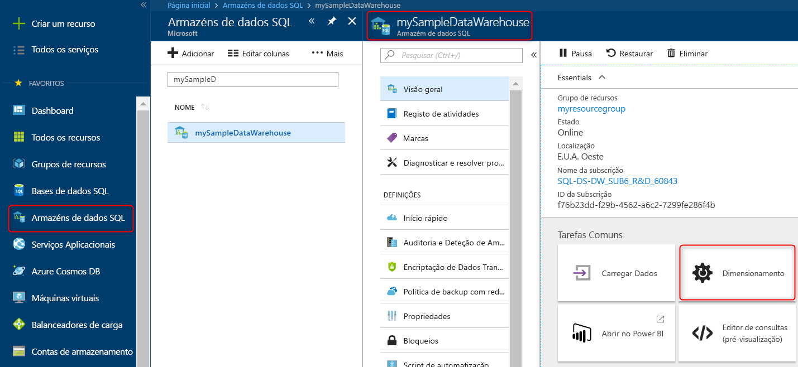

# Início rápido: Dimensionar de computação no Azure SQL Data Warehouse no portal do Azure

Dimensionar a computação no Azure SQL Data Warehouse no portal do Azure. [Aumentar horizontalmente computação](sql-data-warehouse-manage-compute-overview.md) para um melhor desempenho ou escala fazer uma cópia de computação para reduzir os custos. 

Se não tiver uma subscrição do Azure, crie uma conta [gratuita](https://azure.microsoft.com/free/) antes de começar.

## Iniciar sessão no portal do Azure

Inicie sessão no [portal do Azure](https://portal.azure.com/).

## Antes de começar

Pode dimensionar um armazém de dados que já tem, ou utilize [início rápido: criar e ligar - portal](create-data-warehouse-portal.md) para criar um armazém de dados com o nome **mySampleDataWarehouse**.  Este guia de introdução dimensiona **mySampleDataWarehouse**.

## Dimensionar computação

No SQL Data Warehouse, pode aumentar ou diminuir os recursos de computação ao ajustar unidades do data warehouse. O [criar e ligar - portal](create-data-warehouse-portal.md) criado **mySampleDataWarehouse** e inicializado-lo com 400 DWUs. Os seguintes passos ajustar as DWUs para **mySampleDataWarehouse**.

Para alterar as unidades de armazém de dados:

1. Clique em **bases de dados SQL** na página da esquerda do portal do Azure.
2. Selecione **mySampleDataWarehouse** do **bases de dados SQL** página. É aberto o armazém de dados.
3. Clique em **escala**.

    

2. No painel de escala, mova o controlo de deslize esquerda ou direita alterar a definição de DWU.

    

3. Clique em **Guardar**. É apresentada uma mensagem de confirmação. Clique em **Sim** para confirmar ou **não** para cancelar.

    

## Passos Seguintes
Agora que tem aprendeu como dimensionar a computação para o seu armazém de dados. Para saber mais sobre o Azure SQL Data Warehouse, avance para o tutorial para carregar dados.

> [!div class="nextstepaction"]
>[Carregar dados para o SQL Data Warehouse](load-data-from-azure-blob-storage-using-polybase.md)
