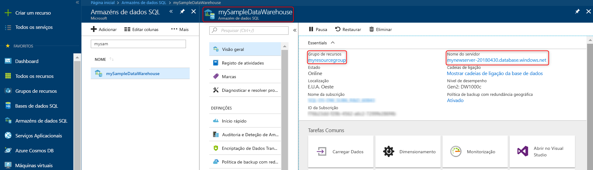

# <a name="quickstart-scale-compute-in-azure-sql-data-warehouse-in-powershell"></a>Início rápido: Dimensionar a computação do Azure SQL Data Warehouse no PowerShell

Dimensionar a computação do Azure SQL Data Warehouse no PowerShell. [Dimensionar a computação](sql-data-warehouse-manage-compute-overview.md) para um melhor desempenho ou a escalar a computação novamente para reduzir os custos.

Se não tiver uma subscrição do Azure, crie uma conta [gratuita](https://azure.microsoft.com/free/) antes de começar.

Este tutorial requer a versão 5.1.1 ou posterior do módulo do Azure PowerShell. Execute `Get-Module -ListAvailable AzureRM` para localizar a versão que tem atualmente. Se precisar de instalar ou atualizar, veja [Install Azure PowerShell module](/powershell/azure/azurerm/install-azurerm-ps)(Instalar o módulo do Azure PowerShell).

## <a name="before-you-begin"></a>Antes de começar

Este guia de introdução pressupõe que já tem um armazém de dados SQL que pode dimensionar. Se precisar de criar um, utilize [Criar e Ligar - Portal](create-data-warehouse-portal.md) para criar um armazém de dados chamado **mySampleDataWarehouse**.

## <a name="log-in-to-azure"></a>Iniciar sessão no Azure

Inicie a sessão na sua subscrição do Azure com o comando [Connect-AzureRmAccount](/powershell/module/azurerm.profile/connect-azurermaccount) e siga as instruções no ecrã.

```powershell
Connect-AzureRmAccount
```

Para ver a subscrição que está a utilizar, execute [Get-AzureRmSubscription](/powershell/module/azurerm.profile/get-azurermsubscription).

```powershell
Get-AzureRmSubscription
```

Se precisar de utilizar uma subscrição diferente que não o predefinido, execute [Set-AzureRmContext](/powershell/module/azurerm.profile/set-azurermcontext).

```powershell
Set-AzureRmContext -SubscriptionName "MySubscription"
```

## <a name="look-up-data-warehouse-information"></a>Procure pelas informações de armazém de dados

Localize o nome da base de dados, nome do servidor e grupo de recursos para o armazém de dados que planeia colocar em pausa e retomar.

Siga estes passos para encontrar as informações de localização para o seu armazém de dados.

1. Inicie sessão no [portal do Azure](https://portal.azure.com/).
2. Clique em **Armazéns de dados SQL** na página da esquerda do portal do Azure.
3. Selecione **mySampleDataWarehouse** na página de **Armazéns de dados SQL**. Esta ação abre o armazém de dados.

    

4. Escreva o nome do armazém de dados, que vai ser utilizado como o nome da base de dados. Recorde-se que um armazém de dados é um tipo de base de dados. Anote também o nome do servidor e do grupo de recursos. Vai utilizá-los nos comandos de pausa e retomar.
5. Se o servidor for foo.database.windows.net, utilize apenas a primeira parte como nome de servidor nos cmdlets do PowerShell. Na imagem anterior, o nome completo do servidor é newserver-20171113.database.windows.net. Utilizamos **newserver 20180430** como o nome do servidor no cmdlet do PowerShell.

## <a name="scale-compute"></a>Dimensionar computação

No SQL Data Warehouse, pode aumentar ou diminuir os recursos de computação ao ajustar unidades do data warehouse. O [Criar e Ligar - portal](create-data-warehouse-portal.md) criou **mySampleDataWarehouse** e inicializou-o com 400 DWUs. Os seguintes passos ajustam as DWUs para **mySampleDataWarehouse**.

Para alterar as unidades de armazém de dados, utilize o cmdlet do PowerShell [Set-AzureRmSqlDatabase](/powershell/module/azurerm.sql/set-azurermsqldatabase). O seguinte exemplo define as unidades de armazém de dados para DW300 para a base de dados **mySampleDataWarehouse**, que está alojada no grupo de Recursos **myResourceGroup** no servidor **mynewserver-20180430**.

```Powershell
Set-AzureRmSqlDatabase -ResourceGroupName "myResourceGroup" -DatabaseName "mySampleDataWarehouse" -ServerName "mynewserver-20171113" -RequestedServiceObjectiveName "DW300"
```

## <a name="check-data-warehouse-state"></a>Verifique o estado do armazém de dados

Para ver o estado atual do armazém de dados, pode utilizar o cmdlet [Get-AzureRmSqlDatabase](/powershell/module/azurerm.sql/get-azurermsqldatabase) do PowerShell. Este obtém o estado da base de dados **mySampleDataWarehouse** no ResourceGroup **myResourceGroup** e do servidor **mynewserver 20180430.database.windows.net**.

```powershell
$database = Get-AzureRmSqlDatabase -ResourceGroupName myResourceGroup -ServerName mynewserver-20171113 -DatabaseName mySampleDataWarehouse
$database
```

Que resulta em algo como:

```powershell
ResourceGroupName             : myResourceGroup
ServerName                    : mynewserver-20171113
DatabaseName                  : mySampleDataWarehouse
Location                      : North Europe
DatabaseId                    : 34d2ffb8-b70a-40b2-b4f9-b0a39833c974
Edition                       : DataWarehouse
CollationName                 : SQL_Latin1_General_CP1_CI_AS
CatalogCollation              :
MaxSizeBytes                  : 263882790666240
Status                        : Online
CreationDate                  : 11/20/2017 9:18:12 PM
CurrentServiceObjectiveId     : 284f1aff-fee7-4d3b-a211-5b8ebdd28fea
CurrentServiceObjectiveName   : DW300
RequestedServiceObjectiveId   : 284f1aff-fee7-4d3b-a211-5b8ebdd28fea
RequestedServiceObjectiveName :
ElasticPoolName               :
EarliestRestoreDate           :
Tags                          :
ResourceId                    : /subscriptions/xxxxxxxx-xxxx-xxxx-xxxx-xxxxxxxxxxxx/
                                resourceGroups/myResourceGroup/providers/Microsoft.Sql/servers/mynewserver-20171113/databases/mySampleDataWarehouse
CreateMode                    :
ReadScale                     : Disabled
ZoneRedundant                 : False
```

Pode ver o **Estado** da base de dados na saída. Neste caso, pode ver que esta base de dados está online.  Quando executar este comando, deve receber um valor de Estado de Online, A Colocar em Pausa, A Retomar, A Dimensionar ou Em Pausa.

Para ver o estado por si só, utilize o seguinte comando:

```powershell
$database | Select-Object DatabaseName,Status
```

## <a name="next-steps"></a>Passos Seguintes
Agora já aprendeu como dimensionar a computação para o seu armazém de dados. Para saber mais sobre o Azure SQL Data Warehouse, avance para o tutorial para carregar dados.

> [!div class="nextstepaction"]
>[Carregar dados para o SQL Data Warehouse](load-data-from-azure-blob-storage-using-polybase.md)
