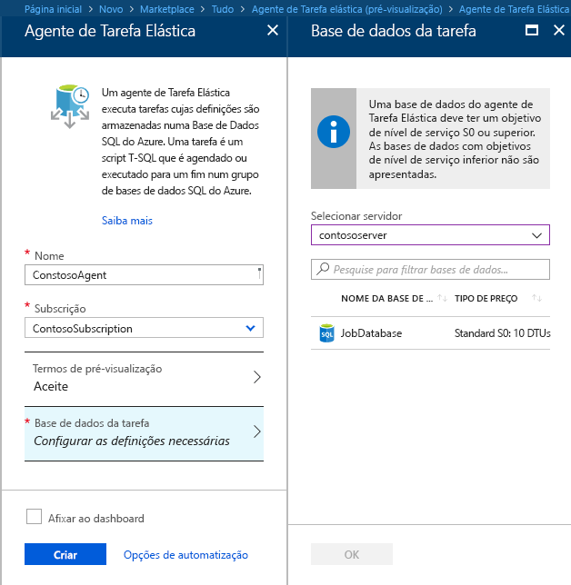
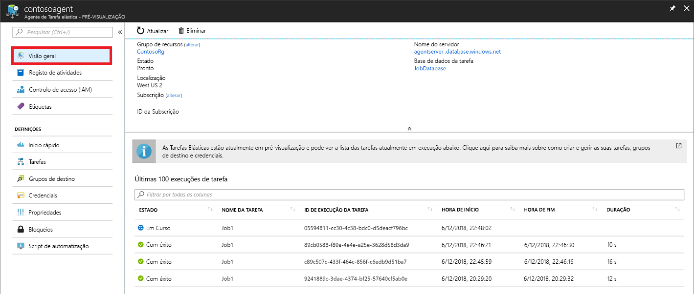
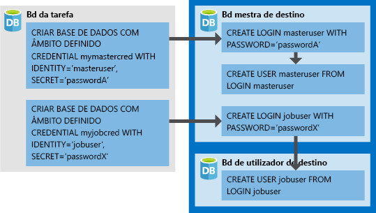

# <a name="manage-groups-of-databases-with-elastic-database-jobs"></a>Gerir grupos de bases de dados com Tarefas de Base de Dados Elástica

As **Tarefas de Base de Dados Elástica** permitem executar um ou mais scripts T-SQL em paralelo, num grande número de bases de dados, com base num agendamento ou a pedido.

**Executar tarefas em qualquer combinação de bases de dados**: uma ou mais bases de dados individuais, todas as bases de dados num servidor, todas as bases de dados num conjunto elástico, ou shardmap, com a flexibilidade adicional para incluir ou excluir qualquer base de dados específica. **As tarefas podem ser executadas em vários servidores, vários conjuntos e podem até ser executadas em bases de dados em subscrições diferentes.** Os servidores e os conjuntos são dinamicamente enumerados em runtime, para que as tarefas sejam executadas em todas as bases de dados que existem no grupo de destino no momento da execução.

A imagem seguinte mostra um agente de tarefa a executar tarefas nos diferentes tipos de grupos de destino:


## <a name="why-use-elastic-jobs"></a>Porquê utilizar tarefas elásticas?

### <a name="manage-many-databases"></a>Gerir muitas bases de dados

- Agende tarefas administrativas para serem executadas todos os dias da semana, depois do horário normal de trabalho, etc.
- Implemente alterações de esquema, gestão de credenciais, recolha de dados de desempenho ou recolha de telemetria do inquilino (cliente). Atualize dados de referência (informações comuns em todas as bases de dados).
- Reconstrua índices para melhorar o desempenho das consultas. Configure tarefas para serem executadas numa coleção de bases de dados recorrentemente, como, por exemplo, fora das horas de ponta.
- Recolha os resultados da consulta a partir de um conjunto de bases de dados numa tabela central de forma contínua. As consultas de desempenho podem ser continuamente executadas e configuradas para acionar tarefas adicionais para serem executadas.

### <a name="collect-data-for-reporting"></a>Recolher dados para relatórios

- Agregue dados a partir de uma coleção de bases de dados SQL do Azure numa tabela de destino única.
- Execute consultas de processamento de dados de execução mais longa num grande conjunto de bases de dados, por exemplo, a coleção de telemetria de cliente. Os resultados são recolhidos para uma tabela de destino única para análise adicional.

### <a name="reduce-overhead"></a>Reduzir o overhead

- Normalmente, tem de ligar a cada base de dados de forma independente para executar instruções Transact-SQL ou para realizar outras tarefas administrativas. Uma tarefa processa a tarefa de início de sessão em cada base de dados no grupo de destino. Também pode definir, manter e persistir os scripts Transact-SQL para serem executados num grupo de bases de dados SQL do Azure.

### <a name="accounting"></a>Contabilidade

- As tarefas registam o estado de execução para cada base de dados. Também obtém a repetição automática quando ocorrem falhas.

### <a name="flexibility"></a>Flexibilidade

- Defina grupos personalizados de bases de dados SQL do Azure e defina agendamentos para executar uma tarefa.


## <a name="elastic-job-components"></a>Componentes de Tarefa Elástica

|Componente  | Descrição (abaixo da tabela encontram-se detalhes adicionais) |
|---------|---------|
|[**Agente de Tarefa Elástica**](#elastic-job-agent) |  O recurso do Azure que cria para executar e gerir tarefas.   |
|[**Base de dados da tarefa**](#job-database)    |    Uma base de dados SQL do Azure que o agente de tarefa utiliza para armazenar dados relacionados com a tarefa, definições de tarefas, etc.      |
|[**Grupo de destino**](#target-group)      |  O conjunto de servidores, conjuntos, bases de dados e mapas de shard no qual executar uma tarefa.       |
|[**Tarefa**](#job)  |  Uma tarefa é uma unidade de trabalho composta por um ou mais [passos de tarefa](#job-step). Os passos de tarefa especificam o script T-SQL a executar, bem como outros detalhes necessários para executar o script.  |


### <a name="elastic-job-agent"></a>Agente de Tarefa Elástica

Um agente de Tarefa Elástica é o recurso do Azure para criar, executar e gerir tarefas. O agente de Tarefa Elástica é um recurso do Azure que o utilizador cria no portal (o [PowerShell](elastic-jobs-powershell.md) e o REST também são suportados). 

A criação de um **agente de Tarefa Elástica** requer uma base de dados SQL existente. O agente configura esta base de dados existente como a [*Base de dados da tarefa*](#job-database).

O agente de Tarefa Elástica é gratuito. A base de dados da tarefa é faturada à mesma tarifa de qualquer base de dados SQL.

### <a name="job-database"></a>Base de dados da tarefa

A *Base de dados da tarefa* serve para definir tarefas e controlar o estado e o histórico de execuções de tarefas. A *Base de dados da tarefa* também serve para armazenar metadados de agente, registos, resultados, definições de tarefas e também contém muitos procedimentos armazenados úteis, bem como outros objetos de base de dados, para criar, executar e gerir tarefas com T-SQL.

Para a pré-visualização atual, é necessária uma base de dados SQL do Azure (S0 ou superior) para criar um agente de Tarefa Elástica.

A *Base de dados da tarefa* não tem literalmente de ser nova, mas deve ser uma S0 limpa e vazia ou uma camada de serviço superior. A camada de serviço recomendada da *Base de dados da tarefa* é S1 ou superior, mas depende realmente das necessidades de desempenho das suas tarefas: número de passos de tarefa, quantas vezes e a frequência com que as tarefas são executadas. Por exemplo, uma base de dados S0 poderá ser suficiente para um agente de tarefa que executa poucas tarefas por hora, mas se executar uma tarefa a cada minuto, poderá não ser suficientemente eficaz e uma camada de serviço superior poderá ser melhor.


#### <a name="job-database-permissions"></a>Permissões da base de dados da tarefa

Durante a criação do agente de tarefa, um esquema, tabelas e uma função chamada *jobs_reader* são criados na *Base de dados da tarefa*. A função é criada com as seguintes permissões e tem como objetivo dar aos administradores um melhor controlo de acesso para a monitorização de tarefas:


|Nome da função  |permissões de esquema "jobs"  |permissões de esquema "jobs_internal"  |
|---------|---------|---------|
|**jobs_reader**     |    SELECIONAR     |    Nenhuma     |

> [!IMPORTANT]
> Considere as implicações de segurança antes de conceder acesso à *Base de dados da tarefa* como um administrador da base de dados. Um utilizador mal intencionado com permissões para criar ou editar tarefas podia criar ou editar uma tarefa que utilize uma credencial armazenada para ligar a uma base de dados sob o controlo do utilizador mal intencionado, o que podia permitir que o utilizador mal intencionado determinasse a palavra-passe da credencial.


### <a name="target-group"></a>Grupo de destino

Um *grupo de destino* define o conjunto de bases de dados onde será executado um passo de tarefa. Um grupo de destino pode conter qualquer número e combinação dos seguintes elementos:

- **Servidor SQL do Azure** - se for especificado um servidor, todas as bases de dados que existem no servidor no momento da execução da tarefa fazem parte do grupo. A credencial da base de dados mestra tem de ser fornecida para que o grupo possa ser enumerado e atualizado antes da execução da tarefa.
- **Conjunto elástico** - se for especificado um conjunto elástico, todas as bases de dados que estão no conjunto elástico no momento da execução da tarefa fazem parte do grupo. Tal como acontece para um servidor, a credencial da base de dados mestra tem de ser fornecida para que o grupo possa ser atualizado antes da execução da tarefa.
- **Base de dados individual** - especifique uma ou mais bases de dados individuais para fazerem parte do grupo.
- **Shardmap** - bases de dados de um shardmap.

> [!TIP]
> No momento da execução da tarefa, a *enumeração dinâmica* reavalia o conjunto de bases de dados nos grupos de destino que incluem servidores ou conjuntos. A enumeração dinâmica garante que as **tarefas são executadas em todas as bases de dados que existem no servidor ou conjunto no momento da execução da tarefa**. A reavaliação da lista de bases de dados em runtime é especificamente útil para cenários em que a associação do conjunto ou do servidor muda com frequência.


Os conjuntos e as bases de dados individuais podem ser especificados como estando incluídos ou excluídos do grupo. Isto permite criar um grupo de destino com qualquer combinação de bases de dados. Por exemplo, pode adicionar um servidor a um grupo de destino, mas excluir bases de dados específicas num conjunto elástico (ou excluir um conjunto completo).

Um grupo de destino pode incluir bases de dados em várias subscrições e em várias regiões. Lembre-se que as execuções em várias regiões têm uma latência superior do que as execuções na mesma região.


### <a name="job"></a>Tarefa

Uma *tarefa* é uma unidade de trabalho que é executada com base num agendamento ou como uma tarefa ocasional. Uma tarefa é composta por um ou mais *passos de tarefa*.

#### <a name="job-step"></a>Passo de tarefa

Cada passo de tarefa especifica um script T-SQL a executar, um ou mais grupos de destino onde executar o script T-SQL e as credenciais de que o agente de tarefa precisa para ligar à base de dados de destino. Cada passo de tarefa tem políticas de repetição e de tempo limite personalizáveis e, opcionalmente, pode especificar parâmetros de saída.

#### <a name="job-output"></a>Saída da tarefa

O resultado dos passos de uma tarefa em cada base de dados de destino é registado pormenorizadamente e a saída do script pode ser capturada numa tabela especificada. Pode especificar uma base de dados para guardar os dados devolvidos por uma tarefa.

#### <a name="job-history"></a>Histórico de tarefas

Histórico de execuções da tarefa é armazenado na *Base de dados da tarefa*. Uma tarefa de limpeza do sistema remove o histórico de execuções com mais de 45 dias. Para remover o histórico com menos de 45 dias, chame o procedimento armazenado **sp_purge_history** na *Base de dados da tarefa*.

## <a name="workflow-to-create-configure-and-manage-jobs"></a>Fluxo de trabalho para criar, configurar e gerir tarefas

### <a name="create-and-configure-the-agent"></a>Criar e configurar o agente

1. Crie ou identifique uma S0 vazia ou uma base de dados SQL superior. Esta será utilizada como a *Base de dados da tarefa* durante a criação do agente de Tarefa Elástica.
2. Crie um agente de Tarefa Elástica no [portal](https://portal.azure.com/#create/Microsoft.SQLElasticJobAgent) ou com o [PowerShell](elastic-jobs-powershell.md#create-the-elastic-job-agent).

   

### <a name="create-run-and-manage-jobs"></a>Criar, executar e gerir tarefas

1. Crie uma credencial para a execução da tarefa na *Base de dados da tarefa* com o [PowerShell](elastic-jobs-powershell.md#create-job-credentials-so-that-jobs-can-execute-scripts-on-its-targets) ou o [T-SQL](elastic-jobs-tsql.md#create-a-credential-for-job-execution).
2. Defina o grupo de destino (as bases de dados nas quais pretende executar a tarefa) com o [PowerShell](elastic-jobs-powershell.md#define-the-target-databases-you-want-to-run-the-job-against) ou o [T-SQL](elastic-jobs-tsql.md#create-a-target-group-servers).
3. Crie uma credencial do agente de tarefa em cada base de dados onde a tarefa será executada [(adicione o utilizador (ou função) a cada base de dados no grupo)](https://docs.microsoft.com/azure/sql-database/sql-database-control-access). Por consultar um exemplo, veja o [tutorial do PowerShell](elastic-jobs-powershell.md#create-job-credentials-so-that-jobs-can-execute-scripts-on-its-targets).
4. Crie uma tarefa com o [PowerShell](elastic-jobs-powershell.md#create-a-job) ou o [T-SQL](elastic-jobs-tsql.md#deploy-new-schema-to-many-databases).
5. Adicione passos de tarefa com o [PowerShell](elastic-jobs-powershell.md#create-a-job-step) ou o [T-SQL](elastic-jobs-tsql.md#deploy-new-schema-to-many-databases).
6. Execute uma tarefa com o [PowerShell](elastic-jobs-powershell.md#run-the-job) ou o [T-SQL](elastic-jobs-tsql.md#begin-ad-hoc-execution-of-a-job).
7. Monitorize o estado de execução da tarefa com o portal, o [PowerShell](elastic-jobs-powershell.md#monitor-status-of-job-executions) ou o [T-SQL](elastic-jobs-tsql.md#monitor-job-execution-status).

   

## <a name="credentials-for-running-jobs"></a>Credenciais para executar tarefas

As tarefas utilizam [credenciais com âmbito de base de dados](/sql/t-sql/statements/create-database-scoped-credential-transact-sql) para ligar às bases de dados especificadas pelo grupo de destino após a execução. Se um grupo de destino contiver servidores ou conjuntos, estas credenciais com âmbito de base de dados são utilizadas para ligar à base de dados mestra para enumerar as bases de dados disponíveis.

A configuração das credenciais corretas para executar uma tarefa pode ser um pouco confusa, por isso, tenha em consideração os seguintes pontos:

- As credenciais com âmbito de base de dados têm de ser criadas na *Base de dados da tarefa*.
- **Todas as bases de dados de destino precisam de um início de sessão com [permissões suficientes](https://docs.microsoft.com/sql/relational-databases/security/permissions-database-engine) para a tarefa ser concluída com êxito** (jobuser no diagrama abaixo).
- As credenciais devem ser reutilizadas em todas as tarefas e as palavras-passe das credenciais são encriptadas e protegidas contra utilizadores que têm acesso só de leitura aos objetos da tarefa.

A imagem seguinte tem como objetivo ajudar a compreender e a configurar as credenciais de tarefa corretas. **Lembre-se de criar o utilizador em todas as bases de dados (todas as *dbs de utilizador de destino*) onde a tarefa tenha de ser executada**.



## <a name="security-best-practices"></a>Melhores práticas de segurança

Algumas considerações sobre melhores práticas para trabalhar com Tarefas Elásticas:

- Limite a utilização das APIs a pessoas de confiança.
- As credenciais devem ter o mínimo de privilégios necessários para executar o passo de tarefa. Para obter mais informações, veja [Autorização e Permissões do SQL Server](https://docs.microsoft.com/dotnet/framework/data/adonet/sql/authorization-and-permissions-in-sql-server).
- Quando utilizar um membro do grupo de destino do servidor e/ou conjunto, é altamente recomendado criar uma credencial separada com direitos na base de dados mestra para ver/listar bases de dados, que serve para expandir as listas de bases de dados dos servidores e/ou conjuntos antes da execução da tarefa.


## <a name="agent-performance-capacity-and-limitations"></a>Desempenho, capacidade e limitações do agente

As Tarefas Elásticas utilizam recursos de computação mínimos enquanto aguardam pela conclusão de tarefas de execução longa.

Dependendo do tamanho do grupo de destino de bases de dados e do tempo de execução pretendido para uma tarefa (número de trabalhos em simultâneo), o agente requer diferentes quantidades de computação e desempenho da *Base de dados da tarefa* (quando mais destinos houver e quanto maior for o número de tarefas, maior é a quantidade de computação necessária).

Atualmente, a pré-visualização está limitada a 100 tarefas simultâneas.

### <a name="prevent-jobs-from-reducing-target-database-performance"></a>Impedir que as tarefas reduzam o desempenho da base de dados de destino

Para garantir que os recursos não são sobrecarregados quando executar tarefas nas bases de dados num conjunto elástico de SQL, as tarefas podem ser configuradas para limitar o número de bases de dados nas quais uma tarefa pode ser executada ao mesmo tempo.

##  <a name="differences-between-elastic-jobs-and-sql-server-agent"></a>Diferenças entre as Tarefas Elásticas e o SQL Server Agent

É importante salientar algumas diferenças entre o SQL Server Agent (disponível no local e como parte da Instância Gerida da Base de Dados SQL) e o agente de Tarefa Elástica da Base de Dados SQL do Azure (agora disponível para a Base de Dados SQL e o SQL Data Warehouse).


|  |Tarefas Elásticas  |SQL Server Agent |
|---------|---------|---------|
|Âmbito     |  Qualquer número de Bases de Dados SQL do Azure e/ou de armazéns de dados na mesma cloud do Azure que o agente de tarefa. Os destinos podem estar em diferentes servidores lógicos, subscrições e/ou regiões. <br><br>Os grupos de destino podem ser compostos por bases de dados individuais ou armazéns de dados, ou por todas as bases de dados num servidor, conjunto, ou por todos os shardmaps (enumerados dinamicamente durante a execução da tarefa). | Qualquer base de dados individual na mesma instância do SQL Server do que o agente SQL. |
|APIs e Ferramentas suportadas     |  Portal, PowerShell, T-SQL, Azure Resource Manager      |   T-SQL, SQL Server Management Studio (SSMS)     |


## <a name="best-practices-for-creating-jobs"></a>Melhores práticas para criar tarefas

### <a name="idempotent-scripts"></a>Scripts Idempotent
Os scripts T-SQL de uma tarefa têm de ser [idempotent](https://en.wikipedia.org/wiki/Idempotence). **Idempotent** significa que, se o script executado com êxito e for executado novamente, ocorre o mesmo resultado. Um script pode falhar devido a problemas de rede transitória. Nesse caso, a tarefa repetirá automaticamente a execução do script um número predefinido de vezes antes de desistir. Um script idempotent tem o mesmo resultado mesmo que seja executado com êxito duas vezes (ou mais).

Uma tática simples consiste em testar a existência de um objeto antes de o criar.


```sql
IF NOT EXIST (some_object)
    -- Create the object
    -- If it exists, drop the object before recreating it.
```

Da mesma forma, um script tem de poder ser executado com êxito ao testar logicamente e refutar as condições que encontrar.


## <a name="next-steps"></a>Passos seguintes

- [Criar e gerir Tarefas Elásticas com o PowerShell](elastic-jobs-powershell.md)
- [Criar e gerir Tarefas Elásticas com o Transact-SQL (T-SQL)](elastic-jobs-tsql.md)