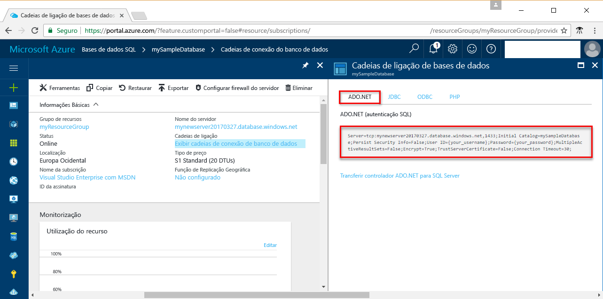

# <a name="use-net-core-c-to-query-an-azure-sql-database"></a>Utilizar o .NET Core (C#) para consultar uma base de dados SQL do Azure

Este início rápido demonstra como utilizar o [.NET Core](https://www.microsoft.com/net/) em Windows/Linux/macOS para criar um programa C# para ligar a uma base de dados SQL do Azure e como utilizar instruções Transact-SQL para consultar dados.

## <a name="prerequisites"></a>Pré-requisitos

Para concluir este início rápido, certifique-se de que tem o seguinte:

[!INCLUDE [prerequisites-create-db](../../includes/sql-database-connect-query-prerequisites-create-db-includes.md)]

- Uma [regra de firewall ao nível do servidor](sql-database-get-started-portal-firewall.md) para o endereço IP público do computador que utilizar para este início rápido.

- Já instalou o [.NET Core para o seu sistema operativo](https://www.microsoft.com/net/core). 

## <a name="sql-server-connection-information"></a>Informações de ligação do servidor SQL

[!INCLUDE [prerequisites-server-connection-info](../../includes/sql-database-connect-query-prerequisites-server-connection-info-includes.md)]

#### <a name="for-adonet"></a>Para ADO.NET

1. Continue ao clicar em **Mostrar cadeias de ligação da base de dados**.

2. Reveja a cadeia de ligação **ADO.NET** completa.

    

> [!IMPORTANT]
> Tem de ter implementada uma regra de firewall para o endereço IP público do computador no qual executar este tutorial. Se estiver num computador diferente ou tiver um endereço IP público diferente, crie uma [regra de firewall ao nível do servidor com o portal do Azure](sql-database-get-started-portal-firewall.md). 
>
  
## <a name="create-a-new-net-project"></a>Criar um novo projeto .NET

1. Abra uma linha de comandos e crie uma pasta com o nome *sqltest*. Navegue até à pasta que criou e execute o seguinte comando:

    ```
    dotnet new console
    ```

2. Abra ***sqltest.csproj*** com o seu editor de texto favorito e adicione System.Data.SqlClient como uma dependência, com o seguinte código:

    ```xml
    <ItemGroup>
        <PackageReference Include="System.Data.SqlClient" Version="4.4.0" />
    </ItemGroup>
    ```

## <a name="insert-code-to-query-sql-database"></a>Inserir código para consultar a base de dados do SQL

1. No seu ambiente de desenvolvimento ou editor de texto favorito, abra **Program.cs**

2. Substitua os conteúdos pelo código seguinte e adicione os valores corretos para o seu servidor, a sua base de dados, o seu utilizador e a sua palavra-passe.

```csharp
using System;
using System.Data.SqlClient;
using System.Text;

namespace sqltest
{
    class Program
    {
        static void Main(string[] args)
        {
            try 
            { 
                SqlConnectionStringBuilder builder = new SqlConnectionStringBuilder();
                builder.DataSource = "your_server.database.windows.net"; 
                builder.UserID = "your_user";            
                builder.Password = "your_password";     
                builder.InitialCatalog = "your_database";

                using (SqlConnection connection = new SqlConnection(builder.ConnectionString))
                {
                    Console.WriteLine("\nQuery data example:");
                    Console.WriteLine("=========================================\n");
                    
                    connection.Open();       
                    StringBuilder sb = new StringBuilder();
                    sb.Append("SELECT TOP 20 pc.Name as CategoryName, p.name as ProductName ");
                    sb.Append("FROM [SalesLT].[ProductCategory] pc ");
                    sb.Append("JOIN [SalesLT].[Product] p ");
                    sb.Append("ON pc.productcategoryid = p.productcategoryid;");
                    String sql = sb.ToString();

                    using (SqlCommand command = new SqlCommand(sql, connection))
                    {
                        using (SqlDataReader reader = command.ExecuteReader())
                        {
                            while (reader.Read())
                            {
                                Console.WriteLine("{0} {1}", reader.GetString(0), reader.GetString(1));
                            }
                        }
                    }                    
                }
            }
            catch (SqlException e)
            {
                Console.WriteLine(e.ToString());
            }
            Console.ReadLine();
        }
    }
}
```

## <a name="run-the-code"></a>Executar o código

1. Na linha de comandos, execute os comandos seguintes:

   ```csharp
   dotnet restore
   dotnet run
   ```

2. Confirme que as 20 linhas superiores são devolvidas e, em seguida, feche a janela da aplicação.


## <a name="next-steps"></a>Passos seguintes

- [Introdução ao .NET Core com Windows/Linux/macOS, utilizando a linha de comandos](/dotnet/core/tutorials/using-with-xplat-cli).
- Aprenda a [ligar e consultar uma base de dados SQL do Azure utilizando o .NET framework e o Visual Studio](sql-database-connect-query-dotnet-visual-studio.md).  
- Aprenda a [Criar a sua primeira base de dados SQL do Azure com o SSMS](sql-database-design-first-database.md) ou a [Criar a sua primeira base de dados SQL do Azure com o .NET](sql-database-design-first-database-csharp.md).
- Para obter mais informações sobre o .NET, veja a [Documentação .NET](https://docs.microsoft.com/dotnet/).
