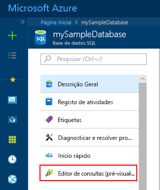
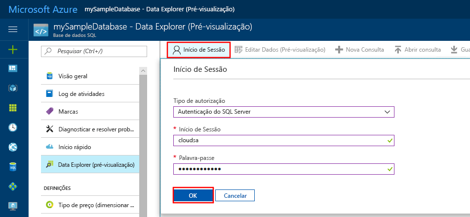
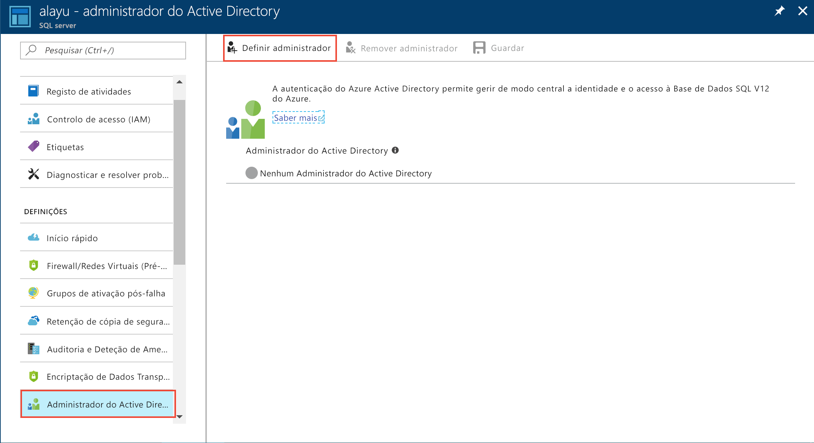
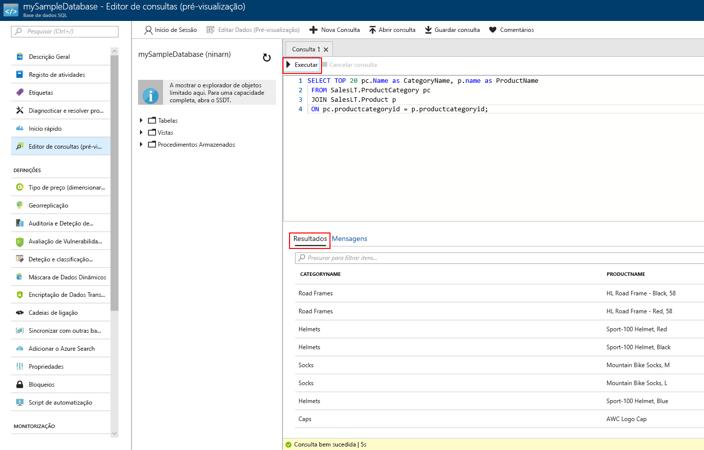

# <a name="quickstart-use-the-azure-portals-sql-query-editor-to-connect-and-query-data"></a>Início rápido: Utilize o editor de consultas SQL do portal do Azure para ligar e consultar dados

O editor de consultas SQL é uma ferramenta de navegador de portal do Azure, fornecendo uma forma fácil de executar consultas SQL na sua base de dados do Azure SQL ou o Azure SQL Data Warehouse. Neste início rápido, irá utilizar o editor de consultas para ligar a uma base de dados SQL e, em seguida, executar declarações de Transact-SQL para consultar, inserir, atualizar e eliminar dados.

## <a name="prerequisites"></a>Pré-requisitos

Para concluir este tutorial, precisa de:

[!INCLUDE [prerequisites-create-db](../../includes/sql-database-connect-query-prerequisites-create-db-includes.md)]

> [!NOTE]
> Certifique-se de que o **permitir acesso aos serviços do Azure** opção estiver definida como **ON** nas definições de firewall do SQL server. Esta opção dá ao acesso de editor de consulta SQL às suas bases de dados e armazéns de dados.

## <a name="sign-in-the-azure-portal"></a>Inicie sessão no portal do Azure

Inicie sessão no [portal do Azure](https://portal.azure.com/).

## <a name="connect-using-sql-authentication"></a>Ligar através da autenticação de SQL

1. Selecione **bases de dados SQL** no menu do lado esquerdo e, em seguida, selecione **mySampleDatabase**.

2. No menu da esquerda, localize e selecione **editor de consultas (pré-visualização)**. O **início de sessão** é apresentada a página.

    

3. Partir do **tipo de autorização** menu pendente, selecione **autenticação do SQL Server** e introduza o ID de utilizador e palavra-passe da conta de administrador de servidor utilizada para criar a base de dados.

     

4. Selecione **OK**.


## <a name="connect-using-azure-active-directory"></a>Ligar com o Azure Active Directory

Configurar um administrador do Active Directory (AD) permite-lhe utilizar uma identidade única para iniciar sessão no portal do Azure e base de dados SQL. Siga os passos abaixo para configurar um administrador do AD para o servidor SQL.

> [!NOTE]
* Contas de e-mail (por exemplo, outlook.com, gmail.com, yahoo.com e assim por diante) ainda não são suportadas como administradores do AD. Confirme que escolhe um utilizador criado nativamente no Azure AD, ou federado no Azure AD.
* Sessão de administrador do Azure AD não funciona com contas que têm a autenticação de 2 fatores ativada.

1. Selecione **todos os recursos** no menu esquerdo e, em seguida, selecione o seu SQL server.

2. Do seu SQL server **configurações** menu, selecione **administrador do Active Directory**.

3. A partir do AD admin página barra de ferramentas, selecione **definir administrador** e escolha o utilizador ou grupo como o administrador do AD.

    

4. A partir do AD admin página barra de ferramentas, selecione **guardar**.

5. Navegue para o **mySampleDatabase** da base de dados e, no menu esquerdo, selecione **editor de consultas (pré-visualização)**. O **início de sessão** é apresentada a página. Se for um administrador do AD, em seguida, no lado direito, em **do Active Directory início de sessão único**, é apresentada uma mensagem dizendo que tiver sido iniciado sessão. 
   
6. Selecione **OK**.


## <a name="view-data"></a>Ver dados

1. Quando estiver autenticado, cole o seguinte SQL editor de consultas para obter os 20 principais produtos por categoria.

   ```sql
    SELECT TOP 20 pc.Name as CategoryName, p.name as ProductName
    FROM SalesLT.ProductCategory pc
    JOIN SalesLT.Product p
    ON pc.productcategoryid = p.productcategoryid;
   ```

2. Na barra de ferramentas, selecione **execute** e, em seguida, reveja o resultado no **resultados** painel.



## <a name="insert-data"></a>Inserir dados

Execute o seguinte [inserir](https://msdn.microsoft.com/library/ms174335.aspx) instrução de Transact-SQL para adicionar um novo produto no `SalesLT.Product` tabela.

1. Substitua a consulta anterior este.

   ```sql
   INSERT INTO [SalesLT].[Product]
           ( [Name]
           , [ProductNumber]
           , [Color]
           , [ProductCategoryID]
           , [StandardCost]
           , [ListPrice]
           , [SellStartDate]
           )
     VALUES
           ('myNewProduct'
           ,123456789
           ,'NewColor'
           ,1
           ,100
           ,100
           ,GETDATE() );
   ```


2. Selecione **execute** para inserir uma nova linha no `Product` tabela. O **mensagens** painel apresenta **consulta foi concluída com êxito: Linhas afetadas: 1**.


## <a name="update-data"></a>Atualizar dados

Execute o seguinte [ATUALIZAÇÃO](https://msdn.microsoft.com/library/ms177523.aspx) instrução de Transact-SQL para modificar o seu novo produto.

1. Substitua a consulta anterior este.

   ```sql
   UPDATE [SalesLT].[Product]
   SET [ListPrice] = 125
   WHERE Name = 'myNewProduct';
   ```

2. Selecione **execute** para atualizar a linha especificada no `Product` tabela. O **mensagens** painel apresenta **consulta foi concluída com êxito: Linhas afetadas: 1**.

## <a name="delete-data"></a>Eliminar dados

Execute o seguinte [eliminar](https://msdn.microsoft.com/library/ms189835.aspx) instrução de Transact-SQL para remover o seu novo produto.

1. Substitua a consulta anterior este:

   ```sql
   DELETE FROM [SalesLT].[Product]
   WHERE Name = 'myNewProduct';
   ```

2. Selecione **execute** para eliminar a linha especificada no `Product` tabela. O **mensagens** painel apresenta **consulta foi concluída com êxito: Linhas afetadas: 1**.


## <a name="query-editor-considerations"></a>Considerações de editor de consulta

Existem alguns aspetos a saber ao trabalhar com o editor de consultas.

* Não é possível utilizar o editor de consultas para consultar bancos de dados do SQL server numa rede Virtual.

* Prima F5 atualiza a página do editor de consultas e qualquer consulta a ser executada é perdida.

* Editor de consultas não suporta a ligação para o `master` base de dados.

* Há um tempo limite de 5 minutos para execução da consulta.

* O editor de consultas suporta apenas a projeção cilíndrica para tipos de dados de geografia.

* Não há suporte para IntelliSense para vistas e tabelas de base de dados. No entanto, o editor suporta preenchimento automático nomes que já tenham sido escritos.


## <a name="next-steps"></a>Passos Seguintes

Para saber mais sobre o Transact-SQL suportado em bases de dados SQL do Azure, veja [diferenças de resolução de Transact-SQL durante a migração para a base de dados SQL](sql-database-transact-sql-information.md).
