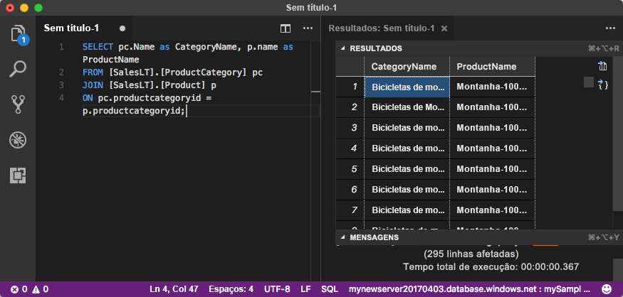

# <a name="quickstart-use-visual-studio-code-to-connect-and-query-an-azure-sql-database"></a>Início rápido: Utilizar o Visual Studio Code para ligar e consultar uma base de dados do SQL do Azure

[Visual Studio Code](https://code.visualstudio.com/docs) é um editor de código gráfico para Linux, macOS e Windows. Ele suporta extensões, incluindo o [extensão mssql](https://aka.ms/mssql-marketplace) para consultar o Microsoft SQL Server, base de dados do Azure SQL e SQL Data Warehouse. Neste início rápido, irá utilizar o Visual Studio Code para ligar a uma base de dados SQL do Azure e, em seguida, executar declarações de Transact-SQL para consultar, inserir, atualizar e eliminar dados.

## <a name="prerequisites"></a>Pré-requisitos

- Uma base de dados SQL do Azure. Pode utilizar um dos seguintes inícios rápidos para criar e, em seguida, configurar uma base de dados na base de dados do Azure SQL:

  || Base de dados individual | Instância gerida |
  |:--- |:--- |:---|
  | Criar| [Portal](sql-database-single-database-get-started.md) | [Portal](sql-database-managed-instance-get-started.md) |
  || [CLI](scripts/sql-database-create-and-configure-database-cli.md) | [CLI](https://medium.com/azure-sqldb-managed-instance/working-with-sql-managed-instance-using-azure-cli-611795fe0b44) |
  || [PowerShell](scripts/sql-database-create-and-configure-database-powershell.md) | [PowerShell](https://blogs.msdn.microsoft.com/sqlserverstorageengine/2018/06/27/quick-start-script-create-azure-sql-managed-instance-using-powershell/) |
  | Configurar | [regra de firewall do IP ao nível do servidor](sql-database-server-level-firewall-rule.md)| [Conectividade a partir de uma VM](sql-database-managed-instance-configure-vm.md)|
  |||[Conectividade no local do](sql-database-managed-instance-configure-p2s.md)
  |Carregar dados|A Adventure Works carregados por início rápido|[Restaurar a Wide World Importers](sql-database-managed-instance-get-started-restore.md)
  |||Restaure ou importar Adventure Works no [BACPAC](sql-database-import.md) ficheiro [github](https://github.com/Microsoft/sql-server-samples/tree/master/samples/databases/adventure-works)|
  |||

  > [!IMPORTANT]
  > Os scripts neste artigo são escritos para utilizar a base de dados do Adventure Works. Com uma instância gerida, tem de importar a base de dados do Adventure Works para uma base de dados de instância ou modificar os scripts neste artigo para utilizar a base de dados do Wide World Importers.

## <a name="install-visual-studio-code"></a>Instalar Visual Studio Code

Certifique-se de que instalou a versão mais recente [Visual Studio Code](https://code.visualstudio.com/Download) e carregar o [extensão mssql](https://aka.ms/mssql-marketplace). Para obter orientações sobre como instalar a extensão do mssql, consulte [instalar o VS Code](https://docs.microsoft.com/sql/linux/sql-server-linux-develop-use-vscode#install-and-start-visual-studio-code) e [mssql para Visual Studio Code ](https://marketplace.visualstudio.com/items?itemName=ms-mssql.mssql).

## <a name="configure-visual-studio-code"></a>Configurar o Visual Studio Code 

### <a name="mac-os"></a>**Mac OS**

Para macOS, tem de instalar o OpenSSL, que é um pré-requisito para .net fundamentais dessa extensão do mssql utiliza. Abra o terminal e introduza os comandos seguintes para instalar **brew**, **OpenSSL**. 

```bash
ruby -e "$(curl -fsSL https://raw.githubusercontent.com/Homebrew/install/master/install)"
brew update
brew install openssl
mkdir -p /usr/local/lib
ln -s /usr/local/opt/openssl/lib/libcrypto.1.0.0.dylib /usr/local/lib/
ln -s /usr/local/opt/openssl/lib/libssl.1.0.0.dylib /usr/local/lib/
```

### <a name="linux-ubuntu"></a>**Linux (Ubuntu)**

Nenhuma configuração especial necessária.

### <a name="windows"></a>**Windows**

Nenhuma configuração especial necessária.

## <a name="get-sql-server-connection-information"></a>Obter as informações de ligação do SQL server

Obtenha as informações de ligação que tem de se ligar à base de dados SQL do Azure. Precisará do nome de servidor completamente qualificado ou nome de anfitrião, nome de base de dados e informações de início de sessão para os próximos procedimentos.

1. Inicie sessão no [portal do Azure](https://portal.azure.com/).

2. Navegue para o **bases de dados SQL** ou **instâncias geridas SQL** página.

3. Sobre o **descrição geral** , reveja o nome de servidor completamente qualificado junto a **nome do servidor de** para uma base de dados ou o servidor completamente qualificado nome junto a **anfitrião** para um instância. Para copiar o nome do servidor ou o nome de anfitrião, coloque o cursor sobre ela e selecione o **cópia** ícone.

## <a name="set-language-mode-to-sql"></a>Definir modo do idioma para SQL

No Visual Studio Code, defina o modo de idioma para **SQL** para ativar comandos mssql e IntelliSense T-SQL.

1. Abra uma nova janela do Visual Studio Code. 

2. Prima **Ctrl**+**N**. É aberto um novo ficheiro de texto sem formatação. 

3. Selecione **texto sem formatação** no canto inferior direito da barra de estado.

4. Na **selecionar modo de idioma** menu pendente que se abre, selecione **SQL**. 

## <a name="connect-to-your-database"></a>Ligar à base de dados

Utilize o Visual Studio Code para estabelecer uma ligação ao servidor da Base de Dados SQL do Azure.

> [!IMPORTANT]
> Antes de continuar, certifique-se de que tem o seu servidor e informações prontas início de sessão. Assim que começar a introduzir as informações de perfil de ligação, se alterar o foco do Visual Studio Code, terá de reiniciar a criação do perfil.
>

1. No Visual Studio Code, prima **Ctrl + Shift + P** (ou **F1**) para abrir a paleta de comandos.

2. Selecione **MS SQL: ligar** e escolha **Enter**.

3. Selecione **criar perfil de ligação**.

4. Siga as instruções para especificar propriedades de ligação do novo perfil. Depois de especificar cada valor, escolha **Enter** para continuar. 

   | Propriedade       | Valor sugerido | Descrição |
   | ------------ | ------------------ | ------------------------------------------------- | 
   | **Nome do servidor** | O nome de servidor completamente qualificado | Algo como: **mynewserver20170313.database.windows.net**. |
   | **Nome da base de dados** | mySampleDatabase | A base de dados para ligar a. |
   | **Autenticação** | Início de sessão do SQL| Este tutorial utiliza a autenticação do SQL. |
   | **Nome de utilizador** | Nome de utilizador | O nome de utilizador da conta de administrador do servidor utilizado para criar o servidor. |
   | **Palavra-passe (Início de Sessão do SQL)** | Palavra-passe | A palavra-passe da conta de administrador do servidor utilizada para criar o servidor. |
   | **Guardar Palavra-passe?** | Sim ou Não | Selecione **Sim** se não pretender que introduzir a palavra-passe de cada vez. |
   | **Introduza um nome para este perfil** | Nome de um perfil, como **mySampleProfile** | Um perfil guardado acelera a sua ligação nos inícios de sessão subsequentes. | 

   Se tiver êxito, é apresentada uma notificação a indicar o seu perfil é criado e ligado.

## <a name="query-data"></a>Consultar dados

Execute o seguinte [SELECIONE](https://msdn.microsoft.com/library/ms189499.aspx) instrução de Transact-SQL para consultar os 20 melhores produtos por categoria.

1. Na janela do editor, cole a seguinte consulta SQL.

   ```sql
   SELECT pc.Name as CategoryName, p.name as ProductName
   FROM [SalesLT].[ProductCategory] pc
   JOIN [SalesLT].[Product] p
   ON pc.productcategoryid = p.productcategoryid;
   ```

2. Prima **Ctrl**+**Shift**+**i** para executar a consulta e exibir os resultados da `Product` e `ProductCategory` tabelas.

    

## <a name="insert-data"></a>Inserir dados

Execute o seguinte [inserir](https://msdn.microsoft.com/library/ms174335.aspx) instrução de Transact-SQL para adicionar um novo produto para o `SalesLT.Product` tabela.

1. Substitua a consulta anterior este.

   ```sql
   INSERT INTO [SalesLT].[Product]
           ( [Name]
           , [ProductNumber]
           , [Color]
           , [ProductCategoryID]
           , [StandardCost]
           , [ListPrice]
           , [SellStartDate]
           )
     VALUES
           ('myNewProduct'
           ,123456789
           ,'NewColor'
           ,1
           ,100
           ,100
           ,GETDATE() );
   ```

2. Prima **Ctrl**+**Shift**+**i** para inserir uma nova linha no `Product` tabela.

## <a name="update-data"></a>Atualizar dados

Execute o seguinte [ATUALIZAR](https://msdn.microsoft.com/library/ms177523.aspx) instrução de Transact-SQL para atualizar o produto foi adicionado.

1. Substitua a consulta anterior este:

   ```sql
   UPDATE [SalesLT].[Product]
   SET [ListPrice] = 125
   WHERE Name = 'myNewProduct';
   ```

2. Prima **Ctrl**+**Shift**+**i** para atualizar a linha especificada no `Product` tabela.

## <a name="delete-data"></a>Eliminar dados

Execute o seguinte [eliminar](https://docs.microsoft.com/sql/t-sql/statements/delete-transact-sql) instrução de Transact-SQL para remover o produto novo.

1. Substitua a consulta anterior este:

   ```sql
   DELETE FROM [SalesLT].[Product]
   WHERE Name = 'myNewProduct';
   ```

2. Prima **Ctrl**+**Shift**+**i** para eliminar a linha especificada no `Product` tabela.

## <a name="next-steps"></a>Passos Seguintes

- Para ligar e consultar com o SQL Server Management Studio, consulte [início rápido: Utilizar o SQL Server Management Studio para ligar a um banco de dados do Azure SQL e consulta dados](sql-database-connect-query-ssms.md).
- Para ligar e consultar com o portal do Azure, veja [início rápido: Utilize o editor de consultas SQL no portal do Azure para ligar e consultar dados](sql-database-connect-query-portal.md).
- Para ler um artigo de revista MSDN sobre a utilização do Visual Studio Code, veja [Create a database IDE with MSSQL extension blog post](https://msdn.microsoft.com/magazine/mt809115) (Criar uma base de dados IDE com a mensagem de blogue de extensão do MSSQL).
