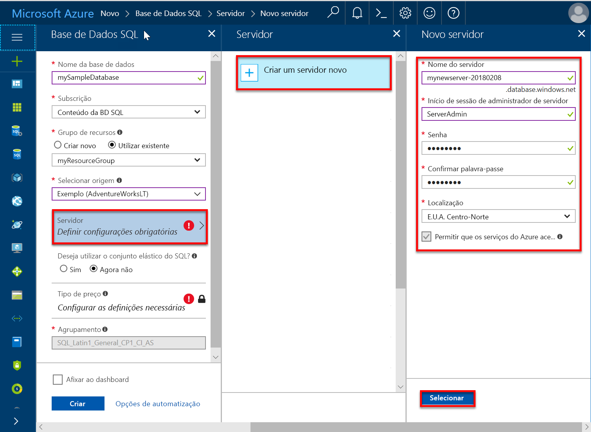
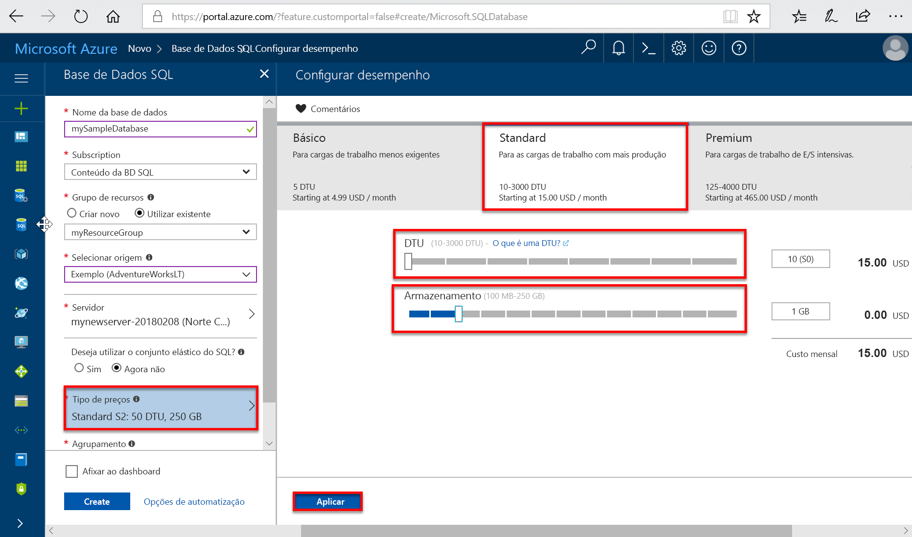
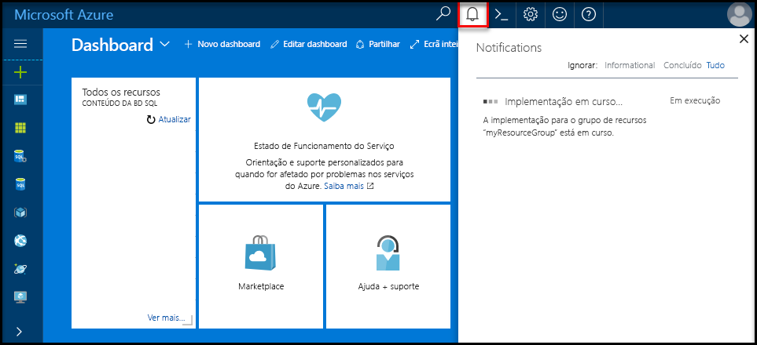
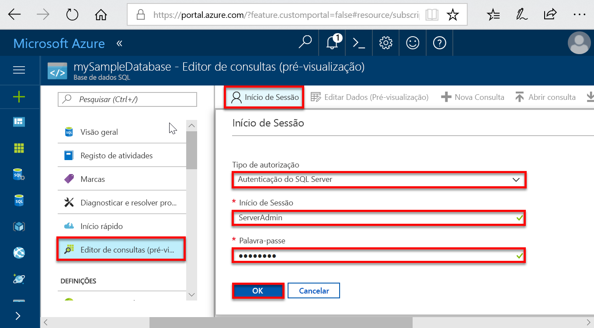
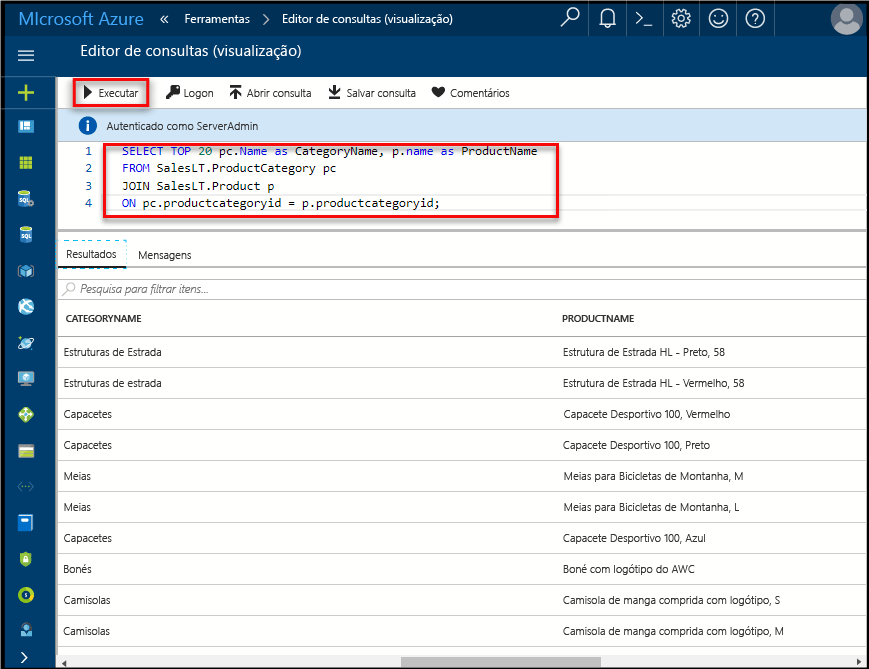

# <a name="quickstart-create-an-azure-sql-database-in-the-azure-portal"></a>Início rápido: Criar uma base de dados SQL do Azure no portal do Azure

Base de dados SQL do Azure é um *da base de dados-como-serviço* que lhe permite executar e dimensionar bases de dados de SQL Server altamente disponíveis na cloud. Este guia de introdução mostra-lhe como começar a utilizar ao criar e, em seguida, consultar uma base de dados SQL do Azure no portal do Azure. 

Se não tiver uma subscrição do Azure, [crie uma conta gratuita](https://azure.microsoft.com/free/) antes de começar.

Para obter todos os passos neste início rápido, inicie sessão para o [portal do Azure](https://portal.azure.com/).

## <a name="create-a-sql-database"></a>Criar uma base de dados SQL

Uma base de dados SQL do Azure tem um conjunto definido de [recursos de computação e armazenamento](sql-database-service-tiers-dtu.md). Criar a base de dados num [servidor lógico da SQL Database do Azure](sql-database-features.md) dentro de um [grupo de recursos do Azure](../azure-resource-manager/resource-group-overview.md).

Para criar uma base de dados do SQL que contém os dados de exemplo do AdventureWorksLT:

1. Selecione **Criar um recurso** no canto superior esquerdo do portal do Azure.
   
1. Selecione **bases de dados**e, em seguida, selecione **base de dados SQL**.
   
1. Na **base de dados SQL** de formulário, escreva ou selecione os seguintes valores: 
   
   - **Nome da base de dados**: Tipo *mySampleDatabase*.
   - **Subscrição**: Lista pendente e selecione a subscrição correta, se não aparecer.  
   - **Grupo de recursos**: Selecione **criar novo**, tipo *myResourceGroup*e selecione **OK**. 
   - **Selecionar origem**: Lista pendente e selecione **Sample (AdventureWorksLT)**. 
   
   >[!IMPORTANT]
   >Certifique-se de selecionar o **Sample (AdventureWorksLT)** dados, pelo que pode seguir este e outros guias de introdução do Azure SQL Database que usam esses dados. 
   
   
   
1. Selecione **servidor**e, em seguida, selecione **criar um novo servidor**. 
   
1. Na **novo servidor** de formulário, escreva ou selecione os seguintes valores: 
   
   - **Nome do servidor**: Tipo *mysqlserver*.
   - **Início de sessão de administrador de servidor**: Tipo *azureuser*. 
   - **palavra-passe**: Tipo *Azure1234567*. 
   - **Confirmar palavra-passe**: Escreva novamente a palavra-passe.
   - **Localização**: Lista pendente e selecione qualquer localização válida.  
   
   >[!IMPORTANT]
   >Lembre-se ou grave o início de sessão de administrador de servidor e a palavra-passe, pelo que pode iniciar sessão para o servidor e bases de dados para esse e outros guias de introdução. Se se esquecer da sua palavra-passe ou o início de sessão, pode obter o nome de início de sessão ou redefinir a senha sobre o **do SQL server** página. Para abrir o **do SQL server** , selecione o nome do servidor na base de dados **descrição geral** página após a criação da base de dados.
   
1. Selecione **selecione**.
   
   
   
1. Sobre o **base de dados SQL** formulário, selecione **escalão de preço**. Explore a quantidade de DTUs e de armazenamento disponível para cada camada de serviço.
   
   >[!NOTE]
   >Este início rápido utiliza a [modelo de compra baseado em DTU](sql-database-service-tiers-dtu.md), mas o [modelo de compra baseado em vCore](sql-database-service-tiers-vcore.md) também está disponível.
   
   >[!NOTE]
   >Mais de 1 TB de armazenamento no escalão Premium está atualmente disponível em todas as regiões, exceto: Norte do Reino Unido, oeste dos E.U.A., South2 do Reino Unido, leste da China, USDoDCentral, Alemanha Central, Sudoeste do USDoDEast, US Gov, E.U.A. centro-sul do Governo Central, Alemanha Nordeste, Norte da China e Gov E.U. a leste. Noutras regiões, o armazenamento máximo no escalão Premium está limitado a 1 TB. Para obter mais informações, consulte [limitações atuais do P11-P15](sql-database-dtu-resource-limits-single-databases.md#single-database-limitations-of-p11-and-p15-when-the-maximum-size-greater-than-1-tb).  
   
1. Neste início rápido, selecione o **padrão** camada de serviço e, em seguida, utilize o controlo de deslize para selecionar **10 DTUs (S0)** e **1** GB de armazenamento.
   
1. Selecione **Aplicar**.  
   
   
   
1. Sobre o **base de dados SQL** formulário, selecione **criar** para implementar e aprovisionar o grupo de recursos, o servidor e a base de dados. 
   
   Implementação demora alguns minutos. Pode selecionar **notificações** na barra de ferramentas para monitorizar o progresso da implementação.

   

## <a name="query-the-sql-database"></a>Consultar a base de dados SQL

Agora que criou uma base de dados SQL do Azure, utilize a ferramenta de consulta incorporada no portal do Azure para ligar à base de dados e consultar os dados.

1. Sobre o **base de dados SQL** page de sua base de dados, selecione **editor de consultas (pré-visualização)** no menu à esquerda. 
   
   
   
1. Escreva as informações de logon e selecione **OK**.
   
1. Introduza a seguinte consulta no **editor de consultas** painel.
   
   ```sql
   SELECT TOP 20 pc.Name as CategoryName, p.name as ProductName
   FROM SalesLT.ProductCategory pc
   JOIN SalesLT.Product p
   ON pc.productcategoryid = p.productcategoryid;
   ```
   
1. Selecione **execute**e, em seguida, reveja os resultados da consulta no **resultados** painel.

   
   
1. Fechar o **editor de consultas** página e selecione **OK** quando lhe for pedido para eliminar as edições não guardadas.

## <a name="clean-up-resources"></a>Limpar recursos

Manter este grupo de recursos, o SQL server e a base de dados SQL, se pretender aceder à [próximos passos](#next-steps) e saiba como ligar e consultar a base de dados utilizando um número de métodos diferentes. 

Quando tiver terminado com estes recursos, pode eliminá-los da seguinte forma:

1. No menu à esquerda no portal do Azure, selecione **grupos de recursos**e, em seguida, selecione **myResourceGroup**.
1. Na página do grupo de recursos, selecione **eliminar grupo de recursos**. 
1. Tipo *myResourceGroup* no campo e, em seguida, selecione **eliminar**.

## <a name="next-steps"></a>Passos Seguintes

- Tem de criar uma regra de firewall ao nível do servidor para ligar à base de dados SQL do Azure a partir de ferramentas remotas ou no local. Para obter mais informações, consulte [criar uma regra de firewall ao nível do servidor](sql-database-get-started-portal-firewall.md).
- Depois de criar uma regra de firewall ao nível do servidor, poderá [ligar e consultar](sql-database-connect-query.md) sua base de dados com várias ferramentas diferentes e linguagens. 
  - [Ligar e consultar com o SQL Server Management Studio](sql-database-connect-query-ssms.md)
  - [Ligar e consultar com o Azure Data Studio](https://docs.microsoft.com/sql/azure-data-studio/quickstart-sql-database?toc=/azure/sql-database/toc.json)
- Para criar bases de dados SQL do Azure com a CLI do Azure, veja [amostras de CLI do Azure](sql-database-cli-samples.md).
- Para criar bases de dados SQL do Azure com o Azure PowerShell, veja [exemplos do Azure PowerShell](sql-database-powershell-samples.md).
