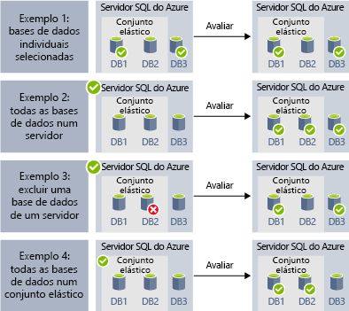
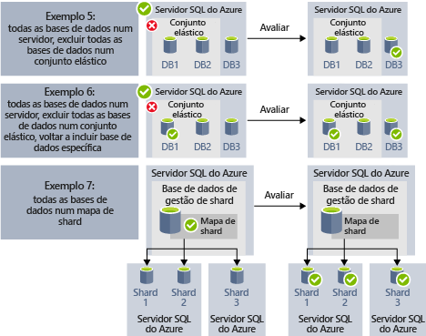

# <a name="automate-management-tasks-using-database-jobs"></a>Automatizar tarefas de gestão com tarefas de base de dados

Base de dados SQL do Azure permite-lhe criar e agendar tarefas que podem ser executadas periodicamente numa ou mais bases de dados para executar consultas de T-SQL e executar tarefas de manutenção. Cada tarefa regista o estado de execução e repete também automaticamente as operações de caso de qualquer falha.
Pode definir a base de dados de destino ou grupos de bases de dados SQL do Azure onde o trabalho será executado e também definir agendas para executar uma tarefa.
Uma tarefa processa a tarefa de início de sessão em base de dados de destino. Também define, manter e manter scripts do Transact-SQL a ser executado num grupo de bases de dados SQL do Azure.

Existem vários cenários em que poderá utilizar a automatização de tarefas:

- Automatizar tarefas de gestão e, em seguida, agendar a execução de cada dia da semana, após horas, etc.
  - Implemente alterações de esquema, gestão de credenciais, recolha de dados de desempenho ou recolha de telemetria do inquilino (cliente).
  - Atualização de dados de referência (informações comuns nas bases de dados), carregar dados do armazenamento de Blobs do Azure.
  - Reconstrua índices para melhorar o desempenho das consultas. Configure tarefas para serem executadas numa coleção de bases de dados recorrentemente, como, por exemplo, fora das horas de ponta.
  - Recolha os resultados da consulta a partir de um conjunto de bases de dados numa tabela central de forma contínua. As consultas de desempenho podem ser continuamente executadas e configuradas para acionar tarefas adicionais para serem executadas.
- Recolher dados para relatórios
  - Agregue dados a partir de uma coleção de bases de dados SQL do Azure numa tabela de destino única.
  - Execute consultas de processamento de dados de execução mais longa num grande conjunto de bases de dados, por exemplo, a coleção de telemetria de cliente. Os resultados são recolhidos para uma tabela de destino única para análise adicional.
- Movimentos de dados
 - Criar tarefas que replicar as alterações feitas em seus bancos de dados para outras bases de dados ou recolher atualizações feitas em bancos de dados remotos e aplicar alterações no banco de dados.
 - Crie tarefas que carregar os dados de ou para as bases de dados com o SQL Server Integration Services (SSIS).

As seguintes tecnologias de agendamento de tarefa estão disponíveis na base de dados do Azure SQL:

- **Tarefas de agente do SQL** são agendamento de tarefas de SQL Server clássica e testadas à exaustão componente que está disponível na instância gerida. Tarefas de agente do SQL não estão disponíveis em bases de dados individuais.
- **Tarefas de base de dados elásticas** são o serviço de agendamento de tarefas de mensagens em fila que executa tarefas personalizadas num ou muitos dados de SQL do Azure.

Vale a pena observar algumas diferenças entre o SQL Agent (disponível no local e como parte da instância gerida do SQL da base de dados) e o agente de tarefa elástica da base de dados (disponível para bases de dados individuais na base de dados SQL do Azure e bases de dados no SQL Data Warehouse).

|  |Tarefas Elásticas  |SQL Agent |
|---------|---------|---------|
|Âmbito     |  Qualquer número de bases de dados SQL do Azure e/ou de armazéns de dados na mesma cloud do Azure que o agente de tarefa. Destinos podem estar em diferentes base de dados SQL servidores, subscrições e/ou regiões. <br><br>Os grupos de destino podem ser compostos por bases de dados individuais ou armazéns de dados, ou por todas as bases de dados num servidor, conjunto ou por shardmaps (enumerados dinamicamente durante a execução da tarefa). | Qualquer base de dados individual na mesma instância do SQL Server como o SQL agent. |
|APIs e Ferramentas suportadas     |  Portal, PowerShell, T-SQL, Azure Resource Manager      |   T-SQL, SQL Server Management Studio (SSMS)     |

## <a name="sql-agent-jobs"></a>Tarefas de agente do SQL

Tarefas de agente do SQL são especificado série de scripts T-SQL na base de dados. Utilize tarefas para definir uma tarefa administrativa que pode ser executada uma ou mais vezes e monitorizada para o êxito ou falha.
Uma tarefa pode ser executada num servidor local ou em vários servidores remotos. Tarefa de agente do SQL é um componente do motor de base de dados interno, que é executado dentro do serviço de instância gerida.
Existem diversos conceitos principais nas tarefas de agente do SQL:

- **Passos da tarefa** conjunto de uma ou mais passos que deve ser executado dentro da tarefa. Para cada passo da tarefa pode definir a estratégia de repetição e a ação que deve acontecer se o passo da tarefa for concluída com êxito ou falha.
- **Agendas** definir quando a tarefa deve ser executada.
- **Notificações** permitem-lhe definir regras que serão utilizadas para notificar operadores por meio de mensagens de correio eletrónico, uma vez concluída a tarefa.

### <a name="job-steps"></a>Passos da tarefa

Passos de tarefa de agente do SQL são seqüências de ações que o SQL Agent deve ser executado. Cada etapa tem o passo seguinte que deve ser executado se a etapa for concluída com êxito ou falha, o número de tentativas num caso de falha.
Agente do SQL permite-lhe criar tipos diferentes dos passos da tarefa, como o passo da tarefa de Transact-SQL que executa um único lote de Transact-SQL na base de dados ou passos de comando/PowerShell de SO que podem executar o script personalizado do SO, passos da tarefa SSIS permitem-lhe carregar dados com o runtime do SSIS, ou [replicação](sql-database-managed-instance-transactional-replication.md) passos que podem publicar as alterações de sua base de dados para outras bases de dados.

[Replicação transacional](sql-database-managed-instance-transactional-replication.md) é uma funcionalidade do motor de base de dados que lhe permite publicar as alterações feitas numa ou várias tabelas numa base de dados e publicar/distribuí-los a um conjunto de bases de dados do subscritor. A publicação das alterações é implementada com os seguintes tipos de passo de tarefa de agente do SQL:

- Leitor de log de transações.
- Instantâneo.
- Distribuidor.

Outros tipos de passos da tarefa não são atualmente suportados, incluindo:

- Passo de tarefa de replicação de intercalação não é suportado.
- Leitor de fila não é suportada.
- Não é suportado do Analysis Services

### <a name="job-schedules"></a>Agendas de tarefas

Uma agenda Especifica quando é executada uma tarefa. Mais do que uma tarefa pode ser executado na agenda mesmo e, mais do que uma agenda pode aplicar a mesma tarefa.
Uma agenda pode definir as seguintes condições para a hora quando uma tarefa é executada:

- Sempre que a instância é reiniciada (ou quando é iniciado de agente do SQL Server). Tarefa é ativada após cada ativação pós-falha.
- Uma vez, numa data e hora específicas, que é útil para execução atrasada de alguma tarefa.
- Numa agenda periódica.

> [!Note]
> Instância gerida atualmente não permite-lhe iniciar uma tarefa quando a instância é "inativa".

### <a name="job-notifications"></a>Notificações de trabalho

Trabalhos do SQL Agent, pode receber notificações quando a tarefa é concluída com êxito ou falharam. Pode receber o e-mail de notificação por e-mail.

Em primeiro lugar, terá de configurar a conta de e-mail que será utilizada para enviar as notificações de e-mail e atribua a conta para o perfil de e-mail denominado `AzureManagedInstance_dbmail_profile`, conforme mostrado no exemplo a seguir:

```sql
-- Create a Database Mail account
EXECUTE msdb.dbo.sysmail_add_account_sp
    @account_name = 'SQL Agent Account',
    @description = 'Mail account for Azure SQL Managed Instance SQL Agent system.',
    @email_address = '$(loginEmail)',
    @display_name = 'SQL Agent Account',
    @mailserver_name = '$(mailserver)' ,
    @username = '$(loginEmail)' ,  
    @password = '$(password)' 

-- Create a Database Mail profile
EXECUTE msdb.dbo.sysmail_add_profile_sp
    @profile_name = 'AzureManagedInstance_dbmail_profile',
    @description = 'E-mail profile used for messages sent by Managed Instance SQL Agent.' ;

-- Add the account to the profile
EXECUTE msdb.dbo.sysmail_add_profileaccount_sp
    @profile_name = 'AzureManagedInstance_dbmail_profile',
    @account_name = 'SQL Agent Account',
    @sequence_number = 1;
```

Também terá de ativar o correio de base de dados na instância gerida:

```sql
GO
EXEC sp_configure 'show advanced options', 1;  
GO  
RECONFIGURE;  
GO  
EXEC sp_configure 'Database Mail XPs', 1;  
GO  
RECONFIGURE 
```

Pode notificar operador que algo aconteceu com as tarefas de agente do SQL. Um operador define informações de contacto de uma pessoa responsável pela manutenção de uma ou mais instâncias geridas. Algum tempo, as responsabilidades de operador são atribuídas a um indivíduo.
Em sistemas com vários servidores SQL ou a instância gerida, muitas pessoas podem partilhar responsabilidades de operador. Um operador não contém informações de segurança e não define uma entidade de segurança.

Pode criar operadores usando o script SSMS ou Transact-SQL mostrado no exemplo a seguir:

```sql
EXEC msdb.dbo.sp_add_operator 
    @name=N'Mihajlo Pupun', 
        @enabled=1, 
        @email_address=N'mihajlo.pupin@contoso.com'
```

Pode modificar todas as tarefas e atribuir o operador que será notificado por e-mail, se a tarefa for concluída, falha ou for concluída com êxito utilizando o SSMS ou o seguinte script de Transact-SQL:

```sql
EXEC msdb.dbo.sp_update_job @job_name=N'Load data using SSIS', 
        @notify_level_email=3,                        -- Options are: 1 on succeed, 2 on failure, 3 on complete
        @notify_email_operator_name=N'Mihajlo Pupun'
```

### <a name="sql-agent-job-limitations"></a>Limitações de tarefa de agente do SQL

Alguns dos recursos do SQL Agent que estão disponíveis no SQL Server não são suportados na instância gerida:
- Definições do agente do SQL são só de leitura. Procedimento `sp_set_agent_properties` não é suportado na instância gerida.
- Agente de ativação/desativação não é atualmente suportada na instância gerida. Agente do SQL está sempre em execução.
- Notificações são parcialmente suportadas
 - Não é suportada paginação.
 - NetSend não é suportada.
 - Alertas não ainda não são suportados.
- Proxies não são suportados.
- Registo de eventos não é suportado.

Para obter informações sobre o agente do SQL Server, consulte [SQL Server Agent](https://docs.microsoft.com/sql/ssms/agent/sql-server-agent).

## <a name="elastic-database-jobs"></a>Tarefas de Base de Dados Elástica

As **Tarefas de Base de Dados Elástica** permitem executar um ou mais scripts T-SQL em paralelo, num grande número de bases de dados, com base num agendamento ou a pedido.

**Executar tarefas em qualquer combinação de bases de dados**: uma ou mais bases de dados individuais, todas as bases de dados num servidor, todas as bases de dados num conjunto elástico, ou shardmap, com a flexibilidade adicional para incluir ou excluir qualquer base de dados específica. **As tarefas podem ser executadas em vários servidores, vários conjuntos e podem até ser executadas em bases de dados em subscrições diferentes.** Os servidores e os conjuntos são dinamicamente enumerados em runtime, para que as tarefas sejam executadas em todas as bases de dados que existem no grupo de destino no momento da execução.

A imagem seguinte mostra um agente de tarefa a executar tarefas nos diferentes tipos de grupos de destino:


### <a name="elastic-job-components"></a>Componentes de Tarefa Elástica

|Componente  | Descrição (abaixo da tabela encontram-se detalhes adicionais) |
|---------|---------|
|[**Agente de Tarefa Elástica**](#elastic-job-agent) |  O recurso do Azure que cria para executar e gerir tarefas.   |
|[**Base de dados da tarefa**](#job-database)    |    Uma base de dados SQL do Azure que o agente de tarefa utiliza para armazenar dados relacionados com a tarefa, definições de tarefas, etc.      |
|[**Grupo de destino**](#target-group)      |  O conjunto de servidores, conjuntos, bases de dados e mapas de shard no qual executar uma tarefa.       |
|[**Tarefa**](#job)  |  Uma tarefa é uma unidade de trabalho que é composto por um ou mais [passos da tarefa](#job-step). Os passos de tarefa especificam o script T-SQL a executar, bem como outros detalhes necessários para executar o script.  |


#### <a name="elastic-job-agent"></a>Agente de Tarefa Elástica

Um agente de Tarefa Elástica é o recurso do Azure para criar, executar e gerir tarefas. O agente de Tarefa Elástica é um recurso do Azure que o utilizador cria no portal (o [PowerShell](elastic-jobs-powershell.md) e o REST também são suportados). 

A criação de um **agente de Tarefa Elástica** requer uma base de dados SQL existente. O agente configura esta base de dados existente como a [*Base de dados da tarefa*](#job-database).

O agente de Tarefa Elástica é gratuito. A base de dados da tarefa é faturada à mesma tarifa de qualquer base de dados SQL.

#### <a name="job-database"></a>Base de dados da tarefa

A *Base de dados da tarefa* serve para definir tarefas e controlar o estado e o histórico de execuções de tarefas. A *Base de dados da tarefa* também serve para armazenar metadados de agente, registos, resultados, definições de tarefas e também contém muitos procedimentos armazenados úteis, bem como outros objetos de base de dados, para criar, executar e gerir tarefas com T-SQL.

Para a pré-visualização atual, é necessária uma base de dados SQL do Azure (S0 ou superior) para criar um agente de Tarefa Elástica.

A *Base de dados da tarefa* não tem literalmente de ser nova, mas deve ser uma S0 limpa e vazia ou uma camada de serviço superior. A camada de serviço recomendada da *Base de dados da tarefa* é S1 ou superior, mas depende realmente das necessidades de desempenho das suas tarefas: número de passos de tarefa, quantas vezes e a frequência com que as tarefas são executadas. Por exemplo, uma base de dados S0 poderá ser suficiente para um agente de tarefa que executa poucas tarefas por hora, mas se executar uma tarefa a cada minuto, poderá não ser suficientemente eficaz e uma camada de serviço superior poderá ser melhor.


##### <a name="job-database-permissions"></a>Permissões da base de dados da tarefa

Durante a criação do agente de tarefa, um esquema, tabelas e uma função chamada *jobs_reader* são criados na *Base de dados da tarefa*. A função é criada com as seguintes permissões e tem como objetivo dar aos administradores um melhor controlo de acesso para a monitorização de tarefas:


|Nome da função  |permissões de esquema "jobs"  |permissões de esquema "jobs_internal"  |
|---------|---------|---------|
|**jobs_reader**     |    SELECIONAR     |    Nenhuma     |

> [!IMPORTANT]
> Considere as implicações de segurança antes de conceder acesso à *Base de dados da tarefa* como um administrador da base de dados. Um utilizador mal intencionado com permissões para criar ou editar tarefas podia criar ou editar uma tarefa que utilize uma credencial armazenada para ligar a uma base de dados sob o controlo do utilizador mal intencionado, o que podia permitir que o utilizador mal intencionado determinasse a palavra-passe da credencial.


#### <a name="target-group"></a>Grupo de destino

Um *grupo de destino* define o conjunto de bases de dados onde será executado um passo de tarefa. Um grupo de destino pode conter qualquer número e combinação dos seguintes elementos:

- **Servidor de base de dados SQL** -se um servidor for especificado, todas as bases de dados que existem no servidor no momento da execução da tarefa são parte do grupo. A credencial da base de dados mestra tem de ser fornecida para que o grupo possa ser enumerado e atualizado antes da execução da tarefa.
- **Conjunto elástico** - se for especificado um conjunto elástico, todas as bases de dados que estão no conjunto elástico no momento da execução da tarefa fazem parte do grupo. Tal como acontece para um servidor, a credencial da base de dados mestra tem de ser fornecida para que o grupo possa ser atualizado antes da execução da tarefa.
- **Base de dados individual** - especifique uma ou mais bases de dados individuais para fazerem parte do grupo.
- **Shardmap** - bases de dados de um shardmap.

> [!TIP]
> No momento da execução da tarefa, a *enumeração dinâmica* reavalia o conjunto de bases de dados nos grupos de destino que incluem servidores ou conjuntos. A enumeração dinâmica garante que as **tarefas são executadas em todas as bases de dados que existem no servidor ou conjunto no momento da execução da tarefa**. A reavaliação da lista de bases de dados em runtime é especificamente útil para cenários em que a associação do conjunto ou do servidor muda com frequência.

Os conjuntos e as bases de dados individuais podem ser especificados como estando incluídos ou excluídos do grupo. Isto permite criar um grupo de destino com qualquer combinação de bases de dados. Por exemplo, pode adicionar um servidor a um grupo de destino, mas excluir bases de dados específicas num conjunto elástico (ou excluir um conjunto completo).

Um grupo de destino pode incluir bases de dados em várias subscrições e em várias regiões. Lembre-se que as execuções em várias regiões têm uma latência superior do que as execuções na mesma região.

Os seguintes exemplos mostram como as diferentes definições de grupo de destino são enumeradas dinamicamente no momento da execução do trabalho, de modo a determinar as bases de dados que o trabalho vai executar:



O **Exemplo 1** mostra um grupo de destino que consiste numa lista de bases de dados individuais. Quando é executado um passo do trabalho com este grupo de destino, a ação desse passo será executada em cada uma dessas bases de dados.<br>
O **Exemplo 2** mostra um grupo de destino que contém um Azure SQL Server como o destino. Quando é executado um passo do trabalho com este grupo de destino, o servidor é enumerado dinamicamente para determinar a lista de bases de dados que estão, atualmente, no servidor. A ação desse passo será executada em cada uma dessas bases de dados.<br>
O **Exemplo 3** mostra um grupo de destino semelhante ao do *Exemplo 2*, mas é excluída especificamente uma base de dados individual. A ação do passo deste trabalho *não* será executada na base de dados excluída.<br>
O **Exemplo 4** mostra um grupo de destino que contém um conjunto elástico como o destino. Tal como no *Exemplo 2*, o conjunto será enumerado dinamicamente no momento de execução do trabalho para determinar a lista de bases de dados contidas no mesmo.
<br><br>




O **Exemplo 5** e o **Exemplo 6** mostram cenários avançados em que o Azure SQL Server, os conjuntos elásticos e as bases de dados podem ser combinados com regras de inclusão e exclusão.<br>
O **Exemplo 7** mostra que as partições num mapa de partições também podem ser avaliadas no momento de execução do trabalho.

#### <a name="job"></a>Tarefa

Uma *tarefa* é uma unidade de trabalho que é executada com base num agendamento ou como uma tarefa ocasional. Uma tarefa é composta por um ou mais *passos de tarefa*.

##### <a name="job-step"></a>Passo de tarefa

Cada passo de tarefa especifica um script T-SQL a executar, um ou mais grupos de destino onde executar o script T-SQL e as credenciais de que o agente de tarefa precisa para ligar à base de dados de destino. Cada passo de tarefa tem políticas de repetição e de tempo limite personalizáveis e, opcionalmente, pode especificar parâmetros de saída.

#### <a name="job-output"></a>Saída da tarefa

O resultado dos passos de uma tarefa em cada base de dados de destino é registado pormenorizadamente e a saída do script pode ser capturada numa tabela especificada. Pode especificar uma base de dados para guardar os dados devolvidos por uma tarefa.

#### <a name="job-history"></a>Histórico de tarefas

Histórico de execuções da tarefa é armazenado na *Base de dados da tarefa*. Uma tarefa de limpeza do sistema remove o histórico de execuções com mais de 45 dias. Para remover o histórico com menos de 45 dias, chame o procedimento armazenado **sp_purge_history** na *Base de dados da tarefa*.

### <a name="agent-performance-capacity-and-limitations"></a>Desempenho, capacidade e limitações do agente

As Tarefas Elásticas utilizam recursos de computação mínimos enquanto aguardam pela conclusão de tarefas de execução longa.

Dependendo do tamanho do grupo de destino de bases de dados e do tempo de execução pretendido para uma tarefa (número de trabalhos em simultâneo), o agente requer diferentes quantidades de computação e desempenho da *Base de dados da tarefa* (quando mais destinos houver e quanto maior for o número de tarefas, maior é a quantidade de computação necessária).

Atualmente, a pré-visualização está limitada a 100 tarefas simultâneas.

#### <a name="prevent-jobs-from-reducing-target-database-performance"></a>Impedir que as tarefas reduzam o desempenho da base de dados de destino

Para garantir que os recursos não são sobrecarregados quando executar tarefas nas bases de dados num conjunto elástico de SQL, as tarefas podem ser configuradas para limitar o número de bases de dados nas quais uma tarefa pode ser executada ao mesmo tempo.

## <a name="next-steps"></a>Passos Seguintes

- [O que é o agente do SQL Server](https://docs.microsoft.com/sql/ssms/agent/sql-server-agent) 
- [Como criar e gerir conjuntos elásticos](elastic-jobs-overview.md) 
- [Criar e gerir Tarefas Elásticas com o PowerShell](elastic-jobs-powershell.md) 
- [Criar e gerir Tarefas Elásticas com o Transact-SQL (T-SQL)](elastic-jobs-tsql.md) 
