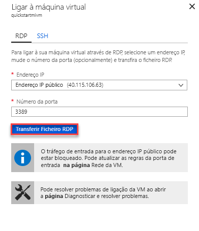

# Início rápido: Configurar a VM do Azure para ligar a uma instância de gerida de base de dados do Azure SQL

Este guia de introdução mostra-lhe como configurar uma máquina virtual do Azure para ligar a uma instância de gerida de base de dados do Azure SQL com o SQL Server Management Studio (SSMS). Para um início rápido que mostra como ligar a partir de um computador de cliente no local através de uma ligação ponto a site, consulte [configurar uma ligação ponto a site](sql-database-managed-instance-configure-p2s.md) 

## Pré-requisitos

Este início rápido utiliza os recursos criados [criar uma instância gerida](sql-database-managed-instance-get-started.md) como ponto de partida.

## Iniciar sessão no portal do Azure

Inicie sessão no [portal do Azure](https://portal.azure.com/).

## Criar uma nova sub-rede na VNet de instância gerida

Os passos seguintes criam uma nova sub-rede na VNet de instância gerida para que uma máquina virtual do Azure podem ligar-se à instância gerida. A sub-rede de instância gerida é dedicada a instâncias geridas. Não é possível criar outros recursos, como máquinas virtuais do Azure, nessa sub-rede. 

1. Abra o grupo de recursos para a instância gerida que criou no [criar uma instância gerida](sql-database-managed-instance-get-started.md) início rápido. Selecione a rede virtual da sua instância gerida.

   

2. Selecione **sub-redes** e, em seguida, selecione **+ sub-rede** para criar uma nova sub-rede.

   

3. Preencha o formulário com as informações nesta tabela:

   | Definição| Valor sugerido | Descrição |
   | ---------------- | ----------------- | ----------- | 
   | **Nome** | Qualquer nome válido|Para nomes válidos, veja [Regras e restrições de nomenclatura](https://docs.microsoft.com/azure/architecture/best-practices/naming-conventions).|
   | **Intervalo de endereços (bloco CIDR)** | Um intervalo válido | O valor predefinido é boa para este início rápido.|
   | **Grupo de segurança de rede** | Nenhuma | O valor predefinido é boa para este início rápido.|
   | **Tabela de rotas** | Nenhuma | O valor predefinido é boa para este início rápido.|
   | **Pontos finais de serviço** | 0 selecionado | O valor predefinido é boa para este início rápido.|
   | **Delegação de sub-rede** | Nenhuma | O valor predefinido é boa para este início rápido.|
 
   

4. Selecione **OK** para criar esta sub-rede adicional na VNet de instância gerida.

## Criar uma máquina virtual na nova sub-rede na VNet

Os passos seguintes mostram como criar uma máquina virtual na nova sub-rede para ligar à instância gerida. 

## Preparar a máquina virtual do Azure

Uma vez que a instância gerida SQL é colocada na sua rede Virtual privada, tem de criar uma VM do Azure com uma ferramenta de cliente SQL instalada, como o SQL Server Management Studio ou o estúdio de dados do Azure. Esta ferramenta permite-lhe ligar à instância gerida e executar consultas. Este início rápido utiliza o SQL Server Management Studio.

É a maneira mais fácil para criar uma máquina virtual do cliente com todas as ferramentas necessárias utilizar os modelos Azure Resource Manager.

1. Certifique-se de que tem sessão iniciada portal do Azure no outro separador do browser. Em seguida, selecione o botão seguinte para criar uma máquina virtual do cliente e instalar o SQL Server Management Studio:

    

2. Preencha o formulário com as informações na tabela a seguir:

   | Definição| Valor sugerido | Descrição |
   | ---------------- | ----------------- | ----------- |
   | **Subscrição** | Uma subscrição válida | Tem de ser uma subscrição na qual tenha permissão para criar novos recursos. |
   | **Grupo de Recursos** |O grupo de recursos que especificou na [criar instância gerida](sql-database-managed-instance-get-started.md) início rápido.|Este grupo de recursos tem de ser aquele no qual existe a VNet.|
   | **Localização** | A localização para o grupo de recursos | Este valor é preenchido com base no grupo de recursos selecionado. | 
   | **Nome da máquina virtual**  | Qualquer nome válido | Para nomes válidos, veja [Regras e restrições de nomenclatura](https://docs.microsoft.com/azure/architecture/best-practices/naming-conventions).|
   |**Nome de utilizador administrador**|Qualquer nome de utilizador válido|Para nomes válidos, veja [Regras e restrições de nomenclatura](https://docs.microsoft.com/azure/architecture/best-practices/naming-conventions). Não utilize "serveradmin", que é uma função ao nível do servidor reservada. Utilizar este nome de utilizador sempre que [ligar à VM](#connect-to-virtual-machine).| 
   |**Palavra-passe**|Qualquer palavra-passe válida|A palavra-passe tem de ter, pelo menos, 12 carateres e cumprir os [requisitos de complexidade definidos](../virtual-machines/windows/faq.md#what-are-the-password-requirements-when-creating-a-vm). Utilizar esta palavra-passe sempre que [ligar à VM](#connect-to-virtual-machine).|
   | **Tamanho da máquina virtual** | Qualquer tamanho válido | A predefinição neste modelo de **Standard_B2s** é suficiente para este início rápido. |
   | **Localização**|[resourceGroup (). location].| Não altere este valor. |
   | **Nome da rede virtual**|O netword virtual em que criou a instância gerida.|
   | **Nome da sub-rede**|O nome da sub-rede que criou no procedimento anterior| Não escolha a sub-rede na qual criou a instância gerida.|
   | **artefactos de localização** | [implementação ().properties.templateLink.uri] | Não altere este valor. |
   | **token de Sas de localização de artefactos** | Deixe em branco | Não altere este valor. |

   

   Se tiver utilizado o nome da VNet sugerido e a sub-rede de predefinição na [criar a sua instância gerida](sql-database-managed-instance-get-started.md), não precisa de alterar os últimos dois parâmetros. Caso contrário, deve alterar estes valores para os valores que introduziu quando configurou o ambiente de rede.

3. Selecione o **concordo com os termos e condições indicados acima** caixa de verificação.
4. Selecione **Compra** para implementar a VM do Azure na sua rede.
5. Selecione o **notificações** ícone para ver o estado da implementação.

Não continue até que seja criada a máquina virtual do Azure. 

## Conectar à máquina virtual

Os passos seguintes mostram como ligar à máquina virtual recentemente criada através de uma ligação de ambiente de trabalho remoto.

1. Após a conclusão da implementação, vá para o recurso de máquina virtual.

      

2. Selecione **Ligar**. 
   
   É apresentado um formulário de ficheiro (ficheiro. rdp) do protocolo de ambiente de trabalho remoto com o IP público endereço e porta número para a máquina virtual. 

     

3. Selecione **transferir ficheiro RDP**.
 
   > [!NOTE]
   > Também pode utilizar o SSH para ligar à sua VM.

4. Fechar o **ligar à máquina virtual** formulário.
5. Para ligar à sua VM, abra o ficheiro RDP transferido. 
6. Quando lhe for pedido, selecione **Connect**. Num Mac, precisa de um cliente RDP como este [Cliente de Ambiente de Trabalho Remoto](https://itunes.apple.com/us/app/microsoft-remote-desktop/id715768417?mt=12) a partir da Mac App Store.

6. Introduza o nome de utilizador e palavra-passe que especificou ao criar a máquina virtual, em seguida, escolha **OK**.

7. Poderá receber um aviso de certificado durante o processo de início de sessão. Escolher **Sim** ou **continuar** para prosseguir com a ligação.

Está ligado à máquina virtual no dashboard do Gestor de servidor.

## Utilizar o SSMS para ligar à instância gerida

1. Na máquina virtual, abra o SQL Server Management Studio (SSMS).
 
   Demora alguns instantes para abrir a medida que precisa concluir a respetiva configuração uma vez que esta é a primeira vez que o SSMS foi iniciado.
2. Na **ligar ao servidor** caixa de diálogo, introduza o completamente qualificado **nome de anfitrião** da sua instância gerida no **nome do servidor** caixa. Selecione **autenticação do SQL Server**, forneça o seu nome de utilizador e palavra-passe e, em seguida, selecione **Connect**.

      

Depois de ligar, pode ver as bases de dados do sistema e dos utilizadores no nó de bases de dados e vários objetos em nós de Segurança, Objetos de Servidor, Replicação, Gestão, SQL Server Agent e Gerador de Perfis de XEvent.

## Passos Seguintes

- Para um início rápido que mostra como ligar a partir de um computador de cliente no local através de uma ligação ponto a site, consulte [configurar uma ligação ponto a site](sql-database-managed-instance-configure-p2s.md).
- Para uma descrição geral das opções de ligação para aplicações, veja [Ligar as suas aplicações à Instância Gerida](sql-database-managed-instance-connect-app.md).
- Para restaurar uma base de dados existente do SQL Server no local para uma instância gerida, pode utilizar o [do Azure Database Migration Service (DMS) para a migração](../dms/tutorial-sql-server-to-managed-instance.md) ou o [comando T-SQL RESTORE](sql-database-managed-instance-get-started-restore.md) para restaurar a partir de um ficheiro de cópia de segurança da base de dados.
