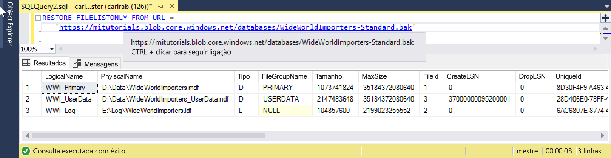

# <a name="quickstart-restore-a-database-to-a-managed-instance"></a>Início rápido: Restaurar uma base de dados para uma instância gerida 

Neste início rápido, usará SQL Server Management Studio (SSMS) para restaurar uma base de dados (a Wide World Importers - ficheiro de cópia de segurança Standard) de armazenamento de Blobs do Azure para uma base de dados do SQL do Azure [instância gerida](sql-database-managed-instance.md). 

> [!VIDEO https://www.youtube.com/embed/RxWYojo_Y3Q]

> [!NOTE]
> - Para obter mais informações sobre a migração com o Azure Database Migration Service (DMS), consulte [migração de instância gerida com o DMS](../dms/tutorial-sql-server-to-managed-instance.md). 
> - Para obter mais informações sobre os vários métodos de migração, consulte [migração de instância do SQL Server para instância gerida da base de dados SQL do Azure](sql-database-managed-instance-migrate.md).

## <a name="prerequisites"></a>Pré-requisitos

Este guia de início rápido:

- Utiliza os recursos a partir da [criar uma instância gerida](sql-database-managed-instance-get-started.md) início rápido.
- Requer o computador tenha a versão mais recente [SQL Server Management Studio](https://docs.microsoft.com/sql/ssms/sql-server-management-studio-ssms) instalado.
- Requer a utilização do SSMS para ligar à sua instância gerida. Consulte estes guias de introdução sobre como ligar:
  - [Ligar a uma Instância Gerida da Base de Dados SQL do Azure a partir de uma VM do Azure](sql-database-managed-instance-configure-vm.md)
  - [Configurar uma ligação de ponto a site para uma instância de gerida de base de dados do Azure SQL no local](sql-database-managed-instance-configure-p2s.md).

> [!NOTE]
> Para obter mais informações sobre a cópia de segurança e restaurar um servidor de SQL da base de dados a utilizar o armazenamento de Blobs do Azure e um [chave de assinatura de acesso partilhado (SAS)](https://docs.microsoft.com/azure/storage/common/storage-dotnet-shared-access-signature-part-1), consulte [cópia de segurança do SQL Server para URL](sql-database-managed-instance-get-started-restore.md).

## <a name="restore-the-database-from-a-backup-file"></a>Restaurar a base de dados a partir de um ficheiro de cópia de segurança

No SSMS, siga estes passos para restaurar a base de dados do Wide World Importers para a sua instância gerida. O ficheiro de cópia de segurança da base de dados é armazenado numa conta de armazenamento de Blobs do Azure pré-configurada.

1. Abra o SMSS e ligue à sua instância gerida.
2. A partir do menu do lado esquerdo, sua instância gerida com o botão direito e selecione **nova consulta** para abrir uma nova janela de consulta.
3. Execute o seguinte script SQL, que utiliza uma conta de armazenamento pré-configurado e a chave SAS para [criar uma credencial](https://docs.microsoft.com/sql/t-sql/statements/create-credential-transact-sql?view=sql-server-2017) na sua instância gerida.

   ```sql
   CREATE CREDENTIAL [https://mitutorials.blob.core.windows.net/databases] 
   WITH IDENTITY = 'SHARED ACCESS SIGNATURE'
   , SECRET = 'sv=2017-11-09&ss=bfqt&srt=sco&sp=rwdlacup&se=2028-09-06T02:52:55Z&st=2018-09-04T18:52:55Z&spr=https&sig=WOTiM%2FS4GVF%2FEEs9DGQR9Im0W%2BwndxW2CQ7%2B5fHd7Is%3D' 
   ```

    

4. Para verificar a sua credencial, execute o seguinte script, que usa um [contentor](https://azure.microsoft.com/services/container-instances/) URL para obter uma lista de ficheiros de cópia de segurança.

   ```sql
   RESTORE FILELISTONLY FROM URL = 
      'https://mitutorials.blob.core.windows.net/databases/WideWorldImporters-Standard.bak'
   ```

    

5. Execute o seguinte script para restaurar a base de dados do Wide World Importers.

   ```sql
   RESTORE DATABASE [Wide World Importers] FROM URL =
     'https://mitutorials.blob.core.windows.net/databases/WideWorldImporters-Standard.bak'
   ```

    

6. Execute o seguinte script para controlar de estado a restauração.

   ```sql
   SELECT session_id as SPID, command, a.text AS Query, start_time, percent_complete
      , dateadd(second,estimated_completion_time/1000, getdate()) as estimated_completion_time 
   FROM sys.dm_exec_requests r 
   CROSS APPLY sys.dm_exec_sql_text(r.sql_handle) a 
   WHERE r.command in ('BACKUP DATABASE','RESTORE DATABASE')
   ```

7. Quando o restauro estiver concluído, irá vê-lo no Object Explorer. 

## <a name="next-steps"></a>Passos Seguintes

- Para uma cópia de segurança para um URL de resolução de problemas, consulte [cópia de segurança do SQL Server para o URL de melhores práticas e resolução de problemas](https://docs.microsoft.com/sql/relational-databases/backup-restore/sql-server-backup-to-url-best-practices-and-troubleshooting).
- Para uma descrição geral das opções de ligação de aplicação, consulte [conectar seus aplicativos para a instância gerida](sql-database-managed-instance-connect-app.md).
- Para consultar com suas ferramentas ou idiomas Favoritos, consulte [inícios rápidos: Base de dados SQL do Azure se ligar e consultar](sql-database-connect-query.md).
