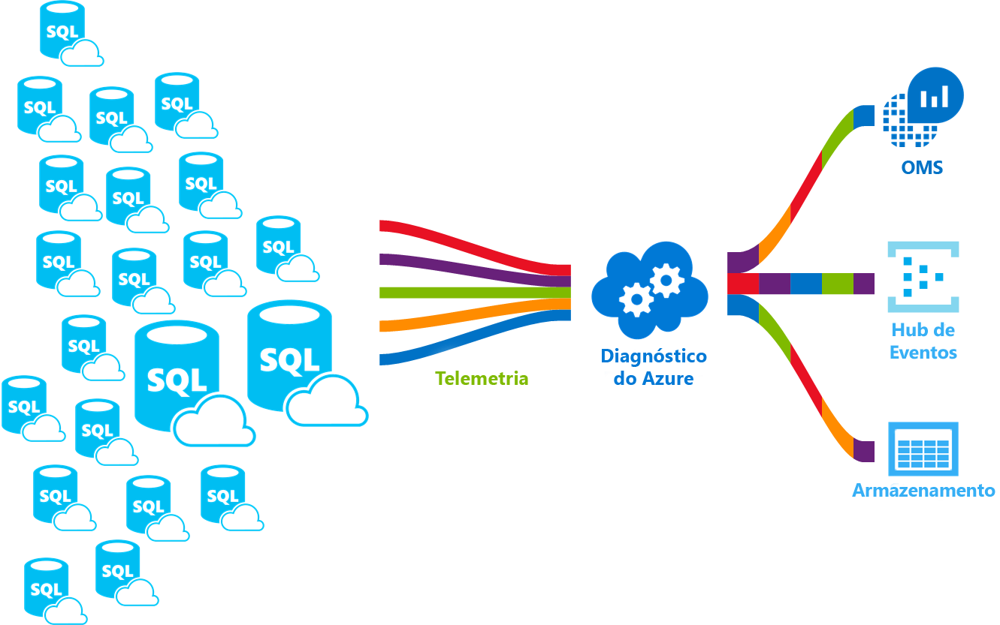

# <a name="azure-sql-database-metrics-and-diagnostics-logging"></a>Métricas de base de dados SQL do Azure e o registo de diagnósticos

Base de dados SQL do Azure, conjuntos elásticos, instância gerida e bases de dados em podem de instância gerida transmita registos de diagnóstico e métricas para monitorizar o desempenho mais fácil. Pode configurar uma base de dados para transmitir a utilização de recursos, funções de trabalho e sessões e conectividade a um dos seguintes recursos do Azure:

* **Análise de SQL do Azure**: para obter monitorização inteligentes de seus bancos de dados do Azure que inclui relatórios de desempenho, alertas e recomendações de atenuação.
* **Os Hubs de eventos do Azure**: para integrar a telemetria de base de dados SQL com as soluções de monitorização personalizadas monitorizção ou em pipelines.
* **O armazenamento do Azure**: para arquivar grandes quantidades de telemetria para uma fração do preço.

    

Para obter mais informações sobre as categorias de métricas e registo suportado por vários serviços do Azure, consulte:

* [Descrição geral das métricas no Microsoft Azure](../monitoring-and-diagnostics/monitoring-overview-metrics.md)
* [Descrição geral dos registos de diagnóstico do Azure](../azure-monitor/platform/diagnostic-logs-overview.md)

Este artigo fornece orientações para o ajudar a ativar a telemetria de diagnóstico para a instância gerida, conjuntos elásticos e bases de dados. Ele também pode ajudar a compreender como configurar a análise de SQL do Azure como uma ferramenta de monitoramento para ver a telemetria de diagnóstico de base de dados.

## <a name="enable-logging-of-diagnostics-telemetry"></a>Ativar o registo de telemetria de diagnóstico

Pode ativar e gerir as métricas e registos de telemetria de diagnóstico utilizando um dos seguintes métodos:

- Portal do Azure
- PowerShell
- CLI do Azure
- API de REST do Azure Monitor
- Modelo Azure Resource Manager

Quando ativar métricas e registo de diagnósticos, tem de especificar o destino de recursos do Azure para recolher a telemetria de diagnóstico. Opções disponíveis incluem:

- Análise de SQL do Azure
- Azure Event Hubs
- Storage do Azure

Pode aprovisionar um novo recurso do Azure ou selecione um recurso existente. Depois de escolher um recurso utilizando o **das definições de diagnóstico** opção, especifique os dados a recolher.

> [!NOTE]
> Se também estiver a utilizar os conjuntos elásticos ou à instância gerida, recomendamos que ative a telemetria de diagnóstico para esses recursos também. Contentores de base de dados em conjuntos elásticos e a instância gerida tem sua própria telemetria de diagnóstico separado.

## <a name="enable-logging-for-azure-sql-database-or-databases-in-managed-instance"></a>Ativar o registo de base de dados do Azure SQL ou bases de dados na instância gerida

Ativar as métricas e registo de diagnósticos na base de dados SQL e nas bases de dados na instância gerida; não estão ativadas por predefinição.

Pode configurar bases de dados do Azure SQL e bancos de dados na instância gerida para recolher a telemetria de diagnóstico seguinte:

| Telemetria para bases de dados de monitorização | Suporte de base de dados SQL do Azure | Base de dados no suporte de instância gerida |
| :------------------- | ------------------- | ------------------- |
| [Todas as métricas](sql-database-metrics-diag-logging.md#all-metrics): Contém a percentagem de DTU/CPU, limite de DTU/da CPU, físico dados lidos percentagem, de registo de escrita em percentagem, com êxito/com falhas/bloqueado por ligações de firewall, percentagem de sessões, percentagem de funções de trabalho, armazenamento, percentagem de armazenamento e percentagem de armazenamento do XTP. | Sim | Não |
| [QueryStoreRuntimeStatistics](sql-database-metrics-diag-logging.md#query-store-runtime-statistics): Contém informações sobre as estatísticas de tempo de execução de consulta como a utilização da CPU e estatísticas de duração de consulta. | Sim | Sim |
| [QueryStoreWaitStatistics](sql-database-metrics-diag-logging.md#query-store-wait-statistics): Contém informações sobre as estatísticas de espera de consulta (o que as suas consultas aguardado), como CPU, o registo e o bloqueio. | Sim | Sim |
| [Erros](sql-database-metrics-diag-logging.md#errors-dataset): Contém informações sobre erros do SQL na base de dados. | Sim | Não |
| [DatabaseWaitStatistics](sql-database-metrics-diag-logging.md#database-wait-statistics-dataset): Contém informações sobre quanto tempo a base de dados gasto aguardando tipos diferentes de espera. | Sim | Não |
| [Tempos limite](sql-database-metrics-diag-logging.md#time-outs-dataset): Contém informações sobre tempos limite na base de dados. | Sim | Não |
| [Blocos](sql-database-metrics-diag-logging.md#blockings-dataset): Contém informações sobre o bloqueio de eventos na base de dados. | Sim | Não |
| [SQLInsights](sql-database-metrics-diag-logging.md#intelligent-insights-dataset): Contém informações inteligentes sobre o desempenho. Para obter mais informações, consulte [informações inteligentes](sql-database-intelligent-insights.md). | Sim | Sim |

### <a name="azure-portal"></a>Portal do Azure

Utilizar o **as definições de diagnóstico** menu para cada uma das bases de dados no portal do Azure para configurar a transmissão em fluxo de telemetria de diagnóstico para bases de dados do Azure SQL e bancos de dados na instância gerida. Pode definir os destinos seguintes: O armazenamento do Azure, os Hubs de eventos do Azure e Log Analytics do Azure.

### <a name="configure-streaming-of-diagnostics-telemetry-for-azure-sql-database"></a>Configurar a transmissão em fluxo de telemetria de diagnóstico para a base de dados do Azure SQL

   

Para ativar a transmissão em fluxo de telemetria de diagnóstico para a base de dados do Azure SQL, siga estes passos:

1. Aceda ao seu recurso de base de dados do Azure SQL.
1. Selecione **as definições de diagnóstico**.
1. Selecione **ativar os diagnósticos** se não existem definições anteriores existe ou selecione **Editar definição** para editar uma definição anterior.
   - Pode criar até três ligações paralelas a telemetria de diagnóstico do fluxo.
   - Selecione **+ Adicionar definição de diagnóstico** para configurar a transmissão em fluxo paralela de dados de diagnóstico para vários recursos.

   
1. Introduza um nome de definição para sua própria referência.
1. Selecione um recurso de destino para os dados de diagnóstico de transmissão em fluxo: **Arquivo para a conta de armazenamento**, **Stream para um hub de eventos**, ou **enviar para o Log Analytics**.
1. Para a experiência de monitorização padrão, com base em eventos, selecione as caixas de verificação seguintes para a telemetria de registo de diagnóstico de base de dados: **SQLInsights**, **AutomaticTuning**, **QueryStoreRuntimeStatistics**, **QueryStoreWaitStatistics**, **erros** , **DatabaseWaitStatistics**, **tempos limite**, **blocos**, e **Deadlocks**.
1. Para uma experiência de monitorização avançada, de minuto-baseado num, selecione a caixa de verificação **AllMetrics**.
1. Selecione **Guardar**.

   

> [!NOTE]
> Não não possível ativar os registos de auditoria de segurança das definições de diagnóstico da base de dados. Para ativar a transmissão de registos de auditoria, consulte [configurar a auditoria da base de dados](sql-database-auditing.md#subheading-2), e [registos de auditoria de SQL no Azure Log Analytics e Hubs de eventos](https://blogs.msdn.microsoft.com/sqlsecurity/2018/09/13/sql-audit-logs-in-azure-log-analytics-and-azure-event-hubs/).

> [!TIP]
> Repita estes passos para cada base de dados de SQL do Azure que pretende monitorizar.

### <a name="configure-streaming-of-diagnostics-telemetry-for-databases-in-managed-instance"></a>Configurar a transmissão em fluxo de telemetria de diagnóstico para bases de dados na instância gerida

   

Para ativar a transmissão em fluxo de telemetria de diagnóstico para bases de dados na instância gerida, siga estes passos:

1. Aceda à sua base de dados na instância gerida.
1. Selecione **as definições de diagnóstico**.
1. Selecione **ativar os diagnósticos** se não existem definições anteriores existe ou selecione **Editar definição** para editar uma definição anterior.
   - Pode criar até três (3) paralelas ligações a telemetria de diagnóstico do fluxo.
   - Selecione **+ Adicionar definição de diagnóstico** para configurar a transmissão em fluxo paralela de dados de diagnóstico para vários recursos.

   

1. Introduza um nome de definição para sua própria referência.
1. Selecione um recurso de destino para os dados de diagnóstico de transmissão em fluxo: **Arquivo para a conta de armazenamento**, **Stream para um hub de eventos**, ou **enviar para o Log Analytics**.
1. Selecione as caixas de verificação para a telemetria de diagnóstico de base de dados: **SQLInsights**, **QueryStoreRuntimeStatistics**, **QueryStoreWaitStatistics** e **erros**.
1. Selecione **Guardar**.

   

> [!TIP]
> Repita estes passos para cada base de dados na instância gerida, que pretende monitorizar.

## <a name="enable-logging-for-elastic-pools-or-managed-instance"></a>Ativar o registo para conjuntos elásticos ou à instância gerida

Ative a telemetria de diagnóstico para conjuntos elásticos e a instância gerida como contentores de base de dados. Eles têm sua própria telemetria de diagnóstico que não está ativada por predefinição.

### <a name="configure-streaming-of-diagnostics-telemetry-for-elastic-pools"></a>Configurar a transmissão em fluxo de telemetria de diagnóstico para conjuntos elásticos

   

Pode configurar um recurso de conjunto elástico para recolher a telemetria de diagnóstico seguinte:

| Recurso | Monitorização de telemetria |
| :------------------- | ------------------- |
| **Conjunto elástico** | [Todas as métricas](sql-database-metrics-diag-logging.md#all-metrics) contém a percentagem de eDTU/CPU, limite de eDTU/da CPU, físico dados lidos percentagem, log escrever percentagem, percentagem de sessões, percentagem de funções de trabalho, armazenamento, percentagem de armazenamento, limite de armazenamento e a percentagem de armazenamento do XTP. |

Para ativar a transmissão em fluxo de telemetria de diagnóstico para um recurso de conjunto elástico, siga estes passos:

1. Vá para o recurso de conjunto elástico no portal do Azure.
1. Selecione **as definições de diagnóstico**.
1. Selecione **ativar os diagnósticos** se não existem definições anteriores existe ou selecione **Editar definição** para editar uma definição anterior.

   

1. Introduza um nome de definição para sua própria referência.
1. Selecione um recurso de destino para os dados de diagnóstico de transmissão em fluxo: **Arquivo para a conta de armazenamento**, **Stream para um hub de eventos**, ou **enviar para o Log Analytics**.
1. Para o Log Analytics, selecione **configurar** e criar uma nova área de trabalho ao selecionar **+ criar nova área de trabalho**, ou selecione uma área de trabalho existente.
1. Selecione a caixa de verificação de telemetria de diagnóstico do conjunto elástico: **AllMetrics**.
1. Selecione **Guardar**.

   

> [!TIP]
> Repita estes passos para cada conjunto elástico que pretende monitorizar.

### <a name="configure-streaming-of-diagnostics-telemetry-for-managed-instance"></a>Configurar a transmissão em fluxo de telemetria de diagnóstico para a instância gerida

   

Pode configurar um recurso de instância gerida para recolher a telemetria de diagnóstico seguinte:

| Recurso | Monitorização de telemetria |
| :------------------- | ------------------- |
| **Instância gerida** | [ResourceUsageStats](sql-database-metrics-diag-logging.md#resource-usage-stats) contém a contagem de vCores, percentagem de CPU média, pedidos de e/s, espaço de armazenamento reservada, lidos/escritos de bytes e espaço de armazenamento utilizado. |

Para ativar a transmissão em fluxo de telemetria de diagnóstico para um recurso de instância gerida, siga estes passos:

1. Vá para o recurso de instância gerida no portal do Azure.
1. Selecione **as definições de diagnóstico**.
1. Selecione **ativar os diagnósticos** se não existem definições anteriores existe ou selecione **Editar definição** para editar uma definição anterior.

   

1. Introduza um nome de definição para sua própria referência.
1. Selecione um recurso de destino para os dados de diagnóstico de transmissão em fluxo: **Arquivo para a conta de armazenamento**, **Stream para um hub de eventos**, ou **enviar para o Log Analytics**.
1. Para o Log Analytics, selecione **configurar** e criar uma nova área de trabalho ao selecionar **+ criar nova área de trabalho**, ou utilizar uma área de trabalho existente.
1. Selecione a caixa de verificação de telemetria de diagnóstico por exemplo: **ResourceUsageStats**.
1. Selecione **Guardar**.

   

> [!TIP]
> Repita estes passos para cada instância gerida que pretende monitorizar.

### <a name="powershell"></a>PowerShell

Pode ativar métricas e registo de diagnósticos com o PowerShell.

- Para ativar o armazenamento de registos de diagnóstico numa conta de armazenamento, utilize este comando:

   ```powershell
   Set-AzureRmDiagnosticSetting -ResourceId [your resource id] -StorageAccountId [your storage account id] -Enabled $true
   ```

   O ID de conta de armazenamento é o ID de recurso para a conta de armazenamento de destino.

- Para ativar a transmissão em fluxo de registos de diagnóstico para um hub de eventos, use este comando:

   ```powershell
   Set-AzureRmDiagnosticSetting -ResourceId [your resource id] -ServiceBusRuleId [your service bus rule id] -Enabled $true
   ```

   O ID de regra de Azure Service Bus é uma cadeia de caracteres com este formato:

   ```powershell
   {service bus resource ID}/authorizationrules/{key name}
   ```

- Para ativar o envio de registos de diagnóstico para uma área de trabalho do Log Analytics, use este comando:

   ```powershell
   Set-AzureRmDiagnosticSetting -ResourceId [your resource id] -WorkspaceId [resource id of the log analytics workspace] -Enabled $true
   ```

- Pode obter o ID de recurso da sua área de trabalho do Log Analytics, utilizando o seguinte comando:

   ```powershell
   (Get-AzureRmOperationalInsightsWorkspace).ResourceId
   ```

Pode combinar estes parâmetros para ativar várias opções de saída.

### <a name="to-configure-multiple-azure-resources"></a>Para configurar vários recursos do Azure

Para oferecer suporte a várias subscrições, utilize o script do PowerShell da [registo de métricas de recurso de ativar o Azure com o PowerShell](https://blogs.technet.microsoft.com/msoms/2017/01/17/enable-azure-resource-metrics-logging-using-powershell/).

Forneça o ID de recurso da área de trabalho \<$WSID\> como um parâmetro ao executar o script `Enable-AzureRMDiagnostics.ps1` para enviar dados de diagnóstico de vários recursos para a área de trabalho.

- Para obter o ID de área de trabalho \<$WSID\> do destino para os seus dados de diagnóstico, utilize o seguinte script:

    ```powershell
    PS C:\> $WSID = "/subscriptions/<subID>/resourcegroups/<RG_NAME>/providers/microsoft.operationalinsights/workspaces/<WS_NAME>"
    PS C:\> .\Enable-AzureRMDiagnostics.ps1 -WSID $WSID
    ```
   Substitua \<subID\> com o ID de subscrição \<RG_NAME\> com o nome do grupo de recursos, e \<WS_NAME\> com o nome de área de trabalho.

### <a name="azure-cli"></a>CLI do Azure

Pode ativar métricas e registo de diagnósticos com a CLI do Azure.

- Para ativar o armazenamento de registos de diagnóstico numa conta de armazenamento, utilize este comando:

   ```azurecli-interactive
   azure insights diagnostic set --resourceId <resourceId> --storageId <storageAccountId> --enabled true
   ```

   O ID de conta de armazenamento é o ID de recurso para a conta de armazenamento de destino.

- Para ativar a transmissão em fluxo de registos de diagnóstico para um hub de eventos, use este comando:

   ```azurecli-interactive
   azure insights diagnostic set --resourceId <resourceId> --serviceBusRuleId <serviceBusRuleId> --enabled true
   ```

   O ID da regra do Service Bus é uma cadeia de caracteres com este formato:

   ```azurecli-interactive
   {service bus resource ID}/authorizationrules/{key name}
   ```

- Para ativar o envio de registos de diagnóstico para uma área de trabalho do Log Analytics, use este comando:

   ```azurecli-interactive
   azure insights diagnostic set --resourceId <resourceId> --workspaceId <resource id of the log analytics workspace> --enabled true
   ```

Pode combinar estes parâmetros para ativar várias opções de saída.

### <a name="rest-api"></a>API REST

Saiba mais sobre como [alterar as definições de diagnóstico, utilizando a API de REST do Azure Monitor](https://docs.microsoft.com/rest/api/monitor/diagnosticsettings).

### <a name="resource-manager-template"></a>Modelo do Resource Manager

Saiba mais sobre como [ative as definições de diagnóstico durante a criação de recursos com um modelo do Resource Manager](../azure-monitor/platform/diagnostic-logs-stream-template.md).

## <a name="stream-into-azure-sql-analytics"></a>Stream em análise SQL do Azure

Análise de SQL do Azure é uma solução de cloud que monitoriza o desempenho de bases de dados, conjuntos elásticos e a instância gerida de SQL do Azure em escala e em várias subscrições. Ele pode ajudá-lo a recolher e visualizar métricas de desempenho da base de dados do Azure SQL e possui inteligência incorporada para resolução de problemas de desempenho.


Registos de diagnóstico e métricas de base de dados SQL podem ser transmitidos em análise de SQL do Azure utilizando o incorporado **enviar para o Log Analytics** opção no separador de definições de diagnóstico no portal. Também pode ativar o Log Analytics utilizando uma definição de diagnóstico através de cmdlets do PowerShell, a CLI do Azure ou a API de REST do Azure Monitor.

### <a name="installation-overview"></a>Visão geral da instalação

Pode monitorar uma frota de base de dados SQL com a análise de SQL do Azure. Execute os seguintes passos:

1. Crie uma solução de análise de SQL do Azure no Azure Marketplace.
2. Crie uma área de trabalho de monitorização na solução.
3. Configure bases de dados de telemetria de diagnóstico de fluxo para a área de trabalho.

Se estiver a utilizar os conjuntos elásticos ou à instância gerida, terá também de configurar a telemetria de diagnóstico de transmissão em fluxo a partir desses recursos.

### <a name="create-azure-sql-analytics-resource"></a>Criar recurso de análise de SQL do Azure

1. Procure a análise de SQL do Azure no Azure Marketplace e selecioná-lo.

   

2. Selecione **criar** no ecrã de descrição geral da solução.

3. Preencha o formulário de análise de SQL do Azure com as informações adicionais, que é necessários: nome de área de trabalho, subscrição, grupo de recursos, localização e escalão de preço.

   

4. Selecione **OK** para confirmar e, em seguida, selecione **criar**.

### <a name="configure-databases-to-record-metrics-and-diagnostics-logs"></a>Configurar bases de dados aos registos de diagnóstico e métricas de registo

A forma mais fácil de configurar em que a métrica de registo de bases de dados é através do portal do Azure. Conforme descrito anteriormente, aceda ao seu recurso de base de dados SQL no portal do Azure e selecione **as definições de diagnóstico**.

Se estiver a utilizar os conjuntos elásticos ou à instância gerida, terá também de configurar as definições de diagnóstico nestes recursos para ativar a telemetria de diagnóstico para transmitir em fluxo para a área de trabalho.

### <a name="use-the-sql-analytics-solution"></a>Utilizar a solução de análise de SQL

Pode utilizar a análise de SQL como um dashboard hierárquico para ver os recursos de base de dados SQL. Para saber como utilizar a solução de análise de SQL, veja [monitorizar a base de dados de SQL com a solução de análise de SQL](../log-analytics/log-analytics-azure-sql.md).

## <a name="stream-into-event-hubs"></a>Transmitir em fluxo para os Hubs de Eventos

Pode transmitir em fluxo registos de diagnóstico e métricas de base de dados SQL para os Hubs de eventos utilizando o incorporado **Stream para um hub de eventos** opção no portal do Azure. Também pode ativar o ID da regra do Service Bus utilizando uma definição de diagnóstico através de cmdlets do PowerShell, a CLI do Azure ou a API de REST do Azure Monitor.

### <a name="what-to-do-with-metrics-and-diagnostics-logs-in-event-hubs"></a>O que fazer com métricas e diagnósticos registos nos Hubs de eventos

Depois dos dados selecionados são transmitidos em Hubs de eventos, está um passo mais perto para ativar cenários de monitorização avançada. Os Event Hubs atuam como a porta de entrada para um pipeline de eventos. Depois de dados são recolhidos para um hub de eventos, podem ser transformado e armazenado através de um fornecedor de análise em tempo real ou um adaptador de armazenamento. Os Hubs de eventos desassocia a produção de um fluxo de eventos do consumo desses eventos. Dessa forma, os consumidores de eventos podem acessar os eventos no seu próprio agendamento. Para obter mais informações sobre os Hubs de eventos, consulte:

- [Quais são os Hubs de eventos do Azure?](../event-hubs/event-hubs-what-is-event-hubs.md)
- [Introdução ao Event Hubs](../event-hubs/event-hubs-csharp-ephcs-getstarted.md)

Pode utilizar métricas de transmissão em fluxo contínuo nos Hubs de eventos para:

* **Ver o estado de funcionamento do serviço através da transmissão em fluxo de dados de caminhos recorrentes para o Power BI**. Ao utilizar os Hubs de eventos, o Stream Analytics e o Power BI, pode facilmente transformar os dados de métricas e diagnósticos para perto de informações em tempo real nos seus serviços do Azure. Para uma descrição geral de como configurar um hub de eventos, o processamento de dados com o Stream Analytics e utilize o Power BI como resultado, consulte [Stream Analytics e o Power BI](../stream-analytics/stream-analytics-power-bi-dashboard.md).

* **Stream registos para fluxos de telemetria e de registo de terceiros**. Ao utilizar os Hubs de eventos de transmissão em fluxo, pode obter os registos de métricas e diagnósticos em várias soluções de análise de monitorização e registo de terceiros.

* **Criar uma plataforma de Registro em log e telemetria personalizada**. Fazer já tiver uma plataforma de telemetria personalizados internos ou estão pensando em criar uma? Altamente dimensionável de publicação-subscrição natureza dos Hubs de eventos permite ingerir forma flexível os registos de diagnóstico. Ver [guia de Dan Rosanova para utilizar os Hubs de eventos numa plataforma de telemetria de escala global](https://azure.microsoft.com/documentation/videos/build-2015-designing-and-sizing-a-global-scale-telemetry-platform-on-azure-event-Hubs/).

## <a name="stream-into-storage"></a>Stream para o armazenamento

Pode armazenar métricas de base de dados SQL e os registos de diagnósticos no armazenamento do Azure utilizando o incorporado **arquivo para uma conta de armazenamento** opção no portal do Azure. Também pode ativar o armazenamento utilizando uma definição de diagnóstico através de cmdlets do PowerShell, a CLI do Azure ou a API de REST do Azure Monitor.

### <a name="schema-of-metrics-and-diagnostics-logs-in-the-storage-account"></a>Esquema de métricas e diagnósticos registos na conta de armazenamento

Depois de configurar a coleção de registos de diagnóstico e métricas, é criado um contentor de armazenamento na conta de armazenamento que selecionou quando as primeiras linhas de dados estão disponíveis. A estrutura dos blobs é:

```powershell
insights-{metrics|logs}-{category name}/resourceId=/SUBSCRIPTIONS/{subscription ID}/ RESOURCEGROUPS/{resource group name}/PROVIDERS/Microsoft.SQL/servers/{resource_server}/ databases/{database_name}/y={four-digit numeric year}/m={two-digit numeric month}/d={two-digit numeric day}/h={two-digit 24-hour clock hour}/m=00/PT1H.json
```

Ou, mais simples:

```powershell
insights-{metrics|logs}-{category name}/resourceId=/{resource Id}/y={four-digit numeric year}/m={two-digit numeric month}/d={two-digit numeric day}/h={two-digit 24-hour clock hour}/m=00/PT1H.json
```

Por exemplo, pode ser um nome de blob para todas as métricas:

```powershell
insights-metrics-minute/resourceId=/SUBSCRIPTIONS/s1id1234-5679-0123-4567-890123456789/RESOURCEGROUPS/TESTRESOURCEGROUP/PROVIDERS/MICROSOFT.SQL/ servers/Server1/databases/database1/y=2016/m=08/d=22/h=18/m=00/PT1H.json
```

Um nome de blob para o armazenamento de dados a partir de um conjunto elástico é semelhante a:

```powershell
insights-{metrics|logs}-{category name}/resourceId=/SUBSCRIPTIONS/{subscription ID}/ RESOURCEGROUPS/{resource group name}/PROVIDERS/Microsoft.SQL/servers/{resource_server}/ elasticPools/{elastic_pool_name}/y={four-digit numeric year}/m={two-digit numeric month}/d={two-digit numeric day}/h={two-digit 24-hour clock hour}/m=00/PT1H.json
```

### <a name="download-metrics-and-logs-from-storage"></a>Transferir os registos e métricas do armazenamento

Saiba como [transferir registos de diagnóstico e métricas do armazenamento](../storage/blobs/storage-quickstart-blobs-dotnet.md#download-the-sample-application).

## <a name="data-retention-policy-and-pricing"></a>Política de retenção de dados e preços

Se selecionar os Hubs de eventos ou uma conta de armazenamento, pode especificar uma política de retenção. Esta política elimina os dados que é mais antigos que um período de tempo selecionado. Se especificar o Log Analytics, a política de retenção depende do escalão de preço selecionado. Neste caso, as unidades gratuitas fornecidas de ingestão de dados, podem ativar gratuita monitorização de vários bancos de dados por mês. O consumo de telemetria de diagnóstico em excesso relativamente às unidades gratuitas pode implicar custos. Lembre-se de que as bases de dados ativas com cargas de trabalho mais pesadas ingerir mais dados do que as bases de dados inativos. Para obter mais informações, consulte [preços do Log Analytics](https://azure.microsoft.com/pricing/details/monitor/).

Se estiver a utilizar a análise de SQL do Azure, pode monitorizar o consumo de ingestão de dados na solução selecionando **área de trabalho do OMS** no menu de navegação de análise de SQL do Azure e, em seguida, selecionar **utilização** e **os custos estimados**.

## <a name="metrics-and-logs-available"></a>Métricas e registos disponíveis

Telemetria de monitorização recolhida pode ser utilizada pelos seus próprios _análise personalizada_ e _desenvolvimento de aplicativos_ usando [idioma de análise de SQL](https://docs.microsoft.com/azure/log-analytics/query-language/get-started-queries). 

## <a name="all-metrics"></a>Todas as métricas

Consulte as tabelas seguintes para obter detalhes sobre todas as métricas por recurso.

### <a name="all-metrics-for-elastic-pools"></a>Todas as métricas para conjuntos elásticos

|**Recurso**|**Métricas**|
|---|---|
|Conjunto elástico|percentagem de eDTU, eDTU utilizado, o limite de eDTU, percentagem de CPU, percentagem de leitura de dados físicos, log escrever percentagem, percentagem de sessões, percentagem de funções de trabalho, armazenamento, percentagem de armazenamento, limite de armazenamento, percentagem de armazenamento do XTP |

### <a name="all-metrics-for-azure-sql-databases"></a>Todas as métricas para bases de dados do Azure SQL

|**Recurso**|**Métricas**|
|---|---|
|Base de dados SQL do Azure|Percentagem de DTU, DTU utilizado, o limite DTU, percentagem de CPU, percentagem de leitura de dados físicos, de registo de escrita em percentagem, com êxito/com falhas/bloqueado por ligações de firewall, percentagem de sessões, percentagem de funções de trabalho, armazenamento, percentagem de armazenamento, percentagem de armazenamento do XTP, e deadlocks |

## <a name="logs-for-managed-instance"></a>Registos para a instância gerida

Consulte a tabela seguinte para obter detalhes sobre os registos para a instância gerida.

### <a name="resource-usage-statistics"></a>Estatísticas de utilização de recursos

|Propriedade|Descrição|
|---|---|
|TenantId|O ID de inquilino |
|SourceSystem|Sempre: Azure|
|TimeGenerated [UTC]|Carimbo de hora quando o registo foi registado |
|Tipo|Sempre: AzureDiagnostics |
|ResourceProvider|Nome do fornecedor de recursos. Sempre: MICROSOFT. SQL |
|Categoria|Nome da categoria. Sempre: ResourceUsageStats |
|Recurso|Nome do recurso |
|ResourceType|Nome do tipo de recurso. Sempre: MANAGEDINSTANCES |
|SubscriptionId|GUID da subscrição para a base de dados |
|ResourceGroup|Nome do grupo de recursos para a base de dados |
|LogicalServerName_s|Nome da instância gerida |
|ResourceId|URI do recurso |
|SKU_s|Produto de instância SKU gerido |
|virtual_core_count_s|Número de vCores disponíveis |
|avg_cpu_percent_s|Percentagem de CPU média |
|reserved_storage_mb_s|Capacidade de armazenamento reservada na instância gerida |
|storage_space_used_mb_s|Armazenamento utilizado na instância gerida |
|io_requests_s|Contagem IOPS |
|io_bytes_read_s|Bytes IOPS de leitura |
|io_bytes_written_s|Bytes IOPS escritos |

## <a name="logs-for-azure-sql-databases-and-managed-instance-databases"></a>Registos para bases de dados de bases de dados do Azure SQL e a instância gerida

Consulte as tabelas seguintes para obter detalhes sobre os registos para bases de dados SQL do Azure e a instância gerida.

### <a name="query-store-runtime-statistics"></a>Estatísticas de tempo de execução de consulta Store

|Propriedade|Descrição|
|---|---|
|TenantId|O ID de inquilino |
|SourceSystem|Sempre: Azure |
|TimeGenerated [UTC]|Carimbo de hora quando o registo foi registado |
|Tipo|Sempre: AzureDiagnostics |
|ResourceProvider|Nome do fornecedor de recursos. Sempre: MICROSOFT. SQL |
|Categoria|Nome da categoria. Sempre: QueryStoreRuntimeStatistics |
|OperationName|Nome da operação. Sempre: QueryStoreRuntimeStatisticsEvent |
|Recurso|Nome do recurso |
|ResourceType|Nome do tipo de recurso. Sempre: BASES DE DADOS/SERVIDORES |
|SubscriptionId|GUID da subscrição para a base de dados |
|ResourceGroup|Nome do grupo de recursos para a base de dados |
|LogicalServerName_s|Nome do servidor da base de dados |
|ElasticPoolName_s|Nome do conjunto elástico da base de dados, se aplicável |
|DatabaseName_s|Nome da base de dados |
|ResourceId|URI do recurso |
|query_hash_s|Hash de consulta |
|query_plan_hash_s|Hash de plano de consulta |
|statement_sql_handle_s|Identificador de sql de declaração |
|interval_start_time_d|Iniciar o datetimeoffset do intervalo de no número de tiques de 1900-1-1 |
|interval_end_time_d|Datetimeoffset de fim do intervalo no número de tiques de 1900-1-1 |
|logical_io_writes_d|Número total de escritas de e/s lógicas |
|max_logical_io_writes_d|Número máx. de e/s lógica escritas por execução |
|physical_io_reads_d|Número total de leituras de e/s físicas |
|max_physical_io_reads_d|Número máx. de e/s lógica leituras por execução |
|logical_io_reads_d|Número total de leituras lógicas de e/s |
|max_logical_io_reads_d|Número máx. de e/s lógica leituras por execução |
|execution_type_d|Tipo de execução |
|count_executions_d|Número de execuções da consulta |
|cpu_time_d|Tempo total de CPU consumido pela consulta em microssegundos |
|max_cpu_time_d|Consumidor de tempo máx. da CPU por uma única execução em microssegundos |
|dop_d|Soma de graus de paralelismo |
|max_dop_d|Grau máximo de paralelismo utilizado para execução única |
|rowcount_d|Número total de linhas devolvidas |
|max_rowcount_d|Número máx. de linhas retornadas na execução única |
|query_max_used_memory_d|Quantidade total de memória utilizada no artigo BDC |
|max_query_max_used_memory_d|Quantidade máxima de memória utilizada por uma única execução no artigo BDC |
|duration_d|Tempo de execução total em microssegundos |
|max_duration_d|Máx. tempo de execução de uma única execução |
|num_physical_io_reads_d|Número total de leituras físicos |
|max_num_physical_io_reads_d|Número máx. de leituras físicos por execução |
|log_bytes_used_d|Quantidade total de bytes de registo utilizados |
|max_log_bytes_used_d|Quantidade máxima de bytes de registo utilizados por execução |
|query_id_d|ID da consulta no Query Store |
|plan_id_d|ID do plano de consulta Store |

Saiba mais sobre [dados de estatísticas de tempo de execução de consulta Store](https://docs.microsoft.com/sql/relational-databases/system-catalog-views/sys-query-store-runtime-stats-transact-sql).

### <a name="query-store-wait-statistics"></a>Estatísticas de espera de Store de consulta

|Propriedade|Descrição|
|---|---|
|TenantId|O ID de inquilino |
|SourceSystem|Sempre: Azure |
|TimeGenerated [UTC]|Carimbo de hora quando o registo foi registado |
|Tipo|Sempre: AzureDiagnostics |
|ResourceProvider|Nome do fornecedor de recursos. Sempre: MICROSOFT. SQL |
|Categoria|Nome da categoria. Sempre: QueryStoreWaitStatistics |
|OperationName|Nome da operação. Sempre: QueryStoreWaitStatisticsEvent |
|Recurso|Nome do recurso |
|ResourceType|Nome do tipo de recurso. Sempre: BASES DE DADOS/SERVIDORES |
|SubscriptionId|GUID da subscrição para a base de dados |
|ResourceGroup|Nome do grupo de recursos para a base de dados |
|LogicalServerName_s|Nome do servidor da base de dados |
|ElasticPoolName_s|Nome do conjunto elástico da base de dados, se aplicável |
|DatabaseName_s|Nome da base de dados |
|ResourceId|URI do recurso |
|wait_category_s|Categoria da espera |
|is_parameterizable_s|A consulta é parametrizável |
|statement_type_s|Tipo de instrução |
|statement_key_hash_s|Hash de chave de instrução |
|exec_type_d|Tipo de execução |
|total_query_wait_time_ms_d|Tempo de espera total da consulta na categoria específica de espera |
|max_query_wait_time_ms_d|Tempo de espera máximo da consulta em execução individual na categoria específica de espera |
|query_param_type_d|0 |
|query_hash_s|Hash de consulta no Query Store |
|query_plan_hash_s|Hash de plano de consulta no Query Store |
|statement_sql_handle_s|Identificador de instrução de consulta Store |
|interval_start_time_d|Iniciar o datetimeoffset do intervalo de no número de tiques de 1900-1-1 |
|interval_end_time_d|Datetimeoffset de fim do intervalo no número de tiques de 1900-1-1 |
|count_executions_d|Contagem de execuções da consulta |
|query_id_d|ID da consulta no Query Store |
|plan_id_d|ID do plano de consulta Store |

Saiba mais sobre [dados de estatísticas de espera de consulta Store](https://docs.microsoft.com/sql/relational-databases/system-catalog-views/sys-query-store-wait-stats-transact-sql).

### <a name="errors-dataset"></a>Conjunto de dados de erros

|Propriedade|Descrição|
|---|---|
|TenantId|O ID de inquilino |
|SourceSystem|Sempre: Azure |
|TimeGenerated [UTC]|Carimbo de hora quando o registo foi registado |
|Tipo|Sempre: AzureDiagnostics |
|ResourceProvider|Nome do fornecedor de recursos. Sempre: MICROSOFT.SQ |
|Categoria|Nome da categoria. Sempre: Erros |
|OperationName|Nome da operação. Sempre: ErrorEvent |
|Recurso|Nome do recurso |
|ResourceType|Nome do tipo de recurso. Sempre: BASES DE DADOS/SERVIDORES |
|SubscriptionId|GUID da subscrição para a base de dados |
|ResourceGroup|Nome do grupo de recursos para a base de dados |
|LogicalServerName_s|Nome do servidor da base de dados |
|ElasticPoolName_s|Nome do conjunto elástico da base de dados, se aplicável |
|DatabaseName_s|Nome da base de dados |
|ResourceId|URI do recurso |
|Mensagem|Mensagem de erro em texto simples |
|user_defined_b|É o bit de definidas pelo utilizador do erro |
|error_number_d|Código de erro |
|Gravidade|Gravidade do erro |
|state_d|Estado do erro |
|query_hash_s|Hash de consulta da consulta com falhas, se disponível |
|query_plan_hash_s|Hash de plano de consulta da consulta com falhas, se disponível |

Saiba mais sobre [mensagens de erro do SQL Server](https://msdn.microsoft.com/library/cc645603.aspx).

### <a name="database-wait-statistics-dataset"></a>Conjunto de dados de estatísticas de espera de base de dados

|Propriedade|Descrição|
|---|---|
|TenantId|O ID de inquilino |
|SourceSystem|Sempre: Azure |
|TimeGenerated [UTC]|Carimbo de hora quando o registo foi registado |
|Tipo|Sempre: AzureDiagnostics |
|ResourceProvider|Nome do fornecedor de recursos. Sempre: MICROSOFT. SQL |
|Categoria|Nome da categoria. Sempre: DatabaseWaitStatistics |
|OperationName|Nome da operação. Sempre: DatabaseWaitStatisticsEvent |
|Recurso|Nome do recurso |
|ResourceType|Nome do tipo de recurso. Sempre: BASES DE DADOS/SERVIDORES |
|SubscriptionId|GUID da subscrição para a base de dados |
|ResourceGroup|Nome do grupo de recursos para a base de dados |
|LogicalServerName_s|Nome do servidor da base de dados |
|ElasticPoolName_s|Nome do conjunto elástico da base de dados, se aplicável |
|DatabaseName_s|Nome da base de dados |
|ResourceId|URI do recurso |
|wait_type_s|Nome do tipo de espera |
|start_utc_date_t [UTC]|Hora de início do período de medida |
|end_utc_date_t [UTC]|Hora de fim do período de medida |
|delta_max_wait_time_ms_d|Tempo por execução de espera máximo |
|delta_signal_wait_time_ms_d|Tempo de espera de sinais total |
|delta_wait_time_ms_d|Tempo de espera total no período |
|delta_waiting_tasks_count_d|Número de tarefas de espera |

Saiba mais sobre [estatísticas de espera de base de dados](https://docs.microsoft.com/sql/relational-databases/system-dynamic-management-views/sys-dm-os-wait-stats-transact-sql).

### <a name="time-outs-dataset"></a>Conjunto de dados de tempos limite

|Propriedade|Descrição|
|---|---|
|TenantId|O ID de inquilino |
|SourceSystem|Sempre: Azure |
|TimeGenerated [UTC]|Carimbo de hora quando o registo foi registado |
|Tipo|Sempre: AzureDiagnostics |
|ResourceProvider|Nome do fornecedor de recursos. Sempre: MICROSOFT. SQL |
|Categoria|Nome da categoria. Sempre: Tempos limite |
|OperationName|Nome da operação. Sempre: TimeoutEvent |
|Recurso|Nome do recurso |
|ResourceType|Nome do tipo de recurso. Sempre: BASES DE DADOS/SERVIDORES |
|SubscriptionId|GUID da subscrição para a base de dados |
|ResourceGroup|Nome do grupo de recursos para a base de dados |
|LogicalServerName_s|Nome do servidor da base de dados |
|ElasticPoolName_s|Nome do conjunto elástico da base de dados, se aplicável |
|DatabaseName_s|Nome da base de dados |
|ResourceId|URI do recurso |
|error_state_d|Código de estado de erro |
|query_hash_s|Consultar o hash, se disponível |
|query_plan_hash_s|Consultar o hash do plano, se disponível |

### <a name="blockings-dataset"></a>Blockings conjunto de dados

|Propriedade|Descrição|
|---|---|
|TenantId|O ID de inquilino |
|SourceSystem|Sempre: Azure |
|TimeGenerated [UTC]|Carimbo de hora quando o registo foi registado |
|Tipo|Sempre: AzureDiagnostics |
|ResourceProvider|Nome do fornecedor de recursos. Sempre: MICROSOFT. SQL |
|Categoria|Nome da categoria. Sempre: blocos |
|OperationName|Nome da operação. Sempre: BlockEvent |
|Recurso|Nome do recurso |
|ResourceType|Nome do tipo de recurso. Sempre: BASES DE DADOS/SERVIDORES |
|SubscriptionId|GUID da subscrição para a base de dados |
|ResourceGroup|Nome do grupo de recursos para a base de dados |
|LogicalServerName_s|Nome do servidor da base de dados |
|ElasticPoolName_s|Nome do conjunto elástico da base de dados, se aplicável |
|DatabaseName_s|Nome da base de dados |
|ResourceId|URI do recurso |
|lock_mode_s|Modo de bloqueio usado pela consulta |
|resource_owner_type_s|Proprietário do bloqueio |
|blocked_process_filtered_s|Bloqueado o processo de relatório XML |
|duration_d|Duração do bloqueio em microssegundos |

### <a name="deadlocks-dataset"></a>Conjunto de dados de deadlocks

|Propriedade|Descrição|
|---|---|
|TenantId|O ID de inquilino |
|SourceSystem|Sempre: Azure |
|TimeGenerated [UTC] |Carimbo de hora quando o registo foi registado |
|Tipo|Sempre: AzureDiagnostics |
|ResourceProvider|Nome do fornecedor de recursos. Sempre: MICROSOFT. SQL |
|Categoria|Nome da categoria. Sempre: Impasses |
|OperationName|Nome da operação. Sempre: DeadlockEvent |
|Recurso|Nome do recurso |
|ResourceType|Nome do tipo de recurso. Sempre: BASES DE DADOS/SERVIDORES |
|SubscriptionId|GUID da subscrição para a base de dados |
|ResourceGroup|Nome do grupo de recursos para a base de dados |
|LogicalServerName_s|Nome do servidor da base de dados |
|ElasticPoolName_s|Nome do conjunto elástico da base de dados, se aplicável |
|DatabaseName_s|Nome da base de dados |
|ResourceId|URI do recurso |
|deadlock_xml_s|Relatório de deadlock XML |

### <a name="automatic-tuning-dataset"></a>Conjunto de dados de otimização automática

|Propriedade|Descrição|
|---|---|
|TenantId|O ID de inquilino |
|SourceSystem|Sempre: Azure |
|TimeGenerated [UTC]|Carimbo de hora quando o registo foi registado |
|Tipo|Sempre: AzureDiagnostics |
|ResourceProvider|Nome do fornecedor de recursos. Sempre: MICROSOFT. SQL |
|Categoria|Nome da categoria. Sempre: AutomaticTuning |
|Recurso|Nome do recurso |
|ResourceType|Nome do tipo de recurso. Sempre: BASES DE DADOS/SERVIDORES |
|SubscriptionId|GUID da subscrição para a base de dados |
|ResourceGroup|Nome do grupo de recursos para a base de dados |
|LogicalServerName_s|Nome do servidor da base de dados |
|LogicalDatabaseName_s|Nome da base de dados |
|ElasticPoolName_s|Nome do conjunto elástico da base de dados, se aplicável |
|DatabaseName_s|Nome da base de dados |
|ResourceId|URI do recurso |
|RecommendationHash_s|Valor hash exclusivo de recomendação de otimização automática |
|OptionName_s|Operação de otimização automática |
|Schema_s|Esquema de base de dados |
|Table_s|Tabela afetada |
|IndexName_s|Nome do índice |
|IndexColumns_s|Nome da coluna |
|IncludedColumns_s|Colunas incluídas |
|EstimatedImpact_s|Estimado o impacto da recomendação de otimização automática JSON |
|Event_s|Tipo de evento de otimização automática |
|Timestamp_t|Última timestamp atualizado |

### <a name="intelligent-insights-dataset"></a>Conjunto de dados de informações inteligente

Saiba mais sobre o [formato de registo de informações inteligentes](sql-database-intelligent-insights-use-diagnostics-log.md).

## <a name="next-steps"></a>Passos Seguintes

Para saber como ativar o registo e compreender as métricas e registo categorias suportadas por vários serviços do Azure, veja:

* [Descrição geral das métricas no Microsoft Azure](../monitoring-and-diagnostics/monitoring-overview-metrics.md)
* [Descrição geral dos registos de diagnóstico do Azure](../azure-monitor/platform/diagnostic-logs-overview.md)

Para saber mais sobre os Hubs de eventos, leia:

* [O que é o Event Hubs do Azure?](../event-hubs/event-hubs-what-is-event-hubs.md)
* [Introdução ao Event Hubs](../event-hubs/event-hubs-csharp-ephcs-getstarted.md)

Para saber mais sobre o armazenamento do Azure, veja [como transferir os registos de diagnóstico e métricas do armazenamento](../storage/blobs/storage-quickstart-blobs-dotnet.md#download-the-sample-application).
