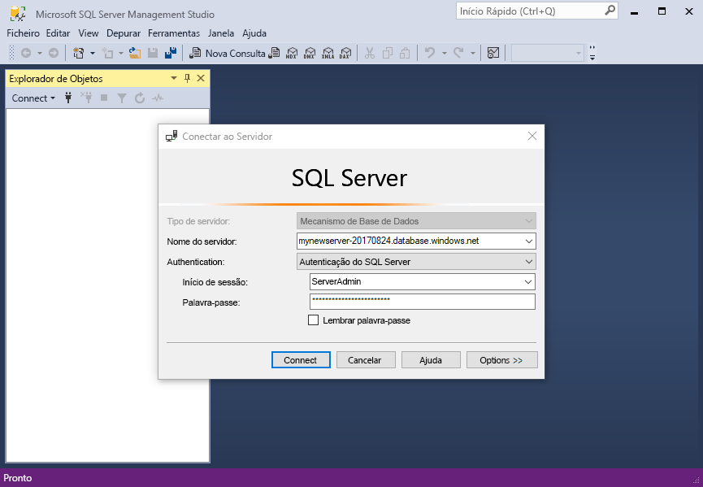
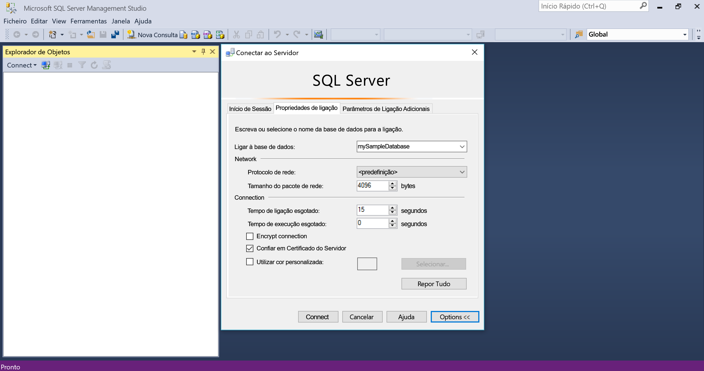
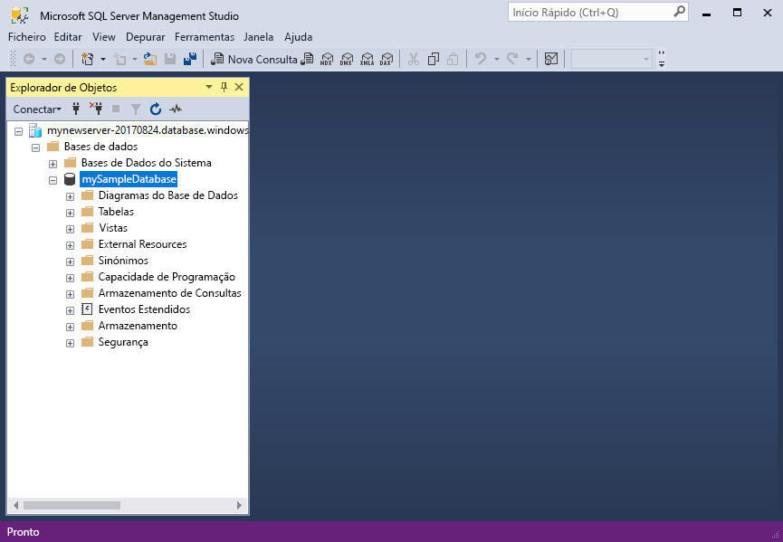

# <a name="migrate-your-sql-server-database-to-azure-sql-database"></a>Migre a sua base de dados do SQL Server para a Base de Dados SQL do Azure

Mover a sua base de dados do SQL Server para a Base de Dados SQL do Azure é tão simples como criar uma base de dados do SQL vazia no Azure e, em seguida, utilizar o [Assistente de Migração de Dados](https://www.microsoft.com/download/details.aspx?id=53595) (DMA) para importar a base de dados para o Azure. Neste tutorial, irá aprender a:

> [!div class="checklist"]
> * Criar uma base de dados SQL do Azure vazia no portal do Azure (com um servidor de base de dados SQL do Azure novo ou existente)
> * Criar um firewall ao nível do servidor no portal do Azure (se ainda não tiver sido criado)
> * Utilize o [Assistente de Migração de Dados](https://www.microsoft.com/download/details.aspx?id=53595) (DMA) para importar a base de dados do SQL Server para a base de dados SQL do Azure vazia 
> * Utilize o [SQL Server Management Studio](https://docs.microsoft.com/sql/ssms/download-sql-server-management-studio-ssms) (SSMS) para alterar as propriedades da base de dados.

Se não tiver uma subscrição do Azure, [crie uma conta gratuita](https://azure.microsoft.com/free/) antes de começar.

## <a name="prerequisites"></a>Pré-requisitos

Para concluir este tutorial, confirme que conclui os pré-requisitos seguintes:

- Instalou a versão mais recente do [SQL Server Management Studio](https://docs.microsoft.com/sql/ssms/download-sql-server-management-studio-ssms) (SSMS).  
- Instalou a versão mais recente do [Assistente de Migração de Dados](https://www.microsoft.com/download/details.aspx?id=53595) (DMA).
- Identificou e tem acesso a uma base de dados para migrar. Este tutorial utiliza a [Base de dados OLTP AdventureWorks do SQL Server 2008-R2](https://msftdbprodsamples.codeplex.com/releases/view/59211) numa instância do SQL Server 2008-R2 ou mais recente, mas pode utilizar qualquer base de dados da sua preferência. Para corrigir problemas de compatibilidade, utilize o [SQL Server Data Tools](https://docs.microsoft.com/sql/ssdt/download-sql-server-data-tools-ssdt)

## <a name="log-in-to-the-azure-portal"></a>Iniciar sessão no portal do Azure

Inicie sessão no [Portal do Azure](https://portal.azure.com/).

## <a name="create-a-blank-sql-database"></a>Criar uma base de dados SQL vazia

É criada uma base de dados SQL do Azure com um conjunto definido de [recursos de armazenamento e computação](sql-database-service-tiers.md). A base de dados é criada num [Grupo de recursos do Azure](../azure-resource-manager/resource-group-overview.md) e num [servidor lógico da Base de Dados SQL do Azure](sql-database-features.md). 

Siga estes passos para criar uma base de dados SQL vazia. 

1. Clique em **Criar um recurso**, no canto superior esquerdo do portal do Azure.

2. Selecione **Bases de Dados** na página **Novo** e selecione **Criar na Base de Dados SQL** em **Base de Dados SQL** na página **Novo**.

   

3. Preencha o formulário da Base de Dados SQL com as informações seguintes, conforme mostrado na imagem anterior:   

   | Definição       | Valor sugerido | Descrição | 
   | ------------ | ------------------ | ------------------------------------------------- | 
   | **Nome da base de dados** | mySampleDatabase | Para nomes de bases de dados válidos, veja [Database Identifiers](https://docs.microsoft.com/sql/relational-databases/databases/database-identifiers) (Identificadores de Bases de Dados). | 
   | **Subscrição** | A sua subscrição  | Para obter detalhes sobre as suas subscrições, veja [Subscriptions](https://account.windowsazure.com/Subscriptions) (Subscrições). |
   | **Grupo de recursos** | myResourceGroup | Para nomes de grupo de recursos válidos, veja [Naming rules and restrictions](https://docs.microsoft.com/azure/architecture/best-practices/naming-conventions) (Atribuição de nomes de regras e restrições). |
   | **Selecionar origem** | Base de dados vazia | Especifica que deve ser criada uma base de dados vazia. |

4. Clique em **Servidor** para criar e configurar um novo servidor para a nova base de dados. Preencha o **Novo formulário de servidor** com as seguintes informações: 

   | Definição       | Valor sugerido | Descrição | 
   | ------------ | ------------------ | ------------------------------------------------- | 
   | **Nome do servidor** | Qualquer nome globalmente exclusivo | Para nomes de servidores válidos, veja [Naming rules and restrictions](https://docs.microsoft.com/azure/architecture/best-practices/naming-conventions) (Atribuição de nomes de regras e restrições). | 
   | **Início de sessão de administrador do servidor** | Qualquer nome válido | Para nomes de início de sessão válidos, veja [Database Identifiers](https://docs.microsoft.com/sql/relational-databases/databases/database-identifiers) (Identificadores de Bases de Dados).|
   | **Palavra-passe** | Qualquer palavra-passe válida | A sua palavra-passe deve ter, pelo menos, oito carateres e deve conter carateres de três das seguintes categorias: carateres maiúsculos, carateres minúsculos, números e carateres não alfanuméricos. |
   | **Localização** | Nenhuma localização válida | Para obter mais informações sobre regiões, veja [Azure Regions](https://azure.microsoft.com/regions/) (Regiões do Azure). |

   

5. Clique em **Selecionar**.

6. Clique em **Escalão de preço** para especificar a camada de serviço, o número de DTUs e a quantidade de armazenamento. Explore as opções para o número de DTUs e de armazenamento que tem disponível para cada camada de serviço. 

7. Para este tutorial, selecione a camada de serviço **Standard** e, em seguida, utilize o controlo de deslize para selecionar **100 DTUs (S3)** e **400** GB de armazenamento.

   

8. Aceitd os termos de pré-visualização para utilizar a opção **Adicionar ao Armazenamento**. 

   > [!IMPORTANT]
   > \*Tamanhos de armazenamento maiores do que a quantidade de armazenamento incluído estão em pré-visualização e são aplicados custos adicionais. Para detalhes, ver os preços da [Base de Dados SQL](https://azure.microsoft.com/pricing/details/sql-database/). 
   >
   >\* No escalão Premium, mais de 1 TB de armazenamento está atualmente disponível nas seguintes regiões: Sul do Brasil, Canadá Central, Leste do Canadá, E.U.A. Central, Centro de França, Alemanha Central, Leste do Japão, Oeste do Japão, Coreia Central, E.U.A. Centro-Norte, Europa do Norte, E.U.A. Centro-Sul, Sudeste Asiático, Sul do Reino Unido, Oeste do Reino Unido, E.U.A. Leste 2, E.U.A. Oeste, Gov (US) - Virginia e Europa Ocidental. Ver [Limitações Atuais P11-P15](sql-database-resource-limits.md#single-database-limitations-of-p11-and-p15-when-the-maximum-size-greater-than-1-tb).  
   > 

9. Depois de selecionar o escalão de servidor, o número de DTUs e a quantidade de armazenamento, clique em **Aplicar**.  

10. Selecione um **agrupamento** para a base de dados vazia (para este tutorial, utilize o valor predefinido). Para obter mais informações sobre agrupamentos, veja [Agrupamentos](https://docs.microsoft.com/sql/t-sql/statements/collations)

11. Agora que concluiu o formulário da Base de Dados SQL do Servidor, clique em **Criar** para aprovisionar a base de dados. O aprovisionamento demora alguns minutos. 

12. Na barra de ferramentas, clique em **Notificações** para monitorizar o processo de implementação.
    
     

## <a name="create-a-server-level-firewall-rule"></a>Criar uma regra de firewall ao nível do servidor

O serviço da Base de Dados SQL cria uma firewall ao nível do servidor, impedindo que as aplicações e ferramentas externas estabeleçam uma ligação ao servidor ou a quaisquer bases de dados no servidor, a menos que seja criada uma regra de firewall para abrir a firewall para endereços IP específicos. Siga estes passos para criar uma [regra de firewall ao nível do servidor da Base de Dados SQL](sql-database-firewall-configure.md) para o endereço IP do seu cliente, para permitir a conectividade externa através da firewall da Base de Dados SQL apenas para o seu endereço IP. 

> [!NOTE]
> A Base de Dados SQL comunica através da porta 1433. Se estiver a tentar ligar a partir de uma rede empresarial, o tráfego de saída através da porta 1433 poderá não ser permitido pela firewall da rede. Se assim for, não poderá ligar ao servidor da Base de Dados SQL do Azure, a menos que o departamento de TI abra a porta 1433.
>

1. Depois de concluída a implementação, clique em **Bases de dados SQL** no menu do lado esquerdo e, em seguida, clique em **mySampleDatabase** na página **Bases de dados SQL**. É aberta uma página de descrição geral para a base de dados que mostra o nome de servidor completamente qualificado (como **mynewserver-20170824.database.windows.net**) e oferece opções para configuração adicional. 

2. Copie este nome de servidor totalmente qualificado para utilizar para ligar ao seu servidor e às respetivas bases de dados nos seguintes guias de introdução. 

    

3. Clique em **Definir firewall do servidor** na barra de ferramentas. É aberta a página **Definições da firewall** do servidor da Base de Dados SQL. 

    

4. Clique em **Adicionar IP de cliente**, na barra de ferramentas, para adicionar o seu endereço IP atual a uma nova regra de firewall. Uma regra de firewall consegue abrir a porta 1433 para um único endereço IP ou para um intervalo de endereços IP.

5. Clique em **Guardar**. É criada uma regra de firewall ao nível do servidor para a sua porta de abertura 1433 do endereço IP atual no servidor lógico.

6. Clique em **OK** e, em seguida, feche a página **Definições da firewall**.

Pode agora ligar ao servidor da Base de Dados SQL e às respetivas bases de dados com o SQL Server Management Studio, o Assistente de Migração de Dados ou outra ferramenta à sua escolha a partir deste endereço IP com a conta de administrador de servidor criada no procedimento anterior.

> [!IMPORTANT]
> Por predefinição, o acesso através da firewall da Base de Dados SQL está ativado para todos os serviços do Azure. Clique em **DESATIVAR** nesta página para desativar todos os serviços do Azure.

## <a name="sql-server-connection-information"></a>Informações de ligação do servidor SQL

Obtenha o nome de servidor totalmente qualificado para o servidor da Base de Dados SQL do Azure no portal do Azure. Utiliza o nome de servidor completamente qualificado para ligar ao seu servidor SQL do Azure com ferramentas de cliente, incluindo o Assistente de Migração de Dados e o SQL Server Management Studio.

1. Inicie sessão no [Portal do Azure](https://portal.azure.com/).
2. Selecione **Bases de Dados SQL** a partir do menu do lado esquerdo e clique na sua base de dados na página **Bases de Dados SQL**. 
3. No painel **Essentials** na página do portal do Azure da sua base de dados, localize e, em seguida, copie o **Nome do servidor**.

   

## <a name="migrate-your-database"></a>Migrar a base de dados

Siga estes passos para utilizar o **[Assistente de Migração de Dados](https://www.microsoft.com/download/details.aspx?id=53595)** para avaliar a preparação da base de dados para migração para a Base de Dados SQL do Azure e para concluir a migração.

1. Abra o **Assistente de Migração de Dados**. Pode executar o DMA em qualquer computador com conectividade à instância do SQL Server que contém a base de dados que pretende migrar e conectividade à Internet. Não precisa de instalá-lo no computador que aloja a instância do SQL Server que está a migrar. A regra de firewall que criou num procedimento anterior aplica-se ao computador em que está a executar o Assistente de Migração de Dados.

     

2. No menu da esquerda, clique em **+ Novo** para criar um projeto de **Avaliação**. Preencha os valores de pedido e, em seguida, clique em **Criar**:

   | Definição      | Valor sugerido | Descrição | 
   | ------------ | ------------------ | ------------------------------------------------- | 
   | Tipo de projeto | Migração | Escolha avaliar a sua base de dados para a migração ou avaliar e migrar como parte do mesmo fluxo de trabalho |
   |Nome do projeto|Tutorial de migração| Um nome descritivo |
   |Tipo do servidor de origem| SQL Server | Esta é a única origem atualmente suportada |
   |Tipo do servidor de destino| Base de Dados SQL do Azure| As opções são: Base de Dados SQL do Azure, SQL Server, SQL Server em máquinas virtuais do Azure |
   |Âmbito da Migração| Esquema e dados| As opções são: esquema e dados, apenas esquema, apenas dados |
   
   

3.  Na página **Selecionar origem**, preencha os valores pedidos e, em seguida, clique em **Ligar**:

    | Definição      | Valor sugerido | Descrição | 
    | ------------ | ------------------ | ------------------------------------------------- | 
    | Nome do servidor | O seu nome de um servidor ou endereço IP | O seu nome de um servidor ou endereço IP |
    | Tipo de autenticação | O tipo de autenticação preferencial| Escolhas: Autenticação do Windows, Autenticação do SQL Server, Autenticação Integrada do Active Directory, Autenticação de Palavra-passe do Active Directory |
    | Nome de utilizador | O seu nome de início de sessão | O seu início de sessão tem de ter permissões do **SERVIDOR DE CONTROLO** |
    | Palavra-passe| A sua palavra-passe | A sua palavra-passe |
    | Propriedades de ligação| Selecione **Encriptar ligação** e **Certificado de servidor de confiança**, conforme adequado para o seu ambiente. | Escolha as propriedades adequadas para ligar ao seu servidor |

    

5. Selecione uma base de dados única do servidor de origem para migrar para a Base de Dados SQL do Azure e, em seguida, clique em **Seguinte**. Para este tutorial, existe apenas uma base de dados.

6. Na página **Selecionar destino**, preencha os valores pedidos e, em seguida, clique em **Ligar**:

    | Definição      | Valor sugerido | Descrição | 
    | ------------ | ------------------ | ------------------------------------------------- | 
    | Nome do servidor | O seu nome de servidor completamente qualificado da Base de Dados do Azure | O nome completamente qualificado do servidor de Base de Dados do Azure do procedimento anterior |
    | Tipo de autenticação | Autenticação do SQL Server | A autenticação do SQL Server é a única opção neste tutorial escrito, mas a Autenticação Integrada do Active Directory e a Autenticação de Palavra-passe do Active Directory também são suportadas pela Base de Dados SQL do Azure |
    | Nome de utilizador | O seu nome de início de sessão | O início de sessão tem de ter permissões da **BASE DE DADOS DE CONTROLO** para a base de dados de origem |
    | Palavra-passe| A sua palavra-passe | A sua palavra-passe |
    | Propriedades de ligação| Selecione **Encriptar ligação** e **Certificado de servidor de confiança**, conforme adequado para o seu ambiente. | Escolha as propriedades adequadas para ligar ao seu servidor |

    

7. Selecione a base de dados do servidor de destino que criou num procedimento anterior e, em seguida, clique em **Seguinte** para iniciar o processo de avaliação do esquema da base de dados de origem. Para este tutorial, existe apenas uma base de dados. Tenha em atenção que o nível de compatibilidade desta base de dados está definido como 140, sendo o nível de compatibilidade predefinido para todas as novas bases de dados na Base de Dados SQL do Azure.

   > [!IMPORTANT] 
   > Depois de migrar a sua base de dados para a Base de Dados SQL do Azure, pode optar por operar a base de dados ao nível de compatibilidade especificado, para efeitos de compatibilidade com versões anteriores. Para obter mais informações sobre as implicações e as opções para o funcionamento de uma base de dados a um nível de compatibilidade específico, veja [ALTERAR Nível de Compatibilidade de BASE DE DADOS](https://docs.microsoft.com/sql/t-sql/statements/alter-database-transact-sql-compatibility-level). Veja também [ALTERAR CONFIGURAÇÃO DO ÂMBITO DA BASE DE DADOS](https://docs.microsoft.com/sql/t-sql/statements/alter-database-scoped-configuration-transact-sql) para obter informações sobre as definições adicionais do nível da base de dados relacionadas com os níveis de compatibilidade.
   >

8. Na página **Selecionar objetos**, assim que o processo de avaliação do esquema da base de dados de origem estiver concluído, analise os objetos selecionados para migração e analise os objetos que contêm problemas. Por exemplo, analise o objeto **dbo.uspSearchCandidateResumes** para as alterações de comportamento do **SERVERPROPERTY('LCID')** e o objeto **HumanResourcesJobCandidate** para alterações de Pesquisa em Texto Completo. 

   > [!IMPORTANT] 
   > Consoante o design da base de dados e o design da sua aplicação, ao migrar a base de dados de origem, poderá ter de modificar a base de dados ou a aplicação, ou ambas, após a migração (e, em alguns casos, antes da migração). Para obter informações sobre as diferenças do Transact-SQL que possam afetar a sua migração, veja [Resolving Transact-SQL differences during migration to SQL Database (Resolver as diferenças do Transact-SQL durante a migração para a Base de Dados SQL)](sql-database-transact-sql-information.md).

     

9. Clique em **Gerar script SQL** para colocar no script os objetos de esquema na base de dados de origem. 
10. Veja o script gerado e, em seguida, clique em **Próxima emissão** conforme necessário para ver as recomendações e os problemas de avaliação identificados. Por exemplo, para a Pesquisa em Texto Completo, a recomendação quando atualiza é testar as suas aplicações que tiram partido das funcionalidades Texto Completo. Pode guardar ou copiar o script se desejar.

     

11. Clique em **Implementar esquema** e veja o processo de migração de esquema.

     

12. Quando concluir a migração de esquema, veja os resultados dos erros e, em seguida, pressupondo que não existem, clique em **Migrar dados**.
13. Na página **Selecionar tabelas**, veja as tabelas selecionadas para a migração e, em seguida, clique em **Começar migração de dados**.

     

14. Veja o processo de migração.

     

## <a name="connect-to-the-database-with-ssms"></a>Ligar à base de dados com o SSMS

Utilize o [SQL Server Management Studio](https://docs.microsoft.com/sql/ssms/sql-server-management-studio-ssms) para estabelecer uma ligação ao servidor da Base de Dados SQL do Azure.

1. Abra o SQL Server Management Studio.

2. Na caixa de dialogo **Ligar ao Servidor**, introduza as seguintes informações:

   | Definição       | Valor sugerido | Descrição | 
   | ------------ | ------------------ | ------------------------------------------------- | 
   | Tipo de servidor | Motor de base de dados | Este valor é obrigatório |
   | Nome do servidor | O nome de servidor completamente qualificado | O nome deve ser semelhante a: **mynewserver20170824.database.windows.net**. |
   | Autenticação | Autenticação do SQL Server | A Autenticação do SQL é o único tipo de autenticação que configurámos neste tutorial. |
   | Iniciar sessão | A conta de administrador do servidor | Esta é a conta que especificou quando criou o servidor. |
   | Palavra-passe | A palavra-passe da sua conta de administrador do servidor | Esta é a palavra-passe que especificou quando criou o servidor. |

   

3. Clique em **Opções** na caixa de diálogo **Ligar ao servidor**. Na secção **Ligar à base de dados**, introduza **mySampleDatabase** para ligar a esta base de dados.

     

4. Clique em **Ligar**. A janela do Object Explorer é aberta no SSMS. 

5. No Object Explorer, expanda as **Bases de Dados** e, em seguida, expanda **mySampleDatabase**, para ver os objetos na base de dados de exemplo.

     

## <a name="change-database-properties"></a>Alterar as propriedades da base de dados

Pode alterar o escalão de serviço, o nível de desempenho e o nível de compatibilidade com o SQL Server Management Studio. Durante a fase de importação, recomendamos que importe para uma base de dados de escalão de desempenho superior para melhor desempenho, mas que reduza verticalmente assim que a importação estiver concluída, para economizar dinheiro até estar pronto a utilizar ativamente a base de dados importada. Alterar o nível de compatibilidade poderá suspender um melhor desempenho e o acesso às funcionalidades mais recentes do serviço da Base de Dados SQL do Azure. Quando migra uma base de dados mais antiga, o seu nível de compatibilidade de base de dados é mantido ao nível mais baixo suportado que é compatível com a base de dados que está a ser importada. Para obter mais informações, veja [Desempenho melhorado das consultas com Nível 130 de compatibilidade na Base de Dados SQL do Azure](sql-database-compatibility-level-query-performance-130.md).

1. No Object Explorer, clique com o botão direito do rato em **mySampleDatabase** e, em seguida, clique em **Nova Consulta**. Uma janela de consulta abre-se ligada à sua base de dados.

2. Execute o seguinte comando para definir a camada de serviço para **Standard** e o nível de desempenho para **S1**.

    ```sql
    ALTER DATABASE mySampleDatabase 
    MODIFY 
        (
        EDITION = 'Standard'
        , MAXSIZE = 250 GB
        , SERVICE_OBJECTIVE = 'S1'
    );
    ```

## <a name="next-steps"></a>Passos seguintes 
Neste tutorial, aprendeu a:

> * Criar uma base de dados SQL do Azure vazia no portal do Azure 
> * Criar um firewall ao nível do servidor no portal do Azure 
> * Utilize o [Assistente de Migração de Dados](https://www.microsoft.com/download/details.aspx?id=53595) (DMA) para importar a base de dados do SQL Server para a base de dados SQL do Azure vazia 
> * Utilize o [SQL Server Management Studio](https://docs.microsoft.com/sql/ssms/download-sql-server-management-studio-ssms) (SSMS) para alterar as propriedades da base de dados.

Avance para o próximo tutorial para saber como proteger a base de dados.

> [!div class="nextstepaction"]
> [Proteger a sua Base de Dados SQL do Azure](sql-database-security-tutorial.md).


