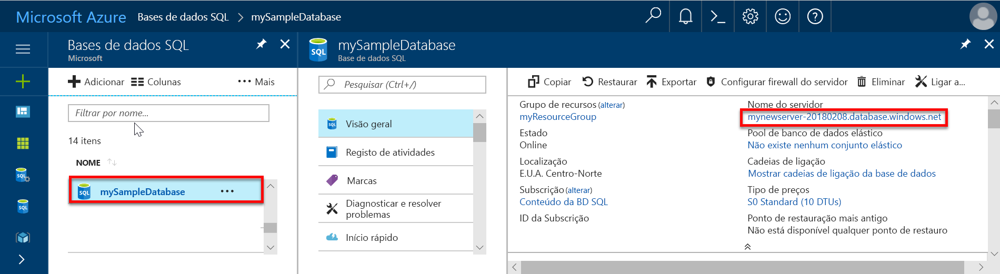

# Início rápido: Criar uma regra de firewall ao nível do servidor na base de dados do SQL do Azure no portal do Azure

Este início rápido explica como criar uma regra de firewall ao nível do servidor na base de dados do SQL do Azure no portal do Azure que lhe permite ligar à mesma a partir de um recurso no local.

## Pré-requisitos

Este início rápido utiliza os recursos criados [criar uma base de dados com o portal do Azure](sql-database-single-database-get-started.md) como ponto de partida.

## Iniciar sessão no portal do Azure

Inicie sessão no [portal do Azure](https://portal.azure.com/).

## Criar uma regra de firewall do IP ao nível do servidor

O serviço de base de dados SQL cria uma firewall ao nível do servidor de base de dados para bases de dados individuais e em pool. Esta firewall impede que os aplicativos de cliente de se ligar ao servidor ou a qualquer uma das respetivas bases de dados individuais ou agrupadas, a menos que crie uma regra de firewall do IP para abrir a firewall. Para uma ligação de um endereço IP fora do Azure, crie uma regra de firewall para um endereço IP específico ou um intervalo de endereços que pretende conseguir ligar-se. Para obter mais informações sobre a base de dados ao nível do servidor e regras de firewall do IP, consulte [base de dados SQL da base de dados ao nível do servidor e regras de firewall IP](sql-database-firewall-configure.md).

> [!NOTE]
> A Base de Dados SQL comunica através da porta 1433. Se estiver a tentar ligar a partir de uma rede empresarial, o tráfego de saída através da porta 1433 poderá não ser permitido pela firewall da rede. Se assim for, não é possível ligar ao seu servidor de base de dados do Azure SQL, a menos que o departamento de TI abra a porta 1433.
> [!IMPORTANT]
> Uma regra de firewall 0.0.0.0 permite que todos os serviços do Azure pass-through a regra de firewall ao nível do servidor e tente ligar a uma base de dados individual ou agrupada através do servidor. Para saber mais sobre como utilizar regras de rede virtual, veja [regras de rede Virtual como alternativas às regras IP](sql-database-firewall-configure.md#virtual-network-rules-as-alternatives-to-ip-rules).

Siga estes passos para criar uma regra de firewall do IP ao nível do servidor para o endereço IP do seu cliente e permitir a conectividade externa através da firewall de base de dados SQL para apenas o seu endereço IP.

1. Depois do [pré-requisitos base de dados SQL do Azure](#prerequisites) implementação estiver concluída, selecione **bases de dados SQL** no menu esquerdo e, em seguida, escolha **mySampleDatabase** no  **Bases de dados SQL** página. É aberta uma página de descrição geral para a base de dados que mostra o nome de servidor completamente qualificado (como **mynewserver-20170824.database.windows.net**) e oferece opções para configuração adicional.

2. Copie este nome de servidor completamente qualificado para utilizar quando se liga ao seu servidor e respetivas bases de dados em outros guias de introdução.

   

3. Selecione **definir firewall do servidor** na barra de ferramentas. O **definições da Firewall** é aberta a página para o servidor de base de dados.

   

4. Escolher **Adicionar IP de cliente** na barra de ferramentas para adicionar o seu endereço IP atual a uma nova regra de firewall ao nível do servidor IP. Uma regra de firewall do IP ao nível do servidor pode abrir a porta 1433 para um único endereço IP ou um intervalo de endereços IP.

   > [!IMPORTANT]
   > Por predefinição, o acesso através da firewall da Base de Dados SQL está ativado para todos os serviços do Azure. Escolher **OFF** nesta página para desativar todos os serviços Azure.
   >

5. Selecione **Guardar**. Uma regra de firewall do IP ao nível do servidor é criada para o seu endereço IP atual abrindo a porta 1433 no servidor de base de dados SQL.

6. Fechar o **definições da Firewall** página.

Utilizar o SQL Server Management Studio ou outra ferramenta à sua escolha, pode agora ligar para o servidor de base de dados SQL e respetivas bases de dados deste endereço IP com a conta de administrador de servidor criada anteriormente.

## Limpar recursos

Guarde estes recursos se pretender aceder aos [Próximos passos](#next-steps) e saiba como ligar e consultar a base de dados utilizando um número de métodos diferentes. Se, no entanto, que pretende eliminar os recursos que criou neste início rápido, utilize os seguintes passos.

1. No menu esquerdo no portal do Azure, selecione **grupos de recursos** e, em seguida, selecione **myResourceGroup**.
2. Na página do grupo de recursos, selecione **elimine**, tipo **myResourceGroup** na caixa de texto e, em seguida, selecione **eliminar**.

## Passos Seguintes

- Agora que tem uma base de dados, pode [ligar e consultar](sql-database-connect-query.md) com uma das suas ferramentas ou linguagens favoritas, incluindo
  - [Ligar e consultar com o SQL Server Management Studio](sql-database-connect-query-ssms.md)
  - [Ligar e consultar com o Azure Data Studio](/sql/azure-data-studio/quickstart-sql-database?toc=/azure/sql-database/toc.json)
- Para saber como criar a sua primeira base de dados, criar tabelas e inserir dados, veja um destes tutoriais:
  - [Conceber a sua primeira base de dados único na base de dados do SQL Azure com o SSMS](sql-database-design-first-database.md)
  - [Criar uma base de dados na base de dados do Azure SQL e estabelecer ligação com o C# e o ADO.NET](sql-database-design-first-database-csharp.md)
