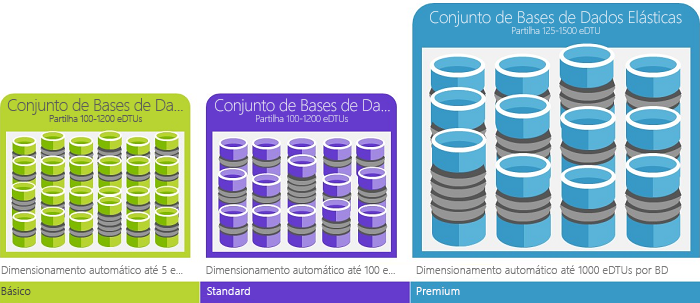

# Base de dados do SQL do Azure compra de modelos e recursos 

Base de dados SQL do Azure permite-lhe comprar facilmente o motor de base de dados de PaaS totalmente gerido que se adeque às suas necessidades de desempenho e custo. Consoante o modelo de implementação de base de dados do Azure SQL, pode selecionar o modelo de compra que atende às suas necessidades: 
 - [Servidores lógicos](sql-database-logical-servers.md) no [base de dados do Azure SQL](sql-database-technical-overview.md) oferece dois modelos de compras para computação, armazenamento e recursos de e/s: um modelo de compra baseado em DTU e um [modelo de compra baseado em vCore](sql-database-service-tiers-vcore.md). 
 - [Instâncias geridas](sql-database-managed-instance.md) na oferta de base de dados do Azure SQL única a [modelo de compra baseado em vCore](sql-database-service-tiers-vcore.md).

O gráfico e tabela seguintes comparam e contrastar esses dois modelos de compras.

|**Modelo de compra**|**Descrição**|**Melhor para**|
|---|---|---|
|modelo baseado em DTU|Este modelo baseia-se numa medida integrados em recursos de computação, armazenamento e e/s. Os níveis de desempenho são expressos em Unidades de Transação de Base de Dados (DTUs) para bases de dados únicas e Unidades de Transação de Bases de Dados elásticas (eDTUs) para conjuntos elásticos. Para obter mais informações sobre DTUs e eDTUs, veja [quais são DTUs e eDTUs](sql-database-service-tiers.md#what-are-database-transaction-units-dtus)?|Ideal para clientes que desejam simples, pré-configurado opções de recursos.| 
|modelo baseado em vCore|Este modelo permite-lhe escolher independentemente a recursos de computação e armazenamento. Ele também permite-lhe utilizar o Azure Hybrid Benefit para o SQL Server para obter poupanças de custos.|Melhor para os clientes que o valor de flexibilidade, controlo e transparência.|
||||  

## modelo de compra baseado em vCore 

Um núcleo virtual representa a CPU lógica oferecida com a opção de escolher entre gerações de hardware e as características físicas de hardware (por exemplo, número de núcleos, memória, o tamanho de armazenamento). O modelo de compra baseado em vCore oferece a flexibilidade, o controle, a transparência de consumo de recursos individuais e uma forma direta de traduzir locais requisitos de carga de trabalho para a cloud. Este modelo permite-lhe escolher a computação, memória e armazenamento com base nas suas necessidades de carga de trabalho. No modelo de compra baseado em vCore, os clientes podem escolher entre [fins gerais](sql-database-high-availability.md#standardgeneral-purpose-availability) e [crítico para a empresa](sql-database-high-availability.md#premiumbusiness-critical-availability) escalões de serviço para ambos [bases de dados únicas](sql-database-single-database-scale.md), [instâncias geridas](sql-database-managed-instance.md), e [conjuntos elásticos](sql-database-elastic-pool.md). 

O modelo de compra baseado em vCore permite que escolha os recursos de computação e armazenamento, combine o desempenho no local e otimizar o preço de forma independente. No modelo de compra baseado em vCore, os clientes pagam pelo:
- Computação (camada de serviços + número de vCores e a quantidade de memória + geração de hardware) *
- Tipo e a quantidade de armazenamento de dados e de registo 
- Número de IOs * * - aplicáveis aos [servidores lógicos](sql-database-logical-servers.md) apenas
- Cópia de segurança de armazenamento (RA-GRS) * * 

\* Na pré-visualização pública inicial, as CPUs lógicas do Gen 4 baseiam-se no Intel E5-2673 v3 processadores de 2,4 GHz (Haswell).

\*\* Durante a pré-visualização, sete dias de cópias de segurança e o IOs são gratuitos.

> [!IMPORTANT]
> Computação, IOs, dados e armazenamento de registo é cobrada por base de dados ou conjunto elástico. Armazenamento de cópias de segurança é cobrado por cada base de dados. Para obter detalhes de encargos de instância gerida, consulte [instância gerida da base de dados SQL do Azure](sql-database-managed-instance.md).
> **Limitações de região:** o modelo de compra baseado em vCore ainda não está disponível nas seguintes regiões: Europa Ocidental, Centro de França, sul do Reino Unido, oeste do Reino Unido e Sudeste da Austrália.

Se a sua base de dados ou conjunto elástico consome mais de 300 conversão de DTU para vCore pode reduzir o custo. Pode converter a utilizar a API de escolha ou no portal do Azure, sem períodos de indisponibilidade. No entanto, a conversão não é necessária. Se o modelo de compra DTU cumpre os requisitos de negócios e desempenho, deve continuar a utilizá-lo. Se optar por converter o modelo de DTU para o modelo de vCore, selecione o nível de desempenho com a seguinte regra geral: cada 100 DTUS no escalão Standard requer, pelo menos, 1 vCore na camada de fins gerais; cada 125 DTU no escalão Premium requer, pelo menos, 1 vCore na camada de negócio críticos.

## Modelo de compra baseado em DTU

As unidades de transação de base de dados (DTU) representa uma medida combinada de CPU, memória, lê e escreve. O modelo de compra baseado em DTU oferece um conjunto de pacotes de recursos de computação pré-configurados e armazenamento para impulsionar diferentes níveis de desempenho do aplicativo incluído. Os clientes que preferem a simplicidade de um pacote pré-configurado e pagamentos fixos a cada mês, pode encontrar o modelo baseado em DTU mais adequado às suas necessidades. No modelo de compra baseado em DTU, os clientes podem escolher entre **básica**, **padrão**, e **Premium** escalões de serviço para ambos [bases de dadosúnicas](sql-database-single-database-scale.md) e [conjuntos elásticos](sql-database-elastic-pool.md). Este modelo de compra não está disponível no [instâncias geridas](sql-database-managed-instance.md).

### O que são unidades de transação de base de dados (DTUs)?
Para uma base de dados SQL do Azure num nível de desempenho específico dentro de um [escalão de serviço](sql-database-single-database-scale.md), Microsoft garante um determinado nível de recursos para essa base de dados (independentemente de qualquer outro banco de dados na cloud do Azure), fornecendo um previsível nível de desempenho. A quantidade de recursos é calculada como um número de unidades de transação de base de dados ou DTUs e é uma medida integrados em recursos de computação, armazenamento e e/s. A relação entre estes recursos foi originalmente determinada por uma [carga de trabalho do OLTP benchmark](sql-database-benchmark-overview.md), projetado para ser típica das cargas de trabalho do mundo real OLTP. Quando a carga de trabalho excede a quantidade de qualquer um desses recursos, o débito é limitados - resultante no tempos limite e desempenho mais lento. Os recursos utilizados pela sua carga de trabalho não afetam os recursos disponíveis para outros bancos de dados do SQL na cloud do Azure e os recursos utilizados por outras cargas de trabalho não afetam os recursos disponíveis para a base de dados SQL.

DTUs são mais úteis para compreender o nível relativo de recursos entre bases de dados do Azure SQL em diferentes níveis de desempenho e escalões de serviço. Por exemplo, duplicar as DTUs aumentando o nível de desempenho de uma base de dados equivale a duplicar o conjunto de recursos disponíveis para essa base de dados. Por exemplo, uma base de dados Premium P11 com 1750 DTUs fornece 350 x mais potência de computação de DTUs do que uma base de dados básica com cinco DTUs.  

Para obter informações mais aprofundadas sobre o consumo de recursos (DTUS) da sua carga de trabalho, utilize [do Azure SQL Database Query Performance Insight](sql-database-query-performance.md) para:

- Identificar as consultas principais por contagem de CPU/duração/execução que potencialmente pode ser otimizada para um melhor desempenho. Por exemplo, uma consulta de intensiva de e/s pode beneficiar do uso da opção [técnicas de otimização de memória](sql-database-in-memory.md) para garantir uma melhor utilização da memória disponível num determinado escalão e o desempenho nível de serviço.
- Desagregar os detalhes de uma consulta, ver o texto e o histórico de utilização de recursos.
- Recomendações que mostram as ações realizadas por de otimização de desempenho de acesso [Assistente de base de dados SQL](sql-database-advisor.md).

### O que são unidades de transação de base de dados elástica (eDTUs)?
Em vez disso, apenas fornecer um conjunto dedicado de recursos (DTUs) que pode não ser sempre necessária para uma base de dados do SQL que estará sempre disponível, pode colocar as bases de dados num [conjunto elástico](sql-database-elastic-pool.md) num servidor de base de dados SQL que partilham um conjunto de recursos entre essas bases de dados. Os recursos partilhados num conjunto elástico são avaliados por unidades de transação de base de dados de elásticas ou eDTUs. Os conjuntos elásticos fornecem uma solução rentável simples para gerir os objetivos de desempenho de várias bases de dados ter variáveis e padrões de utilização imprevisíveis. Um conjunto elástico garante recursos não podem ser consumidos por um banco de dados no agrupamento, enquanto garantir que cada base de dados no conjunto sempre tem uma quantidade mínima de recursos necessários disponíveis. 

Um conjunto é atribuído um número definido de eDTUs por um preço definido. Dentro do conjunto elástico, é dada às bases de dados individuais a flexibilidade para se dimensionarem automaticamente dentro dos limites configurados. Uma base de dados numa carga mais pesada irá consumir mais eDTUs para responder à procura. Bases de dados sob cargas mais leves consumirá menos eDTUs. Bases de dados com qualquer carga não serão não consomem eDTUs. Aprovisionamento de recursos para o conjunto completo, vez por base de dados, tarefas de gestão são simplificadas, fornecendo um orçamento previsível para o conjunto.

Podem ser adicionais mais eDTUs a um conjunto existente sem qualquer período de indisponibilidade da base de dados e sem impacto nas bases de dados do conjunto. Do mesmo modo, se as eDTUs adicionais já não forem necessárias, podem ser removidas de um conjunto existente em qualquer momento. Pode adicionar ou subtrair bases de dados para o pool ou limitar a quantidade de eDTUs que uma base de dados pode utilizar com muita carga para reservar eDTUs para outras bases de dados. Se uma base de dados estiver a subutilizar recursos, pode movê-lo para fora do conjunto e configurá-la como uma base de dados com uma quantidade previsível dos recursos necessários.

### Como posso determinar o número de DTUs necessárias para a minha carga de trabalho?
Se pretender migrar a carga de trabalho de uma máquina virtual do SQL Server ou no local existente para a Base de Dados SQL do Azure, pode utilizar a [Calculadora de DTUs](http://dtucalculator.azurewebsites.net/) para se aproximar do número de DTUs necessárias. Para uma carga de trabalho de base de dados do Azure SQL existente, pode usar [SQL Database Query Performance Insight](sql-database-query-performance.md) para compreender o consumo de recursos de base de dados (DTUs) para obter informações mais aprofundadas sobre para otimizar a sua carga de trabalho. Também pode utilizar o [sys resource_stats](https://msdn.microsoft.com/library/dn800981.aspx) DMV para ver o consumo de recursos para a última hora. Em alternativa, a exibição de catálogo [resource_stats](http://msdn.microsoft.com/library/dn269979.aspx) mostra o consumo de recursos para os últimos 14 dias, mas a uma fidelidade inferior das médias de cinco minutos.

### Como posso saber se poderia beneficiar de um conjunto elástico de recursos?
Os conjuntos são adequados para um grande número de bases de dados com padrões de utilização específicos. Para um determinado banco de dados, este padrão é caracterizado por uma média de utilização baixa com picos de utilização relativamente raros. A Base de Dados SQL avalia automaticamente o histórico de utilização de recursos de bases de dados num servidor de Base de Dados SQL existente e recomenda a configuração de conjunto adequada no portal do Azure. Para obter mais informações, consulte [When should an elastic pool be used? (Quando deve ser utilizado um conjunto elástico?)](sql-database-elastic-pool.md)

## Passos Seguintes

- Para o modelo de compra baseado em vCore, consulte [o modelo de compra baseado em vCore](sql-database-service-tiers-vcore.md)
- Para o modelo de compra baseado em DTU, consulte [modelo de compra baseado em DTU](sql-database-service-tiers-dtu.md).
