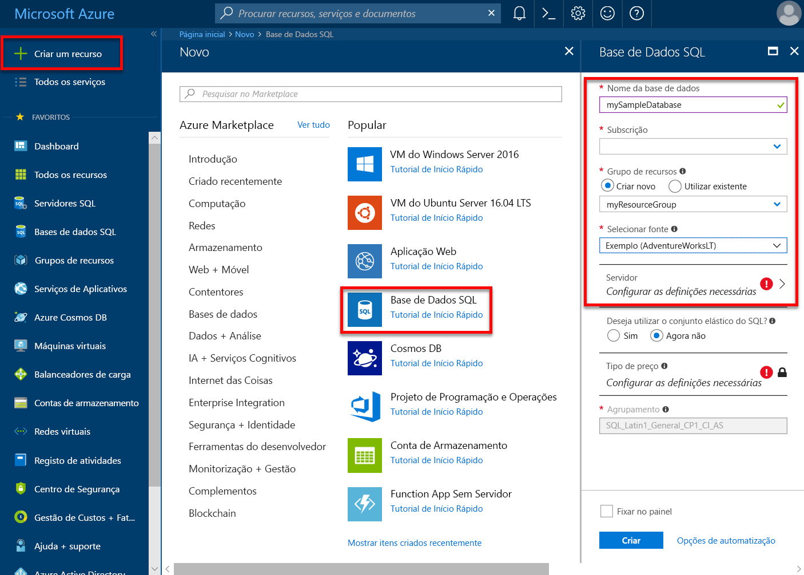
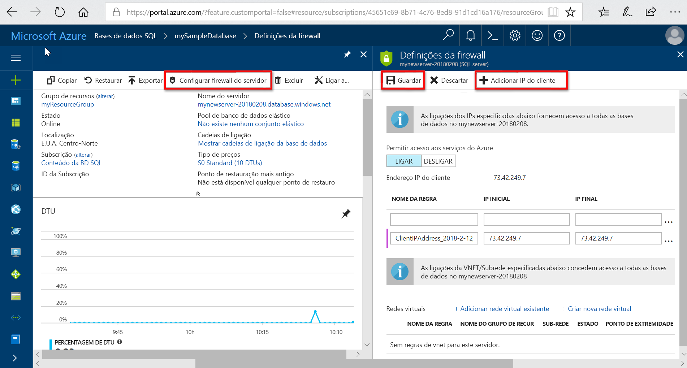

# Criar e gerir servidores lógicos e bases de dados individuais na base de dados do Azure SQL 

Pode criar e gerir bases de dados individuais com o portal do Azure, PowerShell, CLI do Azure, REST API e Transact-SQL e os servidores lógicos de bases de dados do Azure SQL.

## Portal do Azure: Gerir servidores lógicos e bases de dados

É possível criar o grupo de recursos da base de dados SQL do Azure antes do tempo ou ao criar o próprio servidor. Existem vários métodos para obter para um novo formulário do servidor SQL, através da criação de um novo servidor SQL ou como parte da criação de uma nova base de dados. 

### Criar um servidor SQL em branco (servidor lógico)

Para criar um servidor (sem uma base de dados) de base de dados do Azure SQL com o [portal do Azure](https://portal.azure.com), navegue para um formulário de servidor (servidor lógico) do SQL em branco.  

### Criar uma base de dados SQL de exemplo ou em branco

Para criar uma base de dados SQL do Azure com o [portal do Azure](https://portal.azure.com), navegue para um formulário de base de dados SQL em branco e forneça as informações pedidas. Pode criar o grupo de recursos e um servidor lógico antecipadamente ou ao criar o próprio banco de dados da base de dados SQL do Azure. Pode criar uma base de dados em branco ou criar uma base de dados de exemplo com base em Adventure Works LT. 

  

> [!IMPORTANT]
> Para obter informações sobre como selecionar o escalão de preço da base de dados, consulte [modelo de compra baseado em DTU](sql-database-service-tiers-dtu.md) e [modelo de compra baseado em vCore](sql-database-service-tiers-vcore.md).

Para criar uma instância gerida, veja [criar uma instância gerida](sql-database-managed-instance-create-tutorial-portal.md)

### Gerir um SQL server existente

Para gerir um servidor existente, navegue para o servidor utilizando um número de métodos - o como from página específica de banco de dados SQL, o **servidores SQL** página, ou o **todos os recursos** página. 

Para gerir uma base de dados existente, navegue para o **bases de dados SQL** página e clique em banco de dados que pretende gerir. Captura de ecrã seguinte mostra como começar a definição de uma firewall ao nível do servidor de bases de dados do **descrição geral** página para uma base de dados. 

    

> [!IMPORTANT]
> Para configurar propriedades de desempenho para bases de dados, consulte [modelo de compra baseado em DTU](sql-database-service-tiers-dtu.md) e [modelo de compra baseado em vCore](sql-database-service-tiers-vcore.md).
>

> [!TIP]
> Para um guia de introdução portal do Azure, consulte [criar uma base de dados SQL do Azure no portal do Azure](sql-database-get-started-portal.md).

## PowerShell: Gerir servidores lógicos e bases de dados

Para criar e gerir o servidor SQL do Azure, bases de dados e firewalls com o Azure PowerShell, utilize os seguintes cmdlets do PowerShell. Se precisar de instalar ou atualizar o PowerShell, veja [módulo de instalar o Azure PowerShell](/powershell/azure/install-azurerm-ps). 

> [!TIP]
> Para um início rápido do PowerShell, consulte [criar uma base de dados SQL do Azure única com o PowerShell](sql-database-get-started-portal.md). Para scripts de exemplo do PowerShell, consulte [utilize o PowerShell para criar uma base de dados SQL do Azure e configurar uma regra de firewall](scripts/sql-database-create-and-configure-database-powershell.md) e [monitorizar e dimensionar um único SQL da base de dados com o PowerShell](scripts/sql-database-monitor-and-scale-database-powershell.md).
>

| Cmdlet | Descrição |
| --- | --- |
|[New-AzureRmSqlDatabase](/powershell/module/azurerm.sql/new-azurermsqldatabase)|Cria uma base de dados |
|[Get-AzureRmSqlDatabase](/powershell/module/azurerm.sql/get-azurermsqldatabase)|Obtém um ou mais bases de dados|
|[Set-AzureRmSqlDatabase](/powershell/module/azurerm.sql/set-azurermsqldatabase)|Define as propriedades para uma base de dados ou move uma base de dados existente para um conjunto elástico|
|[Remove-AzureRmSqlDatabase](/powershell/module/azurerm.sql/remove-azurermsqldatabase)|Remove uma base de dados|
|[New-AzureRmResourceGroup](/powershell/module/azurerm.resources/new-azurermresourcegroup)|Cria um grupo de recursos|
|[New-AzureRmSqlServer](/powershell/module/azurerm.sql/new-azurermsqlserver)|Cria um servidor|
|[Get-AzureRmSqlServer](/powershell/module/azurerm.sql/get-azurermsqlserver)|Devolve informações sobre servidores|
|[Set-AzureRmSqlServer](https://docs.microsoft.com/powershell/module/azurerm.sql/set-azurermsqlserver)|Modifica as propriedades de um servidor|
|[Remove-AzureRmSqlServer](/powershell/module/azurerm.sql/remove-azurermsqlserver)|Remove um servidor|
|[New-AzureRmSqlServerFirewallRule](/powershell/module/azurerm.sql/new-azurermsqlserverfirewallrule)|Cria uma regra de firewall ao nível do servidor |
|[Get-AzureRmSqlServerFirewallRule](/powershell/module/azurerm.sql/get-azurermsqlserverfirewallrule)|Obtém as regras de firewall para um servidor|
|[Set-AzureRmSqlServerFirewallRule](/powershell/module/azurerm.sql/set-azurermsqlserverfirewallrule)|Modifica uma regra de firewall num servidor|
|[Remove-AzureRmSqlServerFirewallRule](/powershell/module/azurerm.sql/remove-azurermsqlserverfirewallrule)|Elimina uma regra de firewall de um servidor.|
| New-AzureRmSqlServerVirtualNetworkRule | Cria um [ *regra de rede virtual*](sql-database-vnet-service-endpoint-rule-overview.md), com base numa sub-rede que é um ponto de extremidade do serviço de rede Virtual. |

## CLI do Azure: Gerir servidores lógicos e bases de dados

Para criar e gerir o servidor SQL do Azure, bases de dados e firewalls com [CLI do Azure](/cli/azure), utilize o seguinte procedimento [base de dados de SQL do Azure CLI](/cli/azure/sql/db) comandos. Utilize o [Cloud Shell](/azure/cloud-shell/overview) para executar a CLI no seu browser ou [instale-a](/cli/azure/install-azure-cli) no macOS, Linux ou Windows. Para criar e gerir conjuntos elásticos, veja [conjuntos elásticos](sql-database-elastic-pool.md).

> [!TIP]
> Para um guia de introdução do CLI do Azure, consulte [criar uma base de dados SQL do Azure única com a CLI do Azure](sql-database-get-started-cli.md). Para scripts de exemplo da CLI do Azure, consulte [CLI de utilização para criar uma base de dados SQL do Azure e configurar uma regra de firewall](scripts/sql-database-create-and-configure-database-cli.md) e [CLI de utilização para monitorizar e dimensionar uma base de dados SQL](scripts/sql-database-monitor-and-scale-database-cli.md).
>

| Cmdlet | Descrição |
| --- | --- |
|[az sql db create](/cli/azure/sql/db#az_sql_db_create) |Cria uma base de dados|
|[az sql db list](/cli/azure/sql/db#az_sql_db_list)|Apresenta uma lista de todas as bases de dados e armazéns de dados num servidor, ou todas as bases de dados num conjunto elástico|
|[az sql db list-editions](/cli/azure/sql/db#az_sql_db_list_editions)|Os objetivos de serviço disponível de listas e os limites de armazenamento|
|[az sql db list-usages](/cli/azure/sql/db#az_sql_db_list_usages)|Devolve utilizações de base de dados|
|[show do AZ sql db](/cli/azure/sql/db#az_sql_db_show)|Obtém um armazém de dados ou base de dados|
|[az sql db update](/cli/azure/sql/db#az_sql_db_update)|Atualiza uma base de dados|
|[az sql db delete](/cli/azure/sql/db#az_sql_db_delete)|Remove uma base de dados|
|[az group create](/cli/azure/group#az_group_create)|Cria um grupo de recursos|
|[az sql server create](/cli/azure/sql/server#az_sql_server_create)|Cria um servidor|
|[az sql server list](/cli/azure/sql/server#az_sql_server_list)|Listas de servidores|
|[az sql server list-usages](/cli/azure/sql/server#az_sql_server_list_usages)|Devolve as utilizações de servidor|
|[show do AZ sql server](/cli/azure/sql/server#az_sql_server_show)|Obtém um servidor|
|[az sql server update](/cli/azure/sql/server#az_sql_server_update)|Um servidor de atualizações|
|[eliminação do AZ sql server](/cli/azure/sql/server#az_sql_server_delete)|Elimina um servidor|
|[Criar AZ sql server firewall-rule](/cli/azure/sql/server/firewall-rule#az_sql_server_firewall_rule_create)|Cria uma regra de firewall do servidor|
|[lista do AZ sql server firewall-rule](/cli/azure/sql/server/firewall-rule#az_sql_server_firewall_rule_list)|Lista as regras de firewall num servidor|
|[show do AZ sql server firewall-rule](/cli/azure/sql/server/firewall-rule#az_sql_server_firewall_rule_show)|Mostra os detalhes de uma regra de firewall|
|[atualização do AZ sql server firewall-rule](/cli/azure/sql/server/firewall-rule##az_sql_server_firewall_rule_update)|Atualiza uma regra de firewall|
|[eliminação do AZ sql server firewall-rule](/cli/azure/sql/server/firewall-rule#az_sql_server_firewall_rule_delete)|Elimina uma regra de firewall|

## O Transact-SQL: Gerir servidores lógicos e bases de dados

Para criar e gerir o servidor SQL do Azure, bases de dados e firewalls com Transact-SQL, utilize os seguintes comandos T-SQL. Pode emitir estes comandos no portal do Azure, [SQL Server Management Studio](/sql/ssms/use-sql-server-management-studio), [Visual Studio Code](https://code.visualstudio.com/docs), ou qualquer outro programa que pode ligar a um servidor de base de dados do Azure SQL e passar o Transact-SQL comandos. Para gerir conjuntos elásticos, veja [conjuntos elásticos](sql-database-elastic-pool.md).

> [!TIP]
> Para um início rápido com o SQL Server Management Studio no Microsoft Windows, consulte [SQL Database do Azure: Utilize o SQL Server Management Studio para ligar e consultar dados](sql-database-connect-query-ssms.md). Para um início rápido com o Visual Studio Code no macOS, Linux ou Windows, consulte [base de dados do Azure SQL: utilizar Visual Studio Code para ligar e consultar dados](sql-database-connect-query-vscode.md).

> [!IMPORTANT]
> Não é possível criar ou eliminar um servidor com o Transact-SQL.
>

| Comando | Descrição |
| --- | --- |
|[Criar base de dados (banco de dados SQL do Azure)](/sql/t-sql/statements/create-database-azure-sql-database)|Cria uma nova base de dados. Tem de estar ligado à base de dados principal para criar uma nova base de dados.|
| [Alterar base de dados (banco de dados SQL do Azure)](/sql/t-sql/statements/alter-database-azure-sql-database) |Modifica uma base de dados SQL do Azure. |
|[Alterar base de dados (Azure SQL Data Warehouse)](/sql/t-sql/statements/alter-database-azure-sql-data-warehouse)|Modifica um armazém de dados SQL do Azure.|
|[REMOVER a base de dados (Transact-SQL)](/sql/t-sql/statements/drop-database-transact-sql)|Elimina uma base de dados.|
|[sys.database_service_objectives (Azure SQL Database)](/sql/relational-databases/system-catalog-views/sys-database-service-objectives-azure-sql-database)|Devolve o edition (camada de serviço), o objetivo de serviço (escalão de preço) e o nome do conjunto elástico, se existir, para uma base de dados SQL do Azure ou um Azure SQL Data Warehouse. Se a sessão iniciada no banco de dados mestra num servidor de base de dados do Azure SQL, retorna informações sobre todas as bases de dados. Para o Azure SQL Data Warehouse, tem de estar ligado à base de dados mestra.|
|[dm db_resource_stats (Azure SQL Database)](/sql/relational-databases/system-dynamic-management-views/sys-dm-db-resource-stats-azure-sql-database)| Devolve o consumo de CPU, IO e memória para uma base de dados de base de dados do Azure SQL. Não existe uma linha para cada 15 segundos, mesmo que não existe nenhuma atividade na base de dados.|
|[resource_stats (Azure SQL Database)](/sql/relational-databases/system-catalog-views/sys-resource-stats-azure-sql-database)|Devolve os dados de armazenamento e utilização de CPU para uma base de dados do SQL do Azure. Os dados são recolhidos e agregados em intervalos de cinco minutos.|
|[sys.database_connection_stats (Azure SQL Database)](/sql/relational-databases/system-catalog-views/sys-database-connection-stats-azure-sql-database)|Contém as estatísticas de eventos de conectividade da base de dados de base de dados SQL, fornecendo uma visão geral de êxitos de ligação de base de dados e falhas. |
|[sys.event_log (Azure SQL Database)](/sql/relational-databases/system-catalog-views/sys-event-log-azure-sql-database)|Devolve as ligações de base de dados de base de dados do Azure SQL com êxito, falhas de ligação e deadlocks. Pode usar essas informações para controlar ou resolver problemas de sua atividade de base de dados com a base de dados SQL.|
|[sp_set_firewall_rule (Azure SQL Database)](/sql/relational-databases/system-stored-procedures/sp-set-firewall-rule-azure-sql-database)|Cria ou atualiza as definições de firewall ao nível do servidor para o seu servidor de base de dados SQL. Este procedimento armazenado só está disponível na base de dados mestra para o início de sessão principal ao nível do servidor. Uma regra de firewall ao nível do servidor só pode ser criada com o Transact-SQL após a primeira regra de firewall ao nível do servidor foi criada por um utilizador com permissões ao nível do Azure|
|[sys.firewall_rules (Azure SQL Database)](/sql/relational-databases/system-catalog-views/sys-firewall-rules-azure-sql-database)|Devolve informações sobre as definições de firewall ao nível do servidor associado à sua base de dados de SQL do Microsoft Azure.|
|[sp_delete_firewall_rule (Azure SQL Database)](/sql/relational-databases/system-stored-procedures/sp-delete-firewall-rule-azure-sql-database)|Remove as definições de firewall ao nível do servidor do seu servidor de base de dados SQL. Este procedimento armazenado só está disponível na base de dados mestra para o início de sessão principal ao nível do servidor.|
|[sp_set_database_firewall_rule (Azure SQL Database)](/sql/relational-databases/system-stored-procedures/sp-set-database-firewall-rule-azure-sql-database)|Cria ou atualiza as regras de firewall ao nível da base de dados para a sua base de dados do Azure SQL ou SQL Data Warehouse. Regras de firewall da base de dados podem ser configuradas para a base de dados mestra e para as bases de dados de utilizador na base de dados SQL. Regras de firewall da base de dados são úteis quando através de utilizadores de base de dados contidos. |
|[sys.database_firewall_rules (Azure SQL Database)](/sql/relational-databases/system-catalog-views/sys-database-firewall-rules-azure-sql-database)|Devolve informações sobre as definições de firewall ao nível da base de dados associado à sua base de dados de SQL do Microsoft Azure. |
|[sp_delete_database_firewall_rule (Azure SQL Database)](/sql/relational-databases/system-stored-procedures/sp-delete-database-firewall-rule-azure-sql-database)|Remove a definição de firewall ao nível da base de dados da sua base de dados do Azure SQL ou SQL Data Warehouse. |

## REST API: Gerir servidores lógicos e bases de dados

Para criar e gerir o servidor SQL do Azure, bases de dados e firewalls, utilize estes pedidos de REST API.

| Comando | Descrição |
| --- | --- |
|[Servidores – criar ou atualizar](/rest/api/sql/servers/createorupdate)|Cria ou atualiza um novo servidor.|
|[Servidores - Delete](/rest/api/sql/servers/delete)|Elimina um SQL server.|
|[Servidores - Get](/rest/api/sql/servers/get)|Obtém um servidor.|
|[Servidores - lista](/rest/api/sql/servers/list)|Devolve uma lista de servidores.|
|[Servidores - lista por grupo de recursos](/rest/api/sql/servers/listbyresourcegroup)|Devolve uma lista de servidores num grupo de recursos.|
|[Servidores - atualização](/rest/api/sql/servers/update)|Atualiza um servidor existente.|
|[Bases de dados - criar ou atualizar](/rest/api/sql/databases/createorupdate)|Cria uma nova base de dados ou atualiza a base de dados existente.|
|[Bases de dados - Get](/rest/api/sql/databases/get)|Obtém uma base de dados.|
|[Bases de dados - lista por conjunto elástico](/rest/api/sql/databases/listbyelasticpool)|Devolve uma lista de bases de dados num conjunto elástico.|
|[Bases de dados - lista por servidor](/rest/api/sql/databases/listbyserver)|Devolve uma lista de bases de dados num servidor.|
|[Bases de dados - atualização](/rest/api/sql/databases/update)|Atualiza a base de dados existente.|
|[Regras - de firewall criar ou atualizar](/rest/api/sql/firewallrules/createorupdate)|Cria ou atualiza uma regra de firewall.|
|[Regras de firewall - Delete](/rest/api/sql/firewallrules/delete)|Elimina uma regra de firewall.|
|[Regras de firewall - Get](/rest/api/sql/firewallrules/get)|Obtém uma regra de firewall.|
|[Regras de firewall - lista por servidor](/rest/api/sql/firewallrules/listbyserver)|Devolve uma lista de regras de firewall.|

## Passos Seguintes

- Para saber mais sobre como migrar uma base de dados do SQL Server para o Azure, veja [migre para o Azure SQL Database](sql-database-cloud-migrate.md).
- Para obter informações sobre as funcionalidades suportadas, veja [Funcionalidades](sql-database-features.md).
