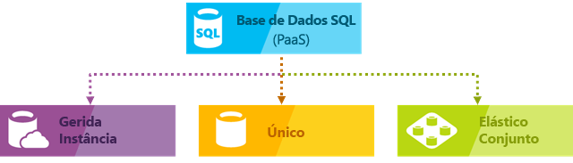

# O serviço de base de dados do Azure SQL

A Base de Dados SQL é um serviço gerido de bases de dados relacionais para fins gerais do Microsoft Azure que suporta estruturas como dados relacionados, JSON, espaciais e XML. A Base de Dados SQL oferece desempenho dinamicamente dimensionável em dois modelos de compra diferentes: um [modelo de compra baseado em vCore](sql-database-service-tiers-vcore.md) e um [modelo de compra baseado em DTU](sql-database-service-tiers-dtu.md). A Base de Dados SQL disponibiliza também opções como [índices columnstore](https://docs.microsoft.com/sql/relational-databases/indexes/columnstore-indexes-overview) para análises e relatórios aprofundados e [OLTP dentro da memória](sql-database-in-memory.md) para processamento transacional avançado. A Microsoft lida com a aplicação de patches e a atualização da base de código do SQL ininterruptamente e abstrai toda a gestão da infraestrutura subjacente.

A Base de Dados SQL do Azure oferece as seguintes opções de implementação para bases de dados SQL do Azure:

- Uma base de dados individual com o seu próprio conjunto de recursos geridos através de um servidor lógico
- Como uma base de dados agrupada num [conjunto elástico](sql-database-elastic-pool.md) com um conjunto partilhado de recursos geridos através de um servidor lógico
- Como parte de uma coleção de bases de dados conhecida como uma [instância gerida](sql-database-managed-instance.md) que contém o sistema e bases de dados de utilizador e um conjunto de recursos de partilha

A ilustração seguinte mostra estas opções de implementação:

 

A Base de Dados SQL partilha a base de código com o [motor de bases de dados do Microsoft SQL Server](https://docs.microsoft.com/sql/sql-server/sql-server-technical-documentation). Com a estratégia da cloud prioritária da Microsoft, as mais recentes capacidades do SQL Server são lançadas primeiro na Base de Dados SQL e, depois, no próprio SQL Server. Esta abordagem disponibiliza-lhe as últimas capacidades do SQL Server sem sobrecarga em termos de aplicação de patches ou atualizações - com estas funcionalidades novas testadas em milhões de bases de dados. Para obter informações sobre as novas capacidades quando são anunciadas, veja:

- **[Mapa do Azure para a Base de Dados SQL](https://azure.microsoft.com/roadmap/?category=databases)**: o local onde encontra as novidades atuais e futuras.
- **[blogue da Base de Dados SQL do Azure](https://azure.microsoft.com/blog/topics/database)**: o local onde os membros da equipa de produto do SQL Server escrevem sobre as notícias e as funcionalidades da Base de Dados SQL.

> [!IMPORTANT]
> Para saber as diferenças de funcionalidades entre a Base de Dados SQL e o SQL Server, consulte [Funcionalidades SQL](sql-database-features.md).

Base de dados SQL proporciona um desempenho previsível com vários tipos de recursos, escalões de serviço e tamanhos de computação que fornece escalabilidade dinâmica sem tempo de inatividade, otimização inteligente incorporada, escalabilidade global e disponibilidade e segurança avançada Opções — tudo com quase sem administração. Estas capacidades permitem-lhe concentrar-se no desenvolvimento rápido de aplicações e acelerar o seu tempo de colocação no mercado, em vez de alocar tempo e recursos valiosos para a gestão de máquinas virtuais e de infraestruturas. O serviço Base de Dados SQL encontra-se atualmente em 38 datacenters em todo o mundo, sendo que são colocados online mais datacenters regularmente, o que lhe permite executar a sua base de dados num datacenter perto de si.

## Dimensionar o desempenho e os conjuntos

Base de dados SQL, cada base de dados é isolada umas das outras e portáteis, tendo cada um com sua própria camada de serviços dentro do [o modelo de compra baseado em DTU](sql-database-service-tiers-dtu.md) ou [o modelo de compra baseado em vCore](sql-database-service-tiers-vcore.md) e um garantida tamanho de computação. Base de dados SQL fornece diferentes tamanhos de computação para diferentes necessidades e permite a bases de dados ser agrupados para maximizar a utilização de recursos e poupar dinheiro.

- Com o [mi](sql-database-managed-instance.md), cada instância está isolada das restantes instâncias com recursos garantidos. Para obter mais informações, veja [Instância Gerida da Base de Dados SQL](sql-database-managed-instance.md).
- Com o [camada de serviços de Hiperescala](sql-database-service-tier-hyperscale.md) (pré-visualização) o modelo de compra de vCore, pode aumenta para 100 TB com cópia de segurança rápida e recursos de restauração.

### Ajuste o desempenho e dimensione a capacidade sem períodos de indisponibilidade

A Base de Dados SQL disponibiliza um [modelo de compra baseado em DTU](sql-database-service-tiers-dtu.md) ou um [modelo de compra baseado em vCore](sql-database-service-tiers-vcore.md).

- O modelo de compra baseado em DTU oferece um blend de computação, memória e recursos de E/S em três camadas de serviço para suportar cargas de trabalho de base de dados leves a pesadas: Basic, Standard e Premium. Computação tamanhos dentro de cada camada fornecem uma mistura diferentes destes recursos, ao qual pode adicionar recursos de armazenamento adicionais.
- O modelo de compra baseado em vCore permite-lhe escolher o número de vCores, a quantidade ou memória e a quantidade e velocidade de armazenamento.

Pode criar a primeira aplicação numa base de dados pequena e individual a um baixo custo por mês no escalão de serviço para fins gerais e, em seguida, alterar o escalão de serviço manual ou programaticamente em qualquer altura para a camada de negócio críticos de serviço para satisfazer as necessidades da sua solução. Pode ajustar o desempenho sem provocar tempos de inatividade na aplicação ou nos clientes. A escalabilidade dinâmica permite que a base de dados responda de forma transparente a requisitos de recursos em rápida mutação e permite-lhe pagar apenas pelos recursos de que precisa, quando precisa.

> [!IMPORTANT]
> O [camada de serviços de Hiperescala](sql-database-service-tier-hyperscale.md) está atualmente em pré-visualização pública. Não recomendamos a execução de qualquer carga de trabalho de produção nos bancos de dados de Hiperescala ainda. Não é possível atualizar uma base de dados de Hiperescala para outros escalões de serviço. Para fins de teste, recomendamos que faça uma cópia da base de dados atual e atualizar a cópia para a camada de serviços de Hiperescala....

A escalabilidade dinâmica é diferente do dimensionamento automático. O dimensionamento automático é quando um serviço é dimensionado automaticamente com base em critérios, enquanto a escalabilidade dinâmica permite o dimensionamento manual sem períodos de indisponibilidade. Uma Base de Dados SQL do Azure única suporta a escalabilidade dinâmica manual, mas não o dimensionamento automático. Para uma experiência mais *automática*, considere utilizar conjuntos elásticos, que permitem que as bases de dados partilhem recursos num conjunto com base nas necessidades individuais da base de dados. No entanto, existem scripts que podem ajudar a automatizar a escalabilidade de uma Base de Dados SQL do Azure única. Por exemplo, veja [Utilizar o PowerShell para monitorizar e dimensionar uma Base de Dados SQL única](scripts/sql-database-monitor-and-scale-database-powershell.md).

### Conjuntos elásticos para maximizar a utilização de recursos

Para muitas empresas e aplicações, ser capaz de criar bases de dados individuais e aumentar e reduzir o desempenho a pedido é suficiente, sobretudo se os padrões de utilização forem relativamente previsíveis. No entanto, se tiver padrões de utilização imprevisíveis, pode tornar-se difícil gerir os custos e o seu modelo de negócio. Os [conjuntos elásticos](sql-database-elastic-pool.md) foram concebidos para resolver este problema. O conceito é simples. Os recursos de desempenho são alocados a um conjunto em vez de a uma base de dados individual e paga os recursos de desempenho coletivo do conjunto em vez do desempenho da base de dados individual.

   

Com os conjuntos elásticos, não tem de se concentrar em ajustar o desempenho da base de dados à medida que a procura pelos recursos flutua. As bases de dados agrupadas consomem os recursos de desempenho do conjunto elástico conforme necessário. As bases de dados agrupadas consomem os limites do conjunto, mas não os excedem, pelo que os seus custos se mantêm previsíveis, mesmo que a utilização das bases de dados não. Além disso, pode [adicionar e remover bases de dados do conjunto](sql-database-elastic-pool-manage-portal.md), dimensionando a sua aplicação de um punhado de bases de dados para milhares, tudo dentro de um orçamento controlado por si. Também pode controlar os recursos mínimos e máximos disponíveis para as bases de dados do conjunto, para garantir que nenhuma utiliza todos os recursos e que todas as bases de dados agrupadas têm uma quantidade mínima garantida de recursos. Para saber mais sobre os padrões de estrutura de aplicações SaaS que utilizam conjuntos elásticos, veja [Design Patterns for Multi-tenant SaaS Applications with SQL Database](sql-database-design-patterns-multi-tenancy-saas-applications.md) (Padrões de Design para Aplicações SaaS multi-inquilino com a Base de Dados SQL).

Os scripts podem ajudar na monitorização e no dimensionamento dos conjuntos elásticos. Por exemplo, veja [Utilizar o Azure PowerShell para monitorizar e dimensionar um conjunto elástico SQL na Base de Dados SQL do Azure](scripts/sql-database-monitor-and-scale-pool-powershell.md)

> [!IMPORTANT]
> A Instância Gerida da Base de Dados SQL não suporta conjuntos elásticos.

### Combinar bases de dados individuais com bases de dados agrupadas

Qualquer que seja a sua opção — bases de dados individual ou conjuntos elásticos —, não está limitado. Pode misturar bases de dados individuais com conjuntos elásticos e alterar os escalões de serviço das bases de dados individuais e dos conjuntos elásticos rápida e facilmente para os adaptar à sua situação. Com o poder e a o alcance do Azure, pode combinar outros serviços do Azure com a Base de Dados SQL para satisfazer as necessidades de design da sua aplicação única, aumentar as eficiências de custos e recursos e conseguir novas oportunidades de negócio.

### Capacidades alargadas de monitorização e alertas

Mas como pode comparar o desempenho relativo das bases de dados individuais e dos conjuntos elásticos? Como pode saber qual é o ponto de paragem certo quando aumenta ou reduz verticalmente o desempenho? Utilize a [monitorização de desempenho incorporada](sql-database-performance.md) e as ferramentas de [alerta](sql-database-insights-alerts-portal.md) juntamente com as classificações de desempenho. Com estas ferramentas, pode avaliar rapidamente o impacto de aumentar ou reduzir verticalmente consoante as necessidades de desempenho atuais ou do projeto. Veja o [modelo de compra baseado em DTU](sql-database-service-tiers-dtu.md) e o [modelo de compra baseado em vCore](sql-database-service-tiers-vcore.md) para obter mais detalhes.

Além disso, a Base de Dados SQL pode [emitir métricas e registos de diagnósticos](sql-database-metrics-diag-logging.md) para uma monitorização mais fácil. Pode configurar a Base de Dados SQL para armazenar a utilização de recursos, funções de trabalho e sessões e a conectividade a um dos recursos do Azure seguintes:

- **Armazenamento do Azure**: para arquivar grandes quantidades de telemetria a um preço baixo
- **Hub de Eventos do Azure**: para integrar a telemetria da Base de Dados SQL na sua solução personalizada de monitorizção ou em pipelines ativos.
- **Azure Log Analytics**: para uma solução de monitorização incorporada com capacidade para relatórios, alertas e mitigação. O Azure Log Analytics é um recurso do [Operations Management Suite (OMS)](../operations-management-suite/operations-management-suite-overview.md)

    

## Capacidades de disponibilidade

O contrato de nível de serviço [(SLA)](http://azure.microsoft.com/support/legal/sla/) do Azure líder da indústria, que garante 99,99% de disponibilidade, com tecnologia de uma rede global de datacenters geridos pela Microsoft, ajuda a manter a sua aplicação operacional 24 horas por dia, sete dias por semana. A plataforma do Azure gere totalmente cada Base de Dados SQL do Azure e garante que nenhum dado é perdido e elevada percentagem de disponibilidade de dados. O Azure gere automaticamente a aplicação de patches, as cópias de segurança, a replicação, a deteção de falhas, falhas potenciais subjacentes de hardware, software ou rede, a implementação de correções de erros, as ativações pós-falha, as atualizações da base de dados e outras tarefas de manutenção. A disponibilidade standard é conseguida por uma separação das camadas de armazenamento e computação. A disponibilidade premium é alcançada ao integrar a computação e o armazenamento num único nó para obter desempenho e, em seguida, implementar Grupos de Disponibilidade Always nos bastidores. Para uma discussão completa sobre as capacidades de elevada disponibilidade da base de dados do Azure SQL, consulte [disponibilidade de base de dados SQL](sql-database-high-availability.md). Além disso, a Base de Dados SQL proporciona funcionalidades de [continuidade de negócio e escalabilidade global](sql-database-business-continuity.md):

- **[Cópias de segurança automáticas](sql-database-automated-backups.md)**: a Base de Dados SQL faz cópias de segurança completas, diferenciais e de registos de transações.
- **[Restauros para um ponto anterior no tempo](sql-database-recovery-using-backups.md)**: a Base de Dados SQL suporta a recuperação para qualquer ponto anterior no tempo dentro do período de retenção de cópias de segurança automáticas.
- **[Georreplicação ativa](sql-database-geo-replication-overview.md)**: a Base de Dados SQL permite-lhe configurar até quatro bases de dados legíveis secundárias no mesmo ou nos datacenters do Azure distribuídos globalmente.  Por exemplo, se tiver uma aplicação SaaS com uma base de dados de catálogo que tem um volume elevado de transações só de leitura simultâneas, utilize a georreplicação ativa para permitir uma escala de leitura global e remover estrangulamentos na base de dados principal que se devam a cargas de trabalho de leitura. 
- **[Grupos de ativação pós-falha](sql-database-geo-replication-overview.md)**: a Base de Dados SQL permite-lhe ativar a disponibilidade elevada e o balanceamento de carga numa escala global, incluindo georreplicação transparente e ativações pós-falha de conjuntos de dados grandes e conjuntos elásticos. Com os grupos de ativação pós-falha e a georreplicação ativa, é possível criar aplicações SaaS distribuídas globalmente com uma sobrecarga mínima em termos de administração, ficando a cabo da Base de Dados SQL a monitorização complexa, o encaminhamento e a orquestração de ativações pós-falha.
- **[Bases de dados com redundância de zona](sql-database-high-availability.md)**: a Base de Dados SQL permite-lhe aprovisionar bases de dados ou conjuntos elásticos Premium ou Críticos para a Empresa em várias zonas de disponibilidade. Uma vez que estas bases de dados e os conjuntos elásticos têm várias réplicas redundantes para elevada disponibilidade, a colocação destas réplicas em várias zonas de disponibilidade permite uma maior resiliência, incluindo a capacidade de recuperar automaticamente de falhas à escala do datacenter sem perda de dados.  

## Inteligência incorporada

Com a Base de Dados SQL, pode tirar partido da inteligência incorporada que o ajuda a reduzir significativamente os custos de execução e gestão de bases de dados e que maximiza, tanto o desempenho, como a segurança, da sua aplicação. Executando milhões de cargas de trabalho dos clientes ininterruptamente, a Base de Dados SQL recolhe e processa uma gigantesca quantidade de dados de telemetria, respeitando também totalmente a privacidade dos clientes em segundo plano. Vários algoritmos avaliam continuamente os dados de telemetria, de modo a que o serviço possa aprender e adaptar-se com a sua aplicação. Com babe nestas análises, o serviço oferece recomendações de melhoria do desempenho, personalizadas à medida da sua carga de trabalho específica. 

### Monitorização e otimização de desempenho automático

A Base de Dados SQL disponibiliza informações detalhadas sobre as consultas que tem de monitorizar. Aprende os padrões da sua base de dados e permite-lhe adaptar o esquema da mesma à carga de trabalho. A Base de Dados SQL disponibiliza [recomendações de otimização de desempenho](sql-database-advisor.md), onde pode ver as ações de otimização e aplicá-las. 

No entanto, a monitorização contínua de bases de dados é uma tarefa difícil e entediante, especialmente se forem muitas. As [Informações inteligentes](sql-database-intelligent-insights.md) realizam esta tarefa para si, ao monitorizar automaticamente o desempenho da Base de Dados SQL em escala e ainda o informa sobre os problemas de degradação de desempenho, identifica a causa do problema e oferece recomendações de melhorias de desempenho, sempre que possível.

Pode ser impossível gerir eficazmente um grande número de bases de dados, mesmo tendo em conta todas as ferramentas e relatórios que a Base de Dados SQL e o Azure proporcionam. Em vez de monitorizar e otimizar a sua base de dados manualmente, pode considerar utilizar a [otimização automática](sql-database-automatic-tuning.md) para delegar algumas das ações de monitorização e otimização à Base de Dados SQL. A Base de Dados SQL aplica recomendações, testa e verifica automaticamente todas as ações de otimização, para garantir que o desempenho continua a melhorar. Desta forma, a Base de Dados SQL adapta-se automaticamente à sua carga de trabalho de forma controlada e segura. A otimização automática significa que o desempenho da sua base de dados é cuidadosamente monitorizado e comparado antes e depois de cada ação de otimização e, caso não melhore, as ações são revertidas.

Hoje em dia, muitos dos nossos parceiros que executam [aplicações SaaS multi-inquilino](sql-database-design-patterns-multi-tenancy-saas-applications.md) tendo a Base de Dados SQL como base confiam na otimização de desempenho automática, para garantir que as aplicações têm sempre um desempenho estável e previsível. Para estes parceiros, esta funcionalidade reduz significativamente o risco de ocorrência de incidentes de desempenho a meio da noite. Além disso, uma vez que parte da base de clientes deles também utiliza o SQL Server, os parceiros utilizam as mesmas recomendações de indexação disponibilizadas pela Base de Dados SQL para ajudar os clientes do SQL Server.

Estão disponíveis dois aspetos de otimização automática na [Base de Dados SQL](sql-database-automatic-tuning.md):

- **Gestão de índices automática**: identifica os índices que devem ser adicionados à sua base de dados e os que devem ser removidos.
- **Correção de planos automática**: identifica planos problemáticos e corrige problemas de desempenho dos planos do SQL (brevemente; já disponível no SQL Server 2017).

### Processamento de consultas adaptável

Também adicionámos o conjunto de funcionalidades de [processamento de consultas adaptável](/sql/relational-databases/performance/adaptive-query-processing) à Base de Dados SQL, incluindo a execução intercalada para funções de valor de tabela com múltiplas instruções, feedback de concessão de memória no modo de lote e associações adaptativas no modo de lote. Todas estas funcionalidades de processamento de consultas adaptativo aplica técnicas de “aprendizagem e adaptação” semelhantes, o que ajuda a ir ainda mais longe na resolução de problemas de desempenho relacionados com questões de otimização de consultas historicamente complicadas.

## Segurança e conformidade avançadas

A Base de Dados SQL proporciona um conjunto de [funcionalidades de segurança e conformidade incorporadas](sql-database-security-overview.md), para ajudar a sua aplicação a cumprir diversos requisitos de segurança e conformidade. 

### Proteção Avançada Contra Ameaças

O SQL Advanced Threat Protection é um pacote unificado para capacidades avançadas de segurança do SQL. Inclui a funcionalidade para detetar e classificar dados confidenciais, gerir as vulnerabilidades da sua base de dados e detetar atividades anómalas que podem indicar uma ameaça à sua base de dados. Oferece uma localização única para ativar e gerir estas capacidades.

- A [Deteção de Dados e Classificação](sql-database-data-discovery-and-classification.md) (atualmente em pré-visualização) oferece capacidades incorporadas na Base de Dados SQL do Azure para detetar, classificar, etiquetar e proteger os dados confidenciais nas suas bases de dados. Pode ser utilizada para oferecer visibilidade sobre o estado de classificação da base de dados e para controlar o acesso aos dados confidenciais na base de dados e além dos respetivos limites.
- A [Avaliação da Vulnerabilidade](sql-vulnerability-assessment.md) é um serviço fácil de configurar que pode detetar, controlar e ajudar a corrigir potenciais vulnerabilidades da base de dados. Oferece visibilidade sobre o estado de segurança e inclui passos acionáveis para resolver problemas de segurança e melhorar as fortificações da sua base de dados.
- A [Deteção de Ameaças](sql-database-threat-detection.md) deteta ameaças anómalas que indicam tentativas potencialmente perigosas e invulgares para aceder ou explorar a sua base de dados. Monitoriza continuamente a sua base de dados quanto a atividades suspeitas e apresenta alertas de segurança imediata em potenciais vulnerabilidades, ataques de injeção SQL e padrões de acesso de base de dados anómalos. Os alertas da Deteção de Ameaças mostram detalhes da atividade suspeita e a ação recomendada para investigar e mitigar essa ameaça.

### Auditoria para conformidade e segurança

A [Auditoria da Base de Dados SQL](sql-database-auditing.md) regista os eventos da base de dados e escreve-os num registo de auditoria na sua conta de armazenamento do Azure. A auditoria pode ajudá-lo a manter a conformidade regulatória, a compreender as atividades da base de dados e a obter informações relativas a discrepâncias e anomalias que possam traduzir preocupações comerciais ou suspeitas de violações de segurança.

### Encriptação de dados

A Base de Dados SQL protege os seus dados ao oferecer encriptação para dados em movimento com [Transport Layer Security](https://support.microsoft.com/kb/3135244), para dados inativos com [Encriptação de Dados Transparente](https://docs.microsoft.com/sql/relational-databases/security/encryption/transparent-data-encryption-azure-sql) e para dados em utilização com [Always Encrypted](https://docs.microsoft.com/sql/relational-databases/security/encryption/always-encrypted-database-engine).

### Integração do Azure Active Directory e a autenticação multifator

A Base de Dados SQL permite-lhe gerir centralmente identidades de utilizadores de bases de dados e outros serviços Microsoft com a [integração do Azure Active Directory](sql-database-aad-authentication.md). Esta capacidade simplifica a gestão de permissões e melhora a segurança. O Azure Active Directory suporta a [autenticação multifator](sql-database-ssms-mfa-authentication.md) (MFA), para aumentar a segurança de dados e aplicações, suportando, ao mesmo tempo, um processo de início de sessão único.

### Certificação de conformidade

A Base de Dados SQL participa em auditorias regulares e foi certificada por várias normas de conformidade. Para obter mais informações, veja o [Centro de Fidedignidade do Microsoft Azure](https://azure.microsoft.com/support/trust-center/), onde pode encontrar a lista mais recente de [certificações de conformidade da Base de Dados SQL](https://azure.microsoft.com/support/trust-center/services/).

## Ferramentas fáceis de utilizar

Com a Base de Dados SQL, criar e manter aplicações é mais fácil e produtivo. A Base de Dados SQL permite-lhe dedicar-se ao que sabe fazer melhor: criar aplicações excelentes. Pode gerir e programar na Base de Dados SQL com as ferramentas e as competências que já tem.

- **[O portal do Azure](https://portal.azure.com/)**: uma aplicação baseada na Web para gerir todos os serviços do Azure 
- **[SQL Server Management Studio](https://docs.microsoft.com/sql/ssms/download-sql-server-management-studio-ssms)**: uma aplicação de cliente gratuita e transferível para gerir qualquer infraestrutura do SQL, desde o SQL Server à Base de Dados SQL
- **[SQL Server Data Tools in Visual Studio](https://docs.microsoft.com/sql/ssdt/download-sql-server-data-tools-ssdt)**: uma aplicação de cliente gratuita e transferível para programar bases de dados relacionais do SQL Server, bases de dados SQL do Azure, pacotes do Integration Services, modelos de dados do Analysis Services e relatórios do Reporting Services.
- **[Visual Studio Code](https://code.visualstudio.com/docs)**: um editor de código, gratuito, transferível e de código aberto para Windows, macOS e Linux que suporta extensões, incluindo a [extensão mssql](https://aka.ms/mssql-marketplace), para consultar o Microsoft SQL Server, a Base de Dados SQL do Azure e o SQL Data Warehouse.

A Base de Dados suporta a criação de aplicações com Python, Java, Node.js, PHP, Ruby e .NET em macOS, Linux e Windows. A Base de Dados SQL suporta as mesmas [bibliotecas de ligações](sql-database-libraries.md) que o SQL Server.

## Envolver a equipa de engenharia do SQL Server

- [DBA Stack Exchange](https://dba.stackexchange.com/questions/tagged/sql-server): colocar questões de administração de base de dados
- [Stack Overflow](http://stackoverflow.com/questions/tagged/sql-server): colocar questões de desenvolvimento
- [Fóruns do MSDN](https://social.msdn.microsoft.com/Forums/home?category=sqlserver): colocar questões técnicas
- [Comentários](http://aka.ms/sqlfeedback): relatar erros e pedir funcionalidades
- [Reddit](https://www.reddit.com/r/SQLServer/): discutir sobre o SQL Server

## Passos Seguintes

- Consultar a [página de preços](https://azure.microsoft.com/pricing/details/sql-database/) para ver comparações de preços e calculadoras de bases de dados individuais e conjuntos elásticos.

- Veja estes guias de introdução para começar:

  - [Criar uma base de dados SQL no portal do Azure](sql-database-get-started-portal.md)  
  - [Criar uma base de dados SQL com a CLI do Azure](sql-database-get-started-cli.md)
  - [Criar uma base de dados SQL utilizando o PowerShell](sql-database-get-started-powershell.md)

- Para um conjunto de amostras de CLI do Azure e PowerShell, veja:
  - [Exemplos da CLI do Azure para a Base de Dados SQL (Azure CLI samples for SQL Database)](sql-database-cli-samples.md)
  - [Exemplos do Azure PowerShell para a Base de Dados SQL (Azure PowerShell samples for SQL Database)](sql-database-powershell-samples.md)
