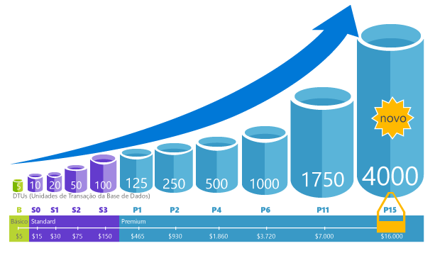

# Base de dados (DTUs) de unidades de transação e unidades de transação de base de dados elásticas (eDTUs)
Este artigo explica as Unidades de Transação da Base de Dados (DTUs) e as Unidades de Transação da Base de Dados Elástica (eDTUs) e o que acontece quando atinge o limite máximo de DTUs ou eDTUs. Para informações específico sobre os preços, consulte [preços da SQL Database do Azure](https://azure.microsoft.com/pricing/details/sql-database/single/).

## Quais são as unidades de transação de base de dados (DTUs)?
Para uma única base de dados do SQL do Azure a um nível de desempenho específicos dentro de um [camada de serviço](sql-database-single-database-resources.md), Microsoft garante que um determinado nível de recursos para a base de dados (independentemente de qualquer outra base de dados na nuvem do Azure), fornecendo um nível de desempenho previsível. A quantidade de recursos é calculada como um número de unidades de transação de base de dados ou DTUs e é uma medida agrupada de computação, armazenamento e recursos de e/s. O rácio entre estes recursos foi originalmente determinado por uma [carga de trabalho OLTP benchmark](sql-database-benchmark-overview.md), concebida para ser típico de cargas de trabalho do mundo real OLTP. Quando a carga de trabalho excede a quantidade de qualquer um destes recursos, o débito é otimizadas - resultante de desempenho mais lento e de tempos limite. Os recursos utilizados pela sua carga de trabalho não afetam os recursos disponíveis para outras bases de dados do SQL Server na nuvem do Azure e os recursos utilizados por outras cargas de trabalho não afetar os recursos disponíveis para a base de dados do SQL Server.

As DTUs são mais úteis para compreender a quantidade de recursos entre bases de dados do Azure SQL níveis de desempenho diferentes e escalões de serviço relativa. Por exemplo, duplicando as DTUs ao aumentar o nível de desempenho de uma base de dados equivale a duplicando o conjunto de recursos disponíveis para a base de dados. Por exemplo, uma base de dados Premium P11 com 1750 DTUs fornece 350 x mais potência de computação de DTUs do que uma base de dados básica com cinco DTUs.  

Para obter informações mais aprofundada sobre o consumo de recursos (DTU) da sua carga de trabalho, utilize [Azure SQL da base de dados Query Performance Insight](sql-database-query-performance.md) para:

- Identificar os principais de consultas por contagem de CPU/duração/execução que potencialmente pode ser otimizada para um melhor desempenho. Por exemplo, uma consulta exigente em termos de e/s pode beneficiar da utilização de [técnicas de otimização de memória](sql-database-in-memory.md) para tornar o melhor utilização de memória disponível num determinado e o desempenho do escalão de nível de serviço.
- Desagregar os detalhes de uma consulta, ver o texto e o histórico de utilização de recursos.
- Desempenho de acesso de otimização de recomendações que mostram as ações executadas pelo [SQL Database Advisor](sql-database-advisor.md).

Pode alterar [escalões de serviço DTU](sql-database-service-tiers-dtu.md) em qualquer altura, sem período de indisponibilidade mínimo para a sua aplicação (em média, menos em quatro segundos). Para muitas empresas e aplicações, ser capaz de criar bases de dados e aumentar e reduzir o desempenho a pedido é suficiente, sobretudo se os padrões de utilização forem relativamente previsíveis. No entanto, se tiver padrões de utilização imprevisíveis, pode tornar-se difícil gerir os custos e o seu modelo de negócio. Para este cenário, utilize um conjunto elástico com um determinado número de eDTUs que são partilhadas entre várias bases de dados no conjunto.

## Quais são as unidades de transação de base de dados elásticas (eDTUs)?
Em vez do que fornecem um conjunto de recursos (DTUs) que pode não ser sempre necessária para uma base de dados do SQL Server que está sempre disponível dedicado, pode colocar as bases de dados para um [conjunto elástico](sql-database-elastic-pool.md) num servidor de base de dados SQL que partilha um conjunto de recursos entre essas bases de dados. Os recursos partilhados num conjunto elástico são avaliados por elástico unidades de transação de base de dados ou eDTUs. Conjuntos elásticos fornecem uma solução económica simple para gerir os objetivos de desempenho para ter vários amplamente várias bases de dados e padrões de utilização imprevisíveis. Um conjunto elástico garantias de recursos não podem ser consumidos por uma base de dados no agrupamento, enquanto garantir que cada base de dados no conjunto sempre tem uma quantidade mínima de recursos necessários disponíveis. 

Um conjunto é atribuído um número definido de eDTUs para um preço do conjunto. Dentro do conjunto elástico, é dada às bases de dados individuais a flexibilidade para se dimensionarem automaticamente dentro dos limites configurados. Uma base de dados com mais pesada carga irá consumir mais eDTUs para satisfazer o pedido. Bases de dados mais ligeira cargas irão consumir menos eDTUs. Bases de dados com nenhuma carga irão consumir não eDTUs. Por recursos para o conjunto completo de aprovisionamento, vez por base de dados, tarefas de gestão são simplificadas, fornecendo um orçamento previsível para o conjunto.

Podem ser adicionais mais eDTUs a um conjunto existente sem qualquer período de indisponibilidade da base de dados e sem impacto nas bases de dados do conjunto. Do mesmo modo, se as eDTUs adicionais já não forem necessárias, podem ser removidas de um conjunto existente em qualquer momento. Pode adicionar ou subtrair bases de dados para o conjunto ou limite a quantidade de edtus que uma base de dados pode utilizar com muita carga reservar eDTUs para outras bases de dados. Se uma base de dados é previsibilidade em-a utilização de recursos, pode movê-la fora do conjunto e configurá-lo como uma base de dados com uma quantidade previsível de recursos necessários.

## Como posso determinar o número de DTUs necessárias para a minha carga de trabalho?
Se pretender migrar a carga de trabalho de uma máquina virtual do SQL Server ou no local existente para a Base de Dados SQL do Azure, pode utilizar a [Calculadora de DTUs](http://dtucalculator.azurewebsites.net/) para se aproximar do número de DTUs necessárias. Para uma carga de trabalho existente do SQL Database do Azure, pode utilizar [SQL da base de dados Query Performance Insight](sql-database-query-performance.md) para compreender o consumo de recursos de base de dados (DTUs) para obter conhecimentos aprofundados mais aprofundado para otimizar a carga de trabalho. Também pode utilizar o [sys.dm_db_ resource_stats](https://msdn.microsoft.com/library/dn800981.aspx) DMV para ver o consumo de recursos de última hora. Em alternativa, a vista de catálogo [resource_stats](http://msdn.microsoft.com/library/dn269979.aspx) mostra o consumo de recursos para os últimos 14 dias, mas numa fidelidade inferior de médias de cinco minutos.

## Como posso saber se poderia beneficiar de um conjunto elástico de recursos?
Os conjuntos são adequados para um grande número de bases de dados com padrões de utilização específicos. Para uma determinada base de dados, este padrão é caracterizado por uma média de utilização baixa com os picos de utilização relativamente pouco frequente. A Base de Dados SQL avalia automaticamente o histórico de utilização de recursos de bases de dados num servidor de Base de Dados SQL existente e recomenda a configuração de conjunto adequada no portal do Azure. Para obter mais informações, consulte [When should an elastic pool be used? (Quando deve ser utilizado um conjunto elástico?)](sql-database-elastic-pool.md)

## O que acontece quando atinjo o meu DTUs máximas?
Níveis de desempenho são calibrated e regidos para fornecer os recursos necessários para executar a carga de trabalho de base de dados até o máximo permitido para o nível / desempenho da camada de serviço selecionado. Se a carga de trabalho é atingir um os limites de e/s/registo de e/s da CPU/dados, irá continuar a receber o nível máximo permitido de recursos, mas provavelmente também irá ocorrer latências maiores de consulta. Estes limites não resultam em erros, mas num abrandamento da carga de trabalho, a menos que o abrandamento se torne tão acentuado que as consultas comecem a exceder o tempo limite. Se contactar os máximo permitido em simultâneo sessões/pedidos de utilizador (threads de trabalho), irá ver erros explícitos. Consulte [dos limites de recursos de base de dados do Azure SQL]( sql-database-dtu-resource-limits.md#what-happens-when-database-and-elastic-pool-resource-limits-are-reached) para obter informações sobre limites de recursos não relacionadas com a CPU, memória, dados e/s ou e/s de registo de transações.

## Passos Seguintes
* Consulte [DTU com base no modelo de compra](sql-database-service-tiers-dtu.md) para obter informações sobre as DTUs e eDTUs disponíveis para bases de dados individuais e conjuntos elásticos, bem como os limites de recursos diferente da CPU, memória, dados e/s e transações no registo de e/s.
* Consulte [vCore com base no modelo de compra (pré-visualização)](sql-database-service-tiers-vcore.md) para obter informações sobre os escalões de serviço e da alocação e de recursos baseados em vCore. 
* Veja [SQL Database Query Performance Insight (Informações de Desempenho de Consultas de Base de Dados SQL)](sql-database-query-performance.md) para compreender o seu consumo (de DTUs).
* Veja [Descrição geral de referência da Base de Dados SQL](sql-database-benchmark-overview.md) para compreender a metodologia por detrás da carga de trabalho de referência do OLTP utilizada para determinar a combinação de DTU.
