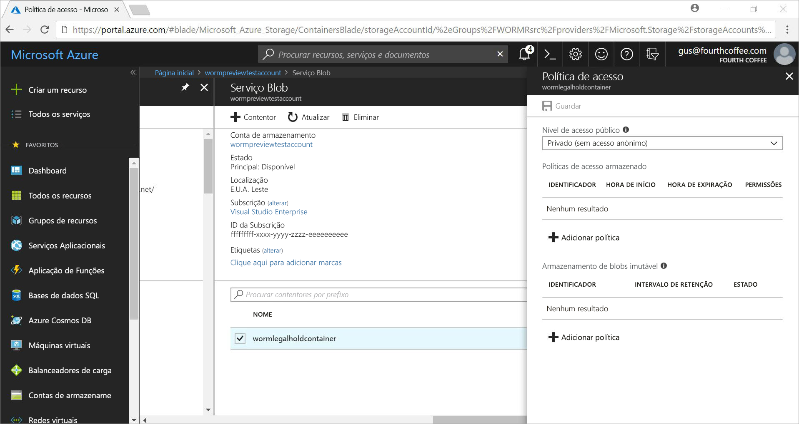
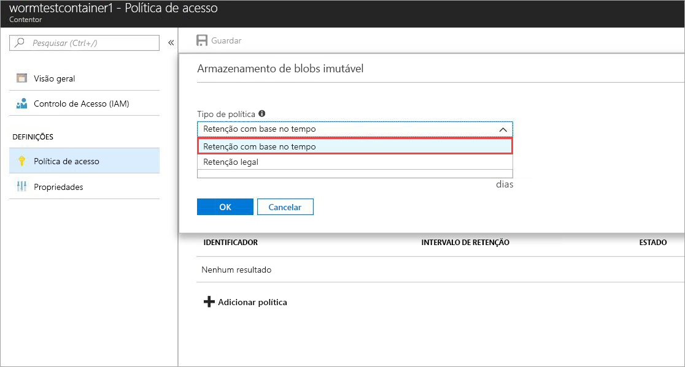
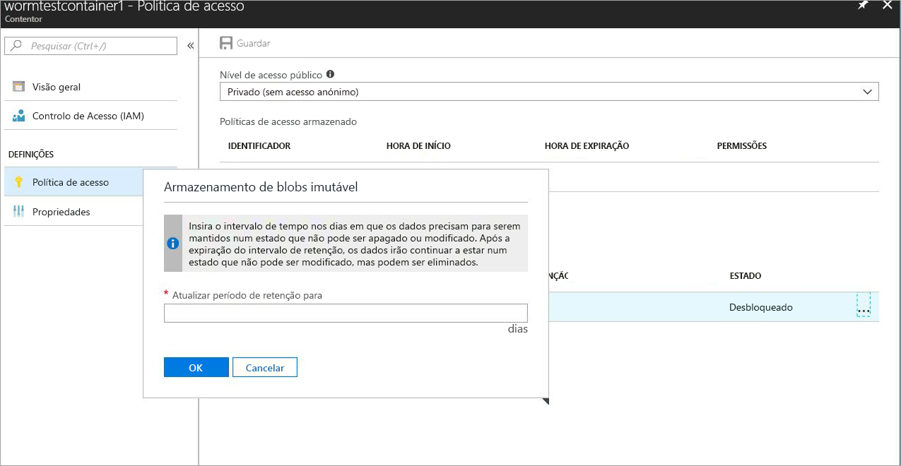
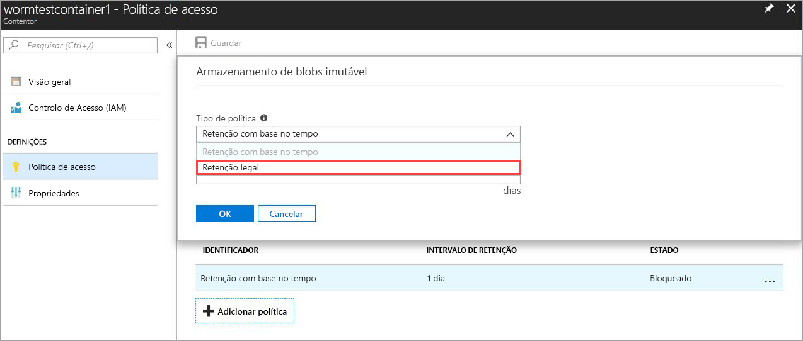
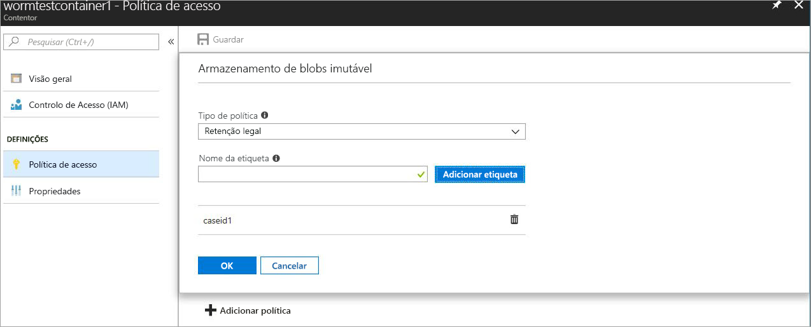

# <a name="immutable-storage-feature-of-azure-blob-storage-preview"></a>Funcionalidade de Armazenamento Imutável do armazenamento de Blobs do Azure (Pré-visualização)

A funcionalidade de Armazenamento Imutável para Blobs do Azure permite aos utilizadores armazenar dados críticos para a empresa no armazenamento de blobs do Azure, num estado WORM (Write Once Read Many). Este estado faz com que os blobs não possam ser apagados nem modificados durante um intervalo de tempo especificado pelo utilizador. Os blobs podem ser criados e lidos, mas não podem ser modificados nem eliminados durante o intervalo de retenção.

## <a name="overview"></a>Descrição geral

A funcionalidade de Armazenamento Imutável permite às organizações em várias indústrias reguladas, particularmente as organizações corretoras, armazenar dados em conformidade com o SEC 17a-4(f) e outros regulamentos.

As aplicações típicas incluem:

- **Conformidade regulamentar**: a funcionalidade de Armazenamento Imutável para Blobs do Azure foi concebida para ajudar instituições financeiras e indústrias relacionadas a cumprirem os regulamentos SEC 17a-4(f), CFTC 1.31©-(d), FINRA, etc.

- **Retenção segura de documentos**: os utilizadores recebem máxima proteção de dados, pois o serviço de armazenamento de Blobs garante que os dados não podem ser modificados nem eliminados por qualquer utilizador, incluindo aqueles com privilégios administrativos da conta.

- **Retenção legal**: o Armazenamento Imutável para blobs do Azure permite aos utilizadores armazenarem informações confidenciais, críticas para um litígio ou investigação criminal, etc., num estado à prova de adulteração durante o período de tempo pretendido.

A funcionalidade de armazenamento imutável permite:

- **Suporte à política de retenção baseada no tempo:** os utilizadores definem políticas para armazenar dados durante um intervalo de tempo especificado.

- **Suporte à política de retenção legal:** quando o intervalo de retenção não é conhecido, os utilizadores podem definir retenções legais para armazenarem os dados de forma imutável, até que a retenção legal seja desmarcada.  Quando uma retenção legal está definida, os blobs podem ser criados e lidos, mas não podem ser modificados nem eliminados. A cada retenção legal está associada uma etiqueta alfanumérica definida pelo utilizador, que é utilizada como uma cadeia de identificador (como um ID de caso).

- **Suporte para todas as camadas de blob:** as políticas WORM são independentes da camada de armazenamento de blobs do Azure e irão aplicar-se a todas as camadas, frequentes, esporádicas e de arquivo. Isto permite aos clientes armazenar os dados na camada com o custo mais otimizado para as cargas de trabalho, mantendo em simultâneo a imutabilidade dos dados

- **Configuração ao nível do contentor:** a funcionalidade de Armazenamento Imutável permite aos utilizadores configurar políticas de retenção baseadas no tempo e etiquetas de retenção legal ao nível do contentor.  Os utilizadores podem criar e bloquear as políticas de retenção baseadas no tempo, expandir intervalos de retenção, definir e desmarcar retenções legais, etc., através de definições simples ao nível do contentor.  Estas políticas serão aplicadas a todos os blobs no contentor, tanto os novos como os existentes.

- **Suporte ao Registo de Auditoria:** cada contentor contém um registo de auditoria que mostra até cinco comandos de retenção baseada no tempo para políticas de retenção baseadas no tempo bloqueadas, com o máximo de três registos para extensões de intervalo de retenção.  Para a retenção baseada no tempo, o registo contém o ID de utilizador, o tipo de comando, carimbos de data/hora e o intervalo de retenção. Para retenções legais, o registo contém o ID de utilizador, o tipo de comando, carimbos de data/hora e as etiquetas de retenção legal. Este registo é mantido durante o tempo de vida do contentor, em conformidade com as diretrizes de regulamentação SEC 17a-4(f). Um registo mais abrangente de todas as atividades de plano de controlo está disponível no [Registo de Atividades do Azure](https://docs.microsoft.com/en-us/azure/monitoring-and-diagnostics/monitoring-overview-activity-logs). É da responsabilidade do utilizador armazenar esses registos de forma persistente, consoante requerido por motivos de regulamentação ou outros fins.

 A funcionalidade está ativada em todas as regiões públicas do Azure.

## <a name="how-it-works"></a>Como funciona

O Armazenamento Imutável para Blobs do Azure suporta dois tipos de políticas WORM ou imutáveis: a retenção baseada no tempo e retenções legais. Veja a secção [Introdução](#Getting-started) para obter detalhes sobre como criar estas políticas imutáveis.
Quando uma política de retenção baseada no tempo ou a retenção legal é aplicada num contentor, todos os blobs existentes irão mudar para o estado imutável (protegidos contra escrita e eliminação). Todos os novos blobs carregados para o contentor também serão movidos para o estado imutável.

> [!IMPORTANT]
> Uma política de retenção baseada no tempo tem de estar *bloqueada* para o blob estar num estado imutável (protegido contra escrita e eliminação) para o SEC 17a-4(f) e outra conformidade regulamentar. Recomenda-se que a política esteja bloqueada num período de tempo razoável, normalmente de 24 horas. Recomendamos que não utilize o estado *desbloqueado* para qualquer finalidade além de avaliações da funcionalidade a curto prazo.

 Quando uma política de retenção baseada no tempo é aplicada num contentor, todos os blobs no contentor permanecerão no estado imutável durante o período de retenção *efetivo*. O período de retenção efetivo para os blobs existentes é igual à diferença entre a hora de criação dos blobs e o intervalo de retenção especificado pelo utilizador. Para novos blobs, o período de retenção efetivo é igual ao intervalo de retenção especificado pelo utilizador. Uma vez que os utilizadores podem alterar o intervalo de retenção, o valor mais recente do intervalo de retenção especificado pelo utilizador será utilizado para calcular o período de retenção efetivo.

> [!TIP]
> Exemplo: o utilizador cria uma política de retenção baseada no tempo com um intervalo de retenção de cinco anos.
> Existe um blob, testblob1, nesse contentor que foi criado há um ano. O período de retenção efetivo para testblob1 será de quatro anos.
> Um novo blob, testblob2, é agora carregado para o contentor. O período de retenção efetivo para este novo blob será de cinco anos.

### <a name="legal-holds"></a>Retenções legais

No caso de retenções legais, todos os blobs existentes e novos permanecerão no estado imutável até que a retenção legal seja desmarcada.
Para obter mais informações sobre como definir e desmarcar retenções legais, veja a secção [Introdução](#Getting-started).

Um contentor pode ter uma retenção legal e uma política de retenção baseada no tempo, ao mesmo tempo. Todos os blobs no contentor permanecerão no estado imutável até que todas as retenções legais sejam desmarcadas, mesmo se o respetivo período de retenção efetivo tiver expirado. Por outro lado, um blob irá permanecer num estado imutável até que o período de retenção efetivo expire, apesar de todas as retenções legais terem sido desmarcadas.
A tabela seguinte mostra os tipos de operações de blob que serão desativadas para os diferentes cenários imutáveis.
Consulte a documentação [API do Serviço Blob do Azure](https://docs.microsoft.com/en-us/rest/api/storageservices/blob-service-rest-api) para obter os detalhes da API REST do Blob.

|Cenário  |Estado de Blob  |Operações de Blob não permitidas  |
|---------|---------|---------|
|O intervalo de retenção efetivo do blob ainda não expirou e/ou a retenção legal está definida     |Imutável: protegido contra eliminação e escrita         |Eliminar Contentor, Eliminar Blob, Colocar Blob1, Colocar Bloco, Colocar Lista de Blocos, Definir Metadados de Blob, Colocar Página, Definir as Propriedades do Blob, Tirar um Instantâneo do Blob, Blob de Cópia Incremental, Anexar Bloco         |
|O intervalo de retenção efetivo no blob expirou     |Protegido apenas contra escrita (as operações de eliminação são permitidas)         |Colocar Blob, Colocar Bloco, Colocar Lista de Blocos, Definir Metadados de Blob, Colocar Página, Definir as Propriedades do Blob, Tirar um Instantâneo do Blob, Blob de Cópia Incremental, Anexar Bloco         |
|Todas as retenções legais estão desmarcadas e não está definida nenhuma política de retenção baseada no tempo no contentor     |Mutável         |Nenhuma         |
|Nenhuma política WORM criada (retenção baseada no tempo ou retenção legal)     |Mutável         |Nenhuma         |

> [!NOTE]
> O primeiro Colocar Blob e as operações Colocar Lista de Blocos e Colocar Blocos necessárias para criar um blob são permitidas nos dois primeiros cenários da tabela acima, todas as operações subsequentes não são permitidas.
> A funcionalidade de Armazenamento Imutável só está disponível em contas GPv2 e de armazenamento de blobs, e tem de ser criada através do [Azure Resource Manager](https://docs.microsoft.com/en-us/azure/azure-resource-manager/resource-group-overview).

## <a name="pricing"></a>Preços

Não há encargos adicionais para a utilização desta funcionalidade, e a forma de definição de preços do dados Imutáveis é feita da mesma forma dos dados regulares mutáveis. Consulte a [Página de Preços do Armazenamento do Azure](https://azure.microsoft.com/pricing/details/storage/blobs/) para obter os detalhes de preços relacionados.

### <a name="restrictions"></a>Restrições

As seguintes restrições aplicam-se durante a pré-visualização pública:

- **Não armazenar dados de produção ou dados críticos da empresa**
- Aplicam-se todas as restrições de pré-visualização/contrato de confidencialidade

## <a name="getting-started"></a>Introdução

O Armazenamento Imutável do Azure para Blobs do Azure é suportado nas versões mais recentes do [Portal do Azure](http://portal.azure.com), [CLI 2.0](https://docs.microsoft.com/en-us/cli/azure/install-azure-cli?view=azure-cli-latest) do Azure e o Azure [PowerShell](https://github.com/Azure/azure-powershell/releases/tag/Azure.Storage.v4.4.0-preview-May2018)

### <a name="azure-portal"></a>Portal do Azure

1. Crie um novo contentor ou selecione um contentor existente para armazenar os blobs que precisam de ser mantidos no estado imutável.
 O contentor tem de ser uma conta de armazenamento GPv2.
2. Clique na Política de Acesso nas definições de Contentor e, em seguida, clique em **+ Adicionar Política** na política **Armazenamento imutável de blobs**, conforme ilustrado abaixo.

    

3. Para ativar a retenção baseada no tempo, escolha Retenção Baseada no Tempo no menu pendente.

    

4. Introduza o intervalo de retenção pretendido em dias (o mínimo é de um dia)

    

    Como pode ver acima, o estado inicial da política é desbloqueado. Isto permite testar a funcionalidade com um intervalo de retenção inferior e efetuar alterações à política antes de bloqueá-la. O bloqueio é essencial para a conformidade regulamentar do SEC 17a-4, etc.

5. Bloqueie a política, clicando com o botão direito do rato em ..., e o seguinte menu será apresentado:

    

    Clique em Bloquear Política, e o estado da política será agora apresentado como bloqueado. Depois de bloqueada, a política já pode ser eliminada e só serão permitidas extensões do intervalo de retenção.

6. Para ativar as retenções legais, clicar em + Adicionar política e escolher Retenção legal no menu pendente

    

7. Criar uma retenção legal com uma ou mais etiquetas

    

### <a name="cli-20"></a>CLI 2.0

Instalar a [extensão CLI](http://docs.microsoft.com/en-us/cli/azure/install-azure-cli?view=azure-cli-latest) com `az extension add -n storage-preview`

Se já tiver a extensão instalada, utilize o seguinte comando para ativar a funcionalidade de Armazenamento Imutável: `az extension update -n storage-preview`

A funcionalidade está incluída nos seguintes grupos de comandos (execute "-h" nos mesmos para ver os comandos): `az storage container immutability-policy` e `az storage container legal-hold`.

### <a name="powershell"></a>PowerShell

A funcionalidade de Armazenamento Imutável é suportada no [PowerShell versão 4.4.0-pré-visualização](https://github.com/Azure/azure-powershell/releases/tag/Azure.Storage.v4.4.0-preview-May20180).
Para ativar a funcionalidade, siga os seguintes passos:

1. Certifique-se de que tem a versão mais recente do PowerShellGet, instalada através do `Install-Module PowerShellGet –Repository PSGallery –Force`
2. Remover qualquer instalação anterior do Azure PowerShell
3. Instalar o AzureRM (o Azure pode instalado da mesma forma a partir deste repositório) `Install-Module AzureRM –Repository PSGallery –AllowClobber`
4. Instalar a versão de pré-visualização dos cmdlets do plano de gestão de Armazenamento`Install-Module -Name AzureRM.Storage -AllowPrerelease -Repository PSGallery -AllowClobber`

Um código do PowerShell de exemplo que ilustra a utilização da funcionalidade é fornecido abaixo.

## <a name="client-libraries"></a>Bibliotecas de cliente

A funcionalidade de Armazenamento Imutável para Blobs do Azure é suportada nas seguintes versões de bibliotecas de cliente

- [Biblioteca de Clientes .net (versão 7.2.0-pré-visualização e superior)](https://www.nuget.org/packages/Microsoft.Azure.Management.Storage/7.2.0-preview)
- [Biblioteca de Clientes node.js (versão 4.0.0 e superior)](https://www.npmjs.com/package/azure-arm-storage)
- [Biblioteca de Clientes Python (versão 2.0.0 Release Candidate 2 e superior)](https://pypi.org/project/azure-mgmt-storage/2.0.0rc1/)

## <a name="supported-values"></a>Valores suportados

- O intervalo de retenção mínimo é de um dia, o máximo é de 400 anos
- Para uma conta de armazenamento especificada, o número máximo de contentores por conta de armazenamento com as políticas imutáveis bloqueadas é 1000
- Para uma conta de armazenamento especificada, o número máximo de contentores com uma definição de retenção legal é 1000
- Para um contentor especificado, o número máximo de etiquetas de retenção legal é 10
- O comprimento máximo de uma etiqueta de retenção legal é de 23 carateres alfanuméricos, o comprimento mínimo é de três carateres
- Para um contentor especificado, o número máximo permitido de extensões do intervalo de retenção para políticas imutáveis bloqueadas é três
- Para um contentor especificado com uma política imutável bloqueada, há um número máximo de cinco registos de política de retenção baseada no tempo e um máximo de 10 registos de política de retenção legal, que são retidos enquanto o contentor durar.

## <a name="faq"></a>FAQ

**A funcionalidade aplica-se apenas a blobs de blocos ou também se aplica a blobs de página e de acréscimo?**

A funcionalidade de Armazenamento Imutável para blobs pode ser utilizada com qualquer tipo de blob.  Tenha em atenção, no entanto, que é recomendado que a funcionalidade seja utilizada principalmente para blobs de blocos. Ao contrário dos blobs de blocos, os blobs de página e de acréscimo têm de ser criados fora de um contentor WORM, e depois copiados para um.  Assim que são copiados para um contentor WORM, deixam de ser permitidos *anexos* a um blob de acréscimo ou alterações a um blob de página.

**É necessário criar sempre uma nova conta de armazenamento para utilizar esta funcionalidade?**

Pode utilizar a funcionalidade de Armazenamento Imutável com as contas GPv2 existentes ou novas contas de armazenamento, se o tipo de conta for GPv2. Esta funcionalidade só está disponível com o armazenamento de blobs.

**O que acontece se tentar eliminar um contentor com uma política de retenção baseada no tempo ou de retenção legal *bloqueada*?**

A operação Eliminar Contentor irá falhar se for, pelo menos, um blob com uma política de retenção baseada no tempo ou uma retenção legal bloqueada. A operação Eliminar Contentor terá êxito se não houver nenhum blob com um intervalo de retenção ativo e nenhumas retenções legais. Tem de eliminar primeiro os blobs antes de poder eliminar o contentor.

**O que acontece se tentar eliminar uma conta de armazenamento com um contentor WORM que tenha uma política de retenção baseada no tempo ou de retenção legal *bloqueada*?**

A eliminação da conta de armazenamento falhará se existir, pelo menos, um contentor WORM com uma retenção legal ou um blob com um intervalo de retenção ativo.  Todos os contentores WORM têm de ser eliminados antes de poder eliminar a conta de armazenamento.  Veja a pergunta n.º 2 para obter informações sobre a eliminação de contentores.

**Posso mover os dados entre camadas de blob diferentes (frequente, esporádico, progressivo) quando o blob está no estado imutável?**

Sim, pode utilizar o comando Definir Camada de Blob para mover dados entre as camadas de blob, mantendo os dados no estado imutável. A funcionalidade de Armazenamento Imutável é suportada em camadas de blob frequente, esporádico e progressivo.

**O que acontece se eu não conseguir pagar e o meu intervalo de retenção não tiver expirado?**

Em caso de não-pagamento, as políticas de retenção de dados normais serão aplicadas de acordo com a tolerância estipulada especificada nos termos e condições do seu contrato com a Microsoft.

**Oferecem um período de avaliação gratuita ou de tolerância para experimentar a funcionalidade?**

Sim, quando uma política de retenção baseada no tempo é criada pela primeira vez, estará num estado *desbloqueado*. Neste estado, pode fazer qualquer alteração pretendida ao intervalo de retenção, como aumentar ou diminuir e até mesmo eliminar a política. Depois de a política ser bloqueada, continua bloqueada, impedindo para sempre a eliminação. Além disso, o intervalo de retenção já não pode ser diminuído quando a política está bloqueada. Recomendamos vivamente que utilize o estado *desbloqueado* apenas para fins de avaliação e que bloqueie a política dentro de 24 horas, para não incorrer em riscos de não conformidade com o SEC 17a-4(f) e outros regulamentos.

**A funcionalidade está disponível em clouds nacionais e do governo?**

A funcionalidade de Armazenamento Imutável está atualmente disponível apenas em regiões públicas do Azure. Envie um e-mail para azurestoragefeedback@microsoft.com relativo ao interesse numa cloud nacional específica.

## <a name="sample-code"></a>Código de exemplo

Um script do PowerShell de exemplo é indicado abaixo para referência.
Este script cria uma nova conta de armazenamento e um contentor; em seguida, mostra como definir e desmarcar retenções legais, criar e bloquear uma política de retenção baseada no tempo (também denominada ImmutabilityPolicy), expandir o intervalo de retenção, etc.

```powershell
\$ResourceGroup = "\<Enter your resource group\>”

\$StorageAccount = "\<Enter your storage account name\>"

\$container = "\<Enter your container name\>"

\$container2 = "\<Enter another container name\>”

\$location = "\<Enter the storage account location\>"

\# Login to the Azure Resource Manager Account

Login-AzureRMAccount

Register-AzureRmResourceProvider -ProviderNamespace "Microsoft.Storage"

\# Create your Azure Resource Group

New-AzureRmResourceGroup -Name \$ResourceGroup -Location \$location

\# Create your Azure storage account

New-AzureRmStorageAccount -ResourceGroupName \$ResourceGroup -StorageAccountName
\$StorageAccount -SkuName Standard_LRS -Location \$location -Kind Storage

\# Create a new container

New-AzureRmStorageContainer -ResourceGroupName \$ResourceGroup
-StorageAccountName \$StorageAccount -Name \$container

\# Create Container 2 with Storage Account object

\$accountObject = Get-AzureRmStorageAccount -ResourceGroupName \$ResourceGroup
-StorageAccountName \$StorageAccount

New-AzureRmStorageContainer -StorageAccount \$accountObject -Name \$container2

\# Get container

Get-AzureRmStorageContainer -ResourceGroupName \$ResourceGroup
-StorageAccountName \$StorageAccount -Name \$container

\# Get Container with Account object

\$containerObject = Get-AzureRmStorageContainer -StorageAccount \$accountObject
-Name \$container

\#list container

Get-AzureRmStorageContainer -ResourceGroupName \$ResourceGroup
-StorageAccountName \$StorageAccount

\#remove container (Add -Force to dismiss prompt)

Remove-AzureRmStorageContainer -ResourceGroupName \$ResourceGroup
-StorageAccountName \$StorageAccount -Name \$container2

\#with Account object

Remove-AzureRmStorageContainer -StorageAccount \$accountObject -Name
\$container2

\#with Container object

\$containerObject2 = Get-AzureRmStorageContainer -StorageAccount \$accountObject
-Name \$container2

Remove-AzureRmStorageContainer -InputObject \$containerObject2

\#Set LegalHold

Add-AzureRmStorageContainerLegalHold -ResourceGroupName \$ResourceGroup
-StorageAccountName \$StorageAccount -Name \$container -Tag tag1,tag2

\#with Account object

Add-AzureRmStorageContainerLegalHold -StorageAccount \$accountObject -Name
\$container -Tag tag3

\#with Container object

Add-AzureRmStorageContainerLegalHold -Container \$containerObject -Tag tag4,tag5

\#Clear LegalHold

Remove-AzureRmStorageContainerLegalHold -ResourceGroupName \$ResourceGroup
-StorageAccountName \$StorageAccount -Name \$container -Tag tag2

\#with Account object

Remove-AzureRmStorageContainerLegalHold -StorageAccount \$accountObject -Name
\$container -Tag tag3,tag5

\#with Container object

Remove-AzureRmStorageContainerLegalHold -Container \$containerObject -Tag tag4

\# create/update ImmutabilityPolicy

\#\# with account/container name

Set-AzureRmStorageContainerImmutabilityPolicy -ResourceGroupName \$ResourceGroup
-StorageAccountName \$StorageAccount -ContainerName \$container
-ImmutabilityPeriod 10

\#with Account object

Set-AzureRmStorageContainerImmutabilityPolicy -StorageAccount \$accountObject
-ContainerName \$container -ImmutabilityPeriod 1 -Etag \$policy.Etag

\#with Container object

\$policy = Set-AzureRmStorageContainerImmutabilityPolicy -Container
\$containerObject -ImmutabilityPeriod 7

\#\# with ImmutabilityPolicy object

Set-AzureRmStorageContainerImmutabilityPolicy -ImmutabilityPolicy \$policy
-ImmutabilityPeriod 5

\#get ImmutabilityPolicy

Get-AzureRmStorageContainerImmutabilityPolicy -ResourceGroupName \$ResourceGroup
-StorageAccountName \$StorageAccount -ContainerName \$container

\#with Account object

Get-AzureRmStorageContainerImmutabilityPolicy -StorageAccount \$accountObject
-ContainerName \$container

\#with Container object

Get-AzureRmStorageContainerImmutabilityPolicy -Container \$containerObject

\#Lock ImmutabilityPolicy (Add -Force to dismiss prompt)

\#\# with ImmutabilityPolicy object

\$policy = Get-AzureRmStorageContainerImmutabilityPolicy -ResourceGroupName
\$ResourceGroup -StorageAccountName \$StorageAccount -ContainerName \$container

\$policy = Lock-AzureRmStorageContainerImmutabilityPolicy -ImmutabilityPolicy
\$policy -force

\#\# with account/container name

\$policy = Lock-AzureRmStorageContainerImmutabilityPolicy -ResourceGroupName
\$ResourceGroup -StorageAccountName \$StorageAccount -ContainerName \$container
-Etag \$policy.Etag

\#with Account object

\$policy = Lock-AzureRmStorageContainerImmutabilityPolicy -StorageAccount
\$accountObject -ContainerName \$container -Etag \$policy.Etag

\#with Container object

\$policy = Lock-AzureRmStorageContainerImmutabilityPolicy -Container
\$containerObject -Etag \$policy.Etag -force

\#Extend ImmutabilityPolicy

\#\# with ImmutabilityPolicy object

\$policy = Get-AzureRmStorageContainerImmutabilityPolicy -ResourceGroupName
\$ResourceGroup -StorageAccountName \$StorageAccount -ContainerName \$container

\$policy = Set-AzureRmStorageContainerImmutabilityPolicy -ImmutabilityPolicy
\$policy -ImmutabilityPeriod 11 -ExtendPolicy

\#\# with account/container name

\$policy = Set-AzureRmStorageContainerImmutabilityPolicy -ResourceGroupName
\$ResourceGroup -StorageAccountName \$StorageAccount -ContainerName \$container
-ImmutabilityPeriod 11 -Etag \$policy.Etag -ExtendPolicy

\#with Account object

\$policy = Set-AzureRmStorageContainerImmutabilityPolicy -StorageAccount
\$accountObject -ContainerName \$container -ImmutabilityPeriod 12 -Etag
\$policy.Etag -ExtendPolicy

\#with Container object

\$policy = Set-AzureRmStorageContainerImmutabilityPolicy -Container
\$containerObject -ImmutabilityPeriod 13 -Etag \$policy.Etag -ExtendPolicy

\#Remove ImmutabilityPolicy (Add -Force to dismiss prompt)

\#\# with ImmutabilityPolicy object

\$policy = Get-AzureRmStorageContainerImmutabilityPolicy -ResourceGroupName
\$ResourceGroup -StorageAccountName \$StorageAccount -ContainerName \$container

Remove-AzureRmStorageContainerImmutabilityPolicy -ImmutabilityPolicy \$policy

\#\# with account/container name

Remove-AzureRmStorageContainerImmutabilityPolicy -ResourceGroupName
\$ResourceGroup -StorageAccountName \$StorageAccount -ContainerName \$container
-Etag \$policy.Etag

\#with Account object

Remove-AzureRmStorageContainerImmutabilityPolicy -StorageAccount \$accountObject
-ContainerName \$container -Etag \$policy.Etag

\#with Container object

Remove-AzureRmStorageContainerImmutabilityPolicy -Container \$containerObject
-Etag \$policy.Etag
```