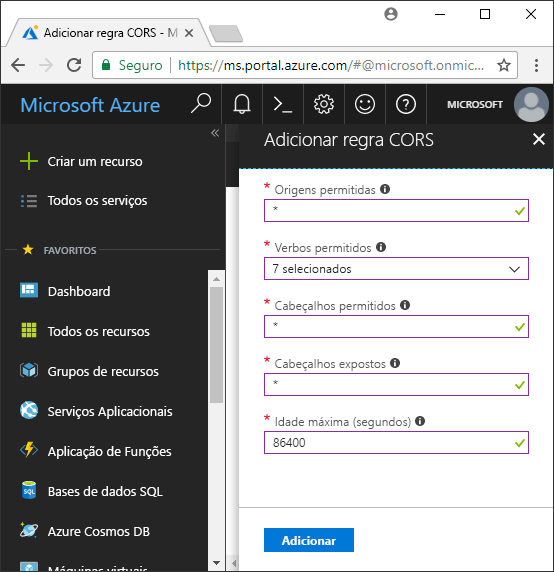

<!-- Customer intent: As a web application developer I want to interface with Azure Blob storage entirely on the client so that I can build a SPA application that is able to upload and delete files on blob storage. -->

# <a name="quickstart-upload-list-and-delete-blobs-using-javascripthtml-in-the-browser"></a>Início Rápido: Utilizar JavaScript/HTML no browser para carregar, listar e eliminar blobs

Este início rápido demonstra como gerir os blobs a partir do código em execução inteiramente no browser. A abordagem utilizada aqui mostra como utilizar as medidas de segurança necessárias para garantir acesso protegido para a sua conta do blob storage. Para concluir este início rápido, precisa de uma [subscrição do Azure](https://azure.microsoft.com/free/?WT.mc_id=A261C142F).

## <a name="prerequisites"></a>Pré-requisitos

[!INCLUDE [storage-quickstart-prereq-include](../../../includes/storage-quickstart-prereq-include.md)]

## <a name="setting-up-storage-account-cors-rules"></a>Configurar regras de CORS da conta de armazenamento 
Antes de a aplicação Web poder aceder a um armazenamento de blobs a partir do cliente, essa conta tem de ser configurada para permitir a [partilha de recursos de várias origens](https://docs.microsoft.com/rest/api/storageservices/cross-origin-resource-sharing--cors--support-for-the-azure-storage-services), ou CORS. 

Regresse ao portal do Azure e selecione a sua conta de armazenamento. Para definir uma regra de CORS nova, regresse à secção **Definições** e clique na ligação **CORS** . Em seguida, clique no botão **Adicionar** para abrir a janela **Adicionar regra de CORS**. Neste início rápido, vai criar uma regra CORS aberta:



A tabela seguinte descreve cada definição de CORS e explica os valores utilizados para definir a regra.

|Definição  |Valor  | Descrição |
|---------|---------|---------|
| Origens permitidas | * | Aceita uma lista delimitada por vírgulas de domínios definidos como origens aceitáveis. Definir o valor como `*` permite que todos os domínios acedam à conta de armazenamento. |
| Verbos permitidos     | delete, get, head, merge, post, options, and put | Apresenta uma lista dos verbos HTTP que podem ser executados na conta de armazenamento. Para efeitos deste início rápido, selecione todas as opções disponíveis. |
| Cabeçalhos permitidos | * | Define uma lista de cabeçalhos de pedidos (incluindo cabeçalhos com prefixo) que a conta de armazenamento permite. Definir o valor como `*` permite acesso a todos os cabeçalhos. |
| Cabeçalhos expostos | * | Apresenta uma lista dos cabeçalhos de resposta que a conta permite. Definir o valor como `*` permite à conta enviar qualquer cabeçalho.  |
| Idade máxima (segundos) | 86400 | O período máximo de tempo que o browser coloca em cache o pedido OPTIONS de validação prévia. Um valor de *86400* permite que a cache permaneça por um dia completo. |

> [!IMPORTANT]
> Assegure-se de que as definições que utilizar na produção expõem a quantidade mínima de acesso necessário à sua conta de armazenamento, de modo a manter o acesso seguro. As definições de CORS descritas aqui são adequadas para um início rápido, porque definem uma política de segurança permissiva. No entanto, não são recomendadas para um contexto do mundo real.

Em seguida, vai utilizar o Azure Cloud Shell para criar um token de segurança.

[!INCLUDE [Open the Azure cloud shell](../../../includes/cloud-shell-try-it.md)]

## <a name="create-a-shared-access-signature"></a>Criar uma Assinatura de Acesso partilhado
A assinatura de acesso partilhado (SAS) é utilizada pelo código em execução no browser para autorizar pedidos ao armazenamento de Blobs. Ao utilizar o SAS, o cliente pode autorizar o acesso aos recursos de armazenamento sem a chave de acesso da conta ou sem a cadeia de ligação. Para obter mais informações, veja [Using shared access signatures (SAS)](../common/storage-dotnet-shared-access-signature-part-1.md) (Utilizar assinaturas de acesso partilhado [SAS]).

Pode criar um SAS com a CLI do AZURE através do Azure Cloud Shell ou com o Explorador de Armazenamento do Azure. A tabela seguinte descreve os parâmetros para os quais terá de indicar valores de modo a gerar uma SAS com a CLI.

| Parâmetro      |Descrição  | Marcador de posição |
|----------------|-------------|-------------|
| *expiry* (expira)       | A data de expiração do token de acesso no formato AAAA-MM-DD. Introduza a data de amanhã para utilização neste início rápido. | *FUTURE_DATE* (data futura) |
| *account-name* (nome da conta) | O nome da conta de armazenamento. Utilize o nome colocado de parte num passo anterior. | *YOUR_STORAGE_ACCOUNT_NAME* (nome da conta de armazenamento) |
| *account-key* (chave da conta)  | A chave da conta de armazenamento. Utilize a chave colocada de parte num passo anterior. | *YOUR_STORAGE_ACCOUNT_KEY* (chave da conta de armazenamento) |

O script seguinte utilizou a CLI do Azure para criar uma SAS que pode transmitir a um serviço de blobs de JavaScript.

> [!NOTE]
> Para obter os melhores resultados, remova os espaços adicionais entre os parâmetros antes de colar o comando no Azure Cloud Shell.

```bash
az storage account generate-sas
                    --permissions racwdl
                    --resource-types sco
                    --services b
                    --expiry FUTURE_DATE
                    --account-name YOUR_STORAGE_ACCOUNT_NAME
                    --account-key YOUR_STORAGE_ACCOUNT_KEY
```
Poderá achar que as séries de valores a seguir a cada parâmetro são algo crípticas. Estes valores de parâmetros são obtidos a partir da primeira letra da respetiva permissão. A tabela seguinte explica a proveniência dos valores: 

| Parâmetro        | Valor   | Descrição  |
|------------------|---------|---------|
| *permissions* (permissões)    | racwdl  | Esta SAS permite capacidades de *leitura*, *acrescento*, *criação*, *escrita*, *eliminação* e *listagem*. |
| *resource-types* (tipos de recursos) | sco     | Os recursos que a SAS afeta são *serviço*, *contentor* e *objeto*. |
| *services* (serviços)       | b       | O serviço que a SAS afeta é o serviço de *blobs*. |

Agora que a SAS foi gerada, copie o valor devolvido na consola no editor de texto. Vai utilizar esse valor num passo posterior.

> [!IMPORTANT]
> Na produção, transmita sempre tokens os SAS através de SSL. Além disso, os tokens SAS devem gerados no servidor e enviados para a página HTML, de modo a serem transmitidos novamente para o Armazenamento de Blobs do Azure. Uma abordagem que pode considerar passa por utilizar uma função sem servidor para gerar os tokens SAS. O portal do Azure inclui modelos de funções que têm a capacidade de gerar um SAS com uma função de JavaScript.

## <a name="implement-the-html-page"></a>Implementar a página HTML

### <a name="set-up-the-web-application"></a>Configurar a aplicação Web
As bibliotecas de cliente JavaScript do Armazenamento do Azure não irão funcionar diretamente a partir do sistema de ficheiros e têm de ser fornecidas por um servidor Web. Por conseguinte, os passos seguintes detalham como utilizar um servidor Web local simples com Node.js.

> [!NOTE]
> Esta secção mostra-lhe como criar um servidor Web local que requer que Node.js esteja instalado no seu computador. Se não quiser instalar Node.js, pode utilizar qualquer outro meio para executar um servidor Web local.

Em primeiro lugar, crie uma pasta nova para o seu projeto e dê-lhe nome *azure-blobs-javascript*. Em seguida, abra uma linha de comandos na pasta *azure-blobs-javascript* e introduza o comando abaixo para preparar a aplicação para instalar o módulo do servidor Web:

```bash
npm init -y
```
Executar *init* adiciona os ficheiros necessários para ajudar a instalar os módulos de servidores Web. Para instalar, o módulo, introduza o comando seguinte:

```bash
npm i http-server
```
Depois, edite o ficheiro *package.json* e substitua a definição de *scripts* existente pelo fragmento de código seguinte:

```javascript
"scripts": {
    "start": "http-server"
}
```
Por fim, na linha de comandos, introduza `npm start` para iniciar o servidor Web:

```bash
npm start
```

### <a name="get-the-blob-storage-client-library"></a>Obter a biblioteca de cliente do armazenamento de blobs
[Transfira as bibliotecas de cliente JavaScript](https://aka.ms/downloadazurestoragejs), extraia os conteúdos do zip e coloque os ficheiros de script da pasta *pacote* numa pasta denominada *scripts*.

### <a name="add-the-client-script-reference-to-the-page"></a>Adicionar a referência de script de cliente à página
Crie uma página HTML na raiz da pasta *azure-blobs-javascript* e dê-lhe o nome *index.html*. Quando a página for criada, adicione o markup seguinte à mesma.

```html
<!DOCTYPE html>
<html>
    <body>
        <button id="create-button">Create Container</button>

        <input type="file" id="fileinput" />
        <button id="upload-button">Upload</button>

        <button id="list-button">List</button>
        
        <button id="delete-button">Delete</button>
    </body>
    <script src="scripts/azure-storage.blob.min.js" charset="utf-8"></script>
    <script>
        // Blob-related code goes here
    </script>
</html>
```
Este markup adiciona o seguinte à página:

- uma referência a *scripts/azure-storage.blob.js*
- botões utilizados para criar um contentor, carregar, lista e eliminar blobs
- um elemento *INPUT* utilizado para carregar um ficheiro
- um marcador de posição para código específico do armazenamento

### <a name="create-an-instance-of-blobservice"></a>Criar uma instância do BlobService 
[BlobService](https://azure.github.io/azure-storage-node/BlobService.html) proporciona uma interface para o Armazenamento de Blobs do Azure. Para criar uma instância do serviço, tem de indicar o nome da conta de armazenamento e a SAS gerada num passo anterior.

```javascript
const account = {
    name: YOUR_STORAGE_ACCOUNT_NAME,
    sas:  YOUR_SAS
};

const blobUri = 'https://' + account.name + '.blob.core.windows.net';
const blobService = AzureStorage.Blob.createBlobServiceWithSas(blobUri, account.sas);
```

### <a name="create-a-blob-container"></a>Criar um contentor de blobs
Com o serviço de blobs criado, pode agora criar um contentor novo para guardar um blob carregado. O método [createContainerIfNotExists](https://azure.github.io/azure-storage-node/BlobService.html#createContainerIfNotExists__anchor) cria um contentor novo e não devolve nenhum erro se o contentor já existir.

```javascript
document.getElementById('create-button').addEventListener('click', () => {

    blobService.createContainerIfNotExists('mycontainer',  (error, container) => {
        if (error) {
            // Handle create container error
        } else {
            console.log(container.name);
        }
    });

});
```

### <a name="upload-a-blob"></a>Carregar um blob
Para carregar um blob de um formulário HTML, receberá uma referência para o ficheiro selecionado de um elemento de *INPUT*. O ficheiro selecionado está disponível através da matriz `files` quando o *tipo* do elemento estiver definido como *ficheiro*.

A partir do script, pode referenciar o elemento HTML e transmitir o ficheiro selecionado ao serviço de blobs.

```javascript
document.getElementById('upload-button').addEventListener('click', () => {

    const file = document.getElementById('fileinput').files[0];

    blobService.createBlockBlobFromBrowserFile('mycontainer', 
                                                file.name, 
                                                file, 
                                                (error, result) => {
                                                    if(error) {
                                                        // Handle blob error
                                                    } else {
                                                        console.log('Upload is successful');
                                                    }
                                                });

});
```

O método [createBlockBlobFromBrowserFile](https://azure.github.io/azure-storage-node/BlobService.html#createBlockBlobFromBrowserFile__anchor) utiliza o ficheiro do browser diretamente para carregar um contentor de blobs.

### <a name="list-blobs"></a>Listar blobs
Depois de ter carregado um ficheiro para o contentor de blobs, vai aceder a uma lista de blobs no contentor com o método [listBlobsSegmented](https://azure.github.io/azure-storage-node/BlobService.html#listBlobsSegmented__anchor).

```javascript
document.getElementById('list-button').addEventListener('click', () => {

    blobService.listBlobsSegmented('mycontainer', null, (error, results) => {
        if (error) {
            // Handle list blobs error
        } else {
            results.entries.forEach(blob => {
                console.log(blob.name);
            });
        }
    });
    
});
```

O método *listBlobsSegmented* devolve uma coleção de blobs. Por predefinição, a quantidade da coleção é 5000 blobs, mas pode ajustar este valor para que se ajuste às suas necessidades. O [exemplo de continuação](https://github.com/Azure/azure-storage-node/blob/master/examples/samples/continuationsample.js#L132) demonstra como trabalhar com um grande número de blobs e como a biblioteca de clientes suporta paginação. 


### <a name="delete-blobs"></a>Eliminar blobs
Pode chamar [deleteBlobIfExists](https://azure.github.io/azure-storage-node/BlobService.html#deleteBlobIfExists__anchor) para eliminar o blob carregado.

```javascript
document.getElementById('delete-button').addEventListener('click', () => {

    var blobName = YOUR_BLOB_NAME;
    blobService.deleteBlobIfExists('mycontainer', blobName, (error, result) => {
        if (error) {
            // Handle delete blob error
        } else {
            console.log('Blob deleted successfully');
        }
    });
    
});
```
> [!WARNING]
> Para que este exemplo de código funcione, tem de indicar um valor para a cadeia de *blobName*.

## <a name="clean-up-resources"></a>Limpar recursos
Para limpar os recursos criados durante este início rápido, regresse ao [portal do Azure](https://portal.azure.com) e selecione a sua conta de armazenamento. Depois de selecionada, pode eliminar a conta de armazenamento ao aceder a **Descrição geral > Eliminar conta de armazenamento**.

## <a name="next-steps"></a>Passos Seguintes
Explore os exemplos para saber como transferir blobs e comunicar o progresso durante o carregamentos de ficheiros.

> [!div class="nextstepaction"]
> [Bibliotecas de cliente do armazenamento de blobs](https://github.com/Azure/azure-storage-node/tree/master/browser)
