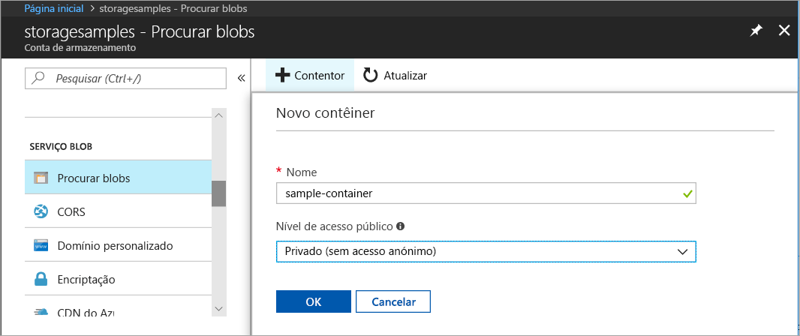
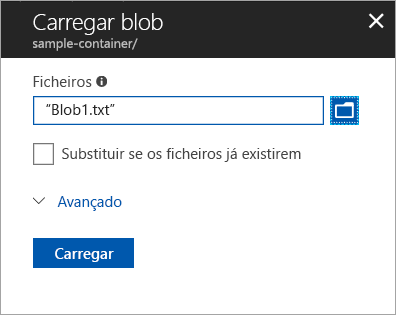
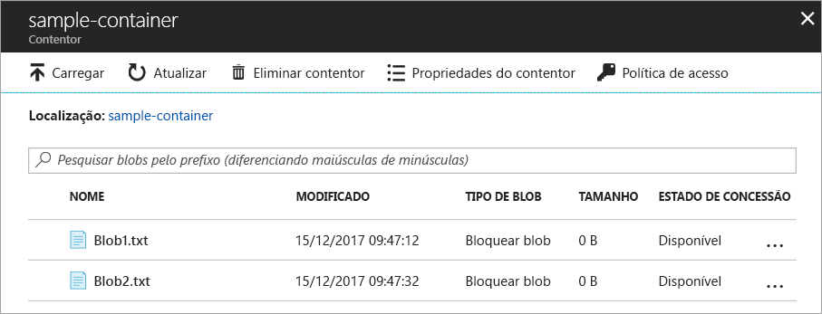
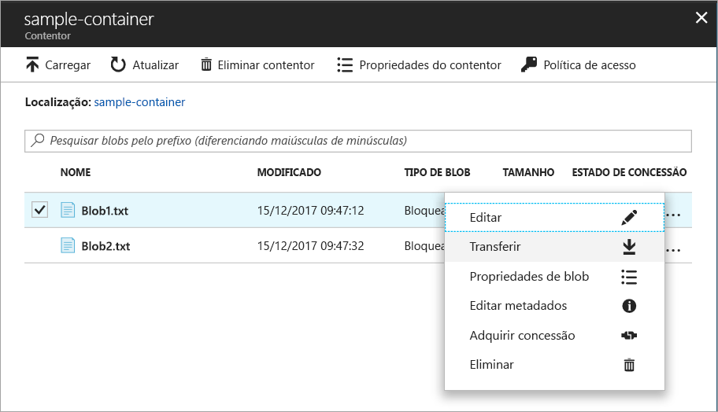
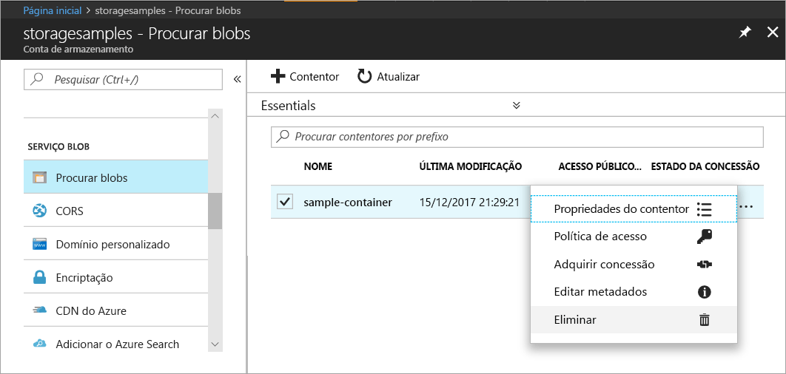

# Início Rápido: carregar, transferir e listar blobs através do portal do Azure

Neste guia de introdução, irá aprender a utilizar o [portal do Azure](https://portal.azure.com/) para criar um contentor no Armazenamento do Azure e para carregar e transferir blobs de blocos nesse contentor.

## Pré-requisitos

Se não tiver uma subscrição do Azure, crie uma [conta gratuita](https://azure.microsoft.com/free/?WT.mc_id=A261C142F) antes de começar.

[!INCLUDE [storage-quickstart-tutorial-create-account-portal](../../../includes/storage-quickstart-tutorial-create-account-portal.md)]

## Criar um contentor

Para criar um contentor no portal do Azure, siga estes passos:

1. No portal do Azure, navegue para a sua nova conta de armazenamento.
2. No menu à esquerda para a conta de armazenamento, desloque-se para a secção **Serviço Blob** e, em seguida, selecione **Procurar Blobs**.
3. Clique no botão **Adicionar Contentor**.
4. Introduza um nome para o novo contentor. O nome do contentor tem estar em minúsculas, tem de começar com uma letra ou um número e só podem conter letras, números e o caráter de travessão (-). Para obter informações sobre os nomes dos contentores e dos blobs, veja [Naming and Referencing Containers, Blobs, and Metadata](https://docs.microsoft.com/rest/api/storageservices/naming-and-referencing-containers--blobs--and-metadata) (Dar Nomes e Referenciar Contentores, Blobs e Metadados).
5. Defina o nível de acesso público ao contentor. O nível predefinido é **Privado (sem acesso anónimo)**.
6. Clique em **OK** para criar o contentor.

    

## Carregar um blob de blocos

Os blobs de blocos são compostos por blocos de dados reunidos para criar um blob. A maioria dos cenários com o armazenamento de Blobs emprega blobs de blocos. Os blobs de blocos são ideais para armazenar dados de texto e binários na cloud, como ficheiros, imagens e vídeos. Este guia de introdução mostra como trabalhar com blobs de blocos. 

Para carregar um blob de blocos para o novo contentor no portal do Azure, siga estes passos:

1. No portal do Azure, navegue para o contentor que criou na secção anterior.
2. Selecione o contentor para mostrar uma lista dos blobs que ele contém. Neste caso, uma vez que criou um novo contentor, ele ainda não contém blobs.
3. Clique no botão **Carregar** para carregar um blob para o contentor.
4. Procurar o sistema de ficheiros local para encontrar um ficheiro para carregar como um blob de blocos e clique em **Carregar**.
     
    

5. Carregue os blobs que quiser desta forma. Verá que os novos blobs estão agora listados no contentor.

    

## Transferir um blob de blocos

Pode transferir um blob de blocos para apresentar no browser ou guardar no seu sistema de ficheiros local. Para transferir um blob de blocos, siga estes passos:

1. Navegue para a lista de blobs que carregou na secção anterior. 
2. Selecione o blob a transferir.
3. Clique com o botão direito do rato no botão **Mais** (**...** ) e selecione **Transferir**. 

## Limpar recursos

Para remover os recursos que criou neste guia de introdução, basta eliminar o contentor. Todos os blobs no contentor também serão eliminados.

Para eliminar o contentor:

1. No portal do Azure, navegue para a lista de contentores na sua conta de armazenamento.
2. Selecione o contentor a eliminar.
3. Clique com o botão direito do rato no botão **Mais** (**...** ) e selecione **Eliminar**.
4. Certifique-se de que pretende eliminar o contentor.

       

## Passos seguintes

Neste início rápido, aprendeu a transferir ficheiros entre um disco local e o armazenamento de Blobs do Azure com .NET. Para saber mais sobre a utilização do armazenamento de Blobs, avance para os procedimentos do armazenamento de blobs.

> [!div class="nextstepaction"]
> [Procedimentos de Operações de Armazenamento de Blobs](storage-dotnet-how-to-use-blobs.md)

