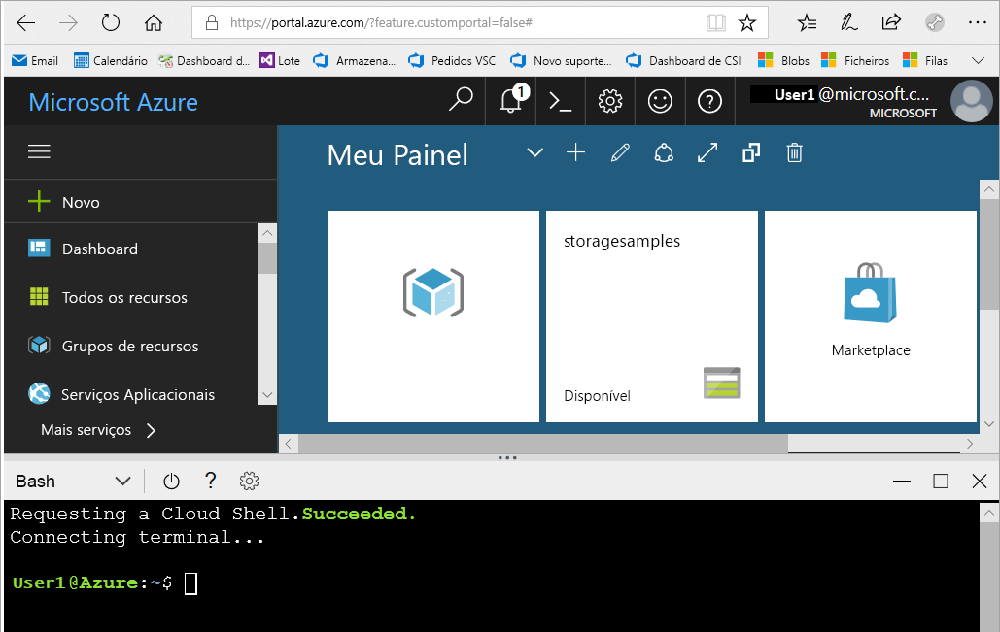
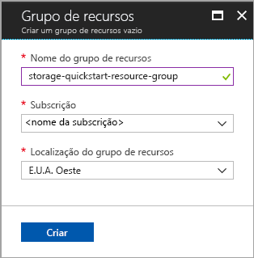
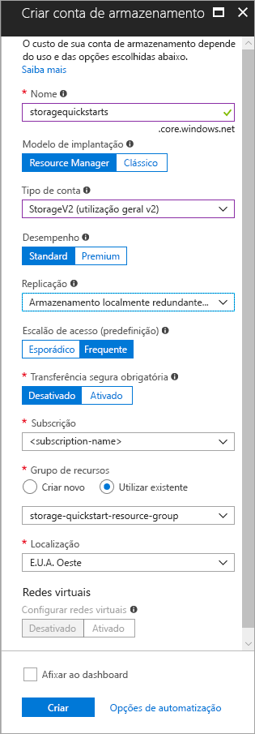

# <a name="create-a-new-storage-account"></a>Criar uma nova conta de armazenamento

Uma conta de armazenamento do Azure oferece um espaço de nomes exclusivo na cloud para armazenar e aceder aos seus objetos de dados no Armazenamento do Azure. Uma conta de armazenamento contém quaisquer blobs, ficheiros, filas, tabelas e discos que cria nessa conta. 

Para começar a utilizar o Armazenamento do Azure, primeiro tem de criar uma nova conta de armazenamento. Pode criar uma conta de armazenamento do Azure com o [portal do Azure](https://portal.azure.com/), o [Azure PowerShell](https://docs.microsoft.com/powershell/azure/overview) ou a [CLI do Azure](https://docs.microsoft.com/cli/azure/overview?view=azure-cli-latest). Este guia de introdução mostra como utilizar cada uma destas opções para criar a sua nova conta de armazenamento. 


## <a name="prerequisites"></a>Pré-requisitos

Se não tiver uma subscrição do Azure, crie uma [conta gratuita](https://azure.microsoft.com/free/) antes de começar.

# <a name="portaltabportal"></a>[Portal](#tab/portal)

Nenhum.

# <a name="powershelltabpowershell"></a>[PowerShell](#tab/powershell)

Este início rápido requer a versão 3.6 ou posterior do módulo Azure PowerShell. Execute `Get-Module -ListAvailable AzureRM` para encontrar a versão atual. Se precisar de instalar ou atualizar, veja [Install Azure PowerShell module](/powershell/azure/install-azurerm-ps)(Instalar o módulo do Azure PowerShell).

# <a name="azure-clitabazure-cli"></a>[CLI do Azure](#tab/azure-cli)

Pode iniciar sessão no Azure e executar comandos da CLI do Azure de uma das seguintes formas:

- Pode executar comandos da CLI no portal do Azure, no Azure Cloud Shell 
- Pode instalar a CLI e executar os respetivos comandos localmente  

### <a name="use-azure-cloud-shell"></a>Utilizar o Azure Cloud Shell

O Azure Cloud Shell é um shell Bash gratuito que pode ser executado diretamente no portal do Azure. Tem a CLI do Azure pré-instalada e configurada para ser utilizada com a sua conta. Clique no botão **Cloud Shell** no menu do canto superior direito do portal do Azure:

[](https://portal.azure.com)

O botão inicia uma shell interativa que pode utilizar para executar os passos neste guia de introdução:

[](https://portal.azure.com)

### <a name="install-the-cli-locally"></a>Instalar a CLI localmente

Também pode instalar e utilizar a CLI do Azure localmente. Este início rápido requer a execução da versão 2.0.4 ou posterior da CLI do Azure. Executar `az --version` para localizar a versão. Se precisar de instalar ou atualizar, veja [instalar o Azure CLI 2.0](/cli/azure/install-azure-cli). 

---

## <a name="log-in-to-azure"></a>Iniciar sessão no Azure

# <a name="portaltabportal"></a>[Portal](#tab/portal)

Inicie sessão no [Portal do Azure](https://portal.azure.com).

# <a name="powershelltabpowershell"></a>[PowerShell](#tab/powershell)

Inicie sessão na sua subscrição do Azure com o comando `Login-AzureRmAccount` e siga as instruções no ecrã para autenticar.

```powershell
Login-AzureRmAccount
```

# <a name="azure-clitabazure-cli"></a>[CLI do Azure](#tab/azure-cli)

Para iniciar o Azure Cloud Shell, inicie sessão no [portal do Azure](https://portal.azure.com).

Para iniciar sessão na sua instalação local da CLI, execute o comando de início de sessão:

```cli
az login
```

---

## <a name="create-a-resource-group"></a>Criar um grupo de recursos

Um grupo de recursos do Azure é um contentor lógico no qual os recursos do Azure são implementados e geridos. Para obter mais informações sobre os grupos de recursos, veja [Descrição geral do Azure Resource Manager](../../azure-resource-manager/resource-group-overview.md).

# <a name="portaltabportal"></a>[Portal](#tab/portal)

Para criar um grupo de recursos no portal do Azure, siga estes passos:

1. No portal do Azure, expanda o menu no lado esquerdo para abrir o menu de serviços e escolha **Grupos de Recursos**.
2. Clique no botão **Adicionar** para adicionar um novo grupo de recursos.
3. Introduza um nome para o novo grupo de recursos.
4. Selecione a subscrição na que vai criar o novo grupo de recursos.
5. Escolha a localização para o grupo de recursos.
6. Clique no botão **Criar**.  



# <a name="powershelltabpowershell"></a>[PowerShell](#tab/powershell)

Para criar um novo grupo de recursos com o PowerShell, utilize o comando [New-AzureRmResourceGroup](/powershell/module/azurerm.resources/new-azurermresourcegroup): 

```powershell
# put resource group in a variable so you can use the same group name going forward,
# without hardcoding it repeatedly
$resourceGroup = "storage-quickstart-resource-group"
New-AzureRmResourceGroup -Name $resourceGroup -Location $location 
```

Se não tiver a certeza de qual a região a especificar para o parâmetro `-Location`, pode obter uma lista de regiões suportadas para a sua subscrição com o comando [Get-AzureRmLocation](/powershell/module/azurerm.resources/get-azurermlocation):

```powershell
Get-AzureRmLocation | select Location 
$location = "westus"
```

# <a name="azure-clitabazure-cli"></a>[CLI do Azure](#tab/azure-cli)

Para criar um novo grupo de recursos com a CLI do Azure, utilize o comando [az group create](/cli/azure/group#create). 

```azurecli-interactive
az group create \
    --name storage-quickstart-resource-group \
    --location westus
```

Se não tiver a certeza de qual a região a especificar para o parâmetro `--location`, pode obter uma lista de regiões suportadas para a sua subscrição com o comando [az account list-locations](/cli/azure/account#list).

```azurecli-interactive
az account list-locations \
    --query "[].{Region:name}" \
    --out table
```

---

# <a name="create-a-general-purpose-storage-account"></a>Criar uma conta de armazenamento para fins gerais

Uma conta de armazenamento para fins gerais concede acesso a todos os serviços de Armazenamento do Azure: blobs, ficheiros, filas e tabelas. Pode criar uma conta de armazenamento para fins gerais num escalão standard ou premium. Os exemplos neste artigo mostram como criar uma conta de armazenamento para fins gerais no escalão standard (predefinição). Para obter mais informações sobre as opções de conta de armazenamento, veja [Introduction to Microsoft Azure Storage (Introdução ao Armazenamento do Microsoft Azure)](storage-introduction.md).

Para atribuir um nome à sua conta de armazenamento, mantenha estas regras em mente:

- Os nomes das contas do Storage devem ter entre 3 e 24 carateres de comprimento e apenas podem conter números e letras minúsculas.
- O nome da sua conta do Storage tem de ser exclusivo no Azure. Duas contas de armazenamento não podem ter o mesmo nome.

# <a name="portaltabportal"></a>[Portal](#tab/portal)

Para criar uma conta de armazenamento para fins gerais no portal do Azure, siga estes passos:

1. No portal do Azure, expanda o menu no lado esquerdo para abrir o menu de serviços e escolha **Mais Serviços**. Em seguida, desloque para baixo até **Armazenamento**e escolha **Contas de armazenamento**. Na janela **Contas de Armazenamento** que é apresentada, escolha **Adicionar**.
2. Introduza um nome para a conta do Storage.
3. Deixe estes campos definidos para as predefinições: **Modelo de implementação**, **Tipo de conta**, **Desempenho**, **Replicação**,  **Transferência segura necessária**.
4. Escolha a subscrição na qual pretende criar a conta de armazenamento.
5. Na secção **Grupo de recursos**, selecione **Utilizar existente** e, em seguida, escolha o grupo de recursos que criou na secção anterior.
6. Escolha a localização para a nova conta de armazenamento.
7. Clique em **Criar** para criar a conta do Storage.      



# <a name="powershelltabpowershell"></a>[PowerShell](#tab/powershell)

Para criar uma conta de armazenamento para fins gerais do PowerShell, utilize o comando [New-AzureRmStorageAccount](/powershell/module/azurerm.storage/New-AzureRmStorageAccount): 

```powershell
New-AzureRmStorageAccount -ResourceGroupName $resourceGroup `
  -Name "storagequickstart" `
  -Location $location `
  -SkuName Standard_LRS `
  -Kind Storage 
```

# <a name="azure-clitabazure-cli"></a>[CLI do Azure](#tab/azure-cli)

Para criar uma conta de armazenamento para fins gerais a partir da CLI do Azure, utilize o comando de [criação de conta de armazenamento az](/cli/azure/storage/account#create).

```azurecli-interactive
az storage account create \
    --name storagequickstart \
    --resource-group storage-quickstart-resource-group \
    --location westus \
    --sku Standard_LRS 
```

---

## <a name="clean-up-resources"></a>Limpar recursos

Se pretende limpar os recursos criados por este guia de introdução, basta eliminar o grupo de recursos. Ao eliminar o grupo de recursos também elimina a conta de armazenamento associada e quaisquer outros recursos associados ao grupo de recursos.

# <a name="portaltabportal"></a>[Portal](#tab/portal)

Para remover um grupo de recursos através do portal do Azure:

1. No portal do Azure, expanda o menu no lado esquerdo para abrir o menu de serviços e escolha **Grupos de Recursos**, para apresentar a lista dos seus grupos de recursos.
2. Encontre o grupo de recursos a eliminar e clique com o botão direito do rato em **Mais** (**...** ) no lado direito da lista.
3. Selecione **Eliminar grupo de recursos** e confirme.

# <a name="powershelltabpowershell"></a>[PowerShell](#tab/powershell)

Para remover o grupo de recursos e os respetivos recursos associados, incluindo a nova conta de armazenamento, utilize o comando [Remove-AzureRmResourceGroup](/powershell/module/azurerm.resources/remove-azurermresourcegroup): 

```powershell
Remove-AzureRmResourceGroup -Name $resourceGroup
```

# <a name="azure-clitabazure-cli"></a>[CLI do Azure](#tab/azure-cli)

Para remover o grupo de recursos e os respetivos recursos associados, incluindo a nova conta de armazenamento, utilize o comando [eliminação do grupo az](/cli/azure/group#delete).

```azurecli-interactive
az group delete --name myResourceGroup
```

---

## <a name="next-steps"></a>Passos seguintes

Neste início rápido, criou uma conta de armazenamento padrão para fins gerais. Para saber como carregar e transferir blobs para e partir da sua conta de armazenamento, avance para o início rápido de armazenamento de Blobs.

# <a name="portaltabportal"></a>[Portal](#tab/portal)

> [!div class="nextstepaction"]
> [Transferir objetos de/para o armazenamento de Blobs do Azure com o portal do Azure](../blobs/storage-quickstart-blobs-portal.md)

# <a name="powershelltabpowershell"></a>[PowerShell](#tab/powershell)

> [!div class="nextstepaction"]
> [Transferir objetos de/para o armazenamento de Blobs do Azure com o PowerShell](../blobs/storage-quickstart-blobs-powershell.md)

# <a name="azure-clitabazure-cli"></a>[CLI do Azure](#tab/azure-cli)

> [!div class="nextstepaction"]
> [Transferir objetos de e para o armazenamento de Blobs do Azure com a CLI do Azure](../blobs/storage-quickstart-blobs-cli.md)

---