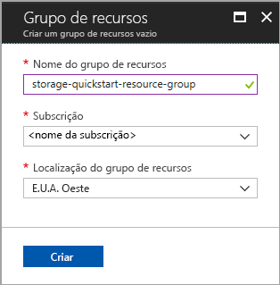
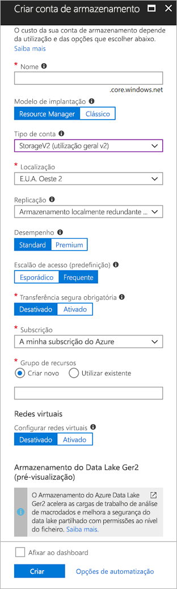

# <a name="quickstart-create-an-azure-data-lake-storage-gen2-preview-storage-account"></a>Início Rápido: Criar uma conta de armazenamento de Pré-visualização do Armazenamento do Azure Data Lake Ger2

As contas de Pré-visualização do Armazenamento do Azure Data Lake Ger2 [suportam um Serviço de Espaço de Nomes Hierárquico](introduction.md) que oferece um sistema de ficheiros baseado no diretório nativo e adaptado para trabalhar com o Sistema de Ficheiros Distribuído do Hadoop (HDFS). O acesso aos dados de Armazenamento do Data Lake Ger2 a partir do HDFS está disponível através do [controlador ABFS](abfs-driver.md).

Para ativar as funcionalidades de Armazenamento do Data Lake Ger2 na sua conta de armazenamento, [preencha o inquérito de pré-visualização para pedir acesso](https://aka.ms/adlsgen2signup). Assim que for aprovado, poderá criar uma nova conta de Armazenamento do Data Lake Ger2. Este início rápido demonstra como criar uma conta com o [portal do Azure](https://portal.azure.com/), o [Azure PowerShell](https://docs.microsoft.com/powershell/azure/overview) ou através da [CLI do Azure](https://docs.microsoft.com/cli/azure?view=azure-cli-latest).

> [!NOTE]
> A IU de criação de conta no portal do Azure é atualizada assim que for aprovado para criar uma conta de Armazenamento do Data Lake Ger2. Da mesma forma, os argumentos do PowerShell e da CLI relacionados com o Armazenamento do Data Lake Ger2 funcionam apenas quando forem aprovados para a pré-visualização.

## <a name="prerequisites"></a>Pré-requisitos

Se não tiver uma subscrição do Azure, crie uma [conta gratuita](https://azure.microsoft.com/free/) antes de começar.

|           | Pré-requisito |
|-----------|--------------|
|Portal     | Nenhuma         |
|PowerShell | Este início rápido requer a versão **5.0.4-preview** ou posterior do módulo Azure PowerShell. Execute `Get-Module -ListAvailable AzureRM` para encontrar a versão atual. Se precisar de instalar ou atualizar, veja [Install Azure PowerShell module](/powershell/azure/install-azurerm-ps)(Instalar o módulo do Azure PowerShell). |
|CLI        | Pode iniciar sessão no Azure e executar comandos da CLI do Azure de uma das seguintes formas: <ul><li>Pode executar comandos da CLI no portal do Azure, no Azure Cloud Shell </li><li>Pode instalar a CLI e executar os respetivos comandos localmente</li></ul>|

Ao trabalhar na linha de comandos, tem a opção de executar o Azure Cloud shell ou instalar a CLI localmente.

### <a name="use-azure-cloud-shell"></a>Utilizar o Azure Cloud Shell

O Azure Cloud Shell é um shell Bash gratuito que pode ser executado diretamente no portal do Azure. Tem a CLI do Azure pré-instalada e configurada para ser utilizada com a sua conta. Clique no botão **Cloud Shell** no menu do canto superior direito do portal do Azure:

[](https://portal.azure.com)

O botão inicia uma shell interativa que pode utilizar para executar os passos neste guia de introdução:

[](https://portal.azure.com)

### <a name="install-the-cli-locally"></a>Instalar a CLI localmente

Também pode instalar e utilizar a CLI do Azure localmente. Este início rápido requer a execução da versão 2.0.38 ou posterior da CLI do Azure. Executar `az --version` para localizar a versão. Se precisar de instalar ou atualizar, veja [Instalar a CLI do Azure](/cli/azure/install-azure-cli).

## <a name="overview-of-creating-an-azure-data-lake-storage-gen2-account"></a>Descrição geral da criação de uma conta de Armazenamento do Azure Data Lake Ger2

Antes de criar uma conta, primeiro tem de criar um grupo de recursos que age como um contentor lógico para contas de armazenamento ou outros recursos criados do Azure. Se pretende limpar os recursos criados por este guia de introdução, basta eliminar o grupo de recursos. Ao eliminar o grupo de recursos também elimina a conta de armazenamento associada e quaisquer outros recursos associados ao grupo de recursos. Para obter mais informações sobre os grupos de recursos, veja [Descrição geral do Azure Resource Manager](../../azure-resource-manager/resource-group-overview.md).

> [!NOTE]
> Tem de criar novas contas de armazenamento como o tipo **StorageV2 (V2 de fins gerais)**, para tirar partido das funcionalidades de Armazenamento do Data Lake Ger2.  

Para obter mais informações sobre as contas de armazenamento, veja [Azure Storage account overview](../common/storage-account-overview.md) (Descrição geral da Conta de Armazenamento).

Para atribuir um nome à sua conta de armazenamento, mantenha estas regras em mente:

- Os nomes das contas do Storage devem ter entre 3 e 24 carateres de comprimento e apenas podem conter números e letras minúsculas.
- O nome da sua conta do Storage tem de ser exclusivo no Azure. Duas contas de armazenamento não podem ter o mesmo nome.

## <a name="create-an-account-using-the-azure-portal"></a>Criar uma conta no portal do Azure

Inicie sessão no [Portal do Azure](https://portal.azure.com).

### <a name="create-a-resource-group"></a>Criar um grupo de recursos

Para criar um grupo de recursos no portal do Azure, siga estes passos:

1. No portal do Azure, expanda o menu no lado esquerdo para abrir o menu de serviços e escolha **Grupos de Recursos**.
2. Clique no botão **Adicionar** para adicionar um novo grupo de recursos.
3. Introduza um nome para o novo grupo de recursos.
4. Selecione a subscrição na que vai criar o novo grupo de recursos.
5. Escolha a localização para o grupo de recursos.
6. Clique no botão **Criar**.  



### <a name="create-a-general-purpose-v2-storage-account"></a>Criar uma conta de armazenamento v2 para fins gerais

Para criar uma conta de armazenamento para fins gerais v2 no portal do Azure, siga estes passos:

> [!NOTE]
> O espaço de nomes hierárquico só está ativado no E.U.A. Leste, E.U.A. Leste 2, E.U.A. Oeste, E.U.A. Oeste 2, E.U.A. Centro-Oeste, Europa do Norte, Europa Ocidental, Sudeste Asiático e Leste da Austrália. Certifique-se de que especifica uma destas localizações ao criar a conta de armazenamento.

1. No portal do Azure, expanda o menu do lado esquerdo para abrir o menu de serviços e escolha **Todos os Serviços**. Em seguida, desloque para baixo até **Armazenamento**e escolha **Contas de armazenamento**. Na janela **Contas de Armazenamento** que é apresentada, escolha **Adicionar**.
2. Introduza um nome para a conta do Storage.
3. Deixe o **Modelo de implementação** definido para o valor predefinido.
4. Defina o **Tipo de conta** como **StorageV2 (armazenamento para fins gerais v2)**.
5. Defina a **Localização** para **E.U.A. Oeste 2**
6. Deixe o campo **Replicação** definido como **Armazenamento Localmente Redundante (LRS)**.
7. Deixe estes campos definidos com as predefinições: **Replicação**. **Desempenho**, **Camada de acesso**.
8. Escolha a subscrição na qual pretende criar a conta de armazenamento.
9. Na secção **Grupo de recursos**, selecione **Utilizar existente** e, em seguida, escolha o grupo de recursos que criou na secção anterior.
10. Mantenha o valor predefinido para **Redes Virtuais**
11. Na secção **Armazenamento do Data Lake Gen2 (pré-visualização)** defina o **Espaço de nomes hierárquico** como **Ativado**.
12. Clique em **Criar** para criar a conta do Storage.



A conta de armazenamento está agora criada através do portal.

### <a name="clean-up-resources"></a>Limpar recursos

Para remover um grupo de recursos através do portal do Azure:

1. No portal do Azure, expanda o menu no lado esquerdo para abrir o menu de serviços e escolha **Grupos de Recursos**, para apresentar a lista dos seus grupos de recursos.
2. Encontre o grupo de recursos a eliminar e clique com o botão direito do rato em **Mais** (**...** ) no lado direito da lista.
3. Selecione **Eliminar grupo de recursos** e confirme.

## <a name="create-an-account-using-powershell"></a>Criar uma conta com o PowerShell

Inicie sessão na sua subscrição do Azure com o comando `Login-AzureRmAccount` e siga as instruções no ecrã para autenticar.

```powershell
Login-AzureRmAccount
```

### <a name="upgrade-your-powershell-module"></a>Atualizar o módulo do powershell

Para interagir com o Armazenamento do Data Lake Ger2 através do PowerShell, terá de atualizar o seu módulo para a versão de pré-visualização.

Para tal, abra um PowerShell elevado e introduza o seguinte comando: `Install-Module AzureRM.Storage –Repository PSGallery -RequiredVersion 5.0.4-preview –AllowPrerelease –AllowClobber –Force `

Em seguida, reinicie a shell.

### <a name="create-a-resource-group"></a>Criar um grupo de recursos

Para criar um novo grupo de recursos com o PowerShell, utilize o comando [New-AzureRmResourceGroup](/powershell/module/azurerm.resources/new-azurermresourcegroup): 

> [!NOTE]
> O espaço de nomes hierárquico só está ativado no E.U.A. Leste, E.U.A. Leste 2, E.U.A. Oeste, E.U.A. Oeste 2, E.U.A. Centro-Oeste, Europa do Norte, Europa Ocidental, Sudeste Asiático e Leste da Austrália. Certifique-se de que especifica uma destas localizações ao criar a conta de armazenamento.

```powershell
# put resource group in a variable so you can use the same group name going forward,
# without hardcoding it repeatedly
$resourceGroup = "storage-quickstart-resource-group"
$location = "westus2"
New-AzureRmResourceGroup -Name $resourceGroup -Location $location
```

### <a name="create-a-general-purpose-v2-storage-account"></a>Criar uma conta de armazenamento v2 para fins gerais

Para criar uma conta de armazenamento para fins gerais v2 do PowerShell, com armazenamento localmente redundante (LRS), utilize o comando [New-AzureRmStorageAccount](/powershell/module/azurerm.storage/New-AzureRmStorageAccount):

```powershell
Get-AzureRmLocation | select Location 
$location = "westus2"

New-AzureRmStorageAccount -ResourceGroupName $resourceGroup `
  -Name "storagequickstart" `
  -Location $location `
  -SkuName Standard_LRS `
  -Kind StorageV2 
  -EnableHierarchicalNamespace $True
```

### <a name="clean-up-resources"></a>Limpar recursos

Para remover o grupo de recursos e os respetivos recursos associados, incluindo a nova conta de armazenamento, utilize o comando [Remove-AzureRmResourceGroup](/powershell/module/azurerm.resources/remove-azurermresourcegroup): 

```powershell
Remove-AzureRmResourceGroup -Name $resourceGroup
```

## <a name="create-an-account-using-azure-cli"></a>Criar uma conta com a CLI do Azure

Para iniciar o Azure Cloud Shell, inicie sessão no [portal do Azure](https://portal.azure.com).

Para iniciar sessão na sua instalação local da CLI, execute o comando de início de sessão:

```cli
az login
```

### <a name="upgrade-your-cli-module"></a>Atualizar o seu módulo da CLI

Para interagir com o Armazenamento do Data Lake Ger2 através da CLI, terá de adicionar a extensão à sua shell.

Para o fazer: introduza o seguinte comando com o Cloud Shell ou uma shell local: `az extension add --name storage-preview`

### <a name="create-a-resource-group"></a>Criar um grupo de recursos

Para criar um novo grupo de recursos com a CLI do Azure, utilize o comando [az group create](/cli/azure/group#az_group_create).

```azurecli-interactive
az group create \
    --name storage-quickstart-resource-group \
    --location westus2
```

> [!NOTE]
> O espaço de nomes hierárquico só está ativado no E.U.A. Leste, E.U.A. Leste 2, E.U.A. Oeste, E.U.A. Oeste 2, E.U.A. Centro-Oeste, Europa do Norte, Europa Ocidental, Sudeste Asiático e Leste da Austrália. Certifique-se de que especifica uma destas localizações ao criar a conta de armazenamento.

### <a name="create-a-general-purpose-v2-storage-account"></a>Criar uma conta de armazenamento v2 para fins gerais

Para criar uma conta de armazenamento para fins gerais v2 a partir da CLI do Azure com armazenamento localmente redundante, utilize o comando [az storage account create](/cli/azure/storage/account#az_storage_account_create).

```azurecli-interactive
az storage account create \
    --name storagequickstart \
    --resource-group storage-quickstart-resource-group \
    --location westus2 \
    --sku Standard_LRS \
    --kind StorageV2 \
    --hierarchical-namespace true
```

### <a name="clean-up-resources"></a>Limpar recursos

Para remover o grupo de recursos e os respetivos recursos associados, incluindo a nova conta de armazenamento, utilize o comando [eliminação do grupo az](/cli/azure/group#az_group_delete).

```azurecli-interactive
az group delete --name myResourceGroup
```

## <a name="next-steps"></a>Passos seguintes

Neste início rápido, criou uma conta de armazenamento Ger 2 de Armazenamento do Data Lake. Para saber como carregar e transferir blobs para e partir da sua conta de armazenamento, avance para o início rápido de armazenamento de Blobs.

* [Mover dados de e para o Armazenamento de Blobs do Azure com AzCopy](https://docs.microsoft.com/azure/machine-learning/team-data-science-process/move-data-to-azure-blob-using-azcopy)