# <a name="quickstart-run-a-spark-job-on-azure-databricks-using-the-azure-portal"></a>Início rápido: Executar uma tarefa do Spark no Azure Databricks com o portal do Azure

Este início rápido mostra como executar uma tarefa do Apache Spark com o Azure Databricks para realizar análise nos dados armazenados na Pré-visualização de Armazenamento do Azure Data Lake Ger2.

Como parte da tarefa do Spark, analisa os dados de subscrição de um canal de rádio para obter informações acerca da utilização gratuita/paga com base nos dados demográficos.

Se não tiver uma subscrição do Azure, [crie uma conta gratuita](https://azure.microsoft.com/free/) antes de começar.

## <a name="prerequisites"></a>Pré-requisitos

- [Criar uma Conta de Armazenamento do Azure Data Lake Ger2](quickstart-create-account.md)

## <a name="set-aside-storage-account-configuration"></a>Reservar a configuração da conta de armazenamento

> [!IMPORTANT]
> Durante este tutorial, irá precisar de acesso ao nome da sua conta de armazenamento e à chave de acesso. No portal do Azure, selecione **Todos os serviços** e filtre *armazenamento*. Selecione **Contas de armazenamento** e localize a conta que criou para este tutorial.
>
> Na **Descrição geral**, copie o **nome** da conta de armazenamento para um editor de texto. Em seguida, selecione **Chaves de acesso** e copie o valor da **chave1** para o editor de texto, uma vez que são precisos ambos os valores para os comandos posteriores.

## <a name="create-an-azure-databricks-workspace"></a>Criar uma área de trabalho do Azure Databricks

Nesta secção, vai criar uma área de trabalho do Azure Databricks com o portal do Azure.

1. No Portal do Azure, selecione **Criar um recurso** > **Análise** > **Azure Databricks**. 

    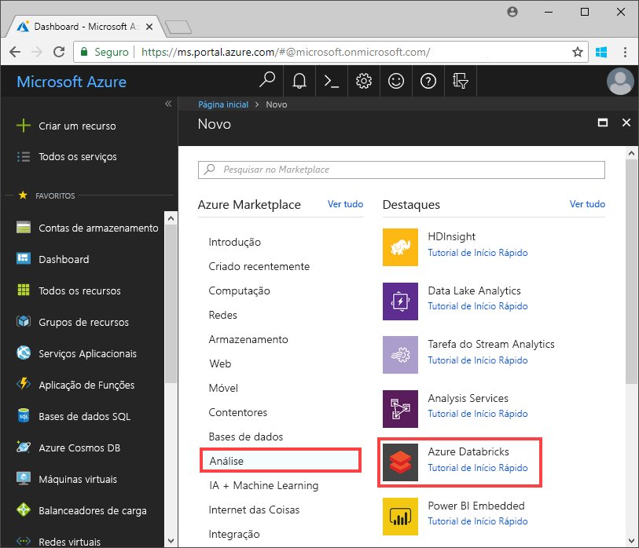

2. Em **Serviço Azure Databricks**, forneça os valores para criar uma área de trabalho do Databricks.

    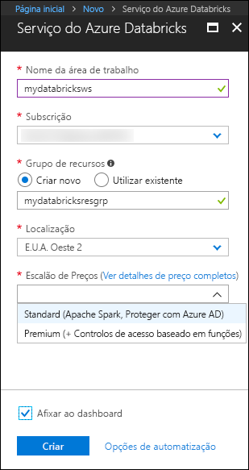

    Forneça os seguintes valores:
     
    |Propriedade  |Descrição  |
    |---------|---------|
    |**Nome da área de trabalho**     | Indique um nome para a sua área de trabalho do Databricks        |
    |**Subscrição**     | Na lista pendente, selecione a sua subscrição do Azure.        |
    |**Grupo de recursos**     | Especifique se quer criar um novo grupo de recursos ou utilizar um existente. Um grupo de recursos é um contentor que mantém recursos relacionados para uma solução do Azure. Para obter mais informações, veja [Descrição geral do Grupo de Recursos do Azure](../../azure-resource-manager/resource-group-overview.md). |
    |**Localização**     | Selecione **E.U.A. Oeste 2**. Para outras regiões disponíveis, veja [Serviços do Azure disponíveis por região](https://azure.microsoft.com/regions/services/).        |
    |**Escalão de Preço**     |  Escolha entre **Standard** ou **Premium**. Para obter mais informações sobre estes escalões, veja [Página de preços do Databricks](https://azure.microsoft.com/pricing/details/databricks/).       |

    Selecione **Afixar ao dashboard** e, em seguida, clique em **Criar**.

3. A criação da área de trabalho demora alguns minutos. Durante a criação da área de trabalho, o portal apresenta o mosaico **Submeter a implementação para o Azure Databricks** no lado direito. Pode ter de se deslocar para a direita no dashboard para ver o mosaico. É também apresentada uma barra de progresso junto à parte superior do ecrã. Pode ver qualquer área de progresso.

    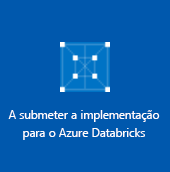

## <a name="create-a-spark-cluster-in-databricks"></a>Criar um cluster do Spark no Databricks

1. No portal do Azure, aceda à área de trabalho do Databricks que criou e, em seguida, selecione **Iniciar Área de Trabalho**.

2. Será redirecionado para o portal do Azure Databricks. No portal, selecione **Novo** > **Cluster**.

    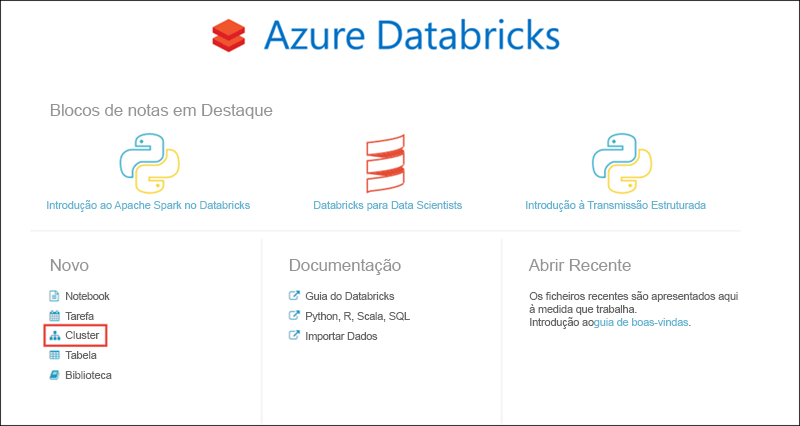

3. Na página **Novo cluster**, indique os valores para criar um cluster.

    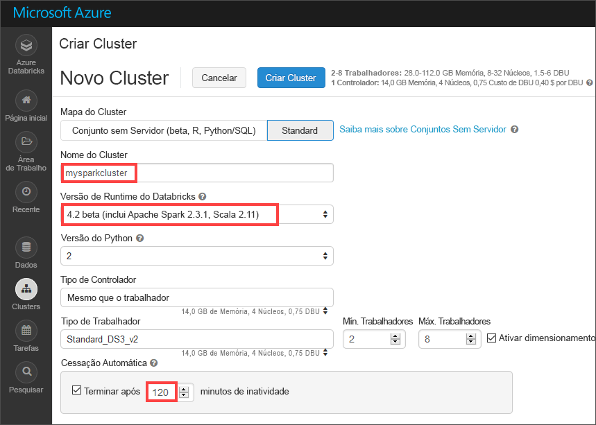

    Aceite todos os outros valores predefinidos que não sejam os seguintes:

    * Introduza um nome para o cluster.
    * Crie um cluster com o runtime **4.2 beta**.
    * Certifique-se de que seleciona a caixa de verificação **Terminar após 120 minutos de inatividade**. Indique uma duração (em minutos) para terminar o cluster, caso não esteja a ser utilizado.

4. Selecione **Criar cluster**. Depois de o cluster estar em execução, pode anexar blocos de notas ao cluster e executar tarefas do Spark.

Para obter mais informações sobre a criação de clusters, veja [Criar um cluster do Spark no Azure Databricks](https://docs.azuredatabricks.net/user-guide/clusters/create.html).

## <a name="create-storage-account-file-system"></a>Criar sistema de ficheiro da conta de armazenamento

Nesta secção, vai criar um bloco de notas na área de trabalho do Azure Databricks e, em seguida, executar fragmentos de código para configurar a conta de armazenamento.

1. No [portal do Azure](https://portal.azure.com), aceda à área de trabalho do Azure Databricks que criou e selecione **Iniciar Área de Trabalho**.

2. No painel esquerdo, selecione **Área de Trabalho**. No menu pendente **Área de Trabalho**, selecione **Criar** > **Bloco de Notas**.

    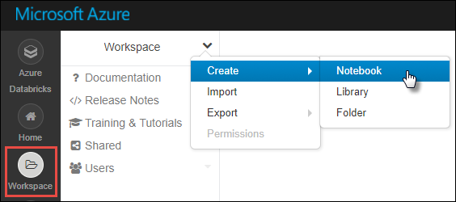

3. Na caixa de diálogo **Criar Bloco de Notas**, introduza um nome para o bloco de notas. Selecione **Scala** como a linguagem e selecione o cluster do Spark que criou anteriormente.

    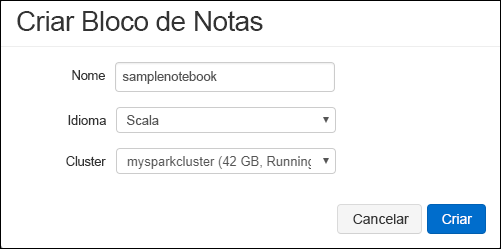

    Selecione **Criar**.

4. No seguinte código, substitua o texto de **ACCOUNT_NAME** e de **ACCOUNT_KEY** pelos valores que guardou no princípio do início rápido. Substitua também o texto de **FILE_SYSTEM_NAME** pelo nome que pretende dar ao sistema de ficheiros. Em seguida, introduza o código na primeira célula.

    ```scala
    spark.conf.set("fs.azure.account.key.<ACCOUNT_NAME>.dfs.core.windows.net", "<ACCOUNT_KEY>") 
    spark.conf.set("fs.azure.createRemoteFileSystemDuringInitialization", "true")
    dbutils.fs.ls("abfs://<FILE_SYSTEM_NAME>@<ACCOUNT_NAME>.dfs.core.windows.net/")
    spark.conf.set("fs.azure.createRemoteFileSystemDuringInitialization", "false") 
    ```

    Prima **SHIFT + ENTER** para executar a célula do código.

    Agora, o sistema de ficheiros é criado para a conta de armazenamento.

## <a name="ingest-sample-data"></a>Ingerir dados de exemplo

Antes de começar esta secção, tem de satisfazer os seguintes pré-requisitos:

Introduza o seguinte código numa célula do bloco de notas:

    %sh wget -P /tmp https://github.com/Azure/usql/blob/master/Examples/Samples/Data/json/radiowebsite/small_radio_json.json

Na célula, prima `Shift` + `Enter` para executar o código.

Agora, numa célula nova abaixo desta, introduza o seguinte código (substitua **FILE_SYSTEM** e **ACCOUNT_NAME** pelos valores que utilizou anteriormente):

    dbutils.fs.cp("file:///tmp/small_radio_json.json", "abfs://<FILE_SYSTEM>@<ACCOUNT_NAME>.dfs.core.windows.net/")

Na célula, prima `Shift` + `Enter` para executar o código.

## <a name="run-a-spark-sql-job"></a>Executar uma tarefa SQL do Spark

Realize as seguintes tarefas para executar uma tarefa SQL do Spark nos dados.

1. Execute uma instrução SQL para criar uma tabela temporária com dados do ficheiro de dados JSON de exemplo, **small_radio_json.json**. No fragmento seguinte, substitua os valores dos marcadores de posição pelo nome do sistema de ficheiros e o nome da conta de armazenamento. Com o bloco de notas que criou anteriormente, cole o fragmento numa nova célula de código no bloco de notas e prima SHIFT + ENTER.

    ```sql
    %sql
    DROP TABLE IF EXISTS radio_sample_data;
    CREATE TABLE radio_sample_data
    USING json
    OPTIONS (
     path  "abfs://<FILE_SYSTEM_NAME>@<ACCOUNT_NAME>.dfs.core.windows.net/<PATH>/small_radio_json.json"
    )
    ```

    Depois de o comando ser concluído com êxito, terá todos os dados do ficheiro JSON como uma tabela num cluster do Databricks.

    O comando mágico de linguagem `%sql` permite executar um código SQL a partir do bloco de notas, mesmo se o bloco de notas for de outro tipo. Para obter mais informações, veja [Misturar linguagens num bloco de notas](https://docs.azuredatabricks.net/user-guide/notebooks/index.html#mixing-languages-in-a-notebook).

2. Vamos ver um instantâneo dos dados JSON de exemplo para compreender melhor a consulta que irá executar. Cole o fragmento seguinte na célula de código e prima **SHIFT + ENTER**.

    ```sql
    %sql 
    SELECT * from radio_sample_data
    ```

3. Verá uma saída tabular, como a apresentada na captura de ecrã seguinte, (apenas são apresentadas algumas colunas):

    

    Entre outros detalhes, os dados de exemplo capturam o género do público-alvo de uma estação de rádio (nome da coluna, **género**) e se a sua subscrição é gratuita ou paga (nome da coluna, **nível**).

4. Agora, vai criar uma representação visual destes dados para mostrar para cada género, quantos utilizadores têm contas gratuitas e quantos têm subscrições pagas. Na parte inferior da saída tabular, clique no ícone de **Gráfico de barras** e, em seguida, clique em **Opções de Desenho**.

    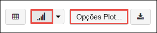

5. Em **Personalizar Desenho**, arraste e largue os valores, conforme mostra a captura de ecrã.

    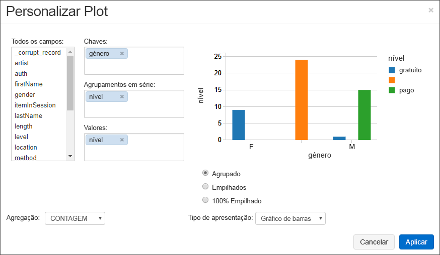

    - Defina **Chaves** como **género**.
    - Defina **Agrupamentos de séries** como **nível**.
    - Defina **Valores** como **nível**.
    - Defina **Agregação** como **CONTAGEM**.

6. Clique em **Aplicar**.

7. A saída mostra a representação visual, tal como ilustrado na captura de ecrã seguinte:

     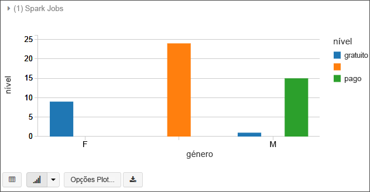

## <a name="clean-up-resources"></a>Limpar recursos

Depois de ler o artigo, pode terminar o cluster. Na área de trabalho do Azure Databricks, selecione **Clusters** e localize o cluster que pretende terminar. Paire o cursor do rato sobre o botão de reticências na coluna **Ações** e selecione o ícone **Terminar**.

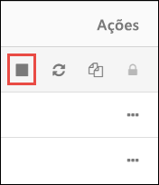

Se não terminar manualmente o cluster, este para automaticamente, desde que tenha selecionado a caixa de verificação **Terminar após __ minutos de inatividade** ao criar o cluster. Se definir esta opção, o cluster para depois de estar inativo durante o período de tempo designado.

## <a name="next-steps"></a>Passos seguintes

Neste artigo, criou um cluster do Spark no Azure Databricks e executou uma tarefa do Spark com dados do Armazenamento do Data Lake Ger2. Também pode ver a página [Origens de dados do Spark](https://docs.azuredatabricks.net/spark/latest/data-sources/index.html) para saber como importar dados de outras origens de dados para o Azure Databricks. Avance para o artigo seguinte para saber como executar uma operação de ETL (extração, transformação e carregamento de dados) com o Azure Databricks.

> [!div class="nextstepaction"]
>[Extrair, transformar e carregar dados com o Azure Databricks](../../azure-databricks/databricks-extract-load-sql-data-warehouse.md)
