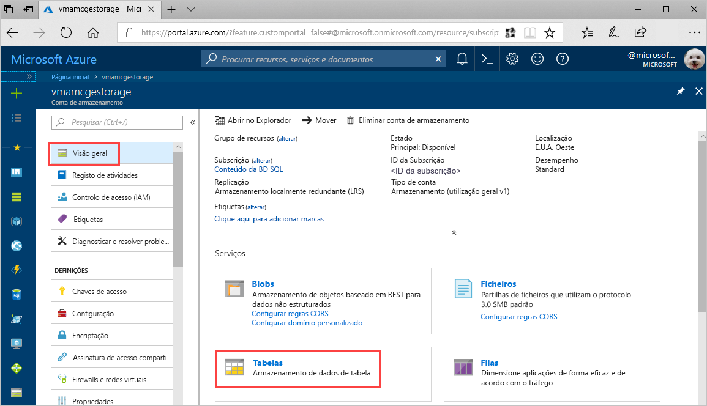
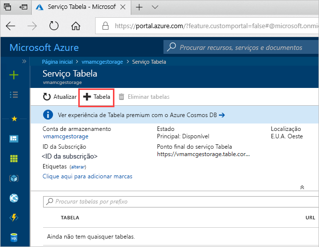
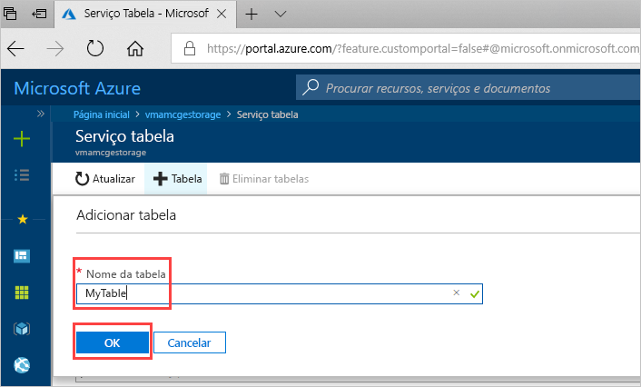

# Início Rápido: Criar uma Tabela de armazenamento do Azure no portal do Azure 

Este início rápido mostra como criar tabelas e entidades no portal do Azure baseado na Web. Este início rápido mostra também como criar uma conta de armazenamento do Azure.

[!INCLUDE [quickstarts-free-trial-note](../../../includes/quickstarts-free-trial-note.md)]

## Pré-requisitos

Para concluir este início rápido, primeiro crie uma conta de armazenamento do Azure no [Portal do Azure](https://portal.azure.com/#create/Microsoft.StorageAccount-ARM). Para obter ajuda na criação da conta, veja [Criar uma conta de armazenamento](../common/storage-quickstart-create-account.md).

## Adicionar uma tabela

Agora, pode utilizar o serviço Tabela no portal do Azure para criar uma tabela.

1. Clique em Descrição geral > Tabelas.

   

2. Clique em **+ Tabela**.

   

3. Escreva um nome para a tabela na caixa **Nome da tabela** e, em seguida, clique em **OK**. 

   

## Passos seguintes

- [Diretrizes de estruturação de tabelas](table-storage-design-guidelines.md)