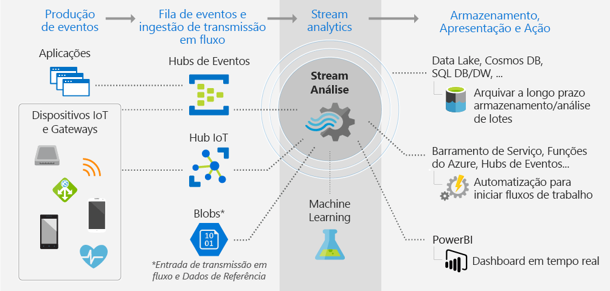
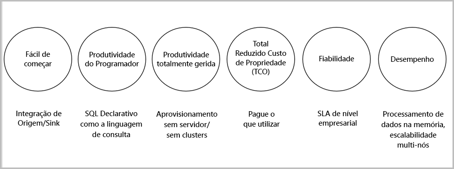

# O que é o Stream Analytics?

O Azure Stream Analytics é um motor de processamento de eventos que lhe permite examinar elevados volumes de dados de transmissão em fluxo a partir de dispositivos. Os dados de entrada podem ser provenientes de dispositivos, sensores, Web sites, feeds de redes sociais, aplicações, entre outras origens. Também suporta a extração de informações de fluxos de dados e a identificação de padrões e relações. Depois, pode utilizar esses padrões para acionar outras ações a jusante, como alertas, fornecer informações a uma ferramenta de relatórios ou armazená-las para utilização futura.

Seguem-se alguns exemplos de onde o Azure Stream Analytics pode ser utilizado: 

* Fusão de sensores de Internet das Coisas (IoT) e análise em tempo real da telemetria dos dispositivos
* Análise de registos/clickstream da Web
* Análise geoespacial para gestão de frotas e veículos autónomos
* Monitorização remota e a manutenção preditiva de recursos de elevado valor
* Análise em tempo real de dados de Pontos de Vendas para controlo de inventário e deteção de anomalias

## Como funciona o Stream Analytics?

O Azure Stream Analytics começa com uma origem de transmissão em fluxo de dados que é ingerida num hub do Hub de Eventos do Azure, no Hub IoT do Azure ou a partir de um arquivo de dados, como o Armazenamento de Blobs do Azure. Para examinar os fluxos, é criado um trabalho do Stream Analytics que especifica a origem de entrada que transmite os dados. O trabalho também especifica uma consulta de transformação que define como procurar dados, padrões ou relações. A consulta de transformação tira partido de uma linguagem de consulta semelhante ao SQL que é utilizada para filtrar, ordenar, Agregar e associar os dados de transmissão em fluxo ao longo de um período de tempo. Quando executa o trabalho, pode ajustar as opções de ordem dos eventos e a duração das janelas de tempo quando são realizadas operações de agregação.

Depois de analisar os dados de entrada, é especificada uma saída para os dados transformados e pode controlar o que fazer em resposta às informações que analisou. Por exemplo, pode realizar ações como:

* Enviar dados para uma fila monitorizada, para acionar fluxos de trabalho personalizados a jusante.
* Enviar dados para o dashboard do Power BI, para visualização em tempo real.
* Arquivar dados noutros serviços de armazenamento do Azure.

A imagem seguinte ilustra o pipeline do Stream Analytics. O trabalho do Stream Analytics pode utilizar todos ou alguns conjuntos de entradas e saídas. Esta imagem mostra como é que os dados são enviados para o Stream Analytics, analisados e enviados para outras ações, como armazenamento ou apresentação:

## Principais capacidades e vantagens

O Azure Stream Analytics foi concebido para ser fácil de utilizar, flexível, fiável e dimensionável para qualquer tamanho de trabalho. Está disponível em vários datacenters, bem como em clouds soberanas. A imagem seguinte ilustra as principais funcionalidades do Azure Stream Analytics:

## Facilidade para começar

É fácil começar a utilizar o Azure Stream Analytics. Bastam apenas alguns cliques para ligar a várias origens e sinks e a criar um pipeline completo. O Stream Analytics pode ser ligado aos [Hubs de Eventos do Azure](https://docs.microsoft.com/azure/event-hubs/) e ao [Hub IoT do Azure](https://docs.microsoft.com/azure/iot-hub/) para ingestão de dados de transmissão em fluxo. Também pode ser ligado ao serviço [armazenamento de Blobs do Azure](https://docs.microsoft.com/azure/storage/storage-introduction) para ingerir dados históricos. Pode combinar dados de hubs de eventos com outras origens de dados e motores de processamento. A entrada dos trabalhos também pode incluir dados de referência que sejam estáticos ou dados com alterações pouco frequentes e pode associar dados de transmissão a esses dados de referência para realizar operações de pesquisa.

O Stream Analytics pode encaminhar a saída dos trabalhos para muitos sistemas de armazenamento como o [Blob do Azure](https://docs.microsoft.com/azure/storage/storage-introduction), a [Base de Dados SQL do Azure](https://docs.microsoft.com/azure/sql-database/), o [Azure Data Lake Stores](https://docs.microsoft.com/azure/data-lake-store/) ou o [Azure Cosmos DB](https://docs.microsoft.com/azure/cosmos-db/introduction). Após o armazenamento, pode executar análises em lote com o Azure HDInsight ou enviar a saída para outro serviço, como os hubs de eventos, para consumo, ou o [Power BI](https://docs.microsoft.com/power-bi/), para visualização em tempo real, mediante a utilização da API de transmissão em fluxo do Power BI.

## Produtividade do programador

O Azure Stream Analytics utiliza uma linguagem de consulta simples baseada em SQL que foi melhorada com limitações temporais poderosas para analisar dados em movimento. Para definir as transformações dos trabalhos, é utilizada uma [linguagem de consulta do Stream Analytics](https://msdn.microsoft.com/library/azure/dn834998.aspx) simples e declarativa, a qual lhe permite criar consultas e análises temporais complexas através da utilização de construções SQL simples. A linguagem de consulta do Stream Analytics é consistente com a linguagem do SQL, familiaridade essa que é suficiente para começar a criar trabalhos. Também pode utilizar ferramentas de programador como o Azure PowerShell, as [ferramentas do Stream Analytics para Visual Studio](stream-analytics-tools-for-visual-studio-install.md) ou modelos do Azure Resource Manager para criar trabalhos. A utilização de ferramentas do programador permite-lhe desenvolver consultas de transformação offline e utilizar o [pipeline CI/CD](stream-analytics-tools-for-visual-studio-cicd.md) para submeter trabalhos para o Azure. 

A linguagem de consulta do Stream Analytics oferece um vasto conjunto de funções para analisar e processar os dados das transmissões em fluxo. Esta linguagem de consulta suporta manipulação de dados simples, funções de agregação e funções geoespaciais complexas. Pode editar as consultas no portal e testá-las com dados de exemplo simples que são extraídos do fluxo em direto.

Pode definir e invocar funções adicionais para alargar as capacidades da linguagem de consultas. Pode definir chamadas de funções no serviço Azure Machine Learning para tirar partido das soluções do Azure Machine Learning e integrar funções definidas pelo utilizador (UDFs) em JavaScript ou agregações definidas pelo utilizador para realizar cálculos complexos como parte da consulta do Stream Analytics.

## Totalmente gerido 

O Azure Stream Analytics é uma oferta sem servidor totalmente gerida (PaaS) no Azure. Isto significa que não tem de aprovisionar nenhum software nem de gerir clusters para executar os trabalhos. O Azure Stream Analytics gere totalmente o trabalho ao assumir a configuração de cluster de computação complexa na cloud e a otimização do desempenho necessário para executar esse trabalho. A integração com os Hubs de Eventos do Azure e com o Hub IoT do Azure permite que os trabalhos ingiram milhões de eventos por segundo provenientes de dispositivos ligados, clickstreams e ficheiros de registo, entre outros. Ao utilizar a funcionalidade de partições dos Hubs de Eventos, pode particionar os cálculos em passos lógicos, tendo a possibilidade de particioná-los ainda mais para aumentar a escalabilidade.

## Custo total de posse baixo

Como serviço cloud, o Stream Analytics está otimizado para custo. Não tem custos à cabeça e só paga as [unidades de transmissão em fluxo que consumir](stream-analytics-streaming-unit-consumption.md) e a quantidade de dados processados. Não são necessários compromissos nem aprovisionamento de clusters. Pode aumentar ou reduzir verticalmente os trabalhos de transmissão em fluxo com base nas necessidades da sua empresa. 

## Fiabilidade 

Como serviço gerido, o Stream Analytics garante o processamento de eventos com uma disponibilidade de 99,9%, ajuda a evitar perda de dados e proporciona continuidade do negócio. Aceda à página [SLA para Stream Analytics](https://azure.microsoft.com/support/legal/sla/stream-analytics/v1_0/) para obter mais detalhes. O Stream Analytics consegue processar milhões de eventos por cada segundo e pode proporcionar resultados com baixa latência.
O Stream Analytics garante exatamente um processamento de eventos e pelo menos uma entrega de eventos. Tem capacidades de recuperação incorporadas para a eventualidade da entrega de um evento falhar. O Stream Analytics consegue manter internamente o estado dos trabalhos, pode iniciar um trabalho a partir da hora da última saída e disponibiliza resultados repetíveis ao fornecer sempre os mesmos resultados. Esta funcionalidade permite-lhe voltar atrás no tempo e investigar cálculos durante a realização de análises a origens de problemas. 

## Desempenho

O Azure Stream Analytics está otimizado para elevado desempenho, pode processar dados de transmissão em fluxo e realizar cálculos dentro da memória. Permite-lhe aumentar ou reduzir verticalmente para lidar com aplicações de processamento de eventos em tempo real e complexos. O Stream Analytics suporta o desempenho através da criação de partições. As consultas complexas podem ser paralelizadas e executadas em vários nós de transmissão em fluxo. 

## Passos seguintes

Viu agora uma descrição geral do Azure Stream Analytics. Em seguida, pode criar o seu primeiro trabalho do Stream Analytics e experimentá-lo na prática:

* [Create a Stream Analytics job by using the Azure portal](stream-analytics-quick-create-portal.md) (Criar um trabalho do Stream Analytics com o portal do Azure).
* [Create a Stream Analytics job by using Azure PowerShell](stream-analytics-quick-create-powershell.md) (Criar um trabalho do Stream Analytics com o Azure PowerShell).
