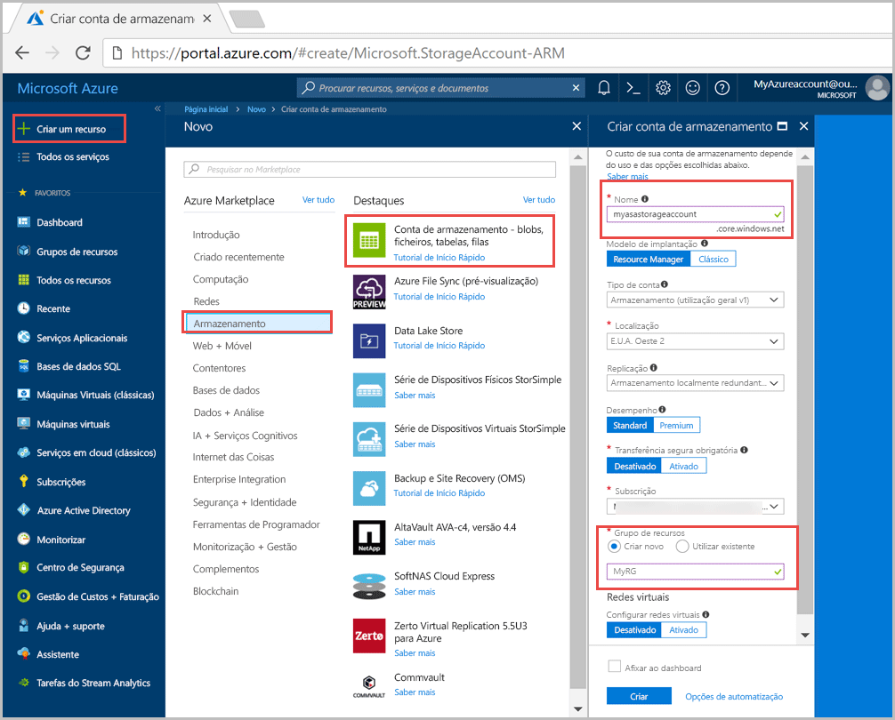
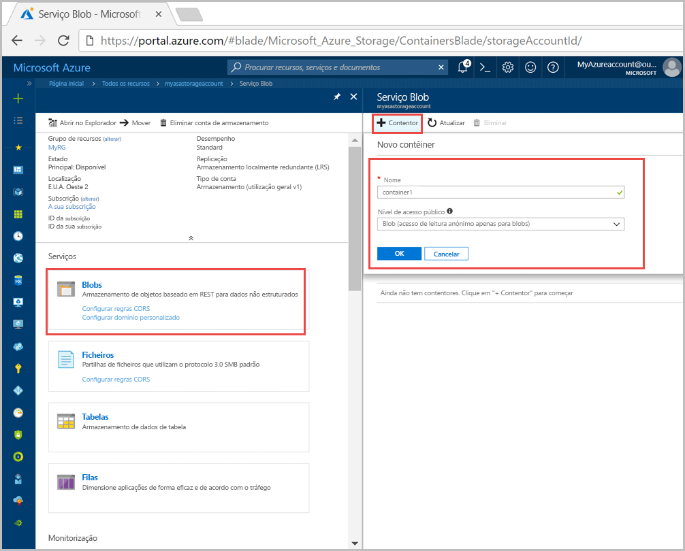
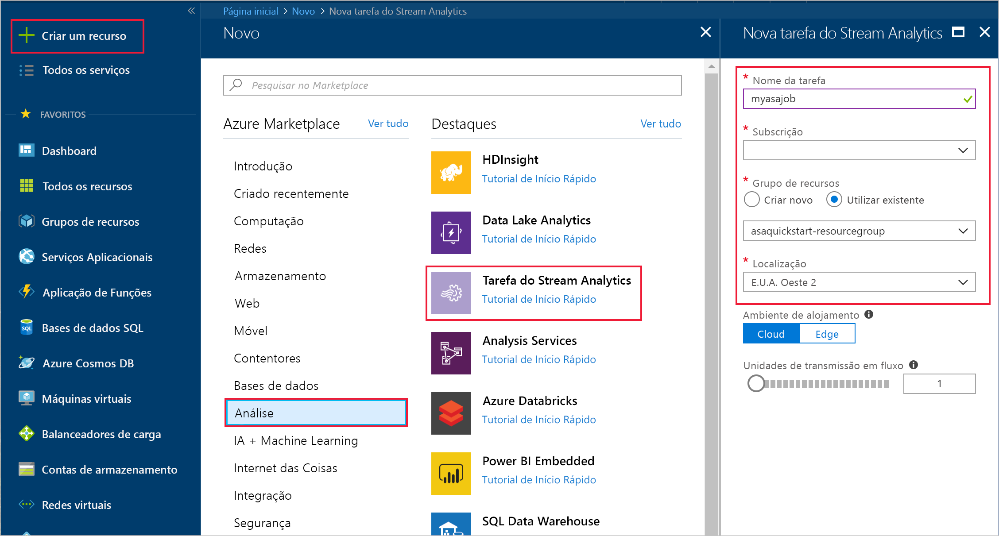
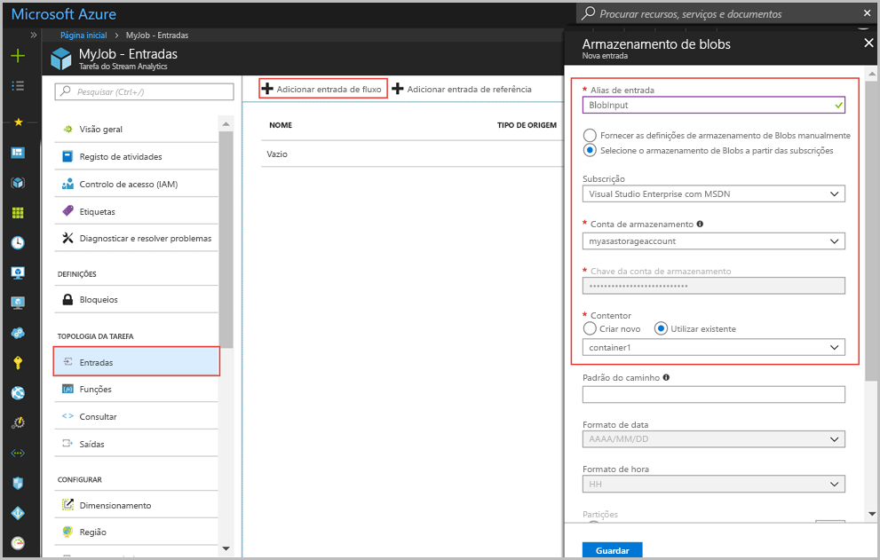
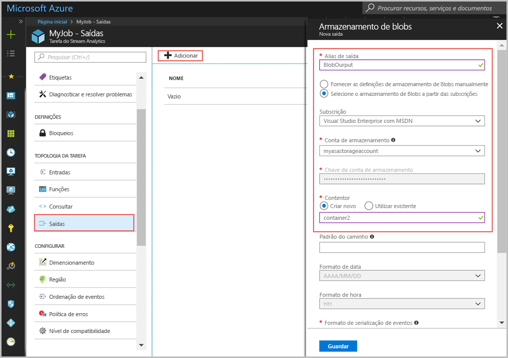
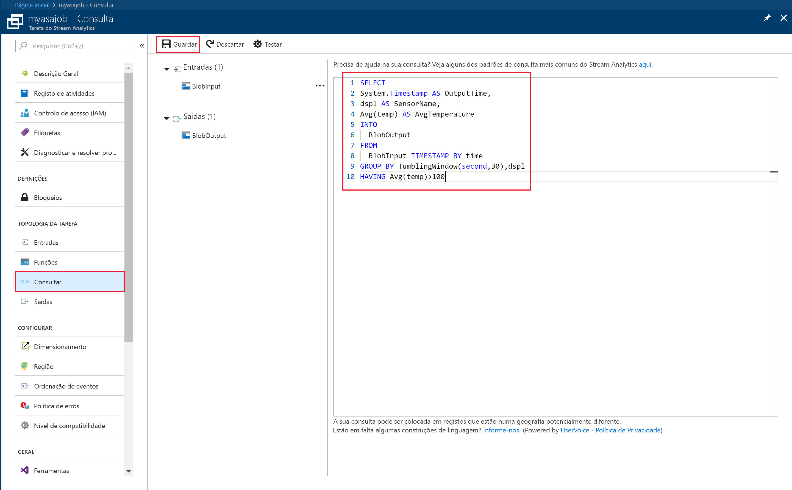
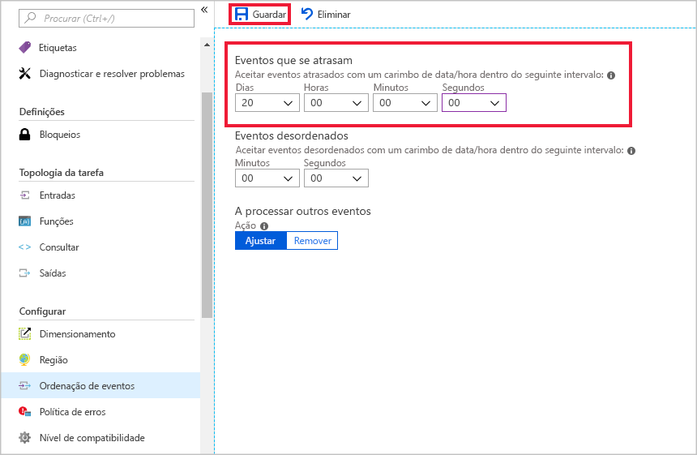
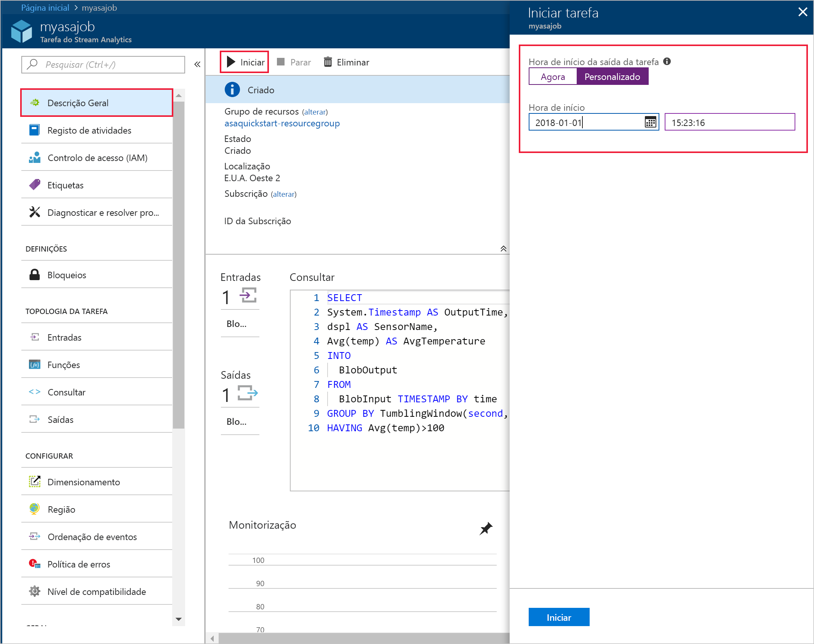
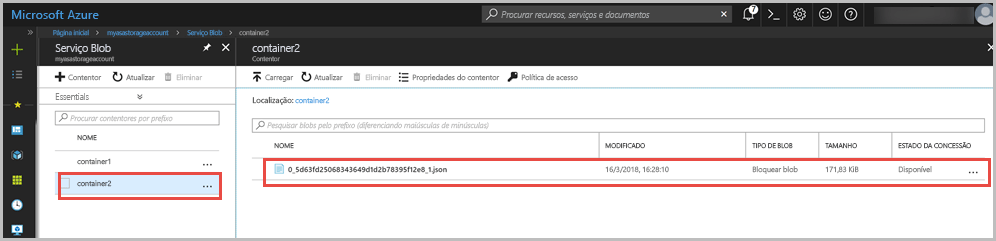

# <a name="quickstart-create-a-stream-analytics-job-by-using-the-azure-portal"></a>Início Rápido: Criar uma tarefa do Stream Analytics com o portal do Azure

Este início rápido mostra como começar ao criar uma tarefa do Stream Analytics. Neste início rápido, vai definir uma tarefa do Stream Analytics que lê dados do sensor de exemplo e filtra as linhas que têm uma temperatura média superior a 100 a cada 30 segundos. Neste artigo, lê os dados a partir do armazenamento de blobs, transforma os dados e escreve-os num contentor diferente no mesmo armazenamento de blobs. O ficheiro de dados de entrada utilizado neste início rápido contém dados estáticos apenas para efeitos ilustrativos. Num cenário do mundo real, utiliza os dados de entrada de transmissão em fluxo para uma tarefa do Stream Analytics.

## <a name="before-you-begin"></a>Antes de começar

* Se não tiver uma subscrição do Azure, crie uma [conta gratuita](https://azure.microsoft.com/free/).

* Inicie sessão no [portal do Azure](https://portal.azure.com/).

## <a name="prepare-the-input-data"></a>Preparar os dados de entrada

Antes de definir a tarefa do Stream Analytics, deve preparar os dados configurados como entrada da tarefa. Para preparar os dados de entrada necessários para a tarefa, execute os seguintes passos:

1. Transfira os [dados do sensor de exemplo](https://raw.githubusercontent.com/Azure/azure-stream-analytics/master/Samples/GettingStarted/HelloWorldASA-InputStream.json) a partir do GitHub. Os dados de exemplo contêm informações do sensor no seguinte formato JSON:  

   ```json
   {
     "time": "2018-08-19T21:18:52.0000000",
     "dspl": "sensorC",
     "temp": 87,
     "hmdt": 44
   }
   ```
2. Inicie sessão no [portal do Azure](https://portal.azure.com/).  

3. No canto superior esquerdo do portal do Azure, selecione **Criar um recurso** > **Armazenamento** > **Conta de armazenamento**. Preencha a página da tarefa Conta de armazenamento com o **Nome** definido como “asaquickstartstorage”, **Localização** definida como “EUA Oeste 2”, **Grupo de recursos** definido como “asaquickstart-resourcegroup” (anfitrião da conta de armazenamento no mesmo grupo de recursos da tarefa Transmissão em Fluxo para um melhor desempenho). As restantes definições podem ser mantidas nos respetivos valores predefinidos.  

   

4. Na página **Todos os recursos**, localize a conta de armazenamento que criou no passo anterior. Abra a página **Descrição geral** e, em seguida, o mosaico **Blobs**.  

5. Na página **Serviço Blob**, selecione **Contentor**, forneça um **Nome** para o contentor, como *container1* e altere o **Nível de acesso público** para Privado (sem acesso anónimo) > selecione **OK**.  

   

6. Aceda ao contentor que criou no passo anterior. Selecione **Carregar** e carregue os dados de sensor que obteve no primeiro passo.  

   

## <a name="create-a-stream-analytics-job"></a>Criar uma tarefa do Stream Analytics

1. Inicie sessão no Portal do Azure.

2. Selecione **Criar um recurso** no canto superior esquerdo do portal do Azure.  

3. Selecione **Dados+Analytics** > **Tarefa do Stream Analytics** na lista de resultados.  

4. Preencha a página da tarefa do Stream Analytics com as seguintes informações:

   |**Definição**  |**Valor sugerido**  |**Descrição**  |
   |---------|---------|---------|
   |Nome da tarefa   |  myasajob   |   Introduza um nome para identificar a tarefa do Stream Analytics. O nome da tarefa do Stream Analytics só pode conter carateres alfanuméricos, hífenes e carateres de sublinhado e tem de ter entre 3 a 63 carateres. |
   |Subscrição  | \<A sua subscrição\> |  Selecione a subscrição do Azure que quer utilizar para esta tarefa. |
   |Grupo de recursos   |   asaquickstart-resourcegroup  |   Selecione **Criar Novo** e introduza um novo nome de grupo de recursos para a sua conta. |
   |Localização  |  \<Selecione a região mais próxima dos seus utilizadores\> | Selecione a localização geográfica onde pode alojar a tarefa do Stream Analytics. Utilize a localização mais próxima dos seus utilizadores para um melhor desempenho e reduzir os custos de transferência de dados. |
   |Unidades de transmissão em fluxo  | 1  |   As unidades de transmissão em fluxo representam os recursos informáticos que são necessários para executar uma tarefa. Por predefinição, este valor está definido como 1. Para saber mais sobre o dimensionamento de unidades de transmissão em fluxo, veja o artigo [Compreender e ajustar as unidades de transmissão em fluxo](stream-analytics-streaming-unit-consumption.md).   |
   |Ambiente de alojamento  |  Nuvem  |   As tarefas do Stream Analytics podem ser implementadas na cloud ou no Edge. A cloud permite-lhe implementar no Azure Cloud e o Edge permite-lhe implementar num dispositivo do IoT Edge. |

   

5. Selecione a caixa **Afixar ao dashboard** para colocar a tarefa no seu dashboard e, em seguida, selecione **Criar**.  

6. Deverá ver a mensagem "Implementação em curso..." apresentada na parte superior direita da janela do browser. 

## <a name="configure-input-to-the-job"></a>Configurar a entrada da tarefa

Nesta secção, irá configurar o armazenamento de blobs como entrada da tarefa do Stream Analytics. Antes de configurar a entrada, crie uma conta de armazenamento de blobs.  

### <a name="add-the-input"></a>Adicionar a entrada 

1. Navegue para a tarefa do Stream Analytics.  

2. Selecione **Entradas** > **Adicionar entrada de fluxo** > **Armazenamento de blobs**.  

3. Preencha a página **Armazenamento de blobs** com os seguintes valores:

   |**Definição**  |**Valor sugerido**  |**Descrição**  |
   |---------|---------|---------|
   |Alias de entrada  |  BlobInput   |  Introduza um nome para identificar a entrada da tarefa.   |
   |Subscrição   |  \<A sua subscrição\> |  Selecione a subscrição do Azure que tem a conta de armazenamento que criou. A conta de armazenamento pode estar na mesma subscrição ou numa diferente. Este exemplo assume que criou a conta de armazenamento na mesma subscrição. |
   |Conta de armazenamento  |  myasastorageaccount |  Escolha ou introduza o nome da conta de armazenamento. Os nomes de contas de armazenamento são detetados automaticamente se forem criados na mesma subscrição. |
   |Contentor  | container1 | Escolha o nome do contentor que tem dados de exemplo. Os nomes de contentores são detetados automaticamente se forem criados na mesma subscrição. |

4. Mantenha as outras opções com os valores predefinidos e selecione **Guardar** para guardar as definições.  

   
 
## <a name="configure-output-to-the-job"></a>Configurar a saída da tarefa

1. Navegue para a tarefa do Stream Analytics que criou anteriormente.  

2. Selecione **Saídas > Adicionar > Armazenamento de blobs**.  

3. Preencha a página **Armazenamento de blobs** com os seguintes valores:

   |**Definição**  |**Valor sugerido**  |**Descrição**  |
   |---------|---------|---------|
   |Alias de saída |   BlobOutput   |   Introduza um nome para identificar a saída da tarefa. |
   |Subscrição  |  \<A sua subscrição\>  |  Selecione a subscrição do Azure que tem a conta de armazenamento que criou. A conta de armazenamento pode estar na mesma subscrição ou numa diferente. Este exemplo assume que criou a conta de armazenamento na mesma subscrição. |
   |Conta de armazenamento |  asaquickstartstorage |   Escolha ou introduza o nome da conta de armazenamento. Os nomes de contas de armazenamento são detetados automaticamente se forem criados na mesma subscrição.       |
   |Contentor |   container1  |  Selecione o contentor existente que criou na conta de armazenamento.   |
   |Padrão do caminho |   saída  |  Introduza um nome para servir como caminho para a saída dentro do contentor existente.   |

4. Mantenha as outras opções com os valores predefinidos e selecione **Guardar** para guardar as definições.  

   
 
## <a name="define-the-transformation-query"></a>Definir a consulta de transformação

1. Navegue para a tarefa do Stream Analytics que criou anteriormente.  

2. Selecione **Consulta** e atualize a consulta da seguinte forma:  

   ```sql
   SELECT 
   System.Timestamp AS OutputTime,
   dspl AS SensorName,
   Avg(temp) AS AvgTemperature
   INTO
     BlobOutput
   FROM
     BlobInput TIMESTAMP BY time
   GROUP BY TumblingWindow(second,30),dspl
   HAVING Avg(temp)>100
   ```

3. Neste exemplo, a consulta lê os dados do blob e copia-os para um novo ficheiro no blob. Em seguida, selecione **Guardar**.  

   

## <a name="configure-late-arrival-policy"></a>Configurar política de chegada tardia

1. Navegue para a tarefa do Stream Analytics que criou anteriormente.

2. Em **Configurar**, selecione **Ordenação de eventos**.

3. Defina os **Eventos que se atrasam** para 20 dias e selecione **Guardar**.

   

## <a name="start-the-stream-analytics-job-and-check-the-output"></a>Iniciar a tarefa do Stream Analytics e verificar a saída

1. Regresse à página de descrição geral da tarefa e selecione **Iniciar**.

2. Em **Iniciar tarefa**, selecione **Personalizado** para o campo **Hora de início**. Selecione `2018-01-24` como data de início, mas não altere a hora. Esta data de início é escolhida porque precede o carimbo de data/hora do evento dos dados de exemplo. Quando terminar, selecione **Iniciar**.

   

3. Após alguns minutos, no portal, localize a conta de armazenamento e o contentor que configurou como saída da tarefa. Selecione o caminho de saída. Agora, pode ver o ficheiro de saída no contentor. A tarefa demora alguns minutos a iniciar pela primeira vez. Depois de ser iniciada, continuará a ser executada à medida que os dados são recebidos.  

   

## <a name="clean-up-resources"></a>Limpar recursos

Quando já não for necessário, elimine o grupo de recursos, a tarefa de transmissão em fluxo e todos os recursos relacionados. A eliminação da tarefa evita a faturação das unidades de transmissão em fluxo consumidas pela tarefa. Se estiver a planear utilizar a tarefa no futuro, pode pará-la e reiniciá-la mais tarde, quando for necessário. Se não quiser continuar a utilizar esta tarefa, elimine todos os recursos criados por este início rápido ao utilizar os seguintes passos:

1. No menu do lado esquerdo no portal do Azure, selecione **Grupos de recursos** e, em seguida, selecione o nome do recurso que criou.  

2. Na página do grupo de recursos, selecione **Eliminar**, escreva o nome do recurso a eliminar na caixa de texto e, em seguida, selecione **Eliminar**.

## <a name="next-steps"></a>Passos seguintes

Neste início rápido, implementou uma tarefa simples do Stream Analytics. Para saber mais sobre como configurar outras origens de entrada e efetuar a deteção em tempo real, avance para o seguinte artigo:

> [!div class="nextstepaction"]
> [Deteção de fraudes em tempo real com o Azure Stream Analytics](stream-analytics-real-time-fraud-detection.md)

