# <a name="quickstart-create-a-stream-analytics-job-by-using-the-azure-stream-analytics-tools-for-visual-studio"></a>Início Rápido: Criar uma tarefa do Stream Analytics com as ferramentas do Azure Stream Analytics para Visual Studio

Este início rápido mostra como criar e executar uma tarefa do Stream Analytics com ferramentas do Azure Stream Analytics para Visual Studio. A tarefa de exemplo lê dados de transmissão em fluxo a partir do armazenamento de blobs do Azure. O ficheiro de dados de entrada utilizado neste início rápido contém dados estáticos apenas para efeitos ilustrativos. Num cenário do mundo real, utiliza os dados de entrada de transmissão em fluxo para uma tarefa do Stream Analytics. Neste início rápido, irá definir uma tarefa que calcula a temperatura média quando ultrapassa 100° e grava os eventos de saída resultantes num novo ficheiro.

## <a name="before-you-begin"></a>Antes de começar

* Se não tiver uma subscrição do Azure, crie uma [conta gratuita](https://azure.microsoft.com/free/).

* Inicie sessão no [portal do Azure](https://portal.azure.com/).

* Instale o Visual Studio 2017, o Visual Studio 2015 ou o Visual Studio 2013 Update 4. As edições Enterprise (Ultimate/Premium), Professional e Community são suportadas. A edição Express não é suportada.

* Siga as [instruções de instalação](https://docs.microsoft.com/azure/stream-analytics/stream-analytics-tools-for-visual-studio-install) para instalar as ferramentas do Stream Analytics para Visual Studio.

## <a name="prepare-the-input-data"></a>Preparar os dados de entrada

Antes de definir a tarefa do Stream Analytics, deve preparar os dados configurados como entrada da tarefa. Para preparar os dados de entrada necessários para a tarefa, execute os seguintes passos:

1. Transfira os [dados do sensor de exemplo](https://raw.githubusercontent.com/Azure/azure-stream-analytics/master/Samples/GettingStarted/HelloWorldASA-InputStream.json) a partir do GitHub. Os dados de exemplo contêm informações do sensor no seguinte formato JSON:  

   ```json
   {
     "time": "2018-01-26T21:18:52.0000000",
     "dspl": "sensorC",
     "temp": 87,
     "hmdt": 44
   }
   ```
2. Inicie sessão no [portal do Azure](https://portal.azure.com/).

3. No canto superior esquerdo do portal do Azure, selecione **Criar um recurso** > **Armazenamento** > **Conta de armazenamento**. Preencha a página da tarefa Conta de armazenamento com o **Nome** definido como "asaquickstartstorage", **Localização** definida como "EUA Oeste", **Grupo de recursos** definido como "asaquickstart-resourcegroup" (anfitrião da conta de armazenamento no mesmo grupo de recursos da tarefa Transmissão em Fluxo para um melhor desempenho). As restantes definições podem ser mantidas nos respetivos valores predefinidos.  

   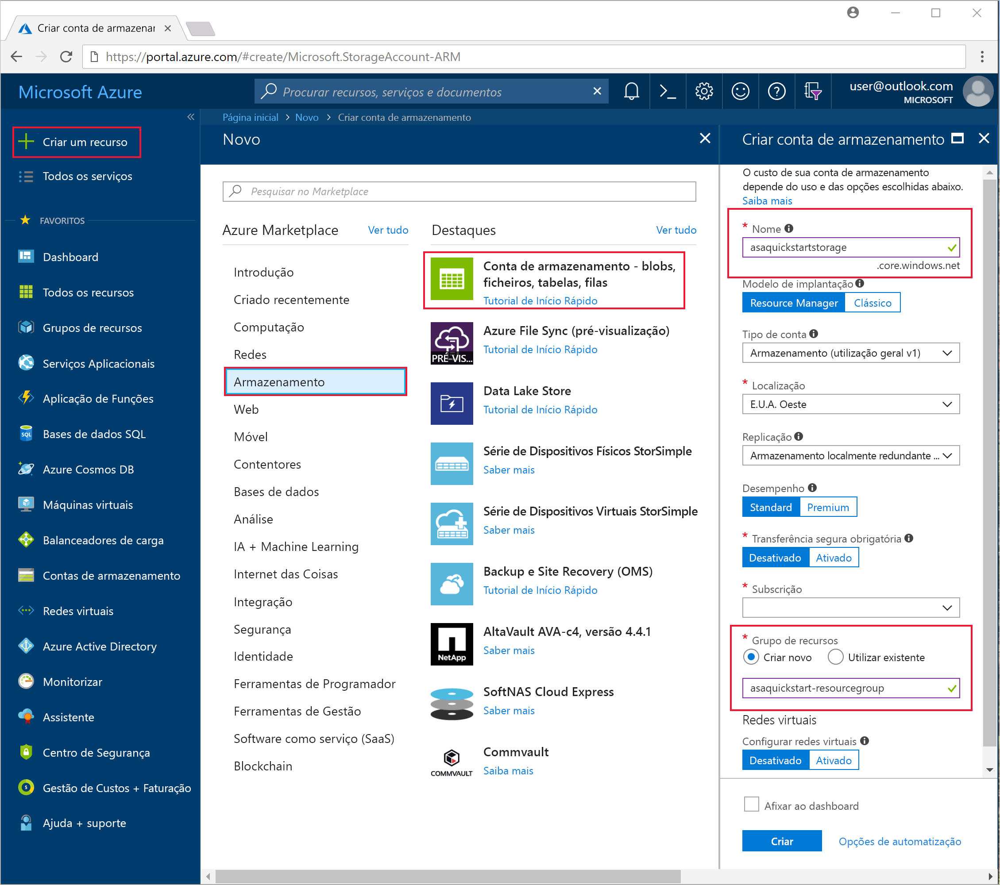

4. Na página **Todos os recursos**, localize a conta de armazenamento que criou no passo anterior. Abra a página **Descrição geral** e, em seguida, o mosaico **Blobs**.  

5. Na página **Serviço de Blobs**, selecione **Contentor**, indique um **Nome** do contentor, como *contentor1* > selecione  **OK**.  

   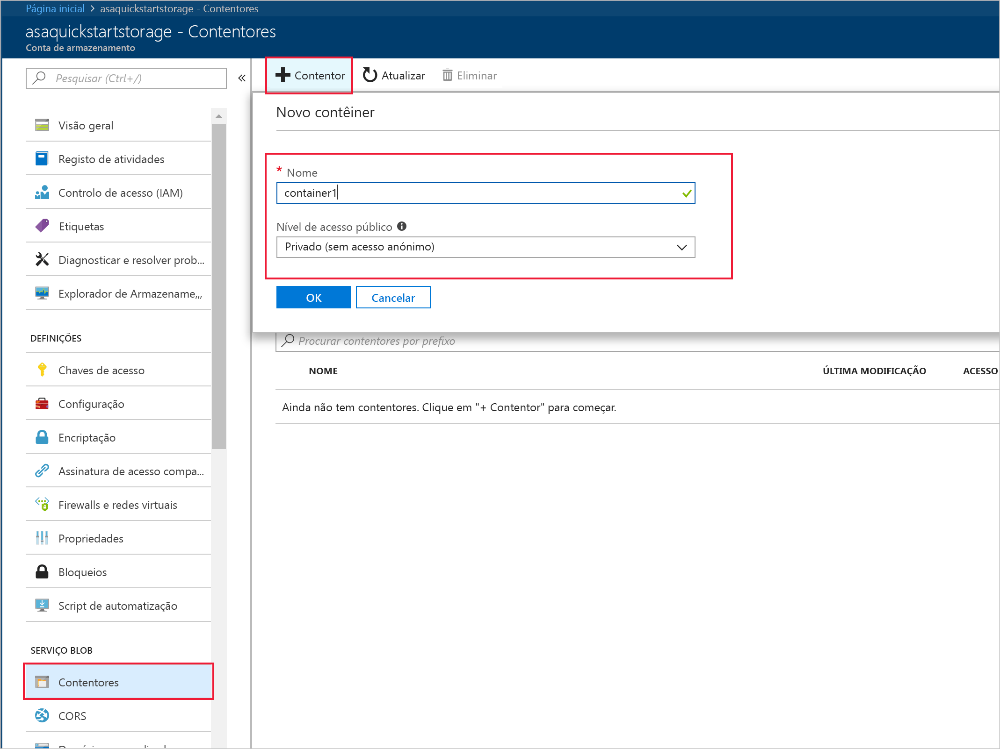

6. Aceda ao contentor que criou no passo anterior. Selecione **Carregar** e carregue os dados de sensor que obteve no primeiro passo.  

   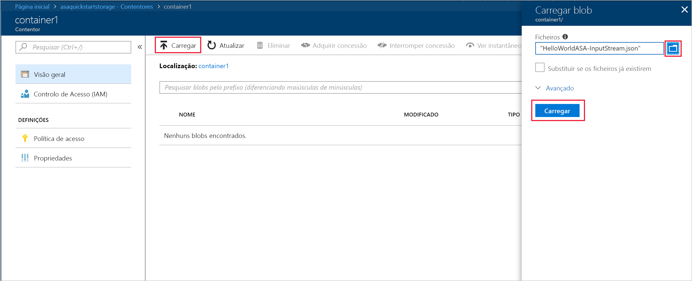

## <a name="create-a-stream-analytics-project"></a>Criar um projeto do Stream Analytics

1. Inicie o Visual Studio.

2. Selecione **Ficheiro > Novo Projeto**.  

3. Na lista de modelos, no lado esquerdo, selecione **Stream Analytics** e, em seguida, selecione **Aplicação do Azure Stream Analytics**.  

4. Introduza o **Nome** do projeto, a **Localização** e o **Nome da solução** e selecione **OK**.

   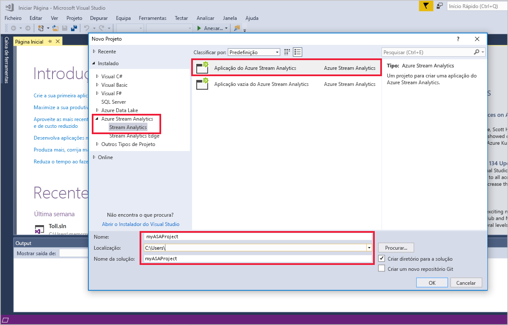

Repare nos elementos que são incluídos num projeto do Azure Stream Analytics.

   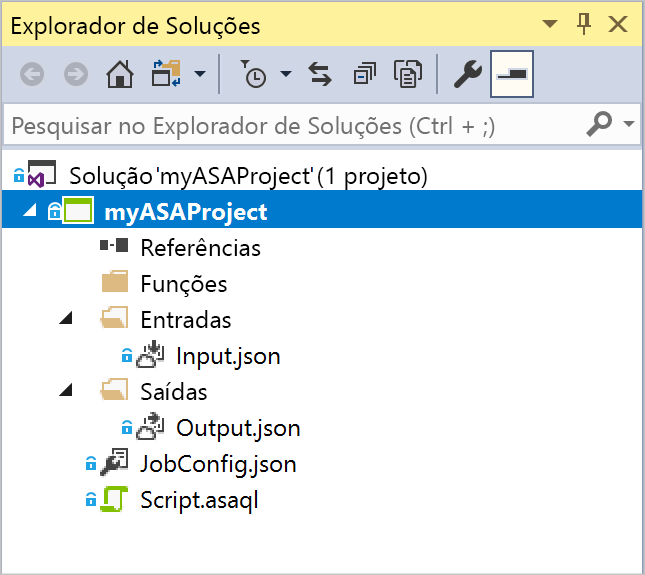


## <a name="choose-the-required-subscription"></a>Escolha a subscrição obrigatória

1. No Visual Studio, no menu **Ver**, selecione **Explorador de Servidores**.

2. Clique com o botão direito do rato em **Azure**, selecione **Ligar à Subscrição do Microsoft Azure** e, em seguida, inicie sessão com a conta do Azure.

## <a name="define-input"></a>Definir entrada

1. No **Explorador de Soluções**, expanda o nó **Entradas** e faça duplo clique em **Input.json**.

2. Preencha a **Configuração de Entrada do Stream Analytics** com os seguintes valores:

   |**Definição**  |**Valor sugerido**  |**Descrição**   |
   |---------|---------|---------|
   |Alias de Entrada  |  Input   |  Introduza um nome para identificar a entrada da tarefa.   |
   |Tipo de Fonte   |  Fluxo de Dados |  Escolha a origem de entrada adequada: Fluxo de Dados ou Dados de Referência.   |
   |Origem  |  Blob Storage |  Escolha a origem de entrada adequada.   |
   |Recurso  | Escolha a origem de dados na conta atual | Opte por introduzir dados manualmente ou selecionar uma conta existente.   |
   |Subscrição  |  \<A sua subscrição\>   | Selecione a subscrição do Azure que tem a conta de armazenamento que criou. A conta de armazenamento pode estar na mesma subscrição ou numa diferente. Este exemplo assume que criou a conta de armazenamento na mesma subscrição.   |
   |Conta de Armazenamento  |  asaquickstartstorage   |  Escolha ou introduza o nome da conta de armazenamento. Os nomes de contas de armazenamento são detetados automaticamente se forem criados na mesma subscrição.   |
   |Contentor  |  container1   |  Selecione o contentor existente que criou na conta de armazenamento.   |
   
3. Mantenha as outras opções com os valores predefinidos e selecione **Guardar** para guardar as definições.  

   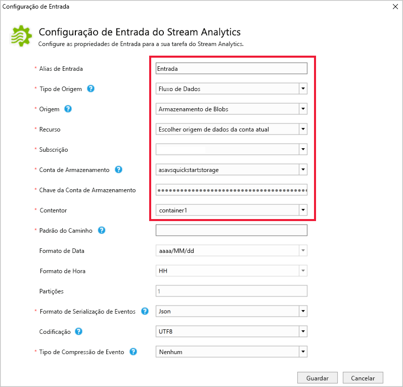

## <a name="define-output"></a>Definir a saída

1. No **Explorador de Soluções**, expanda o nó **Saídas** e faça duplo clique em **Output.json**.

2. Preencha a **Configuração de Saída do Stream Analytics** com os seguintes valores:

   |**Definição**  |**Valor sugerido**  |**Descrição**   |
   |---------|---------|---------|
   |Alias de Saída  |  Saída   |  Introduza um nome para identificar a saída da tarefa.   |
   |Sink   |  Blob Storage |  Escolha o sink adequado.    |
   |Recurso  |  Apresente as definições da origem de dados manualmente |  Opte por introduzir dados manualmente ou selecionar uma conta existente.   |
   |Subscrição  |  \<A sua subscrição\>   | Selecione a subscrição do Azure que tem a conta de armazenamento que criou. A conta de armazenamento pode estar na mesma subscrição ou numa diferente. Este exemplo assume que criou a conta de armazenamento na mesma subscrição.   |
   |Conta de Armazenamento  |  asaquickstartstorage   |  Escolha ou introduza o nome da conta de armazenamento. Os nomes de contas de armazenamento são detetados automaticamente se forem criados na mesma subscrição.   |
   |Contentor  |  container1   |  Selecione o contentor existente que criou na conta de armazenamento.   |
   |Padrão do Caminho  |  saída   |  Introduza o nome de um caminho de ficheiro a ser criado no contentor.   |
   
3. Mantenha as outras opções com os valores predefinidos e selecione **Guardar** para guardar as definições.  

   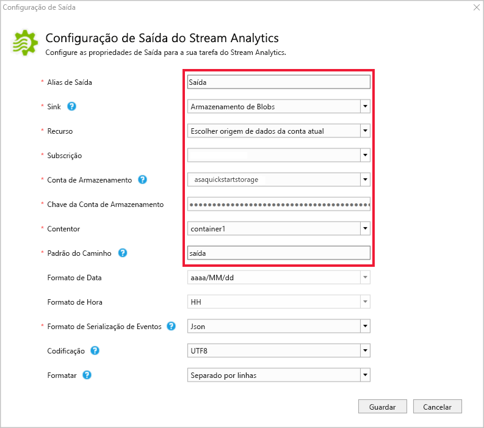

## <a name="define-the-transformation-query"></a>Definir a consulta de transformação

1. Abra o ficheiro **Script.asaql** no **Explorador de Soluções** do Visual Studio.

2. Adicione a seguinte consulta:

   ```sql
   SELECT 
   System.Timestamp AS OutputTime,
   dspl AS SensorName,
   Avg(temp) AS AvgTemperature
   INTO
     Output
   FROM
     Input TIMESTAMP BY time
   GROUP BY TumblingWindow(second,30),dspl
   HAVING Avg(temp)>100
   ```

## <a name="submit-a-stream-analytics-query-to-azure"></a>Submeter uma consulta do Stream Analytics para o Azure

1. No **Editor de Consultas**, selecione **Submeter para o Azure** no editor de scripts.

2. Selecione **Criar uma Nova Tarefa do Azure Stream Analytics** e introduza um **Nome da Tarefa**. Escolha a **Subscrição**, o **Grupo de Recursos** e a **Localização** utilizada no início do Início Rápido.

   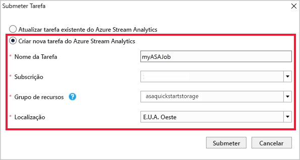

## <a name="start-the-stream-analytics-job-and-check-output"></a>Iniciar a tarefa do Stream Analytics e verificar a saída

1. Quando a tarefa é criada, a vista de tarefa abre-se automaticamente. Selecione o botão da seta verde para iniciar a tarefa,

   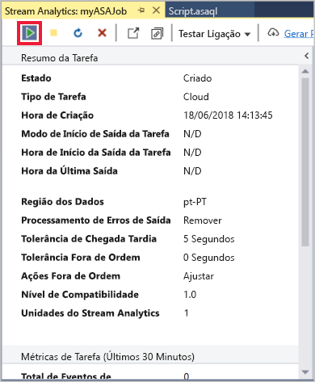

2. Altere **Hora Personalizada** da data para `2018-01-01` e selecione **Iniciar**.

   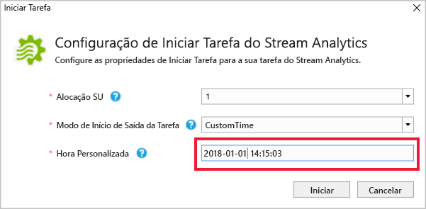

3. Tenha em atenção que o estado da tarefa foi alterado para **Em execução** e se existem eventos de entrada/saída. Esta operação poderá demorar alguns minutos.

   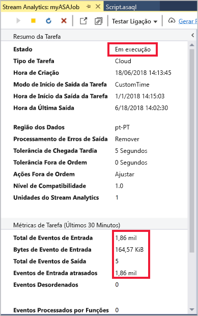

4. Para ver os resultados, no menu **Vista**, selecione **Explorador da Cloud** e navegue para a conta de armazenamento no seu grupo de recursos. Em **Contentores de Blobs**, clique duas vezes em **contentor1** e, em seguida, no caminho do ficheiro **saída**.

   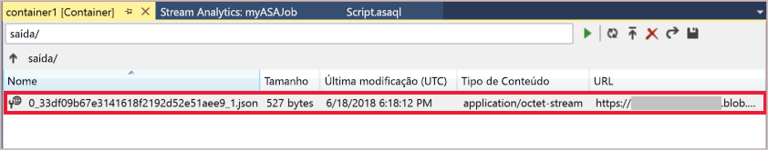

## <a name="clean-up-resources"></a>Limpar recursos

Quando já não for necessário, elimine o grupo de recursos, a tarefa de transmissão em fluxo e todos os recursos relacionados. A eliminação da tarefa evita a faturação das unidades de transmissão em fluxo consumidas pela tarefa. Se estiver a planear utilizar a tarefa no futuro, pode pará-la e reiniciá-la mais tarde, quando for necessário. Se não quiser continuar a utilizar esta tarefa, elimine todos os recursos criados por este início rápido ao utilizar os seguintes passos:

1. No menu do lado esquerdo no portal do Azure, selecione **Grupos de recursos** e, em seguida, selecione o nome do recurso que criou.  

2. Na página do grupo de recursos, selecione **Eliminar**, escreva o nome do recurso a eliminar na caixa de texto e, em seguida, selecione **Eliminar**.

## <a name="next-steps"></a>Passos seguintes

Neste início rápido, implementou uma tarefa simples do Stream Analytics com o Visual Studio. Também pode implementar tarefas do Stream Analytics com o [portal do Azure](stream-analytics-quick-create-portal.md) e o [PowerShell](stream-analytics-quick-create-powershell.md). 

Para saber mais sobre como configurar outras origens de entrada e efetuar a deteção em tempo real, avance para o seguinte artigo:

> [!div class="nextstepaction"]
> [Deteção de fraudes em tempo real com o Azure Stream Analytics](stream-analytics-real-time-fraud-detection.md)
