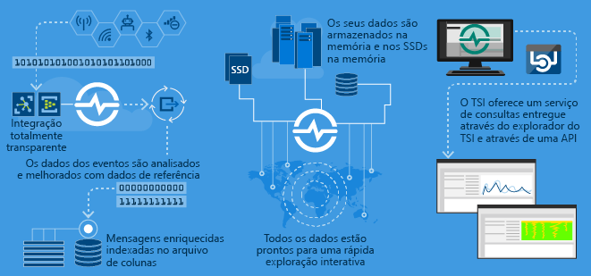
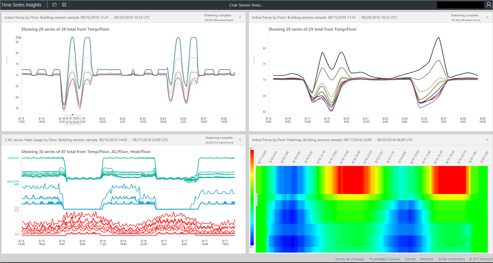

# O que é o Azure Time Series Insights?

O Time Series Insights foi concebido para armazenar, visualizar e consultar grandes quantidades de dados de séries de tempo, tal como os gerados por dispositivos IoT.  Se quiser armazenar, gerir, consultar ou visualizar dados de séries de tempo na cloud, o Time Series Insights é provavelmente a solução adequada para si.  

O Time Series Insights tem quatro tarefas principais:

- Primeiro, está totalmente integrado em gateways de cloud, como o Hub IoT do Azure e os Hubs de Eventos do Azure. Liga-se facilmente a estas origens de eventos e analisa o JSON das mensagens e estruturas que contêm dados em linhas e colunas limpas. Associa os metadados a telemetria e indexa os dados num arquivo em colunas.
- Segundo, o Time Series Insights gere o armazenamento dos seus dados. Para garantir que os dados são sempre acessíveis facilmente, armazena-os na memória e no SSD até 400 dias. Pode consultar interativamente milhares de milhões de eventos em segundos, a pedido.
- Terceiro, o Time Series Insights fornece visualização completa através do explorador do TSI.  
- Quarto, o Time Series Insights fornece um serviço de consulta no explorador do TSI e ao utilizar APIs fáceis de integrar para incorporar os dados de séries de tempo em aplicações personalizadas.  

Se estiver a criar uma aplicação, para consumo interno ou clientes externos a utilizarem, o Time Series Insights pode ser utilizado como back-end para indexação, armazenamento e agregação de dados de séries de tempo. Pode também criar uma experiência de utilizador e de visualização personalizada.  O Time Series Insights expõe as APIs de Consulta para permitir este cenário.  

Se não tiver a certeza de que os dados são de séries de tempo, eis o que deve saber.  Os dados de séries de tempo representam a forma como um recurso ou processo muda ao longo do tempo.  São exclusivos na medida em que têm um carimbo de data/hora e o tempo é mais significativo como um eixo.  Os dados de séries de tempo, chegam normalmente por ordem cronológica e são tratados como uma inserção em vez de uma atualização à base de dados.  Uma vez que o Time Series Insights captura e armazena cada evento novo como uma linha, a alteração é medida ao longo do tempo, o que permite recuar e prever a alteração futura.  Em grandes volumes, armazenar, indexar, consultar, analisar e visualizar dados de séries de tempo pode ser um desafio.  

## Cenários principais

- Armazenamento de dados de séries de tempo de forma escalável.  
  - Na sua essência, o Time Series Insights tem uma base de dados concebida a pensar nos dados de séries de tempo.  Uma vez que é totalmente gerido e escalável, o Time Series Insights processa o trabalho de armazenamento e gestão de eventos.

- Exploração de dados quase em tempo real.  
  - O Time Series Insights fornece um explorador que visualiza toda a transmissão de dados num ambiente.  Pouco tempo depois de ligar uma origem de evento, os dados de evento podem ser visualizados, explorados e consultados no Time Series Insights.  Os dados são úteis para validar se um dispositivo está a emitir dados conforme esperado e a monitorizar um recurso de IoT para estado de funcionamento, produtividade e eficácia geral.  

- Análise de origens de problemas e deteção de anomalias.
  - O Time Series Insights tem ferramentas como padrões e vistas de perspetiva para realizar e guardar análises de origens de problemas em vários passos.  Além disso, o Time Series Insights funciona em conjunto com serviços de alerta, como o Azure Stream Analytics, pelo que os alertas e as anomalias detetadas podem ser visualizados quase em tempo real no explorador do Time Series Insights.  

- Uma vista global da transmissão de dados de séries de tempo a partir de localizações diferentes para comparação de vários recursos/locais.
  - Pode ligar várias origens de eventos a um ambiente do Time Series Insights.  Isto significa que a transmissão de dados em várias localizações diferentes pode ser visualizada quase em tempo real.  Os utilizadores podem tirar partido desta visibilidade para partilhar dados com líderes empresariais e permitir uma melhor colaboração com especialistas de domínio que podem aplicar os seus conhecimentos para ajudar a resolver problemas, aplicar melhores práticas e partilhar conhecimentos.

- Criação de uma aplicação cliente com base no Time Series Insights. 
  - O Time Series Insights expõe as APIs de Consulta REST, o que permite criar aplicações que utilizam dados de séries de tempo.

## Capacidades

- **Fácil de começar**: o Azure Time Series Insights não requer preparação prévia de dados. Ligue a milhões de eventos no Hub IoT do Azure ou no Hub de Eventos em minutos. Depois de ligado, pode visualizar e interagir com os dados de sensores para validar rapidamente as suas soluções IoT. Pode interagir com os dados sem escrever código.
Não tem de aprender linguagens novas, pois o Time Series Insights proporciona uma superfície de consultas granular e isenta de texto para utilizadores avançados, bem como exploração por "apontar e clicar".
- **Informações quase em tempo real**: o Time Series Insights pode ingerir milhões de eventos de sensores por dia, com latência de um minuto. Proporciona-lhe informações detalhadas sobre os dados de sensores, ao ajudá-lo a detetar tendências e anomalias, a realizar análises de origens de problemas e a evitar tempos de indisponibilidade dispendiosos. Ao ativar a correlação cruzada entre os dados em tempo real e os dados históricos, o Time Series Insights ajuda-o a revelar tendências ocultas nos dados.
- **Criar soluções personalizadas**: incorpore dados do Azure Time Series Insights nas suas aplicações existentes ou crie soluções personalizadas novas com as APIs REST do Time Series Insights. Crie e partilhe vistas personalizadas que pode partilhar para que as outras pessoas possam explorar as suas informações.
- **Escalabilidade**: o Time Series Insights foi concebido para suportar IoT em escala. Pode receber entre 1 milhão e 100 milhões de eventos por dia, com um intervalo de retenção predefinido de 31 dias. Pode ver e analisar fluxos de dados em direto quase em tempo real, juntamente com dados históricos. No futuro, as taxas de receção e retenção vão aumentar, de modo a satisfazer a escala empresarial.

## Introdução
Começar demora menos de 5 minutos. 

1.  Para começar, aprovisione um ambiente do Time Series Insights no portal do Azure. 
2.  Ligue uma origem de evento, como um Hub IoT do Azure ou Hub de Eventos.  
3.  Carregue dados de referência (não é um serviço adicional).
4.  Veja os dados em minutos com o explorador do Time Series Insights.

## Explorador do Time Series Insights
Este diagrama mostra um exemplo de dados do Time Series Insights visualizados através do explorador: 

## Passos seguintes
 - [Explorar o explorador do Time Series Insights num ambiente de demonstração](./time-series-quickstart.md)
 - [Planear o seu ambiente do Time Series Insights](time-series-insights-environment-planning.md)

