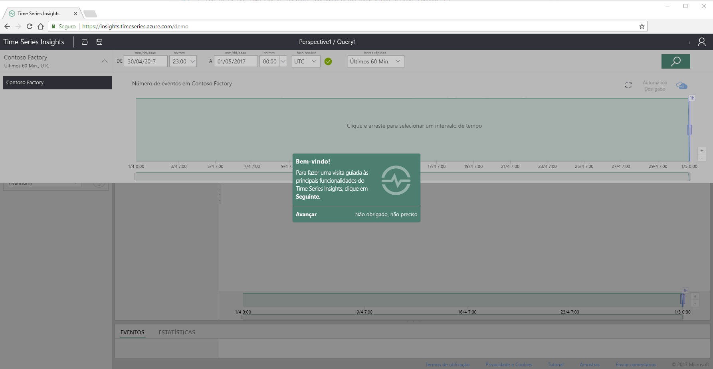
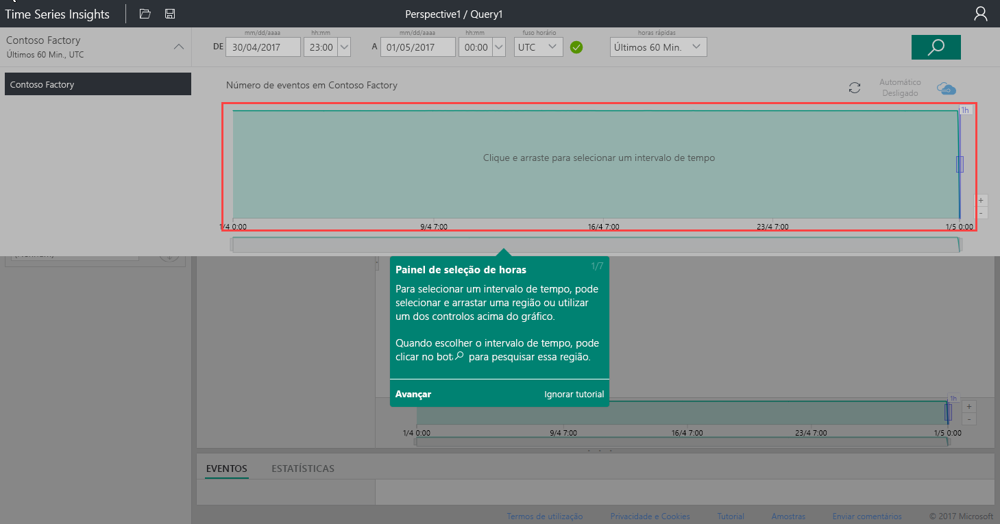
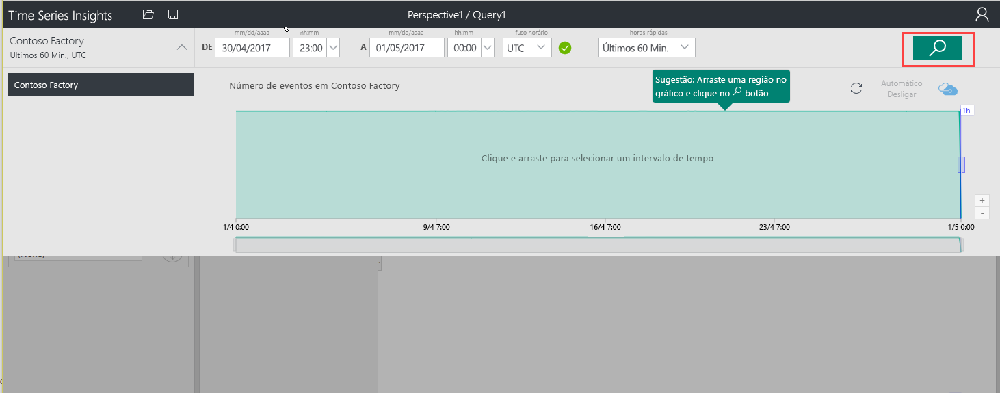
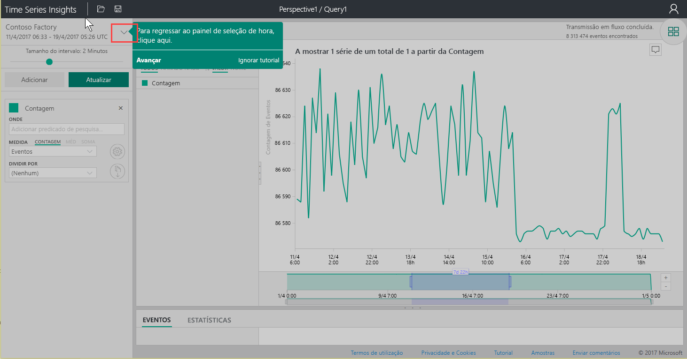
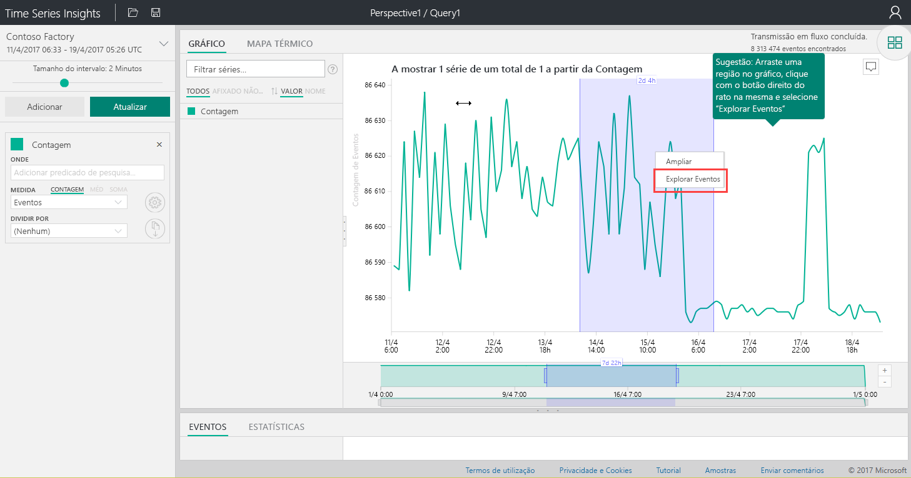
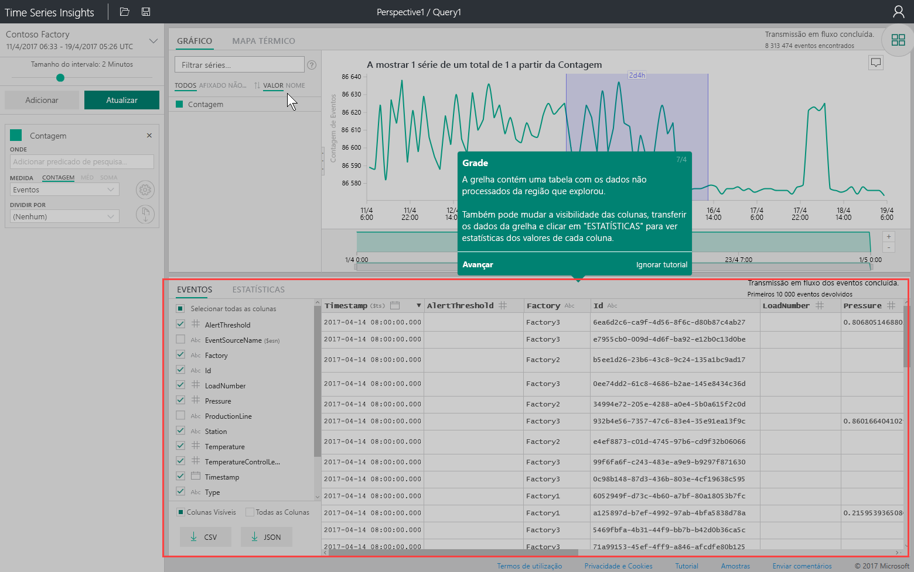
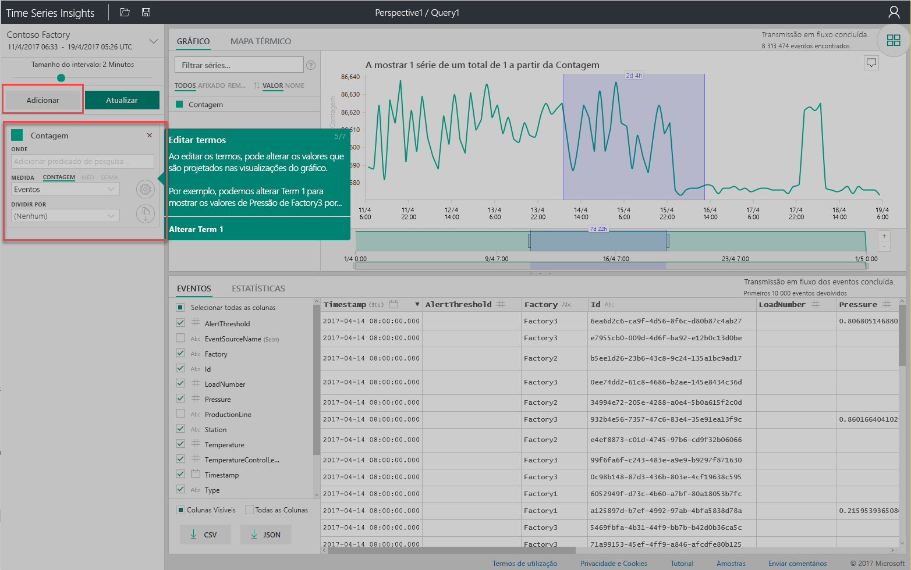
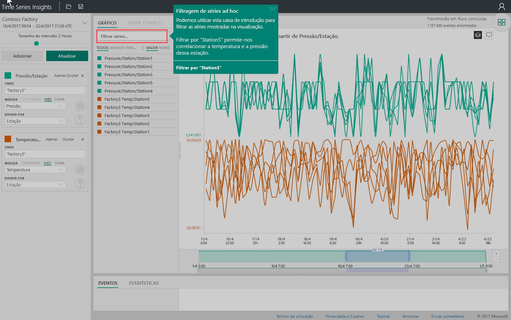

# Início rápido: Explorar o Azure Time Series Insights
Este guia de introdução mostra como começar a utilizar o explorador do Azure Time Series Insights num ambiente de demonstração gratuito. Irá aprender a utilizar o seu browser para visualizar grandes volumes de dados de IoT e realizar uma visita guiada das principais funcionalidades do explorador do Time Series Insights. 

O Azure Time Series Insights é um serviço de análise, armazenamento e visualização totalmente gerido que simplifica a exploração e a análise de milhões de eventos de IoT em simultâneo. Apresenta uma vista global dos seus dados, o que lhe permite validar rapidamente a sua solução IoT e evitar um período de indisponibilidade dispendioso para dispositivos fundamentais para a sua atividade ao ajudá-lo a descobrir tendências ocultas, detetar anomalias e realizar análises de causa raiz praticamente em tempo real.  Se está a criar uma aplicação que precisa de armazenar ou consultar dados de série de tempo, pode programar com as APIs REST do Time Series Insights.

Se não tiver uma subscrição do Azure, crie uma [conta do Azure gratuita](https://azure.microsoft.com/free/?ref=microsoft.com&utm_source=microsoft.com&utm_medium=docs&utm_campaign=visualstudio) antes de começar.

## Explore o explorador do Time Series Insights num ambiente de demonstração

1. No browser, navegue até [https://insights.timeseries.azure.com/demo](https://insights.timeseries.azure.com/demo). 

2. Se lhe for solicitado, inicie sessão no explorador do Time Series Insights com as suas credenciais de conta do Azure. 
 
3. A página de visita guiada rápida do Time Series Insights é apresentada. Clique em **Seguinte** para começar a visita guiada rápida.

   

4. O **painel de seleção de tempo** é apresentado. Utilize este painel para selecionar um intervalo de tempo para visualizar.

   

5. Clique e arraste na região e, em seguida, clique no botão **Pesquisa**.
 
    

   O Time Series Insights apresenta uma visualização de gráfico para o intervalo de tempo especificado. Pode realizar diversas ações no gráfico de linhas, como a filtragem, afixação, ordenação e pilha. 

   Para voltar para o **Painel de seleção de tempo**, clique na seta para baixo, conforme mostrado:

   

6. Clique em **Adicionar** no **Painel de termos** para adicionar um novo termo de pesquisa.

   

7. No gráfico, pode selecionar uma região, clicar com o botão direito na região e selecionar **Explorar Eventos**.
 
   

   É apresentada uma grelha dos dados não processados na região que está a explorar:

   

8. Edite os termos para alterar os valores no gráfico e adicione outro termo para diferentes tipos de valores correlacionados entre si:

   

9. Introduza um termo de filtro na caixa **Filtrar série...** para filtrar séries ad hoc. Para o guia de introdução, introduza **Station5** para correlacionar entre si a temperatura e a pressão dessa estação.
 
   

Depois de concluir o guia de introdução, pode experimentar com o conjunto de dados de exemplo para criar visualizações diferentes. 

### Passos Seguintes
Está pronto para criar o seu próprio ambiente do Time Series Insights:
> [!div class="nextstepaction"]
> [Planeie o seu ambiente do Time Series Insights](time-series-insights-environment-planning.md)
