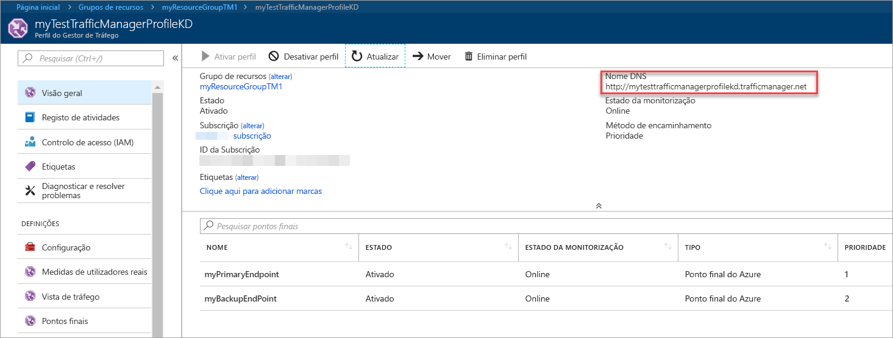
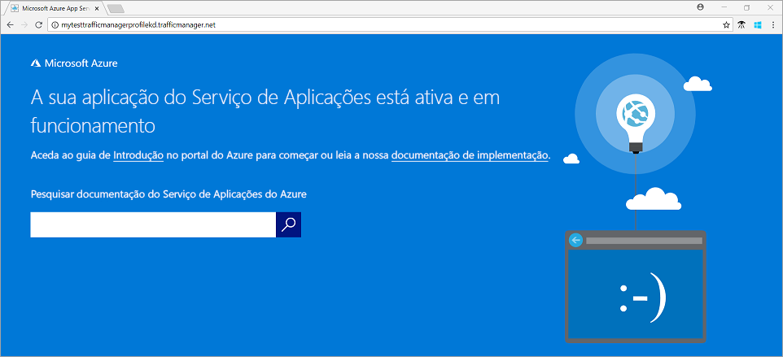

# Início Rápido: Criar um perfil do Gestor de Tráfego para uma aplicação Web de elevada disponibilidade

Este início rápido descreve como criar um perfil do Gestor de tráfego que fornece elevada disponibilidade para a sua aplicação web.

Neste início rápido, irá ler cerca de duas instâncias de um aplicativo web. Cada uma delas está em execução numa região diferente do Azure. Irá criar um perfil do Gestor de tráfego com base na [prioridade de ponto final](traffic-manager-routing-methods.md#priority). O perfil direciona o tráfego de utilizador para o site primário que executa a aplicação web. O Gestor de tráfego monitoriza continuamente a aplicação web. Se o site primário não estiver disponível, ele fornece ativação pós-falha automática para o site de cópia de segurança.

Se não tiver uma subscrição do Azure, crie uma [conta gratuita](https://azure.microsoft.com/free/?WT.mc_id=A261C142F) agora.

## Iniciar sessão no Azure

Inicie sessão no [portal do Azure](https://portal.azure.com).

## Pré-requisitos

Neste início rápido, terá duas instâncias de uma aplicação web implementada em duas regiões do Azure diferentes (*E.U.A. Leste* e *Europa Ocidental*). Cada um irá servir como pontos finais de principal e de ativação pós-falha para o Gestor de tráfego.

1. No lado do canto superior esquerdo do ecrã, selecione **criar um recurso** > **Web** > **aplicação Web**.
2. Na **aplicação Web**, introduza ou selecione estas definições:

    | Definição | Valor |
    | ------- | ----- |
    | Nome da aplicação | Introduza um nome exclusivo para a sua aplicação web.  |
    | Subscrição | Selecione a subscrição que pretende que a aplicação web aplicada a. |
    | Grupo de Recursos | Selecione **criar novo**e introduza *myResourceGroupTM1*. |
    | SO | Selecione **Windows** como seu sistema operativo. |
    | Publicar | Selecione **código** como o formato de que pretende publicar. |

3. Selecione **plano do serviço de aplicações/localização**.
4. Na **plano do App Service**, selecione **criar nova**.
5. Na **plano do serviço de aplicações novo**, introduza ou selecione estas definições:

    | Definição | Valor |
    | ------- | ----- |
    | Plano do App Service | Introduza *myAppServicePlanEastUS*. |
    | Localização | EUA Leste |
    | Escalão de preço | S1 Standard |

6. Selecione **OK**.

7. Na **aplicação Web**, selecione **criar**. Quando a aplicação Web implementa com êxito, ele cria um web site predefinido.

8. Para criar um segundo Web site numa região do Azure diferente, repita os passos 1 a 7 com estas definições:

    | Definição | Valor |
    | --------| ----- |
    | Nome | Introduza um nome exclusivo para a sua aplicação web. |
    | Subscrição | Selecione a subscrição que pretende que a aplicação web aplicada a. |
    | Grupo de recursos | Selecione **criar novo**e, em seguida, introduza *myResourceGroupTM2*. |
    | SO | Selecione **Windows** como seu sistema operativo. |
    | Publicar | Selecione **código** como o formato de que pretende publicar. |
    | Plano do Serviço de Aplicações/Localização | Introduza *myAppServicePlanWestEurope*. |
    | Localização | Europa Ocidental |
    | Escalão de preço | S1 Standard |

## Criar um perfil do Gestor de Tráfego

Crie um perfil do Gestor de tráfego que direciona o tráfego de utilizador com base na prioridade de ponto final.

1. No lado do canto superior esquerdo do ecrã, selecione **criar um recurso** > **rede** > **perfil do Traffic Manager**.
2. Na **perfil do Gestor de tráfego criar**, introduza ou selecione estas definições:

    | Definição | Valor |
    | --------| ----- |
    | Nome | Introduza um nome exclusivo para o seu perfil do Gestor de tráfego.|
    | Método de encaminhamento | Selecione **prioridade**.|
    | Subscrição | Selecione a subscrição que pretende que o perfil do Gestor de tráfego aplicado a. |
    | Grupo de recursos | Selecione *myResourceGroupTM1*.|
    | Localização |Esta definição refere-se para a localização do grupo de recursos. Não tem efeito sobre o perfil do Gestor de tráfego que vai ser implementado globalmente.|

3. Selecione **Criar**.

## Adicionar pontos finais do Gestor de Tráfego

Adicione o Website em *E.U.A. Leste* como o ponto final principal para encaminhar todo o tráfego do utilizador. Adicionar o Web site na *Europa Ocidental* como um ponto de final de ativação pós-falha. Quando o ponto final primário não estiver disponível, o tráfego encaminha automaticamente para o ponto final de ativação pós-falha.

1. Na barra de pesquisa do portal, introduza o nome de perfil do Gestor de tráfego que criou na secção anterior.
2. Selecione o perfil de resultados da pesquisa.
3. Na **perfil do Gestor de tráfego**, na **definições** secção, selecione **pontos finais**e, em seguida, selecione **adicionar**.
4. Introduza ou selecione, estas definições:

    | Definição | Valor |
    | ------- | ------|
    | Tipo | Selecione **ponto final do Azure**. |
    | Nome | Introduza *myPrimaryEndpoint*. |
    | Tipo de recurso de destino | Selecione **serviço de aplicações**. |
    | Recurso de destino | Selecione **escolher um serviço de aplicações** > **E.U.A. Leste**. |
    | Prioridade | Selecione **1**. Quando ele está íntegro, todo o tráfego vai para este ponto final. |

    

5. Selecione **OK**.
6. Para criar um ponto de extremidade de ativação pós-falha para a sua segunda região do Azure, repita os passos 3 e 4 com estas definições:

    | Definição | Valor |
    | ------- | ------|
    | Tipo | Selecione **ponto final do Azure**. |
    | Nome | Introduza *myFailoverEndpoint*. |
    | Tipo de recurso de destino | Selecione **serviço de aplicações**. |
    | Recurso de destino | Selecione **escolher um serviço de aplicações** > **Europa Ocidental**. |
    | Prioridade | Selecione **2**. Todo o tráfego vai para este ponto final de ativação pós-falha se o ponto final primário está danificado. |

7. Selecione **OK**.

Quando terminar a adicionar os dois pontos de extremidade, estes são apresentados na **perfil do Traffic Manager**. Tenha em atenção que é o respetivo estado de monitorização **Online** agora.

## Testar o perfil do Gestor de Tráfego

Nesta secção, irá verificar o nome de domínio do perfil do Traffic Manager. Também irá configurar o ponto final principal fique indisponível. Por fim, obtém a que a aplicação web está ainda disponível. É porque o Gestor de tráfego envia o tráfego para o ponto final de ativação pós-falha.

### Verifique o nome DNS

1. Na barra de pesquisa do portal, procure o nome do **perfil do Gestor de Tráfego** que criou na secção anterior.
2. Selecione o perfil do Gestor de tráfego. O **descrição geral** aparece.
3. O **Perfil do Gestor de Tráfego** mostra o nome DNS do perfil que acabou de criar.
  
   

### Ver o Gestor de Tráfego em ação

1. Num browser, introduza o nome DNS do seu perfil do Gestor de tráfego para ver o Web site predefinido da sua aplicação Web.

    > [!NOTE]
    > Neste cenário de início rápido, todos os pedidos de rota para o ponto final primário. Ele é definido como **prioridade 1**.

    

2. Para ver a ativação pós-falha do Gestor de tráfego em ação, desative o site primário:
    1. Na página de perfil do Gestor de tráfego, do **descrição geral** secção, selecione **myPrimaryEndpoint**.
    2. Na *myPrimaryEndpoint*, selecione **desativada** > **guardar**.
    3. Fechar **myPrimaryEndpoint**. Tenha em atenção que o estado é **desativado** agora.
3. Copie o nome DNS do seu perfil do Gestor de tráfego do passo anterior para ver o site numa nova sessão de browser web.
4. Certifique-se de que a aplicação web está ainda disponível.

O ponto final primário não estiver disponível, pelo que foram encaminhado para o ponto final de ativação pós-falha.

## Limpar recursos

Quando tiver terminado, elimine os grupos de recursos, aplicativos web e todos os recursos relacionados. Para tal, selecione cada item individual no seu dashboard e selecione **eliminar** na parte superior de cada página.

## Passos Seguintes

Neste início rápido, criou um perfil do Gestor de tráfego. Permite-lhe direcionar o tráfego de utilizador para aplicações web de elevada disponibilidade. Para saber mais sobre o encaminhamento de tráfego, avance para os tutoriais do Gestor de tráfego.

> [!div class="nextstepaction"]
> [Traffic Manager tutorials](tutorial-traffic-manager-improve-website-response.md) (Tutoriais do Gestor de Tráfego)