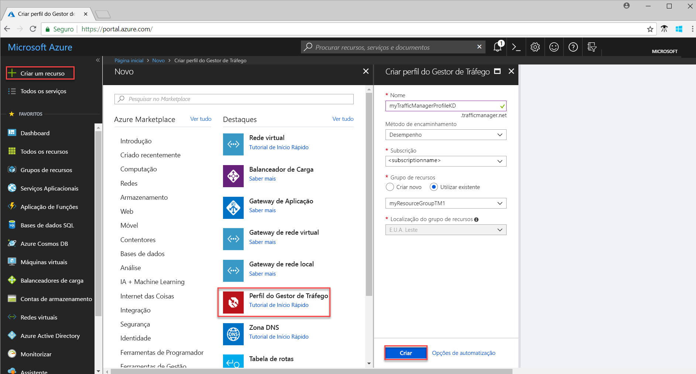
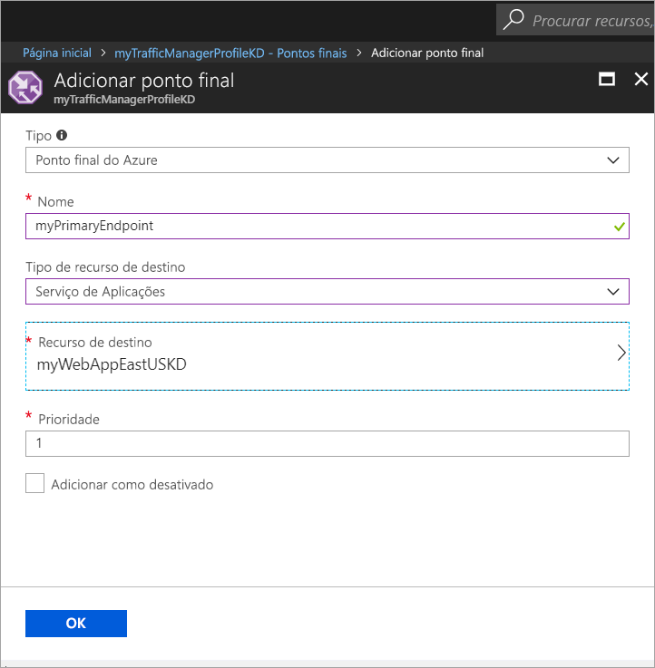

# Início Rápido: Criar um perfil do Gestor de Tráfego para uma aplicação Web de elevada disponibilidade

Este início rápido descreve como criar um perfil do Gestor de Tráfego que proporciona elevada disponibilidade às suas aplicações Web. 

O cenário descrito no início rápido inclui duas instâncias de uma aplicação Web em execução em regiões do Azure diferentes. É criado um perfil do Gestor de Tráfego com base na [prioridade do ponto final](traffic-manager-routing-methods.md#priority), o qual ajuda a direcionar o tráfego do utilizador para o site principal que está a executar a aplicação. O Gestor de Tráfego monitoriza continuamente a aplicação Web e proporciona ativação pós-falha automática ao site alternativo quando o principal não está disponível.

Se não tiver uma subscrição do Azure, crie uma [conta gratuita](https://azure.microsoft.com/free/?WT.mc_id=A261C142F) antes de começar.

## Iniciar sessão no Azure 
Inicie sessão no portal do Azure em https://portal.azure.com.

## Pré-requisitos
Este início rápido requer que tenha implementado duas instâncias de uma aplicação Web em execução em regiões do Azure diferentes (*E.U.A. Leste* e *Europa Ocidental*). As duas instâncias da aplicação Web funcionam como os pontos finais principal e alternativo para o Gestor de Tráfego.

1. No canto superior esquerdo do ecrã, selecione **Criar um recurso** > **Web** > **Aplicação Web** > **Criar**.
2. Em **Aplicação Web**, introduza ou selecione as informações seguintes e introduza predefinições nas definições que estão vazias:

     | Definição         | Valor     |
     | ---              | ---  |
     | Nome           | Introduza um nome exclusivo para a aplicação Web  |
     | Grupo de recursos          | Selecione **Novo** e introduza *myResourceGroupTM1* |
     | Plano do Serviço de Aplicações/Localização         | Selecione **Novo**.  No plano do Serviço de Aplicações, introduza *myAppServicePlanEastUS* e selecione **OK**. 
     |      Localização  |   EUA Leste        |
    |||

3. Selecione **Criar**.
4. É criado um Website predefinido quando a aplicação Web for implementada com êxito.
5. Repita os passos 1 a 3 para criar um segundo Website noutra região do Azure com as seguintes definições:

     | Definição         | Valor     |
     | ---              | ---  |
     | Nome           | Introduza um nome exclusivo para a aplicação Web  |
     | Grupo de recursos          | Selecione **Novo** e introduza *myResourceGroupTM2* |
     | Plano do Serviço de Aplicações/Localização         | Selecione **Novo**.  No plano do Serviço de Aplicações, introduza *myAppServicePlanWestEurope* e selecione **OK**. 
     |      Localização  |   Europa Ocidental      |
    |||

## Criar um perfil do Gestor de Tráfego
Crie um perfil do Gestor de Tráfego que direcione o tráfego do utilizador com base na prioridade do ponto final.

1. No canto superior esquerdo do ecrã, selecione **Criar um recurso** > **Rede** > **Perfil do Gestor de Tráfego** > **Criar**.
2. Em **Criar perfil do Gestor de Tráfego**, introduza ou selecione as informações seguintes, aceite as predefinições das definições restantes e selecione **Criar**:
    
    | Definição                 | Valor                                              |
    | ---                     | ---                                                |
    | Nome                   | Este nome tem de ser exclusivo na zona trafficmanager.net e resultar no nome DNS, **trafficmanager.net**, que é utilizado para aceder ao seu perfil do Gestor de Tráfego.|
    | Método de encaminhamento          | Selecione o método de encaminhamento **Prioridade**.|
    | Subscrição            | Selecione a sua subscrição.|
    | Grupo de recursos          | Selecione **Existente** e selecione *myResourceGroupTM1*.|
    |Localização |Esta definição refere-se à localização do grupo de recursos e não tem qualquer impacto no perfil do Gestor de Tráfego que vai ser implementado globalmente.|
    |||
    
    
   

## Adicionar pontos finais do Gestor de Tráfego

Adicione o Website em *E.U.A. Leste* como o ponto final principal para encaminhar todo o tráfego do utilizador. Adicione o Website na *Europa Ocidental* como o ponto final alternativo. Quando o ponto final principal não estiver disponível, o tráfego é encaminhado automaticamente para o secundário.

1. Na barra de pesquisa do portal, procure o nome do perfil do Gestor de Tráfego que criou na secção anterior e selecione-o nos resultados apresentados.
2. Em **Perfil do Gestor de Tráfego** , na secção **Definições**, clique em **Pontos Finais** e em **Adicionar**.
3. Introduza ou selecione as seguintes informações, aceite as predefinições para as restantes definições e, em seguida, selecione **OK**:

    | Definição                 | Valor                                              |
    | ---                     | ---                                                |
    | Tipo                    | Ponto final do Azure                                   |
    | Nome           | myPrimaryEndpoint                                        |
    | Tipo de recurso de destino           | Serviço de Aplicações                          |
    | Recurso de destino          | **Escolha um Serviço de Aplicações** para mostrar a lista de aplicações Web na mesma subscrição. Em **Recurso**, escolha o Serviço de Aplicações que pretende adicionar como o primeiro ponto final. |
    | Prioridade               | Selecione **1**. Se estiver em bom estado de funcionamento, todo o tráfego vai para este ponto final.    |
    
4. Repita os passos 2 e 3 para o próximo ponto final das Aplicações Web. Adicione-o com o valor de **Prioridade** definido em **2**.
5.  Quando a adição de ambos os pontos finais estiver concluída, estes são apresentados em **Perfil do Gestor de Tráfego**, juntamente com o respetivo estado de monitorização como **Online**.

    

## Testar o perfil do Gestor de Tráfego
Nesta secção, vai determinar primeiro o nome de domínio do perfil do Gestor de Tráfego e, depois, vai ver como é feita a ativação pós-falha do Gestor de Tráfego para o ponto final secundário quando o primeiro está indisponível.
### Determinar o nome DNS
1.  Na barra de pesquisa do portal, procure o nome do **perfil do Gestor de Tráfego** que criou na secção anterior. Nos resultados que são apresentados, clique no perfil do Gestor de Tráfego.
2. Clique em **Descrição geral**.
3. O **Perfil do Gestor de Tráfego** mostra o nome DNS do perfil que acabou de criar.
  
   

### Ver o Gestor de Tráfego em ação

1. Num browser, escreva o nome DNS do perfil do Gestor de Tráfego para ver o Website predefinido da sua Aplicação Web. No cenário deste início rápido, todos os pedidos são encaminhados para o ponto final principal, que está definido como **Prioridade 1**.

2. Para ver a ativação pós-falha do Gestor de Tráfego em ação, desative o site principal da seguinte forma:
    1. Na página Perfil do Gestor de Tráfego, selecione **Definições**>**Pontos Finais**>*MyPrimaryEndpoint*.
    2. Em *MyPrimaryEndpoint*, selecione **Desativado**. 
    3. O estado do ponto final principal, *MyPrimaryEndpoint*, aparece agora como **Desativado**.
3. Copie o nome DNS do Perfil do Gestor de Tráfego do passo anterior para conseguir ver o Website num browser. Quando o ponto final principal for desativado, o tráfego do utilizador é encaminhado para o ponto final secundário.

## Limpar recursos
Quando já não for necessário, elimine os grupos de recursos, as aplicações Web e todos os recursos relacionados. Para tal, selecione os grupos de recursos (*myResourceGroupTM1* e *myResourceGroupTM2*) e clique em **Eliminar**.

## Passos seguintes
Neste início rápido, criou um perfil do Gestor de Tráfego que lhe permite direcionar o tráfego do utilizador para uma aplicação Web de elevada disponibilidade. Para saber mais sobre o encaminhamento, avance para os tutoriais do Gestor de Tráfego.

> [!div class="nextstepaction"]
> [Traffic Manager tutorials](traffic-manager-configure-performance-routing-method.md) (Tutoriais do Gestor de Tráfego)

