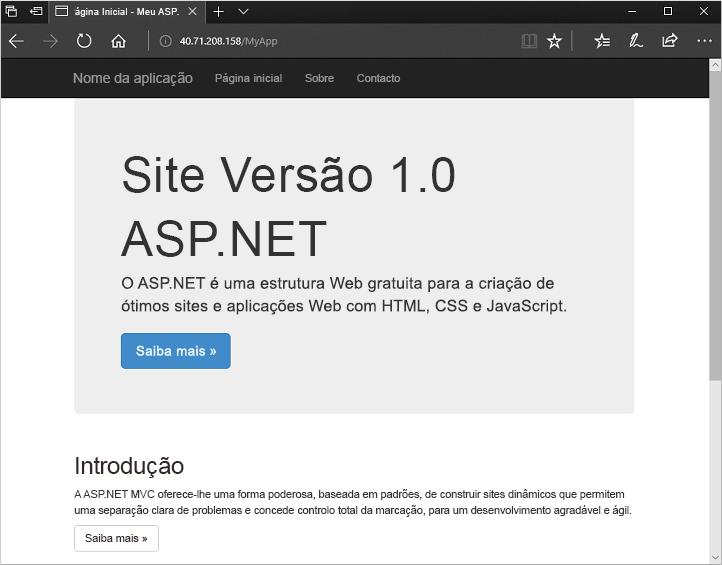

# <a name="create-a-virtual-machine-scale-set-with-azure-powershell"></a>Criar um Conjunto de Dimensionamento de Máquinas Virtuais com o Azure PowerShell
Um conjunto de dimensionamento de máquinas virtuais permite implementar e gerir um conjunto de máquinas virtuais idênticas e de dimensionamento automático. Pode dimensionar o número de VMs no conjunto de dimensionamento manualmente ou definir regras para dimensionar automaticamente com base na utilização de recursos, como CPU, exigência de memória ou tráfego de rede. Neste artigo de introdução, vai criar um conjunto de dimensionamento de máquinas virtuais com o Azure PowerShell. Também pode criar um conjunto de dimensionamento com a [CLI 2.0 do Azure](virtual-machine-scale-sets-create-cli.md) ou o [portal do Azure](virtual-machine-scale-sets-create-portal.md).

Se não tiver uma subscrição do Azure, crie uma [conta gratuita](https://azure.microsoft.com/free/?WT.mc_id=A261C142F) antes de começar.

[!INCLUDE [cloud-shell-powershell.md](../../includes/cloud-shell-powershell.md)]

Se optar por instalar e utilizar o PowerShell localmente, este tutorial requer a versão 4.4.1 ou posterior do módulo Azure PowerShell. Executar ` Get-Module -ListAvailable AzureRM` para localizar a versão. Se precisar de atualizar, veja [Install Azure PowerShell module (Instalar o módulo do Azure PowerShell)](/powershell/azure/install-azurerm-ps). Se estiver a executar localmente o PowerShell, também terá de executar o `Login-AzureRmAccount` para criar uma ligação com o Azure.


## <a name="create-a-resource-group"></a>Criar um grupo de recursos
Para poder criar um conjunto de dimensionamento, crie primeiro um grupo de recursos com [New-AzureRmResourceGroup](/powershell/module/azurerm.resources/new-azurermresourcegroup). O exemplo seguinte cria um grupo de recursos com o nome *myResourceGroup* na localização *EastUS*:

```azurepowershell-interactive
New-AzureRmResourceGroup -ResourceGroupName "myResourceGroup" -Location "EastUS"
```


## <a name="create-load-balancer"></a>Criar um balanceador de carga
As instâncias de VM num conjunto de dimensionamento estão ligadas a um balanceador de carga. Um balanceador de carga do Azure é um balanceador de carga de Camada 4 (TCP, UDP) que fornece elevada disponibilidade ao distribuir o tráfego de entrada entre VMs em bom estado de funcionamento. Uma sonda de estado de funcionamento do balanceador de carga monitoriza uma porta especificada em cada VM e apenas distribui o tráfego para uma VM operacional.

Crie uma rede virtual e um balanceador de carga que tenha um endereço IP público e distribua o tráfego da Web na porta 80. Para criar estes recursos, copie e cole os seguintes cmdlets do PowerShell:

```azurepowershell-interactive
# Create a virtual network subnet
$subnet = New-AzureRmVirtualNetworkSubnetConfig `
  -Name "mySubnet" `
  -AddressPrefix 10.0.0.0/24

# Create a virtual network
$vnet = New-AzureRmVirtualNetwork `
  -ResourceGroupName "myResourceGroup" `
  -Name "myVnet" `
  -Location "EastUS" `
  -AddressPrefix 10.0.0.0/16 `
  -Subnet $subnet

# Create a public IP address
$publicIP = New-AzureRmPublicIpAddress `
  -ResourceGroupName "myResourceGroup" `
  -Location "EastUS" `
  -AllocationMethod Static `
  -Name "myPublicIP"

# Create a frontend and backend IP pool
$frontendIP = New-AzureRmLoadBalancerFrontendIpConfig `
  -Name "myFrontEndPool" `
  -PublicIpAddress $publicIP
$backendPool = New-AzureRmLoadBalancerBackendAddressPoolConfig -Name "myBackEndPool"

# Create a Network Address Translation (NAT) pool
$inboundNATPool = New-AzureRmLoadBalancerInboundNatPoolConfig `
  -Name "myRDPRule" `
  -FrontendIpConfigurationId $frontendIP.Id `
  -Protocol TCP `
  -FrontendPortRangeStart 50001 `
  -FrontendPortRangeEnd 50010 `
  -BackendPort 3389

# Create the load balancer
$lb = New-AzureRmLoadBalancer `
  -ResourceGroupName "myResourceGroup" `
  -Name "myLoadBalancer" `
  -Location "EastUS" `
  -FrontendIpConfiguration $frontendIP `
  -BackendAddressPool $backendPool `
  -InboundNatPool $inboundNATPool

# Create a load balancer health probe on port 80
Add-AzureRmLoadBalancerProbeConfig -Name "myHealthProbe" `
  -LoadBalancer $lb `
  -Protocol TCP `
  -Port 80 `
  -IntervalInSeconds 15 `
  -ProbeCount 2

# Create a load balancer rule to distribute traffic on port 80
Add-AzureRmLoadBalancerRuleConfig `
  -Name "myLoadBalancerRule" `
  -LoadBalancer $lb `
  -FrontendIpConfiguration $lb.FrontendIpConfigurations[0] `
  -BackendAddressPool $lb.BackendAddressPools[0] `
  -Protocol TCP `
  -FrontendPort 80 `
  -BackendPort 80

# Update the load balancer configuration
Set-AzureRmLoadBalancer -LoadBalancer $lb

# Create IP address configurations
$ipConfig = New-AzureRmVmssIpConfig `
  -Name "myIPConfig" `
  -LoadBalancerBackendAddressPoolsId $lb.BackendAddressPools[0].Id `
  -LoadBalancerInboundNatPoolsId $inboundNATPool.Id `
  -SubnetId $vnet.Subnets[0].Id
```


## <a name="create-a-scale-set"></a>Criar um conjunto de dimensionamento
Agora, crie um conjunto de dimensionamento de máquinas virtuais com [New-AzureRmVmss](/powershell/module/azurerm.compute/new-azurermvmss). O exemplo seguinte cria um conjunto de dimensionamento com o nome *myScaleSet* que utiliza a imagem de plataforma do *Windows Server 2016 Datacenter*. O objeto *vmssConfig* cria duas instâncias de VM na região E.U.A. Leste, com as credenciais conforme especificado nas variáveis *adminUsername* e *securePassword*. Forneça as suas próprias credenciais e crie um conjunto de dimensionamento da seguinte forma:

```azurepowershell-interactive
# Provide your own secure password for use with the VM instances
$securePassword = "P@ssword!"
$adminUsername = "azureuser"

# Create a config object
$vmssConfig = New-AzureRmVmssConfig `
    -Location "EastUS" `
    -SkuCapacity 2 `
    -SkuName "Standard_DS2" `
    -UpgradePolicyMode Automatic

# Reference a virtual machine image from the gallery
Set-AzureRmVmssStorageProfile $vmssConfig `
  -ImageReferencePublisher "MicrosoftWindowsServer" `
  -ImageReferenceOffer "WindowsServer" `
  -ImageReferenceSku "2016-Datacenter" `
  -ImageReferenceVersion "latest"

# Set up information for authenticating with the virtual machine
Set-AzureRmVmssOsProfile $vmssConfig `
  -AdminUsername $adminUsername `
  -AdminPassword $securePassword `
  -ComputerNamePrefix "myVM"

# Attach the virtual network to the config object
Add-AzureRmVmssNetworkInterfaceConfiguration `
  -VirtualMachineScaleSet $vmssConfig `
  -Name "network-config" `
  -Primary $true `
  -IPConfiguration $ipConfig

# Create the scale set with the config object (this step might take a few minutes)
New-AzureRmVmss `
  -ResourceGroupName "myResourceGroup" `
  -Name "myScaleSet" `
  -VirtualMachineScaleSet $vmssConfig
```

A criação e configuração de todas as VMs e recursos do conjunto de dimensionamento demora alguns minutos.


## <a name="install-iis-webserver"></a>Instalar o servidor Web do IIS
Para testar o conjunto de dimensionamento, utilize a Extensão de Script Personalizado para transferir e executar um script que instale o IIS nas instâncias de VM. Esta extensão é útil para a configuração pós-implementação, instalação de software ou qualquer outra tarefa de gestão/configuração. Para obter mais informações, veja a [Descrição geral da Extensão de Script Personalizado](../virtual-machines/windows/extensions-customscript.md).

Aplique a Extensão de Script Personalizado que instala o IIS da seguinte forma:

```azurepowershell-interactive
# Define the script for your Custom Script Extension to run
$publicSettings = @{
    "fileUris" = (,"https://raw.githubusercontent.com/Azure-Samples/compute-automation-configurations/master/automate-iis.ps1");
    "commandToExecute" = "powershell -ExecutionPolicy Unrestricted -File automate-iis.ps1"
}

# Get information about the scale set
$vmss = Get-AzureRmVmss `
            -ResourceGroupName "myResourceGroup" `
            -VMScaleSetName "myScaleSet"

# Use Custom Script Extension to install IIS and configure basic website
Add-AzureRmVmssExtension -VirtualMachineScaleSet $vmss `
    -Name "customScript" `
    -Publisher "Microsoft.Compute" `
    -Type "CustomScriptExtension" `
    -TypeHandlerVersion 1.8 `
    -Setting $publicSettings

# Update the scale set and apply the Custom Script Extension to the VM instances
Update-AzureRmVmss `
    -ResourceGroupName "myResourceGroup" `
    -Name "myScaleSet" `
    -VirtualMachineScaleSet $vmss
```


## <a name="test-your-web-server"></a>Testar o servidor Web
Para ver o seu servidor Web em ação, obtenha o endereço IP público do seu balanceador de carga com [Get-AzureRmPublicIpAddress](/powershell/module/azurerm.network/get-azurermpublicipaddress). O exemplo seguinte obtém o endereço IP criado no grupo de recursos *myResourceGroup*:

```azurepowershell-interactive
Get-AzureRmPublicIpAddress -ResourceGroupName "myResourceGroup" | Select IpAddress
```

Introduza o endereço IP público do balanceador de carga num browser. O balanceador de carga distribui o tráfego para uma das suas instâncias de VM, conforme mostra o exemplo seguinte:




## <a name="clean-up-resources"></a>Limpar recursos
Quando já não for necessário, pode utilizar o comando [Remove-AzureRmResourceGroup](/powershell/module/azurerm.resources/remove-azurermresourcegroup) para remover o grupo de recursos, o conjunto de dimensionamento e todos os recursos relacionados da seguinte forma:

```azurepowershell-interactive
Remove-AzureRmResourceGroup -Name "myResourceGroup"
```


## <a name="next-steps"></a>Passos seguintes
Neste artigo de introdução, criou um conjunto de dimensionamento básico e utilizou a Extensão de Script Personalizado para instalar um servidor Web de IIS básico nas instâncias da VM. Para maior escalabilidade e automatização, expanda o conjunto de dimensionamento com os seguintes artigos de procedimentos:

- [Implementar uma aplicação em conjuntos de dimensionamento de máquinas virtuais](virtual-machine-scale-sets-deploy-app.md)
- Dimensionar automaticamente com o [Azure PowerShell](virtual-machine-scale-sets-autoscale-powershell.md), a [CLI do Azure](virtual-machine-scale-sets-autoscale-cli.md) ou o [portal do Azure](virtual-machine-scale-sets-autoscale-portal.md)
- [Utilizar as atualizações automáticas de SO para as instâncias de VM do seu conjunto de dimensionamento](virtual-machine-scale-sets-automatic-upgrade.md)
