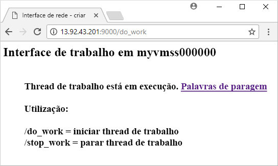

# <a name="create-a-virtual-machine-scale-set-with-the-azure-cli-20"></a>Criar um Conjunto de Dimensionamento de Máquinas Virtuais com a CLI 2.0 do Azure
Um conjunto de dimensionamento de máquinas virtuais permite implementar e gerir um conjunto de máquinas virtuais idênticas e de dimensionamento automático. Pode dimensionar o número de VMs no conjunto de dimensionamento manualmente ou definir regras para dimensionar automaticamente com base na utilização de recursos, como CPU, exigência de memória ou tráfego de rede. Neste artigo de introdução, vai criar um conjunto de dimensionamento de máquinas virtuais com um modelo do Azure Resource Manager. Também pode criar um conjunto de dimensionamento com a [CLI 2.0 do Azure](virtual-machine-scale-sets-create-cli.md), o [Azure PowerShell](virtual-machine-scale-sets-create-powershell.md) ou o [portal do Azure](virtual-machine-scale-sets-create-portal.md).


## <a name="overview-of-templates"></a>Descrição geral dos modelos
Os modelos do Azure Resource Manager permitem implementar grupos de recursos relacionados. Os modelos são escritos em JavaScript Object Notation (JSON) e definem o ambiente de toda a infraestrutura do Azure para a sua aplicação. Num único modelo, pode criar o conjunto de dimensionamento de máquinas virtuais, instalar aplicações e configurar regras de dimensionamento automático. Com a utilização de parâmetros e variáveis, este modelo pode ser reutilizado para atualizar conjuntos de dimensionamento existentes ou criar conjuntos de dimensionamento adicionais. Pode implementar modelos através do portal do Azure, da CLI 2.0 do Azure ou do Azure PowerShell, bem como chamá-los a partir de pipelines de integração contínua/entrega contínua (CI/CD).

Para obter mais informações sobre modelos, veja [Descrição geral do Azure Resource Manager](https://docs.microsoft.com/azure/azure-resource-manager/resource-group-overview#template-deployment)


## <a name="define-a-scale-set"></a>Definir um conjunto de dimensionamento
Um modelo define a configuração para cada tipo de recurso. Um tipo de recurso de conjunto de dimensionamento de máquinas virtuais é semelhante a uma VM individual. As partes principais do tipo de recurso de conjunto de dimensionamento de máquinas virtuais são:

| Propriedade                     | Descrição da propriedade                                  | Valor de modelo de exemplo                    |
|------------------------------|----------------------------------------------------------|-------------------------------------------|
| tipo                         | Tipo de recurso do Azure a criar                            | Microsoft.Compute/virtualMachineScaleSets |
| nome                         | O nome do conjunto de dimensionamento                                       | myScaleSet                                |
| localização                     | A localização para criar o conjunto de dimensionamento                     | EUA Leste                                   |
| sku.name                     | O tamanho da VM para cada instância do conjunto de dimensionamento                  | Standard_A1                               |
| sku.capacity                 | O número de instâncias de VM a criar inicialmente           | 2                                         |
| upgradePolicy.mode           | Modo de atualização de instâncias de VM quando ocorrem alterações              | Automático                                 |
| imageReference               | A plataforma ou imagem personalizada a utilizar para as instâncias de VM | Canonical Ubuntu Server 16.04-LTS         |
| osProfile.computerNamePrefix | O prefixo de nome para cada instância de VM                     | myvmss                                    |
| osProfile.adminUsername      | O nome de utilizador para cada instância de VM                        | azureuser                                 |
| osProfile.adminPassword      | A palavra-passe para cada instância de VM                        | P@ssw0rd!                                 |

 O fragmento seguinte mostra a definição do recurso do conjunto de dimensionamento principal num modelo. Para manter o exemplo curto, a configuração da placa de interface de rede virtual (NIC) não é apresentada. Para personalizar um modelo do conjunto de dimensionamento, pode alterar o tamanho ou a capacidade inicial da VM ou utilizar uma plataforma diferente ou uma imagem personalizada.

```json
{
  "type": "Microsoft.Compute/virtualMachineScaleSets",
  "name": "myScaleSet",
  "location": "East US",
  "apiVersion": "2016-04-30-preview",
  "sku": {
    "name": "Standard_A1",
    "capacity": "2"
  },
  "properties": {
    "upgradePolicy": {
      "mode": "Automatic"
    },
    "virtualMachineProfile": {
      "storageProfile": {
        "osDisk": {
          "caching": "ReadWrite",
          "createOption": "FromImage"
        },
        "imageReference":  {
          "publisher": "Canonical",
          "offer": "UbuntuServer",
          "sku": "16.04-LTS",
          "version": "latest"
        }
      },
      "osProfile": {
        "computerNamePrefix": "myvmss",
        "adminUsername": "azureuser",
        "adminPassword": "P@ssw0rd!"
      }
    }
  }
}
```


## <a name="install-an-application"></a>Instalar uma aplicação
Quando implementa um conjunto de dimensionamento, as extensões de VM podem fornecer tarefas de automatização e configuração pós-implementação, tais como a instalação de uma aplicação. Os scripts podem ser transferidos a partir do armazenamento do Azure ou do GitHub, ou fornecidos para o portal do Azure no runtime da extensão. Para aplicar uma extensão ao conjunto de dimensionamento, adicione a secção *extensionProfile* ao exemplo de recurso anterior. Normalmente, o perfil de extensão define as seguintes propriedades:

- Tipo de extensão
- Publicador da extensão
- Versão da extensão
- Localização dos scripts de configuração ou instalação
- Comandos para executar nas instâncias de VM

Vamos ver duas formas de instalar uma aplicação com extensões - com a Extensão de Script Personalizado para instalar uma aplicação Python em Linux ou com a extensão DSC do PowerShell para instalar uma aplicação ASP.NET em Windows.

### <a name="python-http-server-on-linux"></a>Servidor de HTTP do Python no Linux
O [servidor HTTP de Python em Linux](https://github.com/Azure/azure-quickstart-templates/tree/master/201-vmss-bottle-autoscale) utiliza a Extensão de Script Personalizado para instalar o [Bottle](http://bottlepy.org/docs/dev/), uma arquitetura Web Python, e um servidor HTTP simples. 

Dois scripts são definidos em *fileUris* - *installserver.sh* e *workserver.py*. Estes ficheiros são transferidos a partir do GitHub e, em seguida, o *commandToExecute* define `bash installserver.sh` para a aplicação que vai ser instalada e configurada:

```json
"extensionProfile": {
  "extensions": [
    {
      "name": "AppInstall",
      "properties": {
        "publisher": "Microsoft.Azure.Extensions",
        "type": "CustomScript",
        "typeHandlerVersion": "2.0",
        "autoUpgradeMinorVersion": true,
        "settings": {
          "fileUris": [
            "https://raw.githubusercontent.com/Azure/azure-quickstart-templates/master/201-vmss-bottle-autoscale/installserver.sh",
            "https://raw.githubusercontent.com/Azure/azure-quickstart-templates/master/201-vmss-bottle-autoscale/workserver.py"
          ],
          "commandToExecute": "bash installserver.sh"
        }
      }
    }
  ]
}
```

### <a name="aspnet-application-on-windows"></a>Aplicação ASP.NET em Windows
O modelo de exemplo [aplicação ASP.NET em Windows](https://github.com/Azure/azure-quickstart-templates/tree/master/201-vmss-windows-webapp-dsc-autoscale) utiliza a extensão DSC do PowerShell para instalar uma aplicação ASP.NET MVC que é executada no IIS. 

Um script de instalação é transferido a partir do GitHub, tal como definido em *url*. Em seguida, a extensão executa *InstallIIS* a partir do script *IISInstall.ps1*, tal como definido em *função* e *Script*. A aplicação ASP.NET propriamente dita é fornecida como um pacote do Web Deploy, que também é transferido a partir do GitHub, tal como definido em *WebDeployPackagePath*:

```json
"extensionProfile": {
  "extensions": [
    {
      "name": "Microsoft.Powershell.DSC",
      "properties": {
        "publisher": "Microsoft.Powershell",
        "type": "DSC",
        "typeHandlerVersion": "2.9",
        "autoUpgradeMinorVersion": true,
        "forceUpdateTag": "1.0",
        "settings": {
          "configuration": {
            "url": "https://raw.githubusercontent.com/Azure/azure-quickstart-templates/master/201-vmss-windows-webapp-dsc-autoscale/DSC/IISInstall.ps1.zip",
            "script": "IISInstall.ps1",
            "function": "InstallIIS"
          },
          "configurationArguments": {
            "nodeName": "localhost",
            "WebDeployPackagePath": "https://raw.githubusercontent.com/Azure/azure-quickstart-templates/master/201-vmss-windows-webapp-dsc-autoscale/WebDeploy/DefaultASPWebApp.v1.0.zip"
          }
        }
      }
    }
  ]
}
```

## <a name="deploy-the-template"></a>Implementar o modelo
A forma mais simples de implementar o modelo [servidor HTTP Python em Linux](https://github.com/Azure/azure-quickstart-templates/tree/master/201-vmss-bottle-autoscale) ou [aplicação ASP.NET MVC em Windows](https://github.com/Azure/azure-quickstart-templates/tree/master/201-vmss-windows-webapp-dsc-autoscale) é utilizar o botão **Implementar no Azure**, localizado nos ficheiros Leia-me no GitHub.  Também pode utilizar o PowerShell ou o Azure CLI para implementar os modelos de exemplo.

### <a name="azure-cli-20"></a>CLI 2.0 do Azure
Pode utilizar a CLI 2.0 do Azure para instalar o servidor HTTP de Python em Linux da seguinte forma:

```azurecli-interactive
# Create a resource group
az group create --name myResourceGroup --location EastUS

# Deploy template into resource group
az group deployment create \
    --resource-group myResourceGroup \
    --template-uri https://raw.githubusercontent.com/Azure/azure-quickstart-templates/master/201-vmss-bottle-autoscale/azuredeploy.json
```

Para ver a sua aplicação em ação, obtenha o endereço IP público do balanceador de carga com [az network public-ip list](/cli/azure/network/public-ip#show) da seguinte forma:

```azurecli-interactive
az network public-ip list \
    --resource-group myResourceGroup \
    --query [*].ipAddress -o tsv
```

Introduza o endereço IP público do balanceador de carga num browser no formato *http://<publicIpAddress>:9000/do_work*. O balanceador de carga distribui o tráfego para uma das suas instâncias de VM, conforme mostra o exemplo seguinte:




### <a name="azure-powershell"></a>Azure PowerShell
Pode utilizar o Azure PowerShell para instalar a aplicação ASP.NET em Windows da seguinte forma:

```azurepowershell-interactive
# Create a resource group
New-AzureRmResourceGroup -Name myResourceGroup -Location EastUS

# Deploy template into resource group
New-AzureRmResourceGroupDeployment `
    -ResourceGroupName myResourceGroup `
    -TemplateFile https://raw.githubusercontent.com/Azure/azure-quickstart-templates/master/201-vmss-windows-webapp-dsc-autoscale/azuredeploy.json
```

Para ver a sua aplicação em ação, obtenha o endereço IP público do seu balanceador de carga com [Get-AzureRmPublicIpAddress](/powershell/module/azurerm.network/get-azurermpublicipaddress) da seguinte forma:

```azurepowershell-interactive
Get-AzureRmPublicIpAddress -ResourceGroupName myResourceGroup | Select IpAddress
```

Introduza o endereço IP público do balanceador de carga num browser no formato *http://<publicIpAddress>/MyApp*. O balanceador de carga distribui o tráfego para uma das suas instâncias de VM, conforme mostra o exemplo seguinte:


## <a name="clean-up-resources"></a>Limpar recursos
Quando já não for necessário, pode utilizar [az group delete](/cli/azure/group#delete) para remover o grupo de recursos, o conjunto de dimensionamento e todos os recursos relacionados da seguinte forma:

```azurecli-interactive 
az group delete --name myResourceGroup
```


## <a name="next-steps"></a>Passos seguintes
